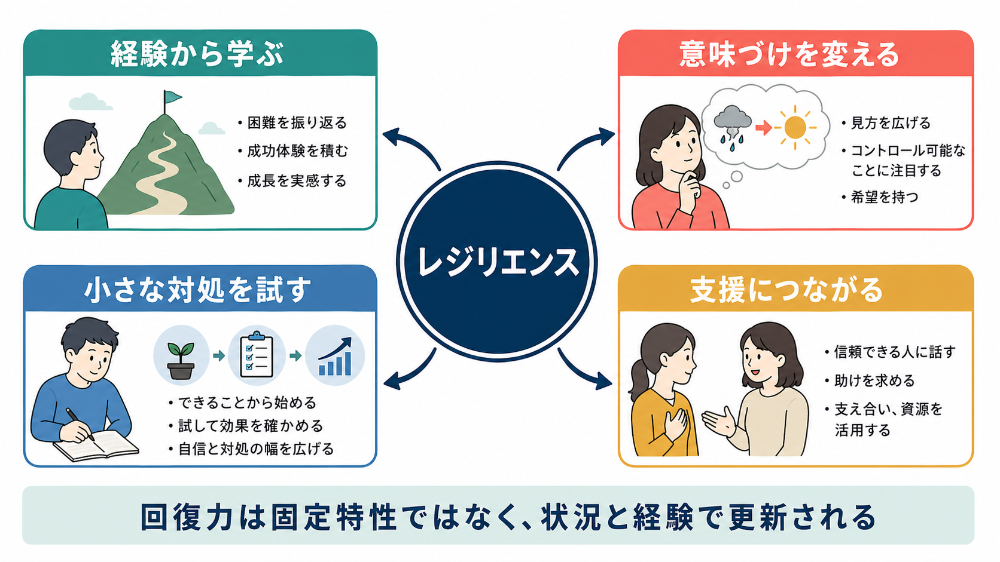
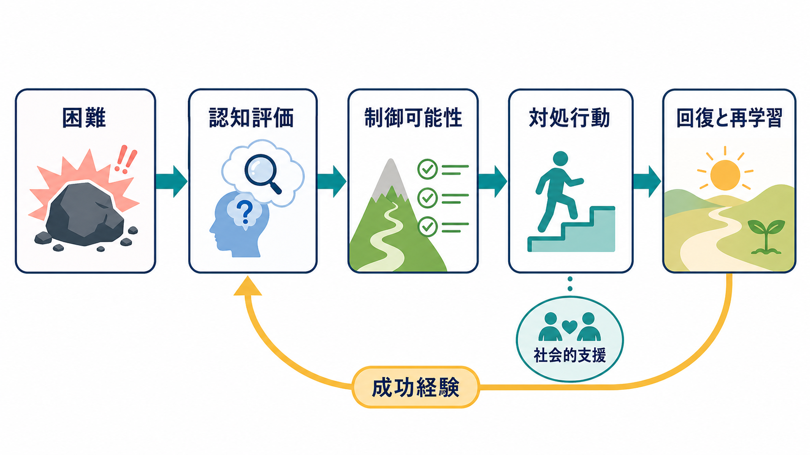

# レジリエンスは学習されるのか

## 要点

- レジリエンスは「困難を感じない性格」ではなく、逆境のあとに機能を保つ、または回復する動的な過程である[1][3]。
- 経験、[[認知的柔軟性とは何か|認知的柔軟性]]、制御可能性の学習、対処行動、社会的支援によって、次の困難への反応は変わりうる[2][4][6]。
- ただし、レジリエンスを「本人の努力で鍛えればよい」とだけ考えるのは不十分である。安全な環境、支援資源、経済的・文化的条件も回復力を左右する[1][6][7]。
- 介入研究では、認知行動療法的スキルやマインドフルネスを含むプログラムが自己報告のレジリエンスを改善する可能性が示されているが、効果の大きさや持続性には限界もある[8]。

## この記事で答える問い

このノートでは、「困難から回復する力は、生まれつきの性格なのか、それとも経験から学習されるのか」を扱う。特に、経験が次の認知評価を変える過程、制御可能性の感覚、社会的支援、研究・臨床での使い方を整理する。

## まず結論

レジリエンスは、完全に固定された特性ではない。遺伝、発達歴、健康状態、逆境の強さなどの影響を受ける一方で、経験から「何が危険で、何がまだ制御でき、誰に助けを求められるか」を更新することで変化する[1][2][4]。

そのため、「レジリエンスは学習されるのか」という問いへの短い答えは「一部は学習される」である。より正確には、個人の中にある能力だけでなく、支援者、制度、生活環境との相互作用を通じて、回復しやすい反応パターンが形成される。

## 背景

レジリエンス研究は、逆境を経験した人が必ず深刻な障害に進むわけではないという観察から発展してきた。Masten は、子どもの発達研究から、レジリエンスは例外的な「超人的能力」ではなく、愛着、問題解決、自己制御、学校や地域の支えといった通常の適応システムから生じると論じた[2]。

成人の喪失・トラウマ研究でも、強い出来事のあとに長期の慢性症状だけでなく、比較的安定した機能を保つ軌道がしばしば見られる[3]。この知見は、困難への反応を「病理か正常か」の二分法だけでなく、時間的な回復軌道として見る必要を示している。

## 基本概念

### レジリエンス

レジリエンスとは、逆境、喪失、慢性ストレス、トラウマ、生活上の困難に直面したあとに、心理的・社会的機能を維持する、または回復する過程である[1]。ここで重要なのは、レジリエンスが「傷つかないこと」ではない点である。苦痛、混乱、疲労があっても、必要な支援を使い、意味づけを調整し、少しずつ行動を再開できることが含まれる。

### 学習される部分

学習されるのは、気合いや楽観主義そのものではない。むしろ、次のような判断と行動の組み合わせである。

- この状況はどの程度危険か。
- 何は変えられ、何は変えられないか。
- 今すぐ取れる小さな行動は何か。
- 誰に相談できるか。
- 過去の経験から、何を次に試せるか。

この意味で、レジリエンスは[[自己効力感とは何か|自己効力感]]、認知的柔軟性、問題解決、社会的支援の利用と強く関係する。

## 仕組み

### 1. 経験は「次の評価」を変える

困難な出来事が起きたとき、人は出来事そのものだけでなく、「これは自分にとってどれほど脅威か」「自分に対処できる余地はあるか」を評価する。認知的再評価は、出来事の意味づけを変えることで情動反応を調整する方法である。ただし、再評価は万能ではなく、状況を実際に変えられる場合には、行動による問題解決のほうが適応的なこともある[5]。

つまりレジリエンスにとって重要なのは、「何でも前向きに捉える」ことではない。変えられないものには意味づけや受容を使い、変えられるものには問題解決や支援要請を使う、という文脈に応じた切り替えである。

### 2. 制御可能性の学習が無力感を弱める

学習性無力感の研究は、制御できないストレスにさらされると、後に逃避可能な状況でも行動が起こりにくくなることを示してきた。Maier と Seligman は、その後の神経科学的知見を踏まえ、重要なのは「無力感が学習される」というより、制御可能性の経験が防御的な学習として働く点だと整理している[4]。

この視点から見ると、レジリエンスを支える経験とは、大きな成功体験だけではない。「小さく試す」「少し変えられた」「助けを求めたら反応があった」といった経験が、次の困難での探索と対処行動を起こしやすくする。

### 3. 社会的支援はストレス反応の緩衝材になる

社会的支援は、単に「励ましてくれる人がいる」という心理的慰めにとどまらない。Cohen と Wills のストレス緩衝仮説では、支援はストレス出来事の評価や対処資源を変えることで、健康への悪影響を弱めると考えられた[6]。また、レジリエンスと社会的支援に関するレビューでは、支援関係が神経内分泌反応、情動調整、行動選択と結びつく可能性が論じられている[7]。

ただし、支援は量だけでは決まらない。本人にとって安全で、尊厳を損なわず、必要なタイミングで届く支援であることが重要である。過剰な介入、否定的な助言、スティグマを伴う支援は、かえって負担になることがある。

### 4. 介入で変えられるが、測定には注意がいる

レジリエンス介入のメタ分析では、認知行動療法的スキル、マインドフルネス、または両者の組み合わせを含む介入が、自己報告のレジリエンス尺度に中等度程度の改善を示した[8]。これは、レジリエンスに学習可能な側面があることを支持する。

一方で、この結果を「短い研修で誰でも逆境に強くなる」と読むのは早い。研究の多くはサンプルサイズが小さく、介入後に実際の逆境へ直面したときの長期的機能まで十分に追跡していない[8]。尺度得点の改善と、現実の回復軌道の改善は同じではない。

## 図解

1枚目は、レジリエンスを支える要因の概念地図である。経験、意味づけ、対処行動、支援が相互に作用し、回復力が固定特性ではなく更新されることを示している。

2枚目は、最も重要なメカニズムである「認知評価と制御可能性の更新」を示した。困難に直面したあと、制御できる部分を探し、対処行動と支援を使い、成功経験が次の評価を変える。

3枚目は、悪循環とレジリエンス学習ループの比較である。脅威評価、回避、孤立が続くと回復が遅れやすい一方で、再評価、小さな行動、支援、成功経験がつながると次の対処が起こりやすくなる。

## 臨床・研究との接続

臨床では、レジリエンスを「患者本人の強さ」として評価するより、「回復を支える条件がどこに残っているか」として見るほうが実用的である。睡眠、身体疾患、孤立、貧困、トラウマ、職場・学校環境が変わらないまま、本人の認知だけを変えようとしても限界がある。

研究では、レジリエンスを一時点の尺度得点だけで測るのではなく、逆境の種類、時間経過、機能の軌道、社会的資源を組み合わせて測る必要がある[1][3]。[[レジリエンスは脳内でどう支えられているのか]]と接続すると、前頭前野、報酬系、ストレス反応系、社会的支援に関わる神経生物学的過程も視野に入る。

## よくある誤解

### 誤解1: レジリエンスが高い人は傷つかない

レジリエンスは苦痛の不在ではない。強い感情反応や一時的な機能低下があっても、時間とともに回復する軌道を含む[3]。

### 誤解2: レジリエンスは個人責任で鍛えるもの

個人の認知や行動は重要だが、支援環境、経済条件、安全、差別の有無も回復を左右する[1][6]。レジリエンスを個人責任に還元すると、構造的な支援の必要性が見えにくくなる。

### 誤解3: 前向きに考えればよい

再評価は有効な場面があるが、変えられる問題には行動が必要である[5]。適応的なのは、楽観一辺倒ではなく、状況に応じて評価、受容、問題解決、支援要請を切り替えることである。

### 誤解4: 研修で簡単に身につく

介入研究は有望だが、効果は測定方法、対象者、介入内容、追跡期間に左右される[8]。現実の逆境への耐性を判断するには、長期的な機能と支援環境まで見る必要がある。

## 関連ノート

- [[レジリエンスは脳内でどう支えられているのか]]
- [[認知的柔軟性とは何か]]
- [[自己効力感とは何か]]
- 関連ノート候補: 学習性無力感、社会的支援、認知的再評価、ストレス脆弱性モデル、PTSD、対処行動、心理的安全性

## 理解チェック

1. レジリエンスを「傷つかない性格」と定義すると、どの点が見落とされるか。
2. 制御可能性の経験は、次の困難への反応をどのように変えうるか。
3. 認知的再評価が有効な場面と、問題解決行動が必要な場面はどう違うか。
4. 社会的支援は、なぜ単なる励まし以上の意味を持つのか。
5. レジリエンス介入研究を読むとき、尺度得点以外に何を確認すべきか。

## MOC更新候補

- `content/00_MOC/` 配下の認知科学・心理学、学習・行動・動機づけ、ストレス・レジリエンス関連MOCに本記事へのリンクを追加する候補。
- 並列ジョブとの競合を避けるため、このタスクではMOC本体を更新しない。

## 未解決問題

- レジリエンス尺度の改善が、実際の逆境後の長期的回復をどこまで予測するか。
- 個人の認知スキルと、社会制度・経済的支援の効果をどのように分離または統合して測るか。
- 文化差、発達段階、トラウマ歴が、レジリエンス学習の経路をどのように変えるか。

## 参考文献

[1] Southwick, S. M., Bonanno, G. A., Masten, A. S., Panter-Brick, C., & Yehuda, R. (2014). Resilience definitions, theory, and challenges: interdisciplinary perspectives. *European Journal of Psychotraumatology*, 5, 25338. https://doi.org/10.3402/ejpt.v5.25338

[2] Masten, A. S. (2001). Ordinary magic: Resilience processes in development. *American Psychologist*, 56(3), 227-238. https://doi.org/10.1037/0003-066X.56.3.227

[3] Bonanno, G. A. (2004). Loss, trauma, and human resilience: Have we underestimated the human capacity to thrive after extremely aversive events? *American Psychologist*, 59(1), 20-28. https://doi.org/10.1037/0003-066X.59.1.20

[4] Maier, S. F., & Seligman, M. E. P. (2016). Learned helplessness at fifty: Insights from neuroscience. *Psychological Review*, 123(4), 349-367. https://doi.org/10.1037/rev0000033

[5] Troy, A. S., Shallcross, A. J., & Mauss, I. B. (2013). A person-by-situation approach to emotion regulation: Cognitive reappraisal can either help or hurt, depending on the context. *Psychological Science*, 24(12), 2505-2514. https://doi.org/10.1177/0956797613496434

[6] Cohen, S., & Wills, T. A. (1985). Stress, social support, and the buffering hypothesis. *Psychological Bulletin*, 98(2), 310-357. https://doi.org/10.1037/0033-2909.98.2.310

[7] Ozbay, F., Johnson, D. C., Dimoulas, E., Morgan, C. A., Charney, D., & Southwick, S. (2007). Social support and resilience to stress: From neurobiology to clinical practice. *Psychiatry (Edgmont)*, 4(5), 35-40. https://pmc.ncbi.nlm.nih.gov/articles/PMC2921311/

[8] Joyce, S., Shand, F., Tighe, J., Laurent, S. J., Bryant, R. A., & Harvey, S. B. (2018). Road to resilience: A systematic review and meta-analysis of resilience training programmes and interventions. *BMJ Open*, 8(6), e017858. https://doi.org/10.1136/bmjopen-2017-017858
