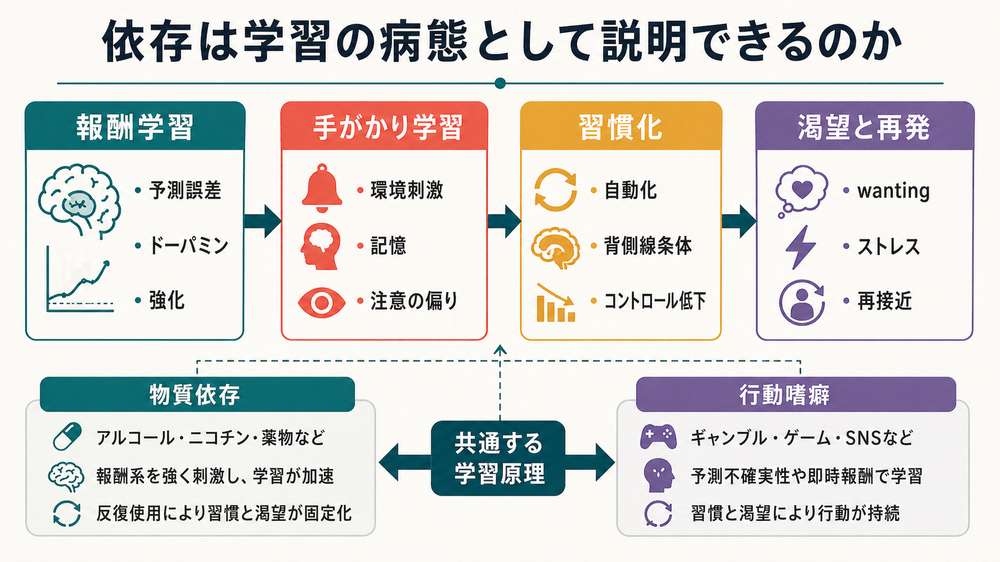
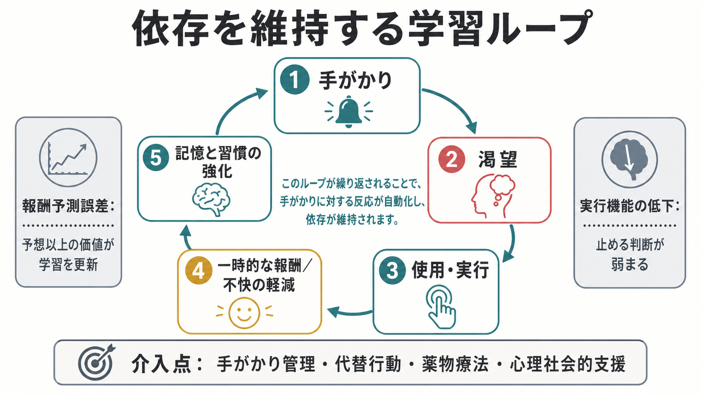

# 依存は学習の病態として説明できるのか

## 要点

- 依存は単なる「快楽の追求」ではなく、報酬、手がかり、習慣、ストレス緩和が結びついた学習の固定化として理解できる。
- 物質使用では薬物が[[報酬系とは何か|報酬系]]やドーパミン信号を強く動かし、行動嗜癖ではギャンブルやゲームの予測不確実性・即時報酬が学習を強める。
- 初期には「報酬を得るための行動」でも、反復により「手がかりに反応して自動的に実行される行動」へ移行しやすい。
- ただし、依存を学習だけで説明し切ることはできない。遺伝的脆弱性、発達、社会環境、併存症、離脱、ストレス、実行機能の低下も関与する。

## この記事で答える問い

「依存は学習の病態である」という説明は、どこまで妥当なのか。この記事では、[[強化学習とは何か|強化学習]]、[[古典的条件づけとは何か|古典的条件づけ]]、[[オペラント条件づけとは何か|オペラント条件づけ]]、[[習慣学習とは何か|習慣学習]]の観点から、物質依存と行動嗜癖をまたいで維持機構を整理する。

## まず結論

依存は「学習の失敗」ではなく、「本来は適応的な学習システムが、特定の報酬や手がかりに過剰に引き寄せられ、柔軟性を失った状態」と見ると理解しやすい。ドーパミンは快感そのものだけでなく、重要な出来事を記憶し、次に同じ行動を起こしやすくする信号として働く。NIDAは、薬物が報酬回路を過剰に活性化し、反復によって薬物以外の報酬を感じにくくし、薬物関連の手がかりを強く学習させると説明している[1]。

この見方の強みは、依存を「意志の弱さ」ではなく、学習、記憶、動機づけ、実行機能が絡む可塑的な過程として扱える点にある。一方で、学習モデルは診断そのものではない。臨床では、DSM-5-TRの物質使用障害のように、制御困難、社会的障害、危険使用、耐性・離脱などを含む基準で重症度を評価する[8]。

## 背景

依存を学習の病態として見る考え方は、正常な学習・記憶システムが薬物や強い報酬経験によって偏って使われる、という発想から出てくる。Everittらは、薬物依存を「正常な学習・記憶システムが慢性的な薬物自己投与によって病的に乗っ取られ、強迫的な薬物探索習慣が成立する過程」として論じた[3]。

この説明は、物質依存だけでなく、ギャンブルやゲームのような行動嗜癖にも一部あてはまる。WHOは、ギャンブル障害とゲーム障害をICD-11で「嗜癖行動による障害」に分類し、反復的で報酬性のある行動が、機能障害や苦痛を伴う臨床的症候群になりうると説明している[7]。

## 基本概念

### 報酬学習

[[報酬予測誤差とは何か|報酬予測誤差]]とは、予想された報酬と実際の報酬の差である。予想以上の報酬が生じると、その直前の手がかりや行動の価値が更新される。Schultzは、ドーパミンニューロンが報酬予測誤差に関与し、報酬の蓄積、意思決定、日常行動の学習に関わる信号として理解できると整理している[2]。

依存では、この更新が通常より強く、狭く、反復的に起こりやすい。薬物は生理的報酬より大きなドーパミン変化を生じさせうるため、「その行動をまた行え」という学習を強く刻む。ギャンブルやゲームでは、予測不確実性、ニアミス、即時フィードバック、社会的報酬などが、行動の価値を繰り返し更新する。

### 手がかり学習

依存行動は、対象そのものだけでなく、周辺の手がかりによって誘発される。場所、時間帯、スマートフォン通知、感情状態、対人ストレス、給料日、飲酒仲間などが、過去の報酬経験と結びつく。これは[[古典的条件づけとは何か|条件づけ]]の問題であり、手がかりが報酬の予告信号になると、注意、身体反応、接近行動を引き出す。

### 習慣化

初期の使用や実行は、「楽しみたい」「不快感を減らしたい」という目標指向的行動として始まる。しかし反復されると、行動は結果の価値に敏感な目標指向制御から、刺激に反応して実行される習慣制御へ移りやすい。EverittとRobbinsは、依存を自発的・娯楽的使用から強迫的な薬物探索習慣へ移行する過程として捉え、その神経基盤として腹側線条体から背側線条体への制御移行を重視している[3]。

### 渇望

渇望は、単なる「好き」ではなく、対象へ接近させる強い動機づけ状態である。RobinsonとBerridgeのインセンティブ感作理論では、反復使用により報酬関連刺激へ過剰な誘因サリエンスが付与され、快感としての liking と、欲しさとしての wanting が分離しうると考える[4]。この点は[[快感と欲求は何が違うのか]]と直結する。

## 仕組み

依存を維持する学習ループは、次のように整理できる。

1. 手がかりが報酬や不快軽減の記憶を呼び出す。
2. 渇望、期待、身体反応が高まる。
3. 物質使用や行動実行が起こる。
4. 一時的な快感、不安軽減、退屈の解消、離脱不快の緩和が生じる。
5. その結果、手がかりと行動の結びつきがさらに強化される。

このループには、正の[[強化とは何か|強化]]と負の強化が同時に関わる。初期には快感や興奮を得る正の強化が目立つが、進行すると不快感、焦燥、離脱、ストレスを減らす負の強化が強くなる。KoobとVolkowは、依存の神経回路を、報酬・誘因サリエンス、離脱・負の情動、渇望・実行機能低下という3つの機能段階として整理している[5]。

ここで重要なのは、依存行動が「本人にとって何の役にも立っていない行動」ではない点である。短期的には、苦痛を下げる、退屈を消す、社会的不安を避ける、身体不快を和らげるなどの機能を持つ。その短期的機能が長期的損失を上回って学習されると、[[遅延割引とは何か|遅延割引]]や[[衝動性とは何か|衝動性]]の問題とも結びつく。

## 図解

図1は、報酬学習、手がかり学習、習慣化、渇望と再発をひとつの概念地図として示している。物質依存では薬理作用が報酬系やストレス系に直接影響し、行動嗜癖では予測不確実性や即時報酬が学習を強める。両者は同一ではないが、反復的な報酬学習と手がかり反応という原理を共有する。

図2は、依存を維持する循環を示している。臨床的な介入では、循環のどこを変えるかが重要になる。手がかりを減らす、渇望をやり過ごす、代替行動を入れる、薬物療法で報酬・離脱過程を調整する、社会的支援でストレスを下げる、といった介入は、同じループの別の箇所に働きかける。

## 臨床・研究との接続

学習の病態という見方は、治療や支援を「罰」ではなく「再学習」として設計する発想につながる。たとえば、手がかりに近づかない環境調整、使用しない行動を選んだ直後の強化、再発リスク状況の事前計画、渇望を波として観察するスキル、代替報酬の再構築などは、[[行動変容はどのように起こるのか|行動変容]]の問題として扱える。

渇望は再発と関係する重要な臨床現象だが、測定や解釈は単純ではない。TiffanyとWrayは、渇望が治療成績、再発、臨床評価に関わる一方で、自己報告された渇望だけで依存行動を完全には説明できないことを論じている[6]。したがって、渇望を「あるかないか」ではなく、手がかり、感情、身体状態、実行機能、利用可能な代替行動と一緒に評価する必要がある。

研究面では、依存は強化学習モデル、習慣学習課題、cue-reactivity、遅延割引、実行機能課題、神経画像、スマートフォンによる生態学的瞬間評価などで検討される。これらは「依存者は学習できない」という意味ではなく、「何が、どの手がかりの下で、どの時間スケールで過剰に学習されているのか」を問う方法である。

## よくある誤解

### 依存は快楽が強すぎるだけなのか

違う。快楽は重要だが、進行した依存では不快感の軽減、離脱回避、ストレス反応、習慣化が大きな役割を持つ。本人が「もう楽しくない」と感じていても、手がかりと行動の結びつきが残っているため、行動が続くことがある。

### 学習の病態なら、消去学習で簡単に治るのか

簡単ではない。[[消去とは何か|消去]]は元の記憶を完全に消すというより、新しい安全な学習を重ねる過程に近い。依存関連の手がかりは、ストレス、環境変化、少量再使用、時間経過で再び反応を引き出すことがある。

### 行動嗜癖は物質依存とまったく同じなのか

同じではない。物質依存では薬理作用、耐性、離脱、身体合併症が中心になる場合がある。行動嗜癖では、賭け、ゲーム、SNSなどの環境設計、予測不確実性、社会的報酬、アクセス容易性が重要になる。ただし、反復報酬、手がかり反応、制御困難、機能障害という点では共通する部分がある[7]。

### 意志が強ければ依存は起こらないのか

意志や自己制御は一部にすぎない。前頭前野による実行機能は重要だが、睡眠不足、ストレス、併存する精神症状、孤立、貧困、慢性痛、アクセス環境などで容易に弱まる。依存を意志だけで説明すると、再学習や環境調整という実際に役立つ介入点が見えにくくなる。

## 関連ノート

- [[報酬系とは何か]]
- [[報酬予測誤差とは何か]]
- [[強化学習とは何か]]
- [[強化とは何か]]
- [[古典的条件づけとは何か]]
- [[オペラント条件づけとは何か]]
- [[習慣学習とは何か]]
- [[快感と欲求は何が違うのか]]
- [[消去とは何か]]
- [[遅延割引とは何か]]
- [[衝動性とは何か]]
- [[行動変容はどのように起こるのか]]

## MOC更新候補

- `content/00_MOC/MOC｜学習・行動・動機づけ.md`
- `content/00_MOC/MOC｜認知科学・心理学.md`
- 依存・嗜癖や臨床心理のMOCが統合ジョブで作られる場合、本記事を候補に含める。

## 理解チェック

1. 依存を「快感の追求」だけで説明すると、どの要素を見落としやすいか。
2. 報酬予測誤差は、手がかり学習とどのように関係するか。
3. 目標指向行動から習慣行動へ移ると、なぜ「わかっているのにやめにくい」状態が起こりやすいか。
4. 物質依存と行動嗜癖は、どこが共通し、どこが異なるか。
5. 再発予防を「意志の強化」ではなく「学習ループの再設計」と考えると、どの介入点が見えるか。

## 未解決問題

- 報酬学習、習慣化、渇望、実行機能低下のうち、個人ごとにどの機構が主要な維持因子なのかをどう見分けるか。
- 行動嗜癖をどこまで物質依存と同じ枠組みで扱い、どこから別の環境設計・文化的文脈として扱うべきか。
- 渇望の自己報告、行動指標、生理指標、神経指標をどのように統合すれば、再発リスクや治療反応をよりよく予測できるか。
- 学習モデルに基づく介入を、スティグマを減らしつつ個別支援へどう落とし込むか。

## 参考文献

[1] National Institute on Drug Abuse. *Drugs, Brains, and Behavior: The Science of Addiction: Drugs and the Brain*. https://nida.nih.gov/publications/drugs-brains-behavior-science-addiction/drugs-brain

[2] Schultz, W. (2017). Reward prediction error. *Current Biology, 27*(10), R369-R371. https://doi.org/10.1016/j.cub.2017.02.064

[3] Everitt, B. J., & Robbins, T. W. (2016). Drug Addiction: Updating Actions to Habits to Compulsions Ten Years On. *Annual Review of Psychology, 67*, 23-50. https://doi.org/10.1146/annurev-psych-122414-033457

[4] Robinson, T. E., & Berridge, K. C. (2008). The incentive sensitization theory of addiction: some current issues. *Philosophical Transactions of the Royal Society B, 363*(1507), 3137-3146. https://doi.org/10.1098/rstb.2008.0093

[5] Koob, G. F., & Volkow, N. D. (2016). Neurobiology of addiction: a neurocircuitry analysis. *The Lancet Psychiatry, 3*(8), 760-773. https://doi.org/10.1016/S2215-0366(16)00104-8

[6] Tiffany, S. T., & Wray, J. M. (2012). The clinical significance of drug craving. *Annals of the New York Academy of Sciences, 1248*, 1-17. https://doi.org/10.1111/j.1749-6632.2011.06298.x

[7] World Health Organization. *Addictive behaviour*. https://www.who.int/health-topics/addictive-behaviour

[8] McNeely, J., Hamilton, L. K., Whitley, S. D., et al. (2024). *Substance Use Screening, Risk Assessment, and Use Disorder Diagnosis in Adults*. NCBI Bookshelf. https://www.ncbi.nlm.nih.gov/books/NBK565474/
