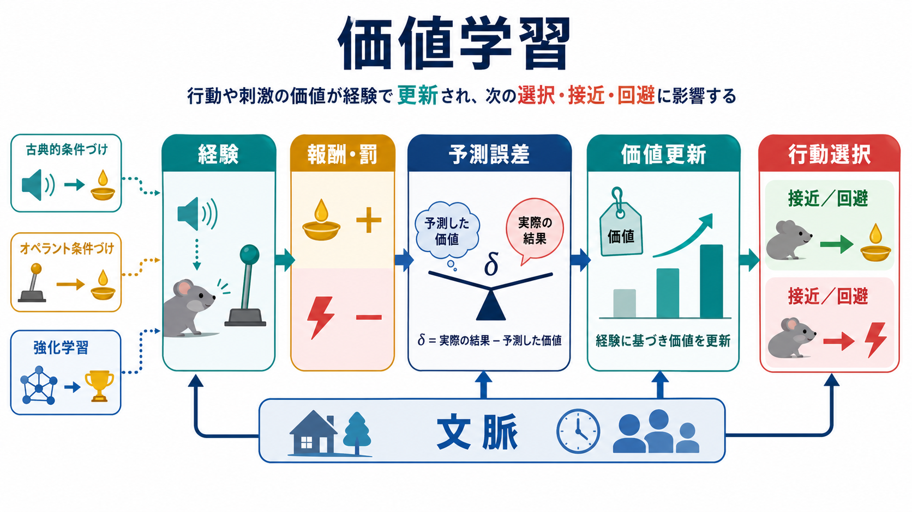
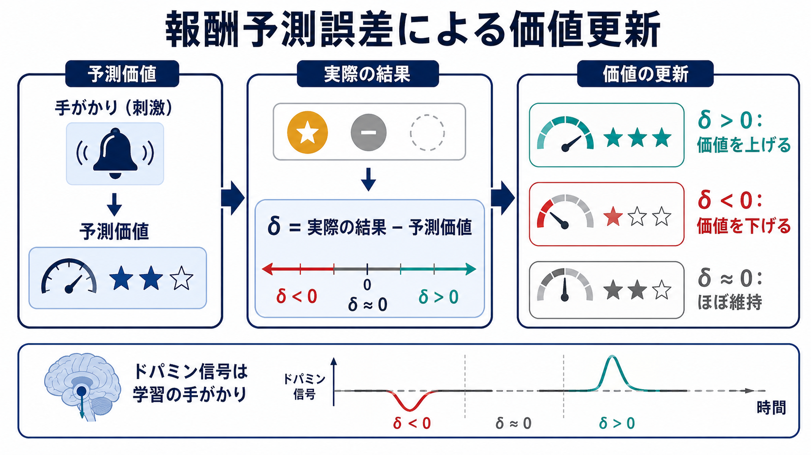
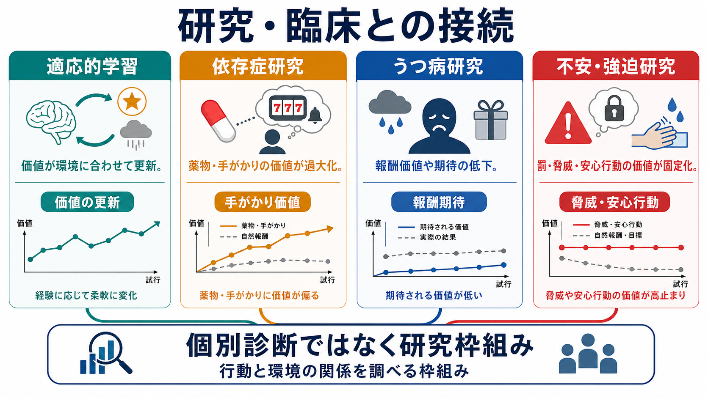

# 価値学習とは何か

## 要点

- 価値学習とは、刺激、行動、文脈、結果に対する「どれくらい近づくべきか／避けるべきか」という評価が、経験によって更新される過程である[1][2]。
- 価値は固定した性質ではなく、予測、結果、身体状態、文脈、社会的意味によって変わる。したがって同じ刺激でも、空腹時と満腹時、成功経験の後と失敗経験の後では異なる価値を持ちうる[3][4]。
- 価値学習の中心には、予測と実際の結果のずれである「予測誤差」がある。期待より良ければ価値は上がり、期待より悪ければ価値は下がりやすい[1][5]。
- 脳では、線条体、前頭前野、扁桃体、中脳ドパミン系などが、報酬予測、行動選択、習慣化、動機づけに関わる。ただし、ドパミンを単純な「快楽物質」と見るのは不正確である[5][6]。
- 臨床研究では、依存症、うつ病の無快感、不安や強迫における回避行動などを、価値の過大評価、過小評価、更新困難として理解する枠組みが使われる。ただし、これは個別診断や治療指示ではなく、教育・研究目的の説明である[7][8]。

## この記事で答える問い

1. 価値学習とは、単なる「報酬を覚えること」と何が違うのか。
2. 予測誤差は、価値の更新にどのように関わるのか。
3. 価値学習は、[[古典的条件づけとは何か]]、[[オペラント条件づけとは何か]]、[[強化とは何か]]とどう接続するのか。
4. 脳の報酬系、[[ドパミンは報酬だけの物質なのか]]、[[大脳基底核ループとは何か]]は、価値学習をどう支えるのか。
5. 依存症、うつ病、不安・強迫の研究では、価値学習の考え方がどのように使われるのか。

## まず結論

価値学習とは、「経験から、何に価値を置き、何を選び、何を避けるかを更新する仕組み」である。ここでいう価値は、道徳的な価値や人生観だけではない。食べ物、薬物、課題、他者からの評価、危険な場所、安心できる行動、将来の利益などが、行動を引き寄せたり遠ざけたりする強さを指す。

たとえば、ある店で食事をして期待以上に満足したなら、その店に行く価値は上がる。反対に、同じ店で嫌な経験をすれば価値は下がる。さらに、空腹、疲労、ストレス、他者の存在、過去の記憶によっても価値は変わる。価値学習は、こうした「経験に応じた評価の更新」を扱う概念である[1][3]。

重要なのは、価値学習が単に「快いものを選ぶ」仕組みではない点である。行動には、報酬を得る、罰を避ける、不確実性を減らす、社会的承認を得る、長期目標に近づくなど、複数の価値が関わる。したがって価値学習は、[[意思決定とは何か]]や[[リスク下の意思決定はどのように行われるのか]]を理解する基礎にもなる。

## 背景

価値学習は、心理学、神経科学、経済学、機械学習の交差点にある概念である。心理学では、刺激と結果の関係を学ぶ[[古典的条件づけとは何か]]、行動と結果の関係を学ぶ[[オペラント条件づけとは何か]]、反応を増減させる[[強化とは何か]]が基礎になる。機械学習では、エージェントが環境と相互作用しながら将来の報酬を最大化する方策を学ぶ「強化学習」として定式化される[1]。

神経科学では、価値は単一の脳領域に保存されるというより、複数の回路で表現される。線条体は報酬予測や行動選択、前頭前野は目標や文脈に応じた制御、扁桃体は情動的な価値づけ、海馬は文脈と記憶、中脳ドパミン系は予測誤差や動機づけ信号に関わる[3][5][6]。この意味で、価値学習は[[神経可塑性は発達と学習をどう支えるのか]]や[[直接路と間接路は行動選択をどう制御するのか]]とも接続する。

価値ベースの意思決定研究では、価値表象、行動価値、選択、結果評価、学習という過程が区別される[3]。たとえば「この選択肢はどれくらい良いか」を表す価値と、「実際にどれを選ぶか」は同じではない。価値が高くても、コストが高い、危険が大きい、社会的に不適切である、長期目標と矛盾する場合には選ばれないことがある。

## 基本概念

### 価値

価値とは、ある刺激や行動が、将来の結果に対して持つ予測的・動機づけ的な重みである。ここには、報酬を得られる見込み、罰を避けられる見込み、努力や時間のコスト、不確実性、身体状態、社会的意味が含まれる。

価値は主観的である。同じ報酬でも、人によって価値は異なる。また同じ人でも、状況によって価値は変わる。水は喉が渇いているときには高い価値を持つが、満腹で水を飲みすぎた後には価値が下がる。このように、価値学習は「外界の報酬量」だけでなく、「その時点の生体や文脈にとっての意味」を扱う。

### 報酬と罰

報酬は行動を増やしやすい結果、罰は行動を減らしやすい結果である。ただし、報酬と罰は快・不快と完全には一致しない。短期的には不快な努力でも、長期目標に近づくなら高い価値を持つことがある。反対に、短期的には快い刺激でも、長期的な損失が大きければ、全体としては低い価値を持つことがある。

この区別は、Berridge らが整理した「liking」「wanting」「learning」の区別と近い。好きであること、欲しくなること、価値を学ぶことは重なるが同一ではない[6]。たとえば依存症研究では、快感そのものより、手がかりに誘発される欲求や接近行動が強く残る場合がある。

### 予測誤差

予測誤差とは、予測された結果と実際の結果のずれである。価値学習では、しばしば次のように直感的に表せる。

$$
\delta = r - \hat{r}
$$

ここで $\delta$ は予測誤差、$r$ は実際に得られた結果、$\hat{r}$ は予測された結果である。結果が予測より良ければ $\delta > 0$ となり、関連する刺激や行動の価値は上がりやすい。結果が予測より悪ければ $\delta < 0$ となり、価値は下がりやすい。予測どおりなら $\delta \approx 0$ となり、大きな更新は起こりにくい[1][5]。

Rescorla-Wagner モデルは、条件づけを予測誤差によって説明した代表的な枠組みである[2]。強化学習では、時間的に離れた将来の結果も含め、価値関数や方策を更新する形で同じ発想が拡張される[1]。

## 仕組み

### 1. 経験が結果をもたらす

価値学習は、刺激や行動が結果と結びつくところから始まる。音の後に食物が出る、あるボタンを押すと報酬が得られる、特定の場所で嫌な経験をする、ある相手に相談すると安心する、というような経験である。

この段階では、経験の種類が重要である。刺激同士の関係を学ぶ場合は古典的条件づけに近く、行動と結果の関係を学ぶ場合はオペラント条件づけに近い。実際の生活では両者は重なる。ある場所が怖くなることと、その場所を避ける行動が増えることは、別々の過程でありながら相互に強め合う。

### 2. 予測が形成される

経験が繰り返されると、脳は「次に何が起こりそうか」を予測する。刺激は単なる感覚入力ではなく、将来の結果を示す手がかりになる。たとえば通知音は、メッセージ、評価、仕事、ストレス、報酬などを予測する手がかりになりうる。

予測が形成されると、実際の結果が起こる前から身体反応や注意、行動準備が変わる。これは価値学習が、結果そのものだけでなく、結果を予測する手がかりにも価値を付与することを意味する。

### 3. 予測誤差で価値が更新される

予測と結果がずれると、価値は更新される。期待以上なら、その手がかりや行動の価値が上がる。期待外れなら価値が下がる。期待どおりなら、学習量は小さくなる。

Schultz、Dayan、Montague の研究は、ドパミンニューロン活動が報酬そのものだけでなく、報酬予測誤差に似た信号を示すことを報告し、価値学習と神経科学をつなぐ重要な根拠になった[5]。ただし、ドパミンは快楽だけを表す物質ではない。報酬予測、動機づけ、行動活性化、注意、学習の手がかりなどに関わる調節信号として理解する方が正確である[5][6]。

### 4. 価値が行動選択に反映される

更新された価値は、次の行動に影響する。価値が高いものには接近しやすく、価値が低いものや罰を予測するものは避けやすい。ただし、行動は単純な価値最大化だけでは決まらない。短期報酬と長期目標、習慣と目標志向的制御、探索と利用、努力コスト、不確実性が競合する。

Daw、Niv、Dayan は、柔軟だが計算負荷の高い目標志向的制御と、単純だが習慣化しやすい制御の競合を、強化学習の枠組みから説明した[4]。この観点では、価値学習は「何が良いか」を学ぶだけでなく、「どの制御システムに任せるか」も含む。

### 5. 文脈が価値を変える

価値は文脈依存的である。ある行動が家庭では有効でも、職場では不適切なことがある。ある手がかりが安全な場面では無害でも、過去の危険経験と結びついた場面では強い回避を誘発することがある。

このため、価値学習では「何を学んだか」だけでなく、「どの文脈で学んだか」が重要になる。これは、恐怖条件づけ、再発、習慣化、安心行動、環境手がかりによる欲求喚起を理解するうえで大きな意味を持つ。

## 図解

図1は、価値学習を「経験、報酬・罰、予測誤差、価値更新、行動選択」の流れとして整理している。古典的条件づけは刺激の予測価値、オペラント条件づけは行動の結果価値、強化学習は将来価値を含む更新規則として位置づけられる。

図2は、報酬予測誤差による価値更新を示す。期待より良い結果が起きれば価値は上がり、期待より悪い結果が起きれば価値は下がる。価値学習はこの更新を一回で完了するのではなく、経験の繰り返し、文脈、学習率、注意、記憶によって少しずつ調整する。

図3は、研究・臨床との接続を示す。適応的な価値学習では、価値は環境の変化に合わせて柔軟に更新される。一方、依存症研究では薬物や関連手がかりの価値が過大化すること、うつ病研究では報酬価値や報酬期待が低下すること、不安・強迫研究では脅威や安心行動の価値が固定化することが問題として検討される[7][8]。

## 臨床・研究との接続

### 依存症研究

依存症では、薬物や行動そのものだけでなく、それに関連する場所、道具、時間帯、感情状態、人間関係が強い手がかり価値を持つことがある。これらの手がかりは、本人が「やめたい」と考えていても接近行動や欲求を誘発しうる。価値学習の観点では、これは単なる意志の弱さではなく、手がかり、報酬予測、習慣、動機づけの回路が再編される過程として研究される[6][7]。

この話題は、[[依存症は報酬学習の病態としてどう理解できるのか]]と直接つながる。ただし、価値学習は依存症のすべてを説明するものではない。遺伝、発達、社会的環境、ストレス、精神疾患の併存、利用可能な支援などを含めて考える必要がある。

### うつ病・無快感研究

うつ病研究では、報酬への反応、報酬を予測する能力、報酬を得るための努力、成功経験から価値を更新する能力が注目される。報酬系の異常は、無快感、意欲低下、社会的回避、将来への期待低下と関係する可能性がある[8]。この点は[[報酬系の異常はうつ病をどう説明するのか]]と接続する。

ただし、「価値学習が悪いからうつ病になる」と単純化してはいけない。うつ病は不均一な症候群であり、睡眠、炎症、ストレス、認知制御、身体状態、社会的要因も関与する。価値学習は、その一部を行動と神経回路の言葉で記述する枠組みである。

### 不安・強迫研究

不安や強迫では、罰、脅威、不確実性、安心行動に高い価値が付与されることがある。たとえば確認行為や回避行動は短期的には不安を下げるため、負の強化によって維持されやすい。しかし長期的には、危険予測の修正機会を減らし、脅威価値を固定化することがある。

この見方は、曝露療法や反応妨害の理論的背景とも関係する。ただし、実際の治療は個別の症状、リスク、生活状況、専門職の評価に基づいて行う必要があり、価値学習の説明だけで自己判断するべきではない。

## よくある誤解

### 誤解1: 価値学習は「報酬をもらうと行動が増える」だけである

報酬による行動増加は重要だが、価値学習はそれより広い。刺激の価値、行動の価値、文脈の価値、罰の予測、努力コスト、長期的な結果、社会的意味が含まれる。したがって、短期報酬だけでは説明できない行動も、価値の時間スケールや文脈を考えると理解しやすくなる。

### 誤解2: 価値は客観的に決まる

価値は物理的な量だけでは決まらない。同じ金額、食物、評価、危険でも、その人の状態、学習歴、文化、目標によって価値は変わる。価値学習では、この主観的・文脈的な評価の変化が中心になる。

### 誤解3: ドパミンは快楽だけを表す

ドパミンは報酬や快楽と関係するが、それだけではない。予測誤差、動機づけ、行動の活性化、注意、学習の更新に関わる。快楽、欲求、学習を分けて考えることが重要である[5][6]。

### 誤解4: 価値学習で精神疾患をすべて説明できる

価値学習は有用な研究枠組みだが、精神疾患の全体説明ではない。臨床症状には、発達、環境、身体疾患、薬物、睡眠、社会的孤立、トラウマ、認知機能、文化的背景などが関わる。価値学習は、その中の「行動と結果の評価がどのように更新されるか」を見るレンズである。

## 関連ノート

既存ノート:

- [[強化とは何か]]
- [[古典的条件づけとは何か]]
- [[オペラント条件づけとは何か]]
- [[ドパミンは報酬だけの物質なのか]]
- [[意思決定とは何か]]
- [[リスク下の意思決定はどのように行われるのか]]
- [[大脳基底核ループとは何か]]
- [[直接路と間接路は行動選択をどう制御するのか]]
- [[依存症は報酬学習の病態としてどう理解できるのか]]
- [[報酬系の異常はうつ病をどう説明するのか]]

関連ノート候補:

- 報酬予測誤差とは何か
- 価値関数とは何か
- モデルフリー学習とモデルベース学習は何が違うのか
- 習慣化と目標志向行動はどう違うのか
- 負の強化は不安行動をどう維持するのか

MOC更新候補:

- `content/00_MOC/MOC｜認知科学・心理学.md` の学習・行動・動機づけ周辺に本記事へのリンクを追加する。
- 並列ジョブとの競合を避けるため、このタスクでは MOC 本体は更新しない。

## 理解チェック

1. 価値学習でいう「価値」は、快感や報酬量だけで決まらない。では、他にどのような要因で変わるか。
2. 報酬予測誤差が正、負、ほぼゼロのとき、価値更新はそれぞれどの方向に進みやすいか。
3. 古典的条件づけ、オペラント条件づけ、強化学習は、価値学習のどの側面を説明しているか。
4. ドパミンを「快楽物質」とだけ呼ぶと、どの点が不正確になるか。
5. 依存症、うつ病、不安・強迫を価値学習で説明するとき、どのような単純化を避けるべきか。

## 参考文献

[1] Sutton, R. S., & Barto, A. G. (2018). *Reinforcement Learning: An Introduction* (2nd ed.). MIT Press. https://mitpress.mit.edu/9780262352703/reinforcement-learning/

[2] Rescorla, R. A., & Wagner, A. R. (1972). A theory of Pavlovian conditioning: Variations in the effectiveness of reinforcement and nonreinforcement. In A. H. Black & W. F. Prokasy (Eds.), *Classical Conditioning II: Current Research and Theory* (pp. 64-99). Appleton-Century-Crofts. https://cir.nii.ac.jp/crid/1573668925942365824

[3] Rangel, A., Camerer, C., & Montague, P. R. (2008). A framework for studying the neurobiology of value-based decision making. *Nature Reviews Neuroscience, 9*, 545-556. https://doi.org/10.1038/nrn2357

[4] Daw, N. D., Niv, Y., & Dayan, P. (2005). Uncertainty-based competition between prefrontal and dorsolateral striatal systems for behavioral control. *Nature Neuroscience, 8*, 1704-1711. https://doi.org/10.1038/nn1560

[5] Schultz, W., Dayan, P., & Montague, P. R. (1997). A neural substrate of prediction and reward. *Science, 275*(5306), 1593-1599. https://doi.org/10.1126/science.275.5306.1593

[6] Berridge, K. C., Robinson, T. E., & Aldridge, J. W. (2009). Dissecting components of reward: 'liking', 'wanting', and learning. *Current Opinion in Pharmacology, 9*(1), 65-73. https://doi.org/10.1016/j.coph.2008.12.014

[7] Everitt, B. J., & Robbins, T. W. (2005). Neural systems of reinforcement for drug addiction: From actions to habits to compulsion. *Nature Neuroscience, 8*, 1481-1489. https://doi.org/10.1038/nn1579

[8] Russo, S. J., & Nestler, E. J. (2013). The brain reward circuitry in mood disorders. *Nature Reviews Neuroscience, 14*, 609-625. https://doi.org/10.1038/nrn3381

## 未解決問題

- 報酬予測誤差、脅威予測誤差、社会的予測誤差を、どこまで共通の価値更新原理で説明できるのか。
- モデルフリーな習慣学習とモデルベースな目標志向的学習は、臨床症状の維持にどのように分担して関わるのか。
- 価値学習の個人差を、発達、ストレス、睡眠、身体状態、社会環境と統合して測定するにはどうすればよいのか。
- 価値更新を促す介入を、本人の権利や生活文脈を損なわずに設計するにはどのような倫理的配慮が必要か。

## 更新ログ

- 2026-04-27: 初稿作成。価値学習の定義、予測誤差、強化学習、神経回路、臨床・研究との接続を整理し、生成インフォグラフィック3点を挿入。
