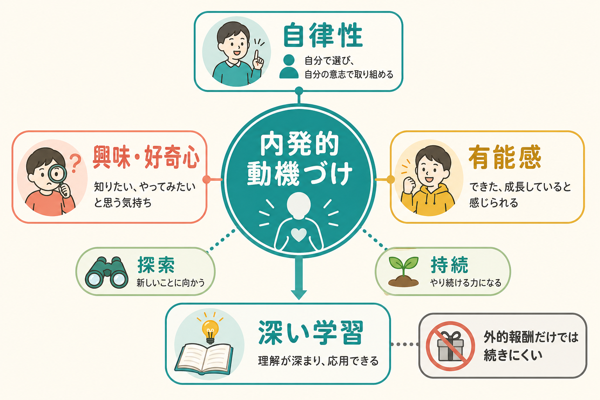
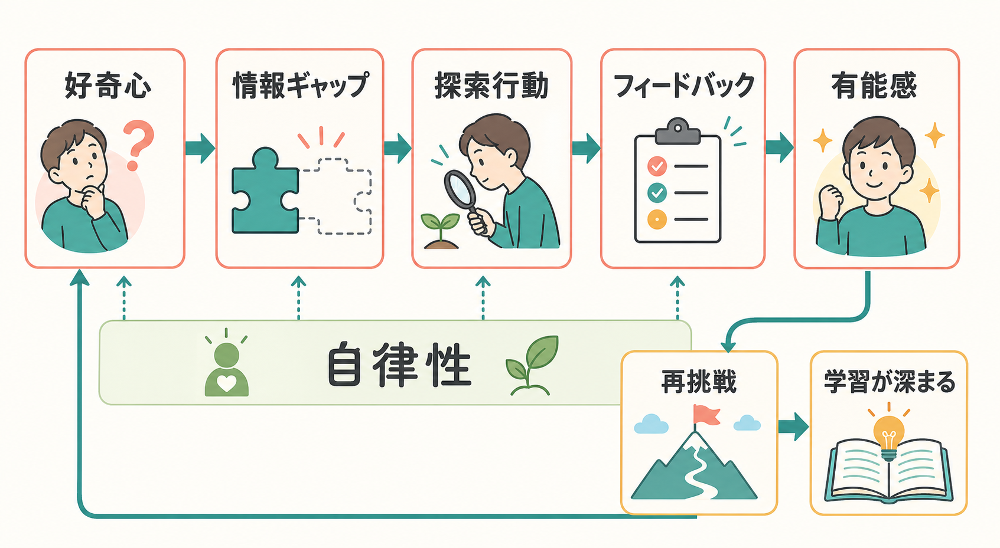
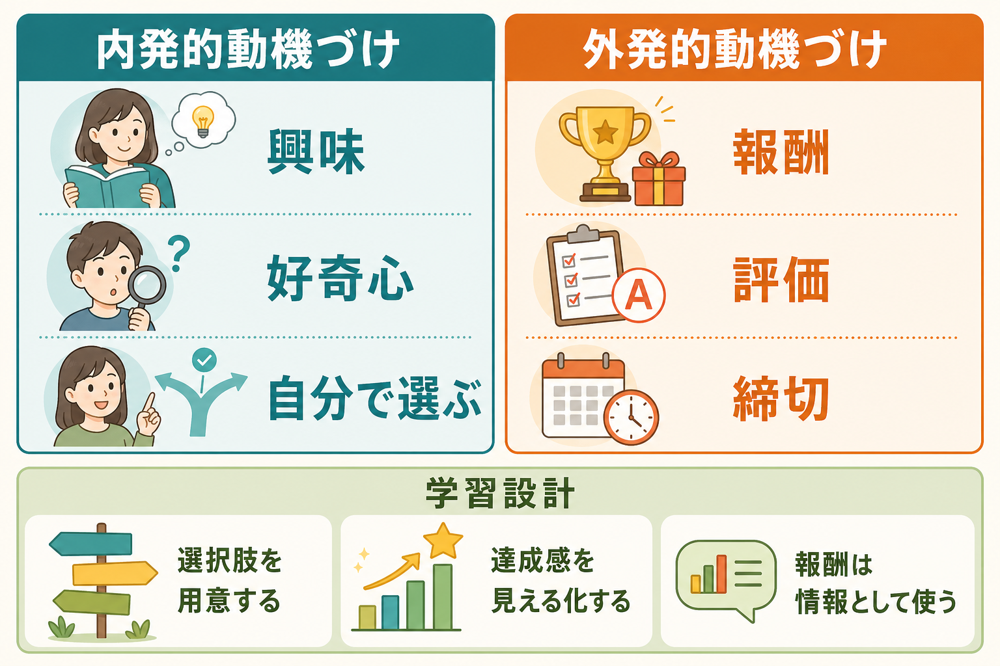

# 内発的動機づけとは何か

## 要点

- 内発的動機づけとは、報酬や評価を得るためではなく、活動そのものが面白い、知りたい、やってみたいと感じるために行動する動機づけである [1]。
- [[自己決定理論とは何か|自己決定理論]]では、内発的動機づけは自律性、有能感、関係性という心理的欲求が支えられる環境で起こりやすいと考える [1]。
- 興味や好奇心は、探索行動、注意、記憶を促し、学習内容を深く処理しやすくする [4][5][6]。
- 外的報酬は常に悪いわけではない。ただし、本人の自律性を奪う管理的な報酬は、活動そのものへの関心を弱めることがある [2][7]。
- 教育では「報酬をなくす」より、選択肢、適切な難しさ、具体的フィードバック、意味づけを設計することが重要である [3][8]。

## この記事で答える問い

この記事では、次の問いに答える。

1. 内発的動機づけは、単なる「やる気」や「好き嫌い」と何が違うのか。
2. 興味、好奇心、自律性、有能感は、どのように学習を支えるのか。
3. 報酬、評価、締切は、いつ学習を助け、いつ内発的動機づけを弱めるのか。
4. 教育、臨床、研究で内発的動機づけを扱うとき、どの限界に注意すべきか。

## まず結論

内発的動機づけは、「内側から自然に湧く気分」というより、活動の面白さ、探索する余地、少し難しい課題への挑戦、自分で選んでいる感覚、成長している感覚が組み合わさって生まれる行動の持続力である。したがって、本人の性格だけで決まるものではない。課題の設計、教師や支援者の関わり、失敗への反応、評価の伝え方によって強まることも弱まることもある [1][3]。

学習にとって重要なのは、内発的動機づけが注意を課題に向け、探索を続けさせ、理解の浅いところを自分で埋めようとする点である。好奇心が高いと、人は答えを知るために時間や労力を払いやすく、驚きのある情報を記憶しやすいことが示されている [5]。一方で、すべての学習を興味だけに任せることはできない。基礎練習、反復、締切、外的評価も必要であり、内発的動機づけと[[外発的動機づけとは何か|外発的動機づけ]]を対立させすぎないことが大切である [8]。

## 背景

心理学では、動機づけを大きく内発的動機づけと外発的動機づけに分けて考えることが多い。内発的動機づけは、活動そのものへの興味や満足によって行動が起こる場合である。外発的動機づけは、成績、報酬、承認、罰の回避、資格取得など、活動の外側にある結果によって行動が起こる場合である [1]。

ただし、この二分法は粗い。現実には、好きで始めた活動に試験や評価が関わることもあれば、最初は義務だった活動が、理解の深まりとともに面白くなることもある。[[動機づけとは何か]]で扱うように、動機づけは単一の量ではなく、価値、期待、感情、身体状態、社会的文脈、報酬の予測が重なった過程である。

この領域で中心的な理論が自己決定理論である。Ryan と Deci は、人間が能動的に探索し、学び、環境に関わる傾向をもつ一方、その傾向は社会的条件によって促進も阻害もされると考えた。そして、自律性、有能感、関係性という三つの心理的欲求が満たされるほど、自己調整と内発的動機づけが支えられやすいと論じた [1]。

## 基本概念

### 内発的動機づけ

内発的動機づけは、「その活動をすること自体が報酬になる」状態である。たとえば、問題を解く過程が面白い、楽器を弾くこと自体が楽しい、知らない現象を調べたい、文章を書くことで考えがまとまる、という場合である。

ここでいう報酬は、外から与えられる賞品だけを指さない。活動中に感じる「わかった」「できた」「もっと知りたい」という経験が、次の探索を支える。これは[[報酬系とは何か|報酬系]]や価値づけの話とも接続するが、内発的動機づけは快楽だけではなく、注意、意味、自己調整、環境との関係を含む。

### 外発的動機づけ

外発的動機づけは、活動の外側にある結果によって行動が支えられる場合である。成績、報酬、罰の回避、締切、資格、他者からの承認などが典型である。外発的動機づけは悪いものではない。期限があるから学習が始まる、評価があるから到達点が明確になる、報酬があるから退屈な作業を終えられる、という場面は多い。

問題は、外的報酬が本人にとって「自分の行動を管理されている」という意味をもつときである。Deci らのメタ分析では、期待された有形報酬、とくに課題遂行や成績に直接結びついた報酬が、自由選択場面での内発的動機づけを低下させる傾向が報告された [2]。ただし、外的インセンティブと内発的動機づけは単純なゼロサムではなく、課題の種類や報酬の伝え方によって関係は変わる [8]。

### 興味と好奇心

興味は、ある対象に注意が向き、価値を感じ、知識が増えるにつれて深まる状態である。Hidi と Renninger は、興味の発達を、きっかけとしての状況的興味、維持された状況的興味、発達中の個人的興味、よく発達した個人的興味という四段階で整理した [4]。つまり、最初から「好きな子」だけが学ぶのではなく、環境が興味の入口を作ることができる。

好奇心は、まだ知らないこと、曖昧なこと、予測と違うことに向かう探索の力である。Kang らは、知識への好奇心が尾状核などの報酬関連領域の活動と関係し、答えを知るために資源を払う行動や、驚きのある情報の記憶向上と関連することを示した [5]。[[好奇心は学習をどう促すのか]]は、この側面をより詳しく扱う関連ノートである。

## 仕組み

### 1. 自律性が「自分で関わっている」感覚を作る

自律性とは、完全に自由放任であることではなく、自分の行動に理由を感じ、自分の意思で関わっていると感じられることである。選択肢がある、課題の意味が説明される、やり方に一定の裁量がある、質問や失敗が許されるといった条件は、自律性を支える。

選択の効果についてのメタ分析では、選択肢を与えることは、内発的動機づけ、努力、課題成績、知覚された有能感を高める傾向が示されている [3]。ただし、選択肢が多すぎる、選ぶ意味がわからない、責任だけを押しつけられる場合は逆効果になりうる。学習設計では、選択肢を増やすだけでなく、選びやすい範囲と理由づけを整える必要がある。

### 2. 有能感が「もう少しやってみる」を支える

有能感とは、自分が課題に働きかけ、少しずつ上達していると感じることである。課題が簡単すぎると退屈になり、難しすぎると無力感が生じる。内発的動機づけを支える課題は、現在の力より少し難しく、努力や方略の変更によって進歩が見える課題である。

この点は[[自己効力感とは何か|自己効力感]]とも近い。ただし、自己効力感が「自分はできる」という予期に焦点を当てるのに対し、内発的動機づけは「その活動に関わること自体の面白さ」も含む。具体的で情報的なフィードバックは、有能感を高めやすい。一方、「報酬を得るためにやらされている」と感じさせるフィードバックは、自律性を下げることがある [1][2]。

### 3. 情報ギャップが探索行動を生む

好奇心は、単に「楽しい気分」ではなく、知っていることと知らないことの差に注意が向く状態として理解できる。問いを立てる、予測する、結果を見る、予測が外れる、理由を探す、という流れが生じると、学習者は情報を自分から取りに行く。

Gottlieb らは、情報探索、好奇心、注意の研究を、心理学、神経科学、機械学習の観点から整理し、情報そのものが内発的価値をもつ場合があると論じた [6]。これは、学習を「正解を与えられる過程」ではなく、「不確実性を減らし、次に何を調べるかを選ぶ過程」として見る視点につながる。

### 4. 報酬は情報にも管理にもなる

同じ報酬でも、学習者に伝わる意味によって効果は変わる。報酬や評価が「あなたは何を達成したか」「次に何を改善できるか」を伝える情報として働く場合、有能感を支えることがある。一方、「これをしないと評価されない」「報酬がないならやる意味がない」という管理的な意味をもつ場合、活動そのものへの関心を弱めることがある [1][2]。

Murayama らの fMRI 研究では、成績連動型の金銭報酬が、その後の自由選択場面における自発的な課題参加を低下させ、前部線条体や前頭前野活動の低下と関連することが報告された [7]。これは、外的報酬価値と内発的な課題価値が、皮質基底核系の価値づけ過程で統合される可能性を示す。ただし、単一研究から教育実践全体を直接決めることはできず、報酬の種類、年齢、課題、文脈を分けて考える必要がある。

## 図解

図1は、内発的動機づけを、興味・好奇心、自律性、有能感、探索、持続、深い学習の関係として整理している。中心にあるのは「活動そのものに関わる価値」であり、外的報酬だけで支える学習とは異なる。

図2は、好奇心から情報ギャップ、探索行動、フィードバック、有能感、再挑戦へ進む循環を示している。重要なのは、正解をすぐ与えることではなく、学習者が「なぜだろう」と感じ、試し、結果から次の問いを作れることである。

図3は、内発的動機づけと外発的動機づけを対立ではなく使い分けとして示している。報酬、評価、締切は学習を開始・維持する足場になりうるが、学習設計では、選択肢、有能感、情報としてのフィードバックを組み合わせる必要がある。

## 臨床・研究との接続

教育場面では、内発的動機づけは、探究学習、読解、科学学習、創作、スポーツ、リハビリテーションなど、長期的な関与が必要な活動で重要になる。教師や支援者は、「もっと頑張れ」と励ますだけでなく、問いを作る、適切な難しさに調整する、選択肢を用意する、進歩を見える化する、失敗を情報として扱う、といった環境設計を行う必要がある [3][4]。

臨床心理学や精神医学では、抑うつ、無関心、ADHD、依存、慢性疾患のセルフケア、リハビリテーション参加などで、動機づけの質が問題になる。ただし、内発的動機づけを「本人の意欲不足」として使ってはならない。症状、疲労、睡眠、認知機能、環境、貧困、家族関係、制度的制約が、活動への関与を大きく左右する。医療・臨床で扱う場合は、研究知見を個別診断や治療指示として短絡せず、教育・支援設計の補助概念として用いる。

研究面では、内発的動機づけは、自己報告、自由選択時間、課題選好、探索行動、記憶成績、神経活動など複数の指標で測られる。どの指標を内発的動機づけの代理とみなすかによって結論が変わるため、測定の妥当性が重要である。[[心理尺度はどのように作られるのか]]や[[妥当性とは何か]]で扱うように、質問紙得点だけで複雑な動機づけを完全に捉えることはできない。

## よくある誤解

### 誤解1: 内発的動機づけは「好きなことだけやる」ことである

内発的動機づけは、努力や反復を避けることではない。むしろ、興味や意味があるからこそ、難しい課題に取り組み、失敗後も再挑戦しやすくなる。好きなことだけを選ぶ状態ではなく、課題への関与が自分のものとして感じられる状態である。

### 誤解2: 外的報酬は必ず内発的動機づけを壊す

外的報酬は常に悪いわけではない。報酬や評価は、学習を始めるきっかけ、到達度の情報、社会的承認、努力の可視化として働くことがある。問題は、報酬が活動の意味を置き換え、「報酬がなければやる価値がない」と感じさせる場合である [2][8]。

### 誤解3: 内発的動機づけは完全に個人差で決まる

興味や好奇心には個人差があるが、環境によって育つ部分も大きい。Hidi と Renninger の興味発達モデルが示すように、状況的興味は、教材、問い、驚き、社会的関わりによって生じ、それが維持されると個人的興味へ発達しうる [4]。

### 誤解4: 自律性とは、何も指示しないことである

自律性支援は放任ではない。課題の目的を説明し、選択肢を調整し、困ったときの支援を用意し、納得できる構造を作ることが含まれる。構造のない自由は、むしろ不安や混乱を生み、有能感を下げることがある。

## 関連ノート

既存ノート:

- [[動機づけとは何か]]
- [[外発的動機づけとは何か]]
- [[自己決定理論とは何か]]
- [[好奇心は学習をどう促すのか]]
- [[自己効力感とは何か]]
- [[報酬系とは何か]]
- [[報酬予測誤差とは何か]]
- [[オペラント条件づけとは何か]]
- [[強化とは何か]]
- [[フィードバックは学習をどう促進するのか]]

MOC更新候補:

- `content/00_MOC/MOC｜認知科学・心理学.md` の「学習・行動・動機づけ」周辺に本記事へのリンクを追加する。
- 並列ジョブとの競合を避けるため、このタスクでは MOC 本体は更新しない。

今後の作成候補:

- 興味発達モデルとは何か
- 過剰正当化効果とは何か
- 自律性支援とは何か
- 教育における報酬設計とは何か

## 理解チェック

1. 内発的動機づけと外発的動機づけは、何を基準に区別されるか。
2. 自律性、有能感、関係性は、内発的動機づけをどのように支えるか。
3. 好奇心が学習と記憶を促すのは、どのような仕組みによると考えられるか。
4. 外的報酬が内発的動機づけを弱めるのは、どのような条件のときか。
5. 教育や臨床で「本人のやる気がない」と言う前に、どの環境要因を確認すべきか。

## 参考文献

[1] Ryan, R. M., & Deci, E. L. (2000). Self-determination theory and the facilitation of intrinsic motivation, social development, and well-being. *American Psychologist, 55*(1), 68-78. https://doi.org/10.1037/0003-066X.55.1.68

[2] Deci, E. L., Koestner, R., & Ryan, R. M. (1999). A meta-analytic review of experiments examining the effects of extrinsic rewards on intrinsic motivation. *Psychological Bulletin, 125*(6), 627-668. https://doi.org/10.1037/0033-2909.125.6.627

[3] Patall, E. A., Cooper, H., & Robinson, J. C. (2008). The effects of choice on intrinsic motivation and related outcomes: A meta-analysis of research findings. *Psychological Bulletin, 134*(2), 270-300. https://doi.org/10.1037/0033-2909.134.2.270

[4] Hidi, S., & Renninger, K. A. (2006). The four-phase model of interest development. *Educational Psychologist, 41*(2), 111-127. https://doi.org/10.1207/s15326985ep4102_4

[5] Kang, M. J., Hsu, M., Krajbich, I. M., Loewenstein, G., McClure, S. M., Wang, J. T., & Camerer, C. F. (2009). The wick in the candle of learning: Epistemic curiosity activates reward circuitry and enhances memory. *Psychological Science, 20*(8), 963-973. https://doi.org/10.1111/j.1467-9280.2009.02402.x

[6] Gottlieb, J., Oudeyer, P.-Y., Lopes, M., & Baranes, A. (2013). Information-seeking, curiosity, and attention: Computational and neural mechanisms. *Trends in Cognitive Sciences, 17*(11), 585-593. https://doi.org/10.1016/j.tics.2013.09.001

[7] Murayama, K., Matsumoto, M., Izuma, K., & Matsumoto, K. (2010). Neural basis of the undermining effect of monetary reward on intrinsic motivation. *Proceedings of the National Academy of Sciences, 107*(49), 20911-20916. https://doi.org/10.1073/pnas.1013305107

[8] Cerasoli, C. P., Nicklin, J. M., & Ford, M. T. (2014). Intrinsic motivation and extrinsic incentives jointly predict performance: A 40-year meta-analysis. *Psychological Bulletin, 140*(4), 980-1008. https://doi.org/10.1037/a0035661

## 未解決問題

- 内発的動機づけを、自己報告、自由選択時間、探索行動、神経活動のどの指標で測るのが最も妥当なのか。
- 報酬が「情報」として働く場合と「管理」として働く場合を、教育現場でどう見分けるべきか。
- 好奇心による学習促進は、年齢、発達特性、文化、学校制度によってどのように変わるのか。
- 内発的動機づけを重視する設計と、評価・資格・締切が必要な制度をどう両立するのか。

## 更新ログ

- 2026-04-27: 初稿作成。内発的動機づけの定義、自己決定理論、興味・好奇心、報酬のアンダーマイニング効果、教育・臨床との接続を整理し、画像3枚と主要参考文献を追加。
