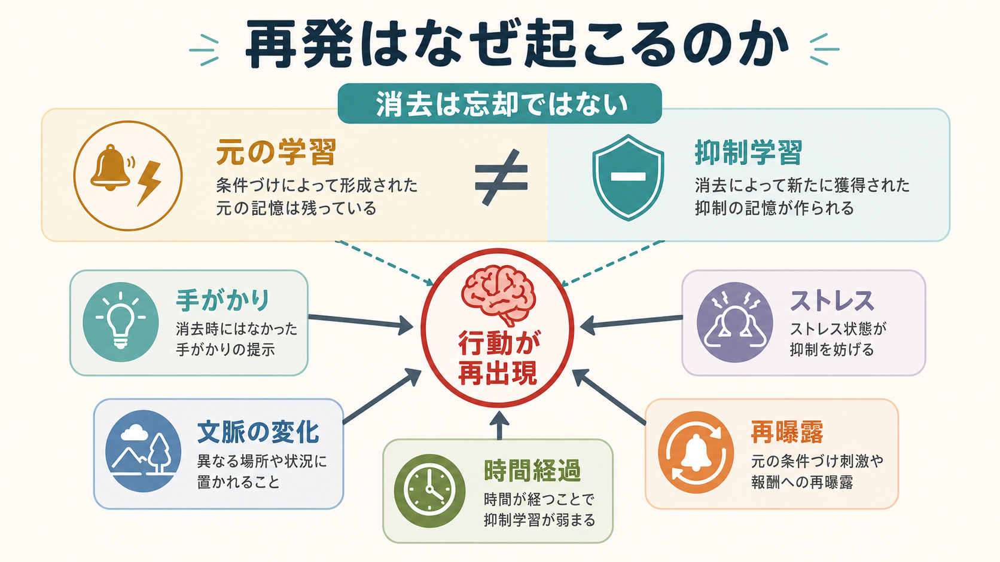
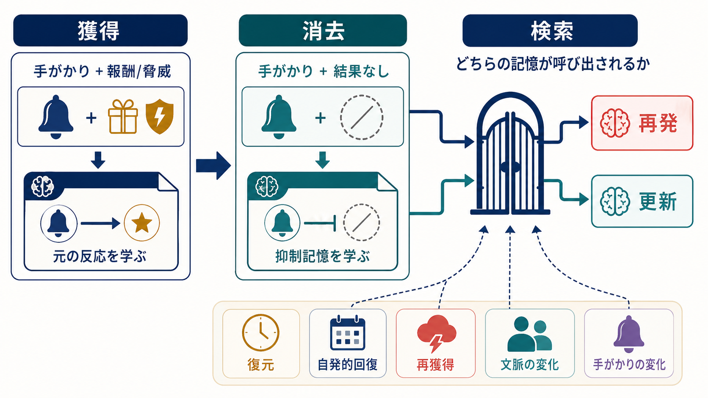

# 再発はなぜ起こるのか

## 要点

- 再発とは、いったん弱まった問題行動や恐怖反応が、手がかり、文脈の変化、時間経過、ストレス、再曝露によって再び出ることである。
- 重要なのは、[[消去とは何か|消去]]が「元の学習を消す」過程ではなく、多くの場合「元の反応を抑える新しい学習」を加える過程だという点である[1][2]。
- そのため、消去後の手がかりは二つの意味をもつ。以前の「反応すべき」という記憶と、消去で学んだ「今は反応しなくてよい」という記憶が競合する[1]。
- 再発は意志の弱さだけで説明できない。記憶検索、文脈依存性、ストレスによる制御低下、報酬・脅威への再接近が重なって起こる学習現象である[4][6]。
- 臨床や支援では、単に反応を減らすだけでなく、複数の文脈で安全・非強化を学び、再出現を前提に再学習できる設計が重要になる[5][7]。

## この記事で答える問い

1. なぜ、やめたはずの行動や弱まったはずの恐怖が戻るのか。
2. 消去後の再発には、どのような種類があるのか。
3. 手がかり、文脈、時間、ストレスは、どのように再発を引き起こすのか。
4. この理解は、依存、回避、不安、行動変容の支援にどう関係するのか。

## まず結論

再発は、失敗ではなく「以前の学習がまだ検索可能であること」の表れである。たとえば、ある場所、匂い、人、時間帯、身体状態が過去の報酬や脅威と結びついていると、その手がかりは消去後にも元の反応を呼び出しうる。消去によって反応が下がっても、元の記憶が完全に消えたとは限らない[1][2]。

このため再発を防ぐには、「反応を一時的に下げる」だけでは足りない。手がかりが出ても反応しない経験、複数の場所や気分で安全を学ぶ経験、再出現したときにすぐ再学習へ戻る手順が必要になる。これは[[行動変容はどのように起こるのか]]、[[習慣学習とは何か]]、[[回避学習とは何か]]を考えるときにも中心的な視点になる。

## 背景

学習心理学では、反応が弱まる現象を古くから[[古典的条件づけとは何か|古典的条件づけ]]や[[オペラント条件づけとは何か|オペラント条件づけ]]の枠組みで研究してきた。古典的条件づけでは、音や場所などの条件刺激が報酬や脅威を予測するようになり、恐怖、渇望、身体反応が生じる。オペラント条件づけでは、行動のあとに[[強化とは何か|強化]]が起こることで、その行動が繰り返されやすくなる。

消去は、この結びつきを弱めるように見える。条件刺激のあとに脅威が起こらない経験を繰り返す、あるいは行動しても報酬が得られない経験を繰り返すと、反応は低下する。しかし Bouton のレビューは、消去を「元の学習の削除」と見るより、「元の学習に対抗する新しい学習」と見る必要を強調した[1]。この見方では、再発は例外ではなく、消去学習の性質から自然に予測される。

## 基本概念

**消去**  
以前は結果を予測していた刺激や行動が、もはや結果を伴わない経験を重ねることで、表に出る反応が弱まる過程である。消去は忘却そのものではなく、抑制的な新学習として理解されることが多い[1][2]。

**再出現**  
消去後に反応が戻る広い現象である。恐怖反応、渇望、薬物探索、回避、過食、先延ばし、確認行動など、さまざまな行動で似た構造が見られる。ただし臨床的な「再発」は、行動の頻度、強度、生活上の影響、本人の安全によって意味が変わるため、単純な実験モデルと同一視しすぎてはいけない。

**更新・復元・自発的回復・再獲得**  
消去後の反応再出現には複数の型がある。文脈が変わると反応が戻る「更新」、結果や報酬・脅威への再曝露で戻る「復元」、時間経過で戻る「自発的回復」、再び条件づけを受けると素早く戻る「再獲得」が代表的である[1][2][3]。

## 仕組み

### 1. 消去は元の記憶を消しにくい

消去後の手がかりは、曖昧な語のように二つの意味をもつ。過去の学習では「この手がかりは報酬や脅威を予測する」と学んでいる。一方、消去では「この手がかりが出ても、いまは結果が起こらない」と学ぶ。どちらの記憶が検索されるかは、現在の文脈に強く依存する[1]。

このため、消去が成功したように見えても、学習した場所、気分、時間帯、身体状態から外れると、元の反応が出やすくなる。[[恐怖条件づけとは何か]]の文脈でいえば、恐怖が下がったことは重要だが、それだけでは「どこでも安全を検索できる」とは限らない。

### 2. 文脈が変わると「更新」が起こる

更新とは、消去した反応が別の文脈で戻る現象である。たとえば治療室では不安が下がったのに、実生活の場所では反応が戻る。あるいは、家では飲酒や喫煙を控えられるが、以前よく使っていた店や人間関係の中で渇望が戻る。

消去学習は、獲得時の学習よりも文脈依存的になりやすい。つまり「この場所では反応しなくてよい」という学習になりやすく、「どこでも反応しなくてよい」という汎用的な学習になりにくい[1][2]。オペラント行動でも、行動と結果の関係だけでなく、文脈が反応を支える役割をもつことが示されている[8]。

### 3. 時間が経つと「自発的回復」が起こる

自発的回復とは、消去直後には弱かった反応が、時間経過後に戻る現象である。Rescorla は、自発的回復が Pavlov 型条件づけにおける基本的な現象であり、消去の背後に複数の学習過程があることを示す手がかりだと整理している[3]。

日常的には「しばらく大丈夫だったのに戻った」と見える。これは必ずしも努力不足ではない。時間そのものが文脈として働き、消去時の記憶を検索しにくくする場合がある。したがって長期維持では、最初の消去だけでなく、間隔を空けた再練習や、再出現時の早期対応が重要になる。

### 4. 再曝露で「復元」や「再獲得」が起こる

復元とは、消去後に報酬や脅威へ再び曝露されることで反応が戻る現象である。依存行動では、少量の再使用、薬物関連手がかり、環境手がかり、ストレスが薬物探索を再開させる条件として研究されてきた[6]。

再獲得とは、いったん消去された刺激と結果の関係が再び経験されると、初回より速く反応が戻る現象である。これは、元の学習が残っているという考えと整合的である[1][2]。したがって「一度だけなら大丈夫」と単純には言えない場面がある。特に報酬が強い行動では、少数回の再強化が大きな回復を生むことがある。

### 5. ストレスは抑制学習の検索を妨げる

ストレスは、再発を直接「作る」というより、抑制学習を検索しにくくし、古い反応を出やすくする条件として働く。薬物探索の reinstatement 研究では、薬物そのもの、薬物関連手がかり、環境文脈、ストレスが再探索を誘発する主要条件として整理されている[6]。恐怖消去の研究でも、消去後の恐怖再出現は臨床的不安の理解に重要である[4]。

この視点は、再発を道徳化しないために重要である。睡眠不足、孤立、痛み、対人ストレス、疲労、急な生活変化が重なると、以前なら使えた対処が検索されにくくなる。行動の再出現を「人格の問題」と決めつけるより、どの手がかりと状態が抑制学習の検索を妨げたのかを分析するほうが実用的である。

## 図解

| 再出現の型 | 何が起こるか | 例 | 支援上の示唆 |
|---|---|---|---|
| 更新 | 消去した文脈から離れると反応が戻る | 治療室では平気だが実生活で不安が戻る | 複数の文脈で練習する |
| 自発的回復 | 時間が経つと反応が戻る | 数週間後に渇望や回避が戻る | 間隔を空けた再練習を入れる |
| 復元 | 報酬・脅威・関連刺激への再曝露で戻る | 少量の再使用や手がかりで探索が戻る | 高リスク手がかりと代替行動を設計する |
| 再獲得 | 再び条件づけされると速く戻る | 一度の成功報酬で旧習慣が強まる | 「戻った後の戻り方」を準備する |
| ストレス誘発 | 抑制記憶が検索されにくくなる | 疲労時や孤立時に問題行動が出る | 睡眠、支援、環境調整を含める |

## 臨床・研究との接続

### 曝露療法との接続

曝露療法では、恐れている刺激や状況に安全な形で接近し、予測した破局的結果が起こらないことを学ぶ。ただし、単にその場で恐怖が下がることだけを目標にすると、別の文脈で恐怖が戻る可能性を見落としやすい。抑制学習モデルでは、期待違反、複数文脈、検索手がかり、安全行動の扱い、感情の言語化などを使い、消去記憶を検索しやすくすることを重視する[5]。

ここで扱う内容は教育・研究目的の説明であり、個別の曝露計画や治療指示ではない。強い不安、トラウマ記憶、自傷リスク、依存症状がある場合は、専門家の評価と安全な支援体制が必要である。

### 依存・渇望との接続

依存行動では、薬物や行動そのものだけでなく、場所、人、時間帯、道具、匂い、感情状態が強い手がかりになる。Shaham らの reinstatement モデルは、薬物自己投与後に反応を消去し、その後に薬物、手がかり、ストレスなどで薬物探索が戻るかを調べる枠組みを整理した[6]。Conklin と Tiffany は、依存の cue-exposure 治療では、動物学習研究から見た消去の脆さを十分に扱わないと効果が限定されやすいと論じている[7]。

このことは、再発予防を「誘惑に勝つ」問題としてだけ扱わない理由になる。高リスク文脈を減らす、代替行動を準備する、複数の状況で手がかりに慣れる、ストレス時の支援経路を作る、といった設計が学習理論と整合的である。

### 行動変容との接続

生活習慣や先延ばしでも、同じ考え方が使える。ある行動が報酬や不快の軽減をもたらしていたなら、その行動は単なる癖ではなく、文脈に支えられた学習である。行動を止めるだけでは、以前の文脈が戻ったときに再発しやすい。

したがって行動変容では、旧行動の手がかりを特定し、旧行動の直後に得られていた報酬や軽減を分析し、代替行動が同じ機能をある程度満たせるようにする必要がある。これは[[報酬予測誤差とは何か]]や[[価値学習とは何か]]とも接続する。

## よくある誤解

### 誤解1: 再発は「元に戻った」ことを意味する

再発は、すべてがゼロに戻ったことを意味しない。消去学習や対処スキルが完全に失われたとは限らない。むしろ、特定の文脈で古い記憶が優位になった状態として捉えると、どの条件で再学習を起こせばよいかを考えやすい。

### 誤解2: 消去できたなら再発しない

消去が起こっても、更新、自発的回復、復元、再獲得が起こりうる[1][2][3]。反応が下がったことは重要だが、「どの文脈で下がったのか」「どのくらい時間が経っても維持されるのか」「ストレス時にも検索できるのか」を別に見る必要がある。

### 誤解3: 意志が強ければ手がかりは問題にならない

手がかりは注意、記憶、身体反応、価値づけをまとめて動かす。とくに依存や恐怖では、手がかり反応は自動的に生じやすい。意志の強さだけでなく、手がかりを減らす、文脈を変える、支援者につなぐ、代替行動を先に配置する、といった環境設計が重要である。

### 誤解4: 失敗したら最初からやり直しである

再発後の早期対応は、学習の一部である。問題は「再発したかどうか」だけではなく、「再発からどれくらい早く観察・修正・再学習へ移れるか」である。再発を予測可能な学習現象として扱うと、羞恥や自己批判に沈むより、次の条件設計に移りやすい。

## 関連ノート

- [[消去とは何か]]
- [[古典的条件づけとは何か]]
- [[オペラント条件づけとは何か]]
- [[恐怖条件づけとは何か]]
- [[回避学習とは何か]]
- [[習慣学習とは何か]]
- [[行動変容はどのように起こるのか]]
- [[強化とは何か]]
- [[報酬予測誤差とは何か]]

MOC 更新候補: `content/00_MOC/` 配下の認知科学・心理学、学習、行動変容、臨床応用に関する MOC。並列ジョブとの衝突を避けるため、本記事では MOC 本体は更新しない。

## 理解チェック

1. 消去を「忘却」ではなく「抑制学習」と見ると、再発はどのように説明できるか。
2. 更新、自発的回復、復元、再獲得の違いを一つずつ説明できるか。
3. ストレスが再発に関わるとき、何が検索されにくくなるのか。
4. ある問題行動について、手がかり、文脈、報酬、代替行動を具体的に挙げられるか。
5. 再発後の対応を「失敗の反省」ではなく「再学習の設計」として書き換えると、何が変わるか。

## 参考文献

[1] Bouton, M. E. (2002). Context, ambiguity, and unlearning: Sources of relapse after behavioral extinction. *Biological Psychiatry, 52*(10), 976-986. https://doi.org/10.1016/S0006-3223(02)01546-9

[2] Bouton, M. E., Westbrook, R. F., Corcoran, K. A., & Maren, S. (2006). Contextual and temporal modulation of extinction: Behavioral and biological mechanisms. *Biological Psychiatry, 60*(4), 352-360. https://doi.org/10.1016/j.biopsych.2005.12.015

[3] Rescorla, R. A. (2004). Spontaneous recovery. *Learning & Memory, 11*(5), 501-509. https://doi.org/10.1101/lm.77504

[4] Vervliet, B., Craske, M. G., & Hermans, D. (2013). Fear extinction and relapse: State of the art. *Annual Review of Clinical Psychology, 9*, 215-248. https://doi.org/10.1146/annurev-clinpsy-050212-185542

[5] Craske, M. G., Treanor, M., Conway, C. C., Zbozinek, T., & Vervliet, B. (2014). Maximizing exposure therapy: An inhibitory learning approach. *Behaviour Research and Therapy, 58*, 10-23. https://doi.org/10.1016/j.brat.2014.04.006

[6] Shaham, Y., Shalev, U., Lu, L., de Wit, H., & Stewart, J. (2003). The reinstatement model of drug relapse: History, methodology and major findings. *Psychopharmacology, 168*, 3-20. https://doi.org/10.1007/s00213-002-1224-x

[7] Conklin, C. A., & Tiffany, S. T. (2002). Applying extinction research and theory to cue-exposure addiction treatments. *Addiction, 97*(2), 155-167. https://doi.org/10.1046/j.1360-0443.2002.00014.x

[8] Bouton, M. E., & Todd, T. P. (2014). A fundamental role for context in instrumental learning and extinction. *Behavioural Processes, 104*, 13-19. https://doi.org/10.1016/j.beproc.2014.02.012

## 未解決問題

- 消去学習をどのような文脈数、間隔、強度で練習すれば、もっとも長期に維持されやすいのか。
- ストレス、睡眠、孤立、身体状態は、消去記憶の検索にどの程度影響するのか。
- 動物実験の再発モデルを、人間の複雑な依存、回避、不安、生活習慣の再発へどこまで一般化できるのか。
- 再発を恥や失敗として扱わず、再学習の機会として扱う支援設計を、どのように個別化できるのか。
