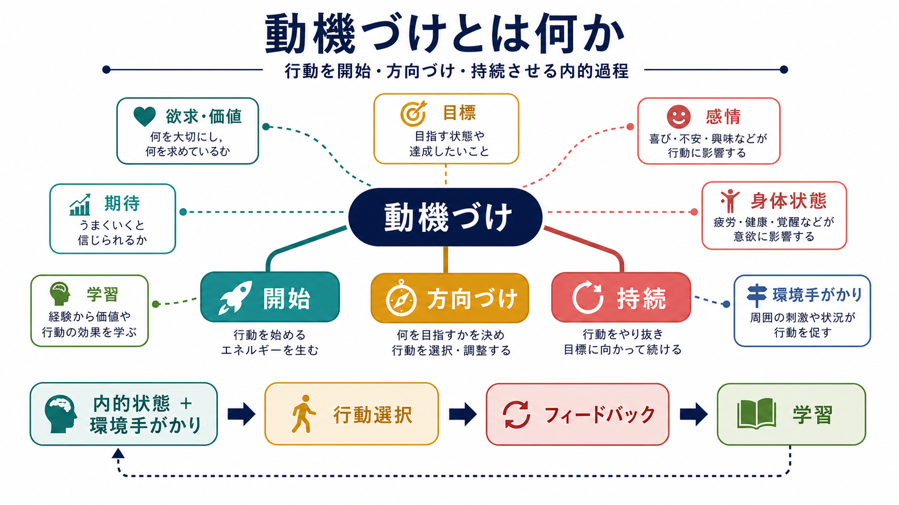
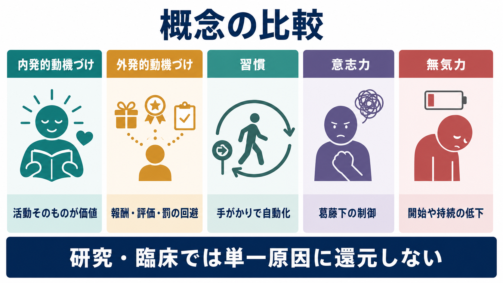

# 動機づけとは何か

## 要点

- 動機づけとは、行動を「始める」「何へ向ける」「どれだけ続ける」かを調整する内的過程である。
- 動機づけは単なる気合いや意志力ではなく、欲求、価値、期待、目標、感情、身体状態、学習、環境手がかりが組み合わさって生じる。
- 報酬は「快いか」「欲しくなるか」「予測できるか」に分けて考えると、依存、習慣、無気力、学習行動を理解しやすい[1]。
- ドーパミン系は快感そのものだけでなく、報酬予測、手がかりの目立ちやすさ、努力配分、接近行動に関わる[2][3]。
- 臨床・教育・研究では、動機づけを「本人の性格」だけに還元せず、課題設計、環境、身体状態、報酬履歴、自己決定感を含めて見る。

## この記事で答える問い

1. 動機づけは「やる気」と同じものなのか。
2. 生物学的な欲求と、心理学的な目標はどうつながるのか。
3. 報酬、ドーパミン、学習は動機づけをどう変えるのか。
4. 動機づけの低下を、個人の怠けとして扱うとなぜ危ういのか。

## まず結論

動機づけは、行動のエネルギー源だけではない。空腹のような身体状態、価値の判断、成功できそうだという期待、環境中の手がかり、過去の学習、他者との関係、目標の明確さが相互作用し、ある行動を他の行動よりも選ばれやすくする過程である。したがって、動機づけを理解するには、内側の欲求だけでなく、外側の状況とフィードバックの循環を見る必要がある。

## 背景

古典的な動機づけ理論は、飢え、渇き、痛みの回避など、身体の不均衡を減らす「動因」から行動を説明しようとした。この見方は、生理的欲求と[[強化とは何か]]の関係を考えるうえで重要だったが、探索、遊び、好奇心、達成、社会的承認のように、単純な緊張低減だけでは説明しにくい行動も多い。

現代の見方では、動機づけは複数の水準で考えられる。生理的水準では身体状態とホメオスタシス、学習水準では[[古典的条件づけとは何か]]や[[オペラント条件づけとは何か]]、認知水準では期待、目標、自己効力感、社会的水準では自律性・有能感・関係性が関わる。自己決定理論では、とくに自律性、有能感、関係性という基本的心理欲求が、内発的動機づけや持続的な自己調整に重要だとされる[4][5]。

## 基本概念

### 開始、方向づけ、持続

動機づけを最小限に分解すると、第一に行動を始める「開始」、第二に複数の選択肢のうち何へ向かうかを決める「方向づけ」、第三に障害や遅延があっても続ける「持続」がある。たとえば勉強を例にすると、机に向かうこと、どの科目を選ぶか、疲れても一定時間続けることは同じ「やる気」ではなく、部分的に異なる過程である。

### 内発的動機づけと外発的動機づけ

内発的動機づけは、活動そのものが面白い、学びたい、できるようになりたいという理由で行動が続く状態である。外発的動機づけは、報酬、評価、罰の回避、義務、承認など、活動外の結果によって行動が支えられる状態である。ただし外発的動機づけは単純に「悪い」ものではない。外から与えられた課題でも、本人が意味を理解し、自分の価値と結びつければ、より自律的な調整になりうる[5]。

### 報酬は一枚岩ではない

報酬は「好き」という快感、「欲しい」という接近傾向、「次に何が起きるか」を学ぶ予測の少なくとも三つに分けられる[1]。この区別は重要である。ある刺激を「好き」と感じていなくても、手がかりによって強く求めてしまうことがある。依存や強迫的な接近行動を考えるとき、快感だけでなく、手がかりが行動を引き寄せる仕組みを見る必要がある。

## 仕組み

### 価値と期待の掛け算

多くの動機づけ現象は、「その結果に価値があるか」と「自分がそれを達成できそうか」の組み合わせで理解できる。価値が高くても成功可能性が極端に低いと接近しにくく、成功できそうでも価値が低ければ行動は起こりにくい。目標設定研究では、具体的で難度が適切な目標、フィードバック、コミットメントが課題遂行を高めることが示されている[6]。

### 予測誤差と学習

報酬が予想より良ければ、その手がかりや行動の価値は上がりやすい。予想通りなら大きな更新は起こりにくく、予想より悪ければ価値は下がりやすい。この「予測と結果のずれ」は報酬予測誤差と呼ばれ、ドーパミンニューロンの活動と関連づけて研究されてきた[2]。ただし、ドーパミンを「快楽物質」とだけ呼ぶのは不正確である。ドーパミン系は報酬予測、手がかりへの接近、努力を払うかどうかの選択にも関わる[3]。

### 努力配分と機会費用

動機づけは「やりたいか」だけでなく、「そのためにどれだけ努力を払うか」にも関わる。たとえば、同じ報酬でも必要な労力が大きいと選ばれにくい。中脳辺縁系ドーパミンは、報酬の快感というよりも、努力を要する選択や接近行動の活性化と結びついて議論されている[3]。

### 感情と認知制御

感情は動機づけと競合するだけでなく、何に注意を向けるか、どの行動を抑制するか、どれだけ認知制御を投入するかを変える。Pessoa は、情動と動機づけが知覚競合と実行制御の両方に影響する枠組みを提案している[7]。つまり、動機づけは「冷たい合理計算」と「熱い感情」の片方ではなく、両者の接点にある。

## 図解

| 観点 | 主な問い | 例 |
|---|---|---|
| 生理的欲求 | 身体状態は行動を押し上げているか | 空腹、疲労、痛み、睡眠不足 |
| 報酬価値 | その結果はどれほど望ましいか | 達成感、金銭、承認、安心 |
| 期待 | 成功できそうか | 自己効力感、過去の成功・失敗 |
| 目標 | 何を目指すのか | 具体性、難度、期限 |
| 手がかり | 環境が行動を誘発しているか | 通知、匂い、場所、他者の行動 |
| 学習履歴 | 何が強化されてきたか | [[罰とは何か]]、報酬、回避の成功 |

## 臨床・研究との接続

動機づけの低下は、うつ病、慢性疲労、疼痛、睡眠障害、薬物使用、発達特性、認知機能低下、ストレス環境など、さまざまな条件で起こりうる。したがって、臨床的文脈では「本人が怠けている」と短絡せず、活動開始の困難、快感の低下、報酬予測の変化、努力コストの増大、回避学習、環境の乏しさを分けて考える必要がある。本記事は教育・研究目的の整理であり、個別の診断や治療方針を示すものではない。

研究では、行動課題、反応時間、選択率、努力課題、質問紙、神経画像、薬理学的操作などを組み合わせて動機づけを測定する。ただし「動機づけ」は直接観察できない構成概念であるため、単一の尺度や脳部位だけで結論づけるのは危うい。行動指標と主観報告、環境条件、学習履歴を合わせて解釈する必要がある。

## よくある誤解

### 誤解1: 動機づけは意志力の強さで決まる

意志的制御は一部にすぎない。行動は、睡眠、疲労、報酬履歴、環境手がかり、社会的支援、目標の明確さによって大きく変わる。

### 誤解2: 報酬を増やせば必ず動機づけは上がる

短期的には有効でも、報酬が目的化しすぎると、自律性や活動そのものの価値が下がることがある。とくに学習や創造的活動では、外的報酬の使い方に注意が必要である[5]。

### 誤解3: 好きなら続く、嫌いなら続かない

「好き」と「欲しい」は分けられる。好きではないのに手がかりで求めてしまう行動もあれば、好きな活動でも疲労や環境の妨害で始められないことがある[1]。

### 誤解4: 動機づけの低下は単一の原因で説明できる

実際には、快感低下、予測の悲観化、努力コストの増大、失敗経験、罰の履歴、環境手がかりの不足が重なる。支援では、原因探しよりも、開始しやすい環境、具体的目標、小さな成功経験、回復可能なフィードバックを設計するほうが有効な場合がある。

## 関連ノート

- [[強化とは何か]]
- [[罰とは何か]]
- [[オペラント条件づけとは何か]]
- [[古典的条件づけとは何か]]
- [[観察学習とは何か]]
- [[般化と弁別は何が違うのか]]

### 今後の作成候補

- 報酬予測誤差とは何か
- 内発的動機づけとは何か
- 自己決定理論とは何か
- 努力コストとは何か
- 無気力とアパシーは何が違うのか

### MOC更新候補

- `content/00_MOC/` 配下の認知科学・心理学系 MOC に、バッチ統合時に本記事へのリンクを追加する。

## 理解チェック

1. 動機づけを「開始」「方向づけ」「持続」に分けると、どのような利点があるか。
2. 「好き」と「欲しい」を分けると、依存や習慣の理解はどう変わるか。
3. ドーパミンを単に「快楽物質」と呼ぶと、どの点が見落とされるか。
4. 外発的動機づけが常に悪いとは言えない理由は何か。
5. 動機づけ低下を支援するとき、個人の性格以外に何を見るべきか。

## 未解決問題

- 人間の日常生活で、報酬予測誤差、努力コスト、自己決定感をどの程度分離して測定できるか。
- 内発的動機づけと外発的動機づけの境界は、文化、発達段階、社会制度によってどう変わるか。
- 臨床的な無気力、抑うつ、疲労、回避学習を、行動課題と主観報告からどこまで区別できるか。

## 参考文献

[1] Berridge, K. C., Robinson, T. E., & Aldridge, J. W. (2009). Dissecting components of reward: 'liking', 'wanting', and learning. *Current Opinion in Pharmacology*, 9(1), 65-73. https://doi.org/10.1016/j.coph.2008.12.014

[2] Schultz, W., Dayan, P., & Montague, P. R. (1997). A neural substrate of prediction and reward. *Science*, 275(5306), 1593-1599. https://doi.org/10.1126/science.275.5306.1593

[3] Salamone, J. D., & Correa, M. (2012). The mysterious motivational functions of mesolimbic dopamine. *Neuron*, 76(3), 470-485. https://doi.org/10.1016/j.neuron.2012.10.021

[4] Deci, E. L., & Ryan, R. M. (2000). The "what" and "why" of goal pursuits: Human needs and the self-determination of behavior. *Psychological Inquiry*, 11(4), 227-268. https://doi.org/10.1207/S15327965PLI1104_01

[5] Ryan, R. M., & Deci, E. L. (2000). Intrinsic and extrinsic motivations: Classic definitions and new directions. *Contemporary Educational Psychology*, 25(1), 54-67. https://doi.org/10.1006/ceps.1999.1020

[6] Locke, E. A., & Latham, G. P. (2002). Building a practically useful theory of goal setting and task motivation: A 35-year odyssey. *American Psychologist*, 57(9), 705-717. https://doi.org/10.1037/0003-066X.57.9.705

[7] Pessoa, L. (2009). How do emotion and motivation direct executive control? *Trends in Cognitive Sciences*, 13(4), 160-166. https://doi.org/10.1016/j.tics.2009.01.006
