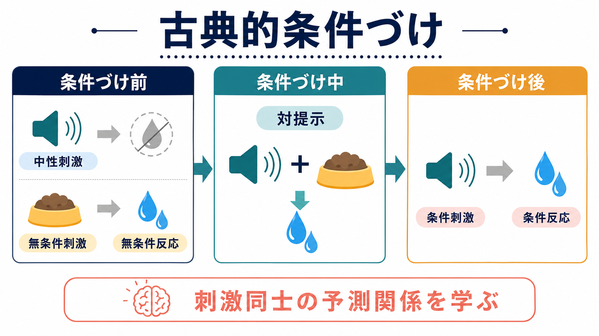
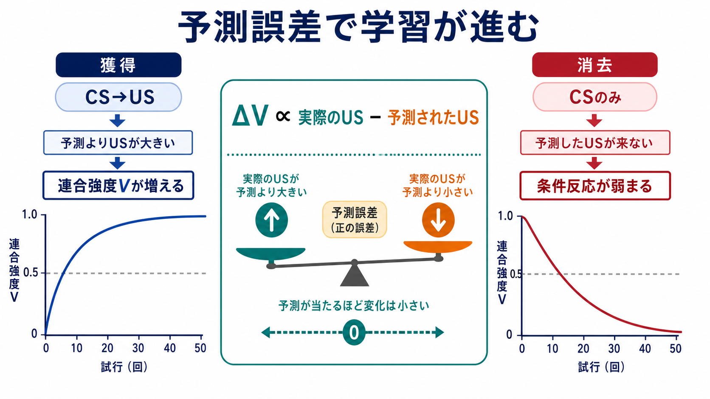
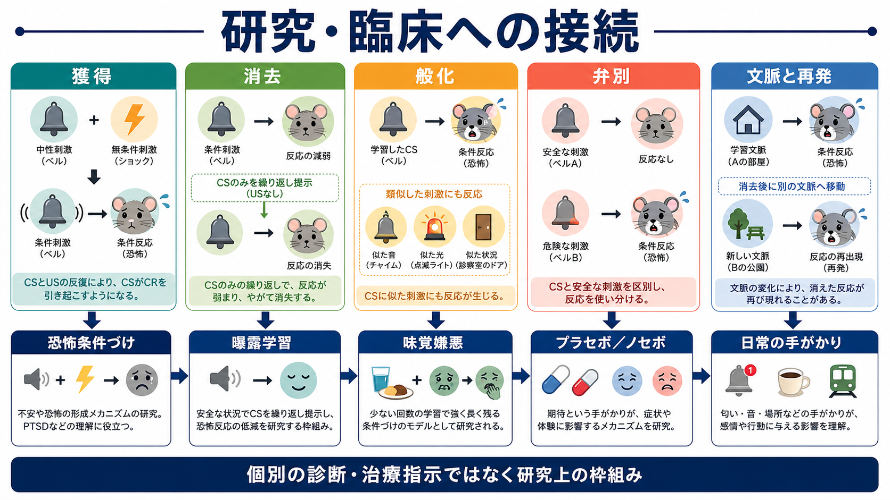

# 古典的条件づけとは何か

## 要点

- 古典的条件づけとは、もともと反応を起こさない中性刺激が、生物学的に意味のある刺激と結びつくことで、条件反応を引き起こすようになる学習である[1][2]。
- 重要なのは「刺激が同時に出た」だけではなく、条件刺激が無条件刺激をどの程度予測するかである[3]。
- 獲得、消去、般化、弁別、自発的回復、文脈依存性は、条件反応の形成と変化を理解する基本語彙である[2][5]。
- Rescorla-Wagner モデルでは、学習は「実際に起きた無条件刺激」と「予測された無条件刺激」のずれ、つまり予測誤差によって進むと表現される[4]。
- 恐怖条件づけ、曝露学習、味覚嫌悪、プラセボ／ノセボ、依存や渇望の手がかり反応など、研究・臨床に広く接続する。ただし、ここでの説明は教育・研究目的であり、個別の診断や治療指示ではない[6][7]。

## この記事で答える問い

1. 古典的条件づけでは、何が何と結びつくのか。
2. 中性刺激、無条件刺激、条件刺激、条件反応はどう区別するのか。
3. なぜ単なる同時出現ではなく、予測や文脈が重要なのか。
4. 恐怖、不安、味覚嫌悪、曝露学習などの研究・臨床とどうつながるのか。

## まず結論

古典的条件づけは、「ベルを鳴らすと犬がよだれを出す」という単純な反射の話だけではない。より一般には、ある刺激が、別の重要な出来事を予測する手がかりになる過程である。音、匂い、場所、人、身体感覚のような手がかりが、食物、痛み、驚き、安心、不快感などの出来事と結びつくと、その手がかりだけで生理反応、情動、接近・回避傾向が生じやすくなる[1][3]。

したがって、古典的条件づけは[[情動と認知は分けられるのか|情動と認知]]、[[予測処理とは何か|予測処理]]、[[神経可塑性は発達と学習をどう支えるのか|神経可塑性]]をつなぐ基礎的な学習原理として読める。反応は自動的に見えるが、その背後では「この刺激は次に何を意味するのか」という予測関係が更新されている。

## 背景

古典的条件づけは、パブロフの条件反射研究から広く知られるようになった。パブロフは、食物そのものだけでなく、食物の到来を知らせる刺激にも唾液反応が出ることを観察し、これを実験的に扱った[1]。現代の入門的整理では、この学習は、無条件刺激、無条件反応、中性刺激、条件刺激、条件反応の組み合わせとして説明される[2]。

ただし、歴史的な説明をそのまま「刺激と反応の機械的な結びつき」と理解すると狭すぎる。Eelen のレビューが強調するように、古典的条件づけ研究は、単なる同時出現ではなく、刺激間の随伴性、予測価値、注意、文脈、既存の学習履歴を扱う方向に発展してきた[3]。この意味で、古典的条件づけは行動主義の古典概念であると同時に、現代の認知科学・神経科学にも接続する概念である。

## 基本概念

### 中性刺激

中性刺激は、学習前には標的反応をほとんど引き起こさない刺激である。たとえば、食物を予測するようになる前の音や光は中性刺激として扱える。

### 無条件刺激と無条件反応

無条件刺激は、学習がなくても生物学的に意味のある反応を起こしやすい刺激である。食物、痛み、強い音、悪心を起こす出来事などが典型例である。無条件反応は、それに対して自然に生じる反応であり、唾液、驚愕、防御反応、悪心などが含まれる[2]。

### 条件刺激と条件反応

中性刺激が無条件刺激と繰り返し結びつくと、その刺激は条件刺激になる。条件刺激だけで生じるようになった反応が条件反応である。条件反応は無条件反応と似ることもあるが、常に同じではない。たとえば、恐怖条件づけでは、音や場所が危険を知らせる条件刺激となり、防御、回避、緊張などの反応を引き起こす[6]。

## 仕組み

### 獲得

獲得は、条件刺激と無条件刺激の関係を学ぶ段階である。たとえば、音の直後に食物が出る試行が繰り返されると、音は食物の到来を予測する手がかりになる。ここで重要なのは、時間的近接だけではない。条件刺激があるときに無条件刺激が起きやすく、条件刺激がないときには起きにくいという随伴性が強いほど、刺激は予測的な意味を持ちやすい[3]。

### 予測誤差

Rescorla-Wagner モデルは、古典的条件づけを数理的に説明する代表的な枠組みである。単純化して書けば、学習量は次のように表せる[4]。

$$
\Delta V \propto \lambda - V
$$

ここで $V$ は条件刺激が持つ連合強度、$\lambda$ は実際に生じた無条件刺激の強さを表す。無条件刺激が予測より大きければ $V$ は増え、予測どおりなら変化は小さくなり、予測した無条件刺激が来なければ $V$ は下がる。これは[[予測処理とは何か|予測処理]]における予測誤差の考え方と直感的に対応する。

### 消去

消去は、条件刺激が繰り返し提示されても無条件刺激が起きないとき、条件反応が弱まる現象である。ただし、消去は「元の記憶が完全に消える」ことではない。Bouton と Moody のレビューが整理するように、消去後の反応は文脈、時間経過、再学習によって戻ることがあり、記憶検索や干渉の問題として理解する必要がある[5]。

### 般化と弁別

般化は、条件刺激に似た刺激にも条件反応が広がることである。たとえば、ある音に対して恐怖反応を学ぶと、似た音にも反応することがある。弁別は、似た刺激のうち、どれが本当に無条件刺激を予測するかを区別する学習である[2]。

## 図解

古典的条件づけは、次のような流れとして整理できる。

| 段階 | 刺激の関係 | 反応 |
|---|---|---|
| 条件づけ前 | 中性刺激は標的反応を起こさない。無条件刺激は無条件反応を起こす。 | 音では唾液が出ないが、食物では唾液が出る。 |
| 条件づけ中 | 中性刺激と無条件刺激が対提示される。 | 音が食物の到来を予測する。 |
| 条件づけ後 | 中性刺激は条件刺激になる。 | 音だけで条件反応が生じる。 |
| 消去 | 条件刺激のみが提示される。 | 条件反応が弱まる。 |
| 再出現 | 時間や文脈が変わる。 | 自発的回復や更新が起こることがある。 |

## 臨床・研究との接続

恐怖条件づけは、古典的条件づけの代表的な研究領域である。中立的な音や文脈が嫌悪刺激と結びつくと、防御反応を引き起こす手がかりになる。扁桃体を中心とする回路は、恐怖条件づけの獲得と表出に関与する主要な候補として研究されてきた[6]。この論点は、[[PTSDでは恐怖記憶ネットワークに何が起きているのか|PTSDの恐怖記憶ネットワーク]]の理解とも接続する。

曝露療法の理論では、恐怖刺激に安全な条件で接触することにより、単に恐怖記憶を消すというより、「恐れていた結果は起きない」という新しい抑制学習を形成する、という理解が重視される[7]。これは臨床実践の重要な研究枠組みだが、個々の症状に対する治療方法は専門家と相談して決める必要がある。

味覚嫌悪は、古典的条件づけの標準的な説明を拡張した現象である。Garcia と Koelling の研究は、味と悪心のように、生物学的に結びつきやすい刺激と結果の組み合わせがあり、長い時間間隔でも強い学習が起こりうることを示した[8]。これは、学習が単なる近接性だけでなく、生物学的制約や進化的適応にも依存することを示す。

## よくある誤解

### 誤解1: 古典的条件づけは「単なる反射」である

反射的な反応を扱うことは多いが、現代的には、刺激が出来事をどの程度予測するか、文脈がどう検索されるか、どの刺激が注意を引くかが重要である[3][5]。

### 誤解2: 消去は記憶の削除である

消去後にも自発的回復、復元、更新が起こることがある。したがって、消去は元の連合の完全な消去ではなく、新しい学習や文脈依存的な検索の問題として理解される[5][7]。

### 誤解3: 古典的条件づけとオペラント条件づけは同じである

古典的条件づけは、主に刺激同士の関係を学ぶ。オペラント条件づけは、行動とその結果の関係を学ぶ。実生活では両者が重なるが、分析上は区別しておくと理解しやすい。

### 誤解4: 人間の複雑な感情は条件づけだけで説明できる

条件づけは重要な基礎原理だが、人間の感情や行動には、[[エピソード記憶とは何か|エピソード記憶]]、言語、社会的意味づけ、自己理解、[[リスク下の意思決定はどのように行われるのか|意思決定]]、文化的文脈も関わる。古典的条件づけは万能の説明ではなく、複数の説明レベルの一部である。

## 関連ノート

- [[予測処理とは何か]]
- [[神経可塑性は発達と学習をどう支えるのか]]
- [[情動と認知は分けられるのか]]
- [[エピソード記憶とは何か]]
- [[リスク下の意思決定はどのように行われるのか]]
- [[PTSDでは恐怖記憶ネットワークに何が起きているのか]]

### 関連ノート候補

- オペラント条件づけとは何か
- 恐怖条件づけとは何か
- 消去学習とは何か
- 般化と弁別とは何か
- Rescorla-Wagner モデルとは何か

### MOC更新候補

- `content/00_MOC/MOC｜認知科学・心理学.md`

## 理解チェック

1. 中性刺激、無条件刺激、条件刺激、条件反応を、日常例でそれぞれ説明できるか。
2. 「同時に出た」だけではなく「予測する」ことが重要だと言える理由は何か。
3. 消去が記憶の削除ではないと考える根拠は何か。
4. 古典的条件づけとオペラント条件づけの違いは何か。
5. 恐怖条件づけや曝露学習に古典的条件づけを使うとき、どのような限界や注意があるか。

## 未解決問題

- 条件反応の強さは、連合強度、注意、文脈、身体状態、意識的期待のどれにどの程度依存するのか。
- 消去学習を長期的に保持し、文脈が変わっても反応が戻りにくくする条件は何か。
- 人間の社会的意味づけや言語的説明は、古典的条件づけの獲得・消去・般化にどのように介入するのか。
- 動物実験の恐怖条件づけ知見を、どこまで人間の不安・トラウマ関連症状に一般化できるのか。

## 参考文献

[1] Pavlov, I. P. (1927/2010). *Conditioned reflexes: An investigation of the physiological activity of the cerebral cortex*. Annals of Neurosciences, 17(3), 136-141. https://pmc.ncbi.nlm.nih.gov/articles/PMC4116985/

[2] Sanvictores, T., Mahabadi, N., & Rehman, C. I. (2024). Classical Conditioning. In *StatPearls*. StatPearls Publishing. https://www.ncbi.nlm.nih.gov/sites/books/NBK470326/

[3] Eelen, P. (2018). Classical Conditioning: Classical Yet Modern. *Psychologica Belgica*, 58(1), 196-211. https://doi.org/10.5334/pb.451

[4] Rescorla, R. A., & Wagner, A. R. (1972). A theory of Pavlovian conditioning: Variations in the effectiveness of reinforcement and nonreinforcement. In A. H. Black & W. F. Prokasy (Eds.), *Classical Conditioning II: Current Research and Theory* (pp. 64-99). Appleton-Century-Crofts. https://cir.nii.ac.jp/crid/1573668925942365824

[5] Bouton, M. E., & Moody, E. W. (2004). Memory processes in classical conditioning. *Neuroscience & Biobehavioral Reviews*, 28(7), 663-674. https://doi.org/10.1016/j.neubiorev.2004.09.001

[6] Maren, S. (2001). Neurobiology of Pavlovian fear conditioning. *Annual Review of Neuroscience*, 24, 897-931. https://doi.org/10.1146/annurev.neuro.24.1.897

[7] Craske, M. G., Treanor, M., Conway, C. C., Zbozinek, T., & Vervliet, B. (2014). Maximizing exposure therapy: An inhibitory learning approach. *Behaviour Research and Therapy*, 58, 10-23. https://doi.org/10.1016/j.brat.2014.04.006

[8] Garcia, J., & Koelling, R. A. (1966). Relation of cue to consequence in avoidance learning. *Psychonomic Science*, 4, 123-124. https://doi.org/10.3758/BF03342209
