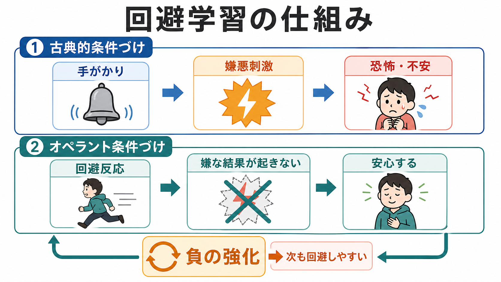
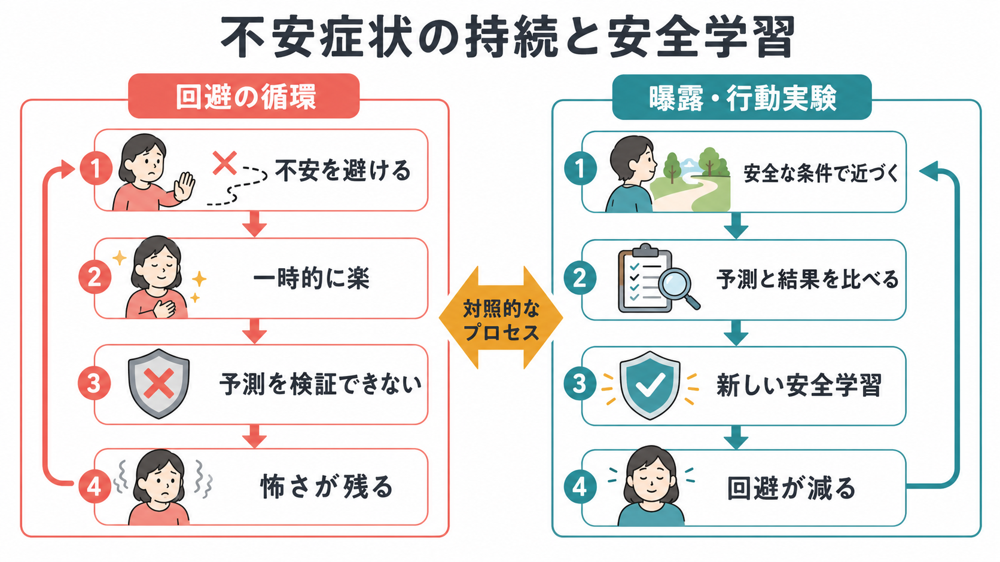

# 回避学習とは何か

## 要点

- 回避学習とは、嫌悪的な出来事を避ける行動が学習され、同じ状況で繰り返されやすくなる過程である。
- 典型的には、脅威手がかりに対する恐怖・不安の学習と、回避した結果として嫌な出来事や不安が減るという負の強化が組み合わさる[1]。
- 回避は危険から身を守る適応的行動でもあるが、実際には安全な状況でも広がると、不安を下げる経験や予測を検証する機会を奪い、不安症状を維持しうる[2][3]。
- 曝露療法や行動実験は、単に「怖さに慣れる」ためではなく、予測と結果を照合し、新しい安全学習を形成する機会として理解できる[4]。

## この記事で答える問い

1. 回避学習は、恐怖条件づけやオペラント条件づけとどう関係するのか。
2. なぜ「避けて楽になる」ことが、長期的には不安を維持しうるのか。
3. 回避行動は常に悪いのか、それとも適応的な場合もあるのか。
4. 曝露療法・行動実験・安全学習とはどのように接続するのか。

## まず結論

回避学習の核心は、「回避したから嫌なことが起きなかった」という経験が、次の回避を強める点にある。たとえば、人前で話すと失敗するかもしれないと感じた人が発表を避けると、その場では不安が下がる。しかし、避けたために「実際に発表しても破局は起きなかったかもしれない」という情報は得られない。その結果、脅威予測は修正されにくく、次の発表場面でも回避が選ばれやすくなる[1][2]。

## 背景

回避は生命維持に必要な行動である。危険な場所から離れる、感染リスクを避ける、疲労が強いときに休むといった行動は、環境に合わせた適応である。問題になるのは、危険の大きさに比べて回避が過剰になり、生活範囲、学習機会、対人関係、身体活動を狭める場合である。

不安症やPTSDでは、恐怖・不安そのものだけでなく、回避によって生活が制限されることが重要な維持要因になる。これは [[PTSDでは恐怖記憶ネットワークに何が起きているのか]]、[[扁桃体過活動は不安症やPTSDにどう関わるのか]]、[[精神療法は脳を変えるのか]] と接続して考えると理解しやすい。脅威手がかり、身体反応、予測、行動、環境からのフィードバックが循環するからである。

## 基本概念

### 回避と逃避

逃避は、すでに起きている嫌悪刺激から離れる行動である。強い音が鳴っている部屋から出る、痛みを生む姿勢をやめる、などが例になる。回避は、嫌悪刺激が起きる前にそれを防ごうとする行動である。発表前に欠席する、電車でパニックが起きるかもしれないので乗らない、確認しないと不安なので何度も確認する、といった行動が含まれる。

回避学習が難しいのは、回避が成功すると「何も起きない」ためである。何も起きなかった理由が、本当に危険を防いだからなのか、そもそも危険がなかったからなのか、学習者には区別しにくい。この「反証情報の欠如」が、回避を維持しやすくする[1][5]。

### 負の強化

負の強化とは、嫌な刺激や状態が取り除かれることで、その直前の行動が増える過程である。ここでいう「負」は罰ではなく、「何かが取り除かれる」という意味である。回避行動では、嫌悪刺激そのものだけでなく、不安、緊張、予期恐怖、身体感覚への注意が下がることも強化子になりうる[6]。

### 安全行動

安全行動とは、不安場面にいながら破局を防ぐために行う補助的行動である。社交場面で目を合わせない、薬や水を常に持つ、発言を極端に短くする、確認を繰り返す、といった形をとる。安全行動は曝露や行動実験を妨げることがある一方、初期段階では接近を可能にする支えになる場合もある。重要なのは、その行動が予測の検証を助けているのか、検証を妨げているのかを機能で見ることである[7][8]。

## 仕組み

古典的な説明は、二要因モデルである。第一に、古典的条件づけによって、もともと中立だった手がかりが嫌悪刺激と結びつき、恐怖や不安を引き起こすようになる。第二に、オペラント条件づけによって、回避反応が嫌悪刺激や不安を減らすため、負の強化を受ける[1]。

ただし、現代の研究では、二要因モデルだけでは十分ではないと考えられている。人は単に刺激と反応の連合を作るだけでなく、「この場面では何が起きそうか」「自分の行動で結果を変えられるか」「回避しなかったらどれくらい危険か」という予測や信念を持つ。したがって、回避学習は、連合学習、期待、制御可能性、身体反応、意思決定が重なる過程として捉える必要がある[1][2]。この点は [[意思決定とは何か]] や [[身体と感情はどのようにつながるのか]] とも接続できる。

神経回路の研究では、脅威手がかりへの防御反応には扁桃体を含む回路が関わる一方、能動的回避では前頭前野が防御反応を調整し、行動を選ぶ過程が重要になる。動物研究では、能動的回避の獲得において、前頭前野が扁桃体を介した凍りつき反応を抑え、行動による回避を可能にすることが示されている[3]。これは「怖いから動けない」状態と、「怖いが行動で制御する」状態が、同じ恐怖反応の強弱だけでは説明できないことを示す。

## 図解

上の図では、左側が回避の循環である。不安を避けると一時的には楽になるが、予測を検証できないため、怖さが残りやすい。右側は、曝露や行動実験を通じて安全な条件で近づき、予測と結果を比べ、新しい安全学習を作る流れである。

図を臨床的助言として読むのではなく、学習理論のモデルとして読むことが重要である。実際の治療では、症状の重さ、生活状況、身体疾患、トラウマ歴、併存症、薬物療法、支援環境を踏まえた専門的判断が必要になる。

## 臨床・研究との接続

不安症状の維持を考えるとき、回避学習は強力な説明枠組みになる。たとえばパニック発作への恐怖では、電車や混雑を避けることで短期的な安心は得られる。しかし、避けるほど「電車に乗っても発作が破局に至らない」「身体感覚は時間とともに変化する」といった学習機会が減る。社交不安では、発言を避ける、視線を避ける、安全な言い回しだけを使うと、相手が実際にはどう反応するかを確かめにくい。

曝露療法の抑制学習モデルでは、恐怖記憶を消すのではなく、「この条件では危険ではない」という新しい記憶を形成し、必要な文脈で取り出せるようにすることが重視される[4]。そのため、重要なのは不安をゼロにすることだけではなく、予測した結果と実際の結果を比較し、回避なしでも対処できる経験を重ねることである。

一方で、回避行動をすべて悪とみなすのも単純化である。Hofmann と Hay は、回避には不安症状を維持する側面だけでなく、制御感を高め、接近を可能にする適応的側面もあると論じている[8]。安全行動についても、曝露の学習を妨げる場合がある一方、段階的に使うことで接近を支える場合がある[7]。したがって研究・臨床では、「回避しているか」だけでなく、「何を避け、何を可能にし、どの予測を検証できなくしているか」を見る必要がある。

## よくある誤解

### 誤解1: 回避はいつも悪い

回避は危険から離れるための基本的な適応行動である。問題は、実際の危険に比べて過剰になり、生活機能や学習機会を狭める場合である。危険が現実的に高い場面での回避と、安全な場面で不安だけを下げる回避は区別する必要がある。

### 誤解2: 回避学習は恐怖条件づけだけで説明できる

恐怖条件づけは重要だが、回避学習には行動によって結果を変えるオペラント学習、期待、制御可能性、安心感、コスト評価が関わる[1][6]。そのため、同じ恐怖反応でも、凍りつく人、逃げる人、確認する人、助けを求める人がいる。

### 誤解3: 曝露は我慢訓練である

曝露は苦痛に耐えるだけの手続きではない。学習理論の観点では、予測を明確にし、結果と比較し、回避しなくても起きること・起きないことを学ぶ機会である[4]。ただし、実施は個別の状態に合わせる必要があり、この記事は治療指示ではない。

## 関連ノート

- [[PTSDでは恐怖記憶ネットワークに何が起きているのか]]
- [[扁桃体過活動は不安症やPTSDにどう関わるのか]]
- [[精神療法は脳を変えるのか]]
- [[意思決定とは何か]]
- [[身体と感情はどのようにつながるのか]]
- [[身体症状症は脳の予測処理で説明できるのか]]

## MOC更新候補

- `content/00_MOC/` 配下の認知科学・心理学、学習・行動、臨床心理学関連 MOC に追加候補。
- 並列ジョブとの競合を避けるため、本記事では MOC ファイル本体は更新しない。

## 理解チェック

1. 回避と逃避の違いを説明できるか。
2. 負の強化は「罰」とどう違うか。
3. 回避によって不安が短期的に下がることが、なぜ長期的維持につながりうるか。
4. 安全行動が学習を助ける場合と妨げる場合を、機能の違いとして説明できるか。
5. 曝露療法を「恐怖記憶の削除」ではなく「安全学習」として説明できるか。

## 参考文献

[1] Krypotos, A.-M., Effting, M., Kindt, M., & Beckers, T. (2015). Avoidance learning: a review of theoretical models and recent developments. *Frontiers in Behavioral Neuroscience, 9*, 189. https://doi.org/10.3389/fnbeh.2015.00189

[2] Pittig, A., Treanor, M., LeBeau, R. T., & Craske, M. G. (2018). The role of associative fear and avoidance learning in anxiety disorders: Gaps and directions for future research. *Neuroscience & Biobehavioral Reviews, 88*, 117-140. https://doi.org/10.1016/j.neubiorev.2018.03.015

[3] Moscarello, J. M., & LeDoux, J. E. (2013). Active avoidance learning requires prefrontal suppression of amygdala-mediated defensive reactions. *Journal of Neuroscience, 33*(9), 3815-3823. https://doi.org/10.1523/JNEUROSCI.2596-12.2013

[4] Craske, M. G., Treanor, M., Conway, C. C., Zbozinek, T., & Vervliet, B. (2014). Maximizing exposure therapy: An inhibitory learning approach. *Behaviour Research and Therapy, 58*, 10-23. https://doi.org/10.1016/j.brat.2014.04.006

[5] Vervliet, B., Lange, I., & Milad, M. R. (2017). Temporal dynamics of relief in avoidance conditioning and fear extinction: Experimental validation and clinical relevance. *Behaviour Research and Therapy, 96*, 66-78. https://doi.org/10.1016/j.brat.2017.04.011

[6] Rachman, S., Radomsky, A. S., & Shafran, R. (2008). Safety behaviour: A reconsideration. *Behaviour Research and Therapy, 46*(2), 163-173. https://doi.org/10.1016/j.brat.2007.11.008

[7] Hofmann, S. G., & Hay, A. C. (2018). Rethinking avoidance: Toward a balanced approach to avoidance in treating anxiety disorders. *Journal of Anxiety Disorders, 55*, 14-21. https://doi.org/10.1016/j.janxdis.2018.03.004

## 未解決問題

- 回避が「適応的な危険管理」から「生活を狭める維持要因」へ移る境界を、個人差としてどう測定するか。
- 回避行動のコスト、安心感、制御感、予測誤差を同じ実験課題でどこまで分離できるか。
- 安全行動を段階的に使う場合、どの条件なら安全学習を妨げず、むしろ接近を助けるのか。

## 更新ログ

- 2026-04-27: 初稿作成。回避学習の二要因モデル、負の強化、不安症状の維持、曝露・安全学習との接続を整理し、画像2枚と主要参考文献を追加。
