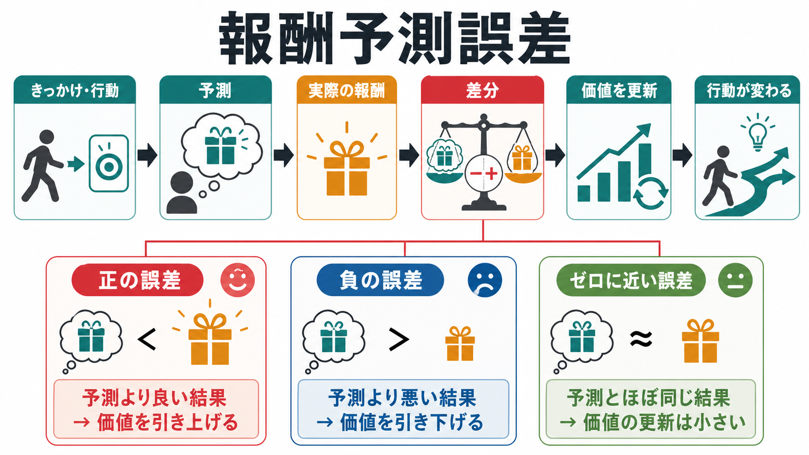
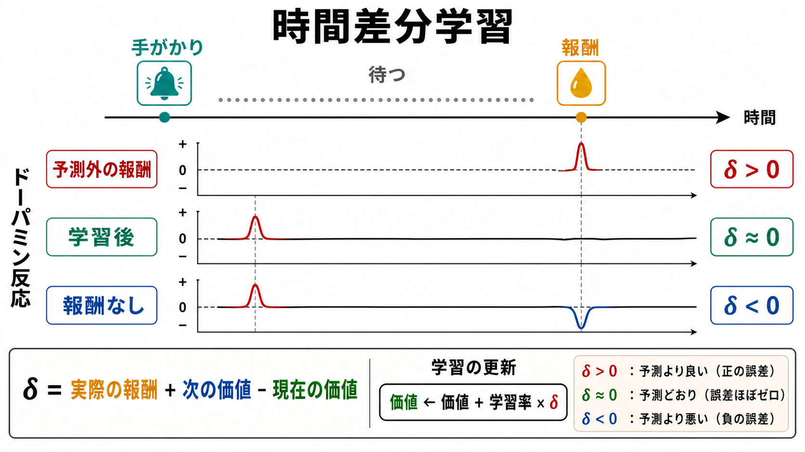
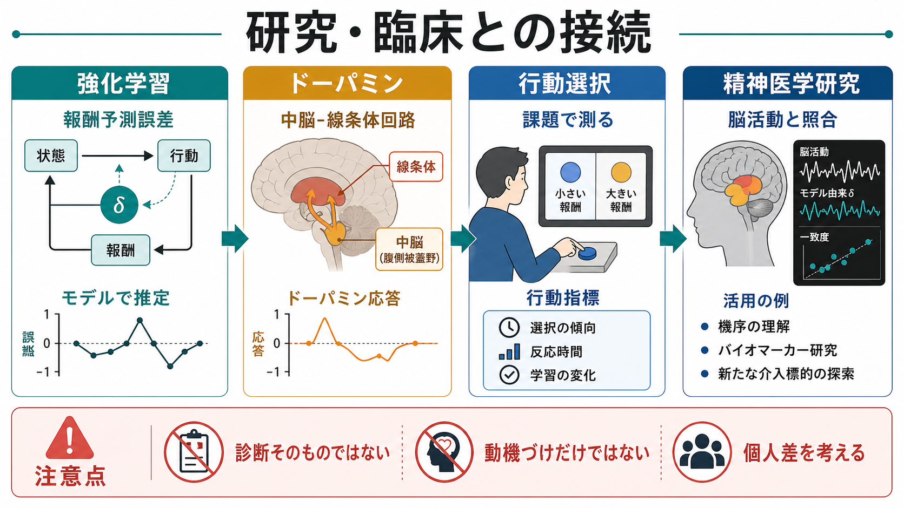

# 報酬予測誤差とは何か

## 要点

- 報酬予測誤差とは、「予想していた報酬」と「実際に得られた報酬」の差である。予想より良ければ正、悪ければ負、ほぼ予想通りならゼロに近い信号になる[1][2]。
- この差分は、次に同じ状況に出会ったときの価値予測を更新する学習信号として働く。つまり、報酬そのものではなく「予測からどれだけ外れたか」が学習を強く動かす[2][3]。
- 中脳ドーパミンニューロンの一部は、予測外の報酬で活動が増え、予測された報酬では反応が小さくなり、期待した報酬が来ないと活動が下がるという、報酬予測誤差に似た応答を示す[1][4]。
- ただし、報酬予測誤差は「快感」や「やる気」と同義ではない。価値更新、注意、行動選択、神経回路、課題設計をつなぐ計算論的な概念として理解する必要がある[5][6]。

## この記事で答える問い

この記事では、[[オペラント条件づけとは何か]]や[[古典的条件づけとは何か]]で扱う「経験によって行動が変わる」現象を、より計算論的に見るために、次の問いに答える。

1. 報酬予測誤差は何を表す信号なのか。
2. なぜ「報酬の大きさ」だけではなく「予測との差」が重要なのか。
3. 時間差分学習とドーパミン応答はどのように対応するのか。
4. 研究・臨床的な文脈で使うとき、どこに注意が必要なのか。

## まず結論

報酬予測誤差は、学習における「答え合わせ」の信号である。たとえば、あるボタンを押すと 100 円もらえると思っていたのに 300 円もらえたなら、予測より良い結果なので正の誤差が生じる。次回は、そのボタンや状況の価値を少し高く見積もる。逆に、100 円を予想していたのに何も得られなければ、負の誤差が生じ、その選択肢の価値は下がる。

重要なのは、報酬予測誤差が「報酬があったかどうか」だけを表すのではない点である。すでに完全に予測された報酬は、学習をあまり進めない。学習を強く進めるのは、予測が外れた瞬間である。この考え方は、強化学習の時間差分学習、条件づけ研究、ドーパミン神経活動の研究を結びつける中心概念になっている[1][2][5]。

## 背景

行動は、単に「よい結果があったから増える」というだけでは説明しきれない。予測済みの結果は、何度繰り返しても新しい情報をあまり含まない。反対に、予想外によい結果、予想外に悪い結果、予想していた結果の消失は、環境についての信念を大きく更新させる。

この発想は、古典的条件づけ、[[オペラント条件づけとは何か]]、強化学習をつなぐ。強化学習では、エージェントが状態を観察し、行動を選び、報酬を受け取り、将来の報酬を最大化するように価値や方策を更新する[2]。報酬予測誤差は、この更新の方向と大きさを決める信号として位置づけられる。

## 基本概念

### 予測、実際の報酬、誤差

最も単純には、報酬予測誤差は次のように表せる。

$$
\delta = r - \hat{r}
$$

ここで、$\delta$ は報酬予測誤差、$r$ は実際の報酬、$\hat{r}$ は予測された報酬である。実際の報酬が予測より大きければ $\delta > 0$、小さければ $\delta < 0$、ほぼ一致すれば $\delta \approx 0$ になる。

時間差分学習では、報酬だけでなく「次の状態の価値」も含めて、現在の価値予測を更新する。典型的には次の形で書かれる[2][5]。

$$
\delta_t = r_t + \gamma V(s_{t+1}) - V(s_t)
$$

$V(s_t)$ は現在の状態価値、$V(s_{t+1})$ は次の状態価値、$\gamma$ は将来報酬をどの程度重視するかを表す割引率である。つまり、いま得た報酬だけでなく、「この先にどれくらい良い未来が見込めるか」も誤差信号に入る。

### 正・負・ゼロに近い誤差

| 種類 | 状況 | 学習への意味 |
|---|---|---|
| 正の報酬予測誤差 | 予測より良い結果が起きた | その手がかり・行動・状態の価値を上げる |
| 負の報酬予測誤差 | 予測より悪い結果が起きた | その価値を下げる |
| ゼロに近い誤差 | 予測通りの結果が起きた | 価値更新は小さい |

この整理から分かるように、学習は「報酬が多いほど常に強い」のではなく、「予測から外れたほど強い」。この点が、報酬予測誤差を通常の「報酬量」と区別する中心である。

## 仕組み

報酬予測誤差の働きは、次の循環として見ると分かりやすい。

1. 環境の手がかりや自分の行動から、将来の報酬を予測する。
2. 実際の結果を観察する。
3. 予測と結果の差を計算する。
4. 差が大きければ、価値予測や行動選択を更新する。
5. 次に同じ状況が来たとき、更新された予測に基づいて行動する。

ドーパミン研究では、この循環とよく対応する現象が観察された。報酬が予測できない初期には、報酬が出た時点でドーパミン応答が増える。学習が進むと、応答は報酬そのものから報酬を予測する手がかりへ移る。そして、予測された報酬が省略されると、期待された報酬時点で活動が低下する[1][4]。

この「報酬から手がかりへの応答の移動」は、単にドーパミンが快楽物質であるという理解では説明しにくい。むしろ、ドーパミン応答の一部は、現在の出来事が将来の価値をどれだけ予測するかを更新する信号として読める[1][6]。

## 図解

図1は、報酬予測誤差を「予測、実際の報酬、差分、価値更新、行動変化」の流れとして示している。図2は、時間差分学習の観点から、学習前・学習後・報酬省略時のドーパミン反応を比較している。図3は、強化学習、ドーパミン回路、行動課題、精神医学研究の接続を示している。

## 臨床・研究との接続

報酬予測誤差は、ヒトや動物の学習課題を解析するための計算論的道具として使われる。たとえば、課題中の選択履歴から、参加者が報酬確率や価値をどの程度更新しているかをモデルで推定し、その推定された誤差信号と脳活動や行動指標を照合する[5][7]。

精神医学研究では、依存、うつ病、統合失調症、強迫症、ADHD などに関連して、報酬学習、価値更新、動機づけ、予測誤差処理の異常が検討されることがある。ただし、報酬予測誤差の推定値は診断そのものではない。課題、モデル、パラメータ、薬物状態、発達段階、文脈によって解釈が変わるため、個別診断や治療指示として直接使うのではなく、研究上の仮説を検討する枠組みとして扱う必要がある。

近年は、ドーパミン信号が単一の平均的な価値誤差だけでなく、価値分布や不確実性に関わる表現を含む可能性も検討されている[8]。これは、報酬予測誤差の考え方が終わったというより、単純な平均値の誤差から、より豊かな価値表現へ拡張されつつあることを示す。

## よくある誤解

### 「報酬予測誤差 = 報酬量」ではない

同じ 100 円でも、予想外にもらえた 100 円と、当然もらえると思っていた 100 円では学習信号としての意味が違う。報酬予測誤差が見ているのは、報酬の絶対量ではなく、予測からのズレである。

### 「ドーパミン = 快楽物質」では説明が粗い

ドーパミンは快感だけを運ぶ単純な物質ではない。報酬予測、行動の活性化、注意、運動、価値更新など、多面的な機能に関わる。報酬予測誤差としてのドーパミン応答は、その中の重要な一側面である[6][7]。

### 「負の誤差 = 罰」ではない

負の報酬予測誤差は、必ずしも外的な罰を意味しない。「期待していた報酬が来なかった」「思ったほど良くなかった」という情報でも負の誤差は生じる。これは、罰刺激そのものとは区別して考える必要がある。

### 「モデルで推定できる = 本人の心が完全に分かる」ではない

強化学習モデルは、行動データを要約し、仮説を検証するための道具である。モデルの当てはまりが良くても、本人の経験や動機づけの全体を完全に説明するわけではない。

## 関連ノート

- [[オペラント条件づけとは何か]]
- [[古典的条件づけとは何か]]
- [[予測処理とは何か]]
- [[意思決定とは何か]]
- [[リスク下の意思決定はどのように行われるのか]]
- [[ドパミンは報酬だけの物質なのか]]
- [[直接路と間接路は行動選択をどう制御するのか]]
- [[依存症は報酬学習の病態としてどう理解できるのか]]
- [[報酬系の異常はうつ病をどう説明するのか]]
- [[妄想は予測誤差処理の異常として説明できるのか]]

## 理解チェック

1. 100 円を予想して 100 円を得た場合と、0 円を予想して 100 円を得た場合では、どちらが大きな正の報酬予測誤差を生むか。
2. 学習後に、ドーパミン応答が報酬そのものではなく手がかりに移るのはなぜか。
3. 報酬予測誤差を「快感の強さ」とだけ理解すると、どのような説明が抜け落ちるか。
4. 精神医学研究で報酬予測誤差を使うとき、なぜ診断そのものとして扱ってはいけないのか。

## 関連ノート候補

- 強化学習とは何か
- 時間差分学習とは何か
- 価値関数とは何か
- 行動価値とは何か
- 探索と活用とは何か
- 計算論的精神医学とは何か

## MOC更新候補

- `content/00_MOC/` 配下の認知科学・心理学、脳・神経科学、数理モデル・計算論的精神医学関連 MOC に追加候補。
- 並列生成ジョブとの競合を避けるため、本記事作成時点では MOC ファイルを直接更新しない。

## 未解決問題

- ドーパミンニューロンの活動を、単一の報酬予測誤差としてどこまで一般化できるか。
- 報酬、罰、驚き、注意、運動準備の信号を、実験課題とモデルでどのように切り分けるか。
- 精神疾患研究において、課題内の推定パラメータを日常生活の動機づけや機能障害へどの程度結びつけられるか。
- 平均的な価値誤差だけでなく、価値分布、不確実性、リスク感受性をどのように統合するか。

## 参考文献

[1] Schultz, W., Dayan, P., & Montague, P. R. (1997). A neural substrate of prediction and reward. *Science*, 275(5306), 1593-1599. https://doi.org/10.1126/science.275.5306.1593

[2] Sutton, R. S., & Barto, A. G. (2018). *Reinforcement Learning: An Introduction* (2nd ed.). MIT Press. https://mitpress.mit.edu/9780262352703/reinforcement-learning/

[3] Waelti, P., Dickinson, A., & Schultz, W. (2001). Dopamine responses comply with basic assumptions of formal learning theory. *Nature*, 412, 43-48. https://doi.org/10.1038/35083500

[4] Bayer, H. M., & Glimcher, P. W. (2005). Midbrain dopamine neurons encode a quantitative reward prediction error signal. *Neuron*, 47(1), 129-141. https://doi.org/10.1016/j.neuron.2005.05.020

[5] Niv, Y. (2009). Reinforcement learning in the brain. *Journal of Mathematical Psychology*, 53(3), 139-154. https://doi.org/10.1016/j.jmp.2008.12.005

[6] Glimcher, P. W. (2011). Understanding dopamine and reinforcement learning: The dopamine reward prediction error hypothesis. *Proceedings of the National Academy of Sciences*, 108(Suppl. 3), 15647-15654. https://doi.org/10.1073/pnas.1014269108

[7] Watabe-Uchida, M., Eshel, N., & Uchida, N. (2017). Neural circuitry of reward prediction error. *Annual Review of Neuroscience*, 40, 373-394. https://doi.org/10.1146/annurev-neuro-072116-031109

[8] Dabney, W., Kurth-Nelson, Z., Uchida, N., Starkweather, C. K., Hassabis, D., Munos, R., & Botvinick, M. (2020). A distributional code for value in dopamine-based reinforcement learning. *Nature*, 577, 671-675. https://doi.org/10.1038/s41586-019-1924-6
