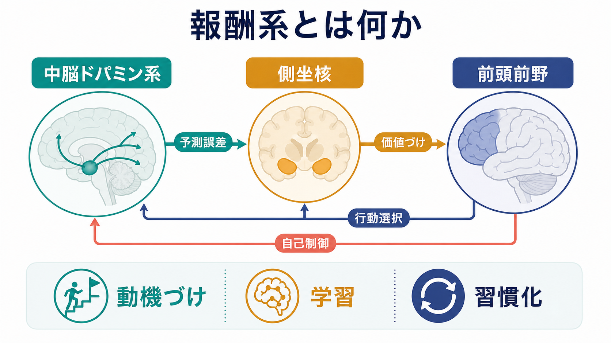
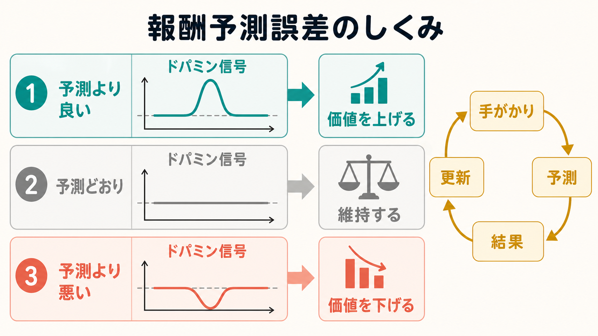
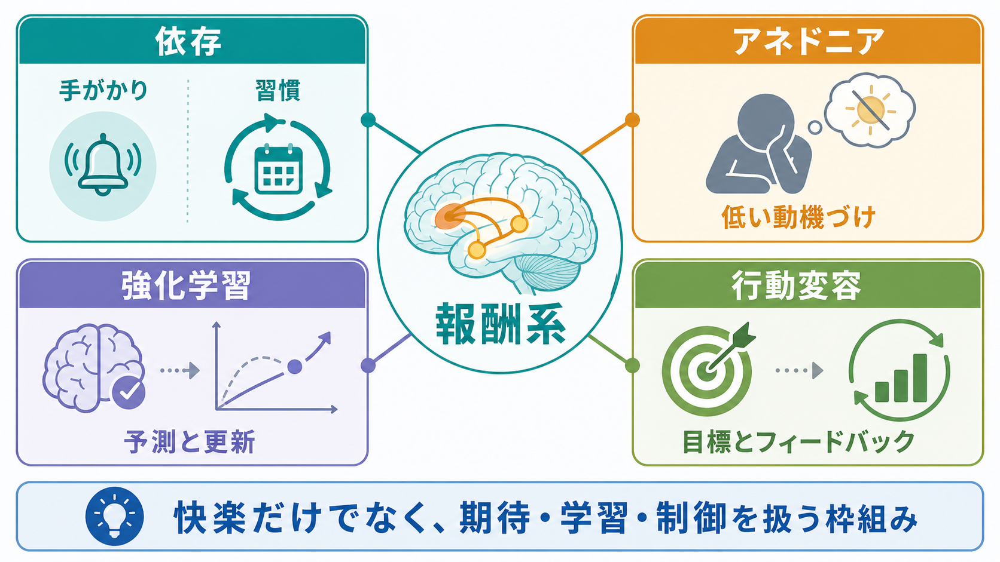

# 報酬系とは何か

## 要点

- 報酬系とは、快い経験だけを生む場所ではなく、報酬を予測し、価値を更新し、行動を選び、必要なら抑制する複数領域のネットワークである[1]。
- 中心になるのは、中脳の腹側被蓋野などのドパミンニューロン、側坐核を含む腹側線条体、眼窩前頭皮質・内側前頭前野・前部帯状皮質を含む前頭前野である[1][5]。
- ドパミンは単純な「快楽物質」ではない。多くの研究では、予測より良い結果・悪い結果を知らせる報酬予測誤差、報酬を求める動機づけ、手がかりへの注意づけに深く関わると整理される[2][3][4]。
- 報酬系の知識は、[[強化学習とは何か]]、[[報酬予測誤差とは何か]]、依存、うつ病におけるアネドニア、行動変容研究をつなぐ基礎概念になる[6][7][8]。

## この記事で答える問い

この記事では、[[オペラント条件づけとは何か]]や[[強化とは何か]]で扱う「行動の結果が次の行動を変える」という現象を、脳回路の側から見る。主な問いは次の4つである。

1. 報酬系はどの脳領域から成るのか。
2. ドパミン、側坐核、前頭前野はそれぞれ何を担うのか。
3. 報酬系は「快感」ではなく「動機づけ」と「学習」にどう関わるのか。
4. 依存、アネドニア、強化学習モデルとどのように接続するのか。

## まず結論

報酬系は、「何がよかったか」を記録するだけの仕組みではない。より正確には、環境の手がかりから将来の価値を予測し、その予測が外れたときに学習を進め、次にどの行動へエネルギーを向けるかを調整する回路である。

中脳ドパミン系は、報酬そのものへの反応だけでなく、報酬を予測する手がかりや予測誤差に反応する。側坐核は、ドパミン信号、皮質からの文脈情報、扁桃体や海馬からの情動・記憶情報を統合し、接近行動や努力投入を支える。前頭前野は、報酬の大きさ、確率、遅延、社会的意味、長期目標を踏まえて、行動選択や自己制御に関わる[1][5]。

したがって、報酬系を理解するときは「快楽のスイッチ」としてではなく、「期待、価値、学習、行動制御をつなぐネットワーク」として見る必要がある。

## 背景

報酬とは、行動の頻度や選択を変える結果である。食物、社会的承認、達成感、金銭、好奇心の充足などは、文脈によって報酬として働く。心理学では、報酬が行動を増やす過程は[[オペラント条件づけとは何か]]や[[強化とは何か]]で扱われる。神経科学では、その背後にある脳回路、神経伝達物質、可塑性を調べる。

古典的な研究では、中脳ドパミンニューロンが、予測できない報酬で発火し、学習が進むと報酬そのものより報酬を予告する手がかりに反応し、期待された報酬が来ないと活動低下を示すことが報告された[2]。この発見は、[[報酬予測誤差とは何か]]と[[強化学習とは何か]]を脳研究に結びつける重要な根拠になった。

一方で、現在の理解ではドパミンを単一の「価値誤差信号」だけに還元しない。ドパミン信号は価値、顕著性、行動、文脈、時間スケールによって多様に変わりうるため、予測誤差は強力な説明枠組みであると同時に、拡張と注意深い解釈が必要な仮説でもある[3]。

## 基本概念

### 報酬系は単一の場所ではない

報酬系という語は便利だが、脳内に「報酬中枢」が1つだけあるという意味ではない。報酬処理の中心には、腹側被蓋野・黒質などの中脳ドパミンニューロン、側坐核を含む腹側線条体、腹側淡蒼球、眼窩前頭皮質、内側前頭前野、前部帯状皮質がある。さらに、扁桃体、海馬、視床、外側手綱核、脳幹核なども、報酬の予測、情動価、記憶、抑制に関わる[1]。

### 「好き」と「欲しい」は違う

報酬を考えるとき、快いという「好き」と、取りに行きたくなるという「欲しい」は分けて考える必要がある。Berridgeらは報酬を、快感としての liking、誘因動機づけとしての wanting、予測や連合としての learning に分けて整理した[4]。

この区別は依存を理解するときに特に重要である。ある対象を以前ほど「好き」ではなくても、手がかりに反応して強く「欲しい」と感じ、探索や接近が生じることがある。ドパミン系は、このうちとくに wanting や手がかりによる動機づけに深く関わる[4][7]。

### 側坐核は価値を行動へ変換する結節点

側坐核は腹側線条体の一部であり、ドパミン入力と皮質・辺縁系からの入力が合流する。ここでは、報酬の予測、手がかりの意味、情動的価値、行動の準備が結びつく。側坐核ドパミンは、単純に快感を作るというより、報酬探索、努力投入、接近行動の調整に関わると考えられる[5]。

### 前頭前野は報酬を文脈化する

前頭前野は「今すぐ得られる報酬」と「長期的に望ましい目標」を比較する。眼窩前頭皮質は報酬の質や現在価値、内側前頭前野や前部帯状皮質は価値評価、努力、葛藤、行動選択に関わる。これにより、報酬系は衝動的な接近だけでなく、待つ、やめる、切り替える、別の目標を選ぶといった制御にも関与する[1]。

## 仕組み

### 1. 手がかりが報酬を予測する

ある刺激が報酬に繰り返し先行すると、その刺激は「手がかり」になる。たとえば通知音、匂い、場所、人の表情、アプリのアイコン、実験課題の合図などが、次に起こる結果を予測させる。これは[[古典的条件づけとは何か]]と近い現象であり、もともと中立だった刺激が報酬予測を帯びる。

### 2. ドパミン信号が予測のずれを知らせる

予測より良い結果が起これば、ドパミン活動は一過性に増えやすい。予測どおりなら変化は小さく、予測された報酬が得られなければ活動は低下しやすい。この差分が、次の予測や行動価値を更新する信号になる[2]。

強化学習の言葉で書けば、単純化した報酬予測誤差は次のように表せる。

$$
\delta_t = r_t + \gamma V(s_{t+1}) - V(s_t)
$$

ここで、$\delta_t$ は予測誤差、$r_t$ はその時点で得られた報酬、$V(s_t)$ は現在状態の価値、$V(s_{t+1})$ は次状態の価値、$\gamma$ は将来価値をどの程度重視するかを表す割引率である。脳のドパミン信号とこの数式が完全に同じという意味ではないが、学習の方向を説明する対応関係として有用である[2][3]。

### 3. 側坐核が接近と努力を調整する

側坐核は、手がかりが「今、行動する価値がある」と示すとき、接近、探索、努力投入を支える。たとえば、同じ報酬でも、空腹、疲労、社会的文脈、成功確率によって価値は変わる。側坐核はこうした状態依存の価値を、行動の活性化へ結びつける結節点として働く[5]。

### 4. 前頭前野が長期目標と照合する

報酬系は短期的な誘惑だけを増幅するわけではない。前頭前野は、今すぐの報酬、将来の損失、社会的ルール、自己目標を比較し、行動を選ぶ。[[リスク下の意思決定はどのように行われるのか]]で扱うような不確実性や遅延報酬も、この前頭前野・線条体回路の調整を受ける[1]。

## 図解

図1は、中脳ドパミン系、側坐核、前頭前野を、予測誤差、価値づけ、行動選択、自己制御の流れとして整理した。図2は、報酬予測誤差が価値更新にどう関わるかを、予測より良い・予測どおり・予測より悪いという3条件で示した。図3は、報酬系の理解が、依存、アネドニア、強化学習、行動変容にどう接続するかを示している。

## 臨床・研究との接続

### 依存

依存では、薬物や行動そのものだけでなく、それに結びついた手がかりが強い誘因動機づけを帯びる。NIDAは、薬物が報酬回路のドパミン信号を強く変化させ、薬物使用、快感、外的手がかりの結びつきを強化しうると説明している[8]。神経生物学的には、報酬、ストレス、実行制御の回路変化が、渇望、衝動性、再使用リスクと関わる[7]。

ただし、この説明は個人を単純に「脳に支配されている」とみなすためのものではない。依存は、神経回路、学習履歴、環境、ストレス、社会的要因が重なって生じる問題として扱う必要がある。

### うつ病とアネドニア

うつ病では、アネドニア、すなわち通常なら報酬的な経験への喜びや動機づけの低下が重要な症状として扱われる。報酬回路、とくに腹側被蓋野から側坐核への経路、前頭前野、扁桃体、海馬の機能的変化は、報酬知覚、動機づけ、意思決定の変化と関連づけて研究されている[6]。

ここでも、報酬系の知見は個別診断や治療指示ではなく、研究上の理解枠組みとして読む必要がある。

### 強化学習モデル

[[強化学習とは何か]]では、エージェントが行動の結果から価値を更新する。報酬系研究は、この計算論的枠組みを脳活動や行動データと結びつける。たとえば、課題中の選択履歴から予測誤差や学習率を推定し、[[fMRIは神経活動を直接測っているのか]]や[[PETは脳の何を測るのか]]で扱う神経計測と照合する研究が行われる。

## よくある誤解

### 誤解1: ドパミンは快楽物質である

ドパミンは快い経験と関係するが、快感そのものだけを表す物質ではない。報酬予測、手がかりへの誘因動機づけ、探索、努力、学習更新に関わる。快感としての liking と、欲しさとしての wanting は分けて考える必要がある[4]。

### 誤解2: 報酬系は依存だけの話である

報酬系は、食事、社会的交流、学習、目標達成、好奇心、創作、リハビリテーション、教育設計にも関わる。依存は報酬系の重要な応用領域だが、報酬系そのものは日常的な適応行動を支える基本回路である[1][8]。

### 誤解3: 報酬があれば必ず学習が進む

報酬が大きくても、予測どおりであれば新しい学習は小さいことがある。また、報酬の与え方が不適切だと、短期的な行動だけが増え、長期的な理解や自律性を損なう場合もある。重要なのは、報酬量だけでなく、予測、タイミング、文脈、本人の目標との関係である。

### 誤解4: 報酬系を測れば個人の意志や性格がわかる

報酬系の活動は、課題、測定法、疲労、薬物、発達段階、文化的文脈、個人の学習履歴に左右される。したがって、単一の脳指標から性格、意志力、依存リスクを直接断定することはできない。

## 関連ノート

- [[強化学習とは何か]]
- [[報酬予測誤差とは何か]]
- [[強化とは何か]]
- [[オペラント条件づけとは何か]]
- [[古典的条件づけとは何か]]
- [[罰とは何か]]
- [[リスク下の意思決定はどのように行われるのか]]
- [[fMRIは神経活動を直接測っているのか]]
- [[PETは脳の何を測るのか]]
- [[MOC｜認知科学・心理学]]
- [[MOC｜脳・神経科学]]

### MOC更新候補

- `content/00_MOC/MOC｜認知科学・心理学.md` の「学習・行動・動機づけ」入口に追加候補。
- `content/00_MOC/MOC｜脳・神経科学.md` の基礎神経科学・神経回路関連に追加候補。

### 今後の作成候補

- ドパミンとは何か
- 側坐核とは何か
- 腹側被蓋野とは何か
- アネドニアとは何か
- 誘因サリエンスとは何か
- 依存と報酬予測誤差

## 理解チェック

1. 報酬系を「快楽の場所」とだけ説明すると、どの点が不足するか。
2. ドパミン信号が、予測できない報酬から報酬を予告する手がかりへ移ることは、学習の何を示しているか。
3. liking、wanting、learning の区別は、依存やアネドニアの理解にどう役立つか。
4. 側坐核と前頭前野は、報酬に基づく行動選択でどのように役割分担しているか。

## 未解決問題

- ドパミン信号を、価値予測誤差、顕著性、運動、認知状態のどこまでに分けて説明できるか。
- ヒトの報酬系研究で、動物実験、行動課題、fMRI、PET、計算モデルをどのように統合するか。
- 報酬系の個人差を、教育、行動変容、臨床支援にどう慎重に応用できるか。
- 報酬系の異常という説明が、社会的・環境的要因を過小評価しないようにするにはどうすればよいか。

## 参考文献

[1] Haber, S. N., & Knutson, B. (2010). The reward circuit: linking primate anatomy and human imaging. *Neuropsychopharmacology*, 35, 4-26. https://doi.org/10.1038/npp.2009.129

[2] Schultz, W., Dayan, P., & Montague, P. R. (1997). A neural substrate of prediction and reward. *Science*, 275(5306), 1593-1599. https://doi.org/10.1126/science.275.5306.1593

[3] Gershman, S. J., Assad, J. A., Datta, S. R., Linderman, S. W., Sabatini, B. L., Uchida, N., & Wilbrecht, L. (2024). Explaining dopamine through prediction errors and beyond. *Nature Neuroscience*, 27, 1645-1655. https://doi.org/10.1038/s41593-024-01705-4

[4] Berridge, K. C., Robinson, T. E., & Aldridge, J. W. (2009). Dissecting components of reward: 'liking', 'wanting', and learning. *Current Opinion in Pharmacology*, 9(1), 65-73. https://doi.org/10.1016/j.coph.2008.12.014

[5] Ikemoto, S., & Panksepp, J. (1999). The role of nucleus accumbens dopamine in motivated behavior: a unifying interpretation with special reference to reward-seeking. *Brain Research Reviews*, 31(1), 6-41. https://doi.org/10.1016/S0165-0173(99)00023-5

[6] Russo, S. J., & Nestler, E. J. (2013). The brain reward circuitry in mood disorders. *Nature Reviews Neuroscience*, 14, 609-625. https://doi.org/10.1038/nrn3381

[7] Volkow, N. D., Koob, G. F., & McLellan, A. T. (2016). Neurobiologic advances from the brain disease model of addiction. *New England Journal of Medicine*, 374(4), 363-371. https://doi.org/10.1056/NEJMra1511480

[8] National Institute on Drug Abuse. (2023). Drugs, brains, and behavior: The science of addiction - Drugs and the brain. https://nida.nih.gov/publications/drugs-brains-behavior-science-addiction/drugs-brain
