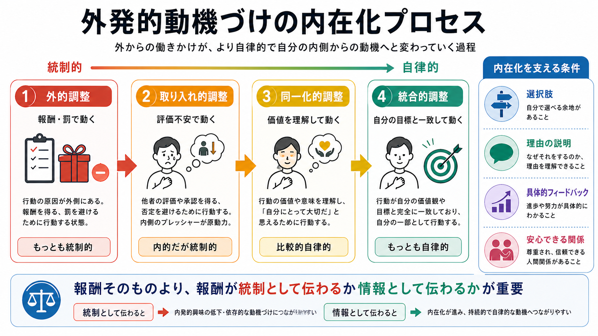

# 外発的動機づけとは何か

## 要点

- 外発的動機づけとは、報酬、評価、罰、締切、社会的承認など、行動の外側にある結果や条件によって行動が促されることをいう [1]。
- 外発的動機づけは「悪い動機づけ」ではない。自己決定理論では、外発的動機づけにも、強く統制されたものから、本人が価値を理解して自律的に選ぶものまで連続性がある [1][2]。
- 報酬は短期的な行動を増やすことがあるが、予告された物質的報酬や過度に統制的な評価は、内発的興味を弱める場合がある [3][4]。
- 教育、職場、医療・臨床支援では、「報酬を出すかどうか」だけでなく、それが本人の自律性、有能感、関係性を支える形で提示されているかが重要になる [2][5][7]。

## この記事で答える問い

この記事では、次の問いに答える。

1. 外発的動機づけは、単に「ごほうびで人を動かすこと」なのか。
2. 報酬、評価、罰は、どのように行動を促すのか。
3. 外発的動機づけは、内発的動機づけや自律性と対立するのか。
4. 教育、職場、臨床・研究では、外的な動機づけをどう設計すべきか。

## まず結論

外発的動機づけは、行動の理由がその活動自体の楽しさや興味だけではなく、活動の外側にある結果に向いている状態である。たとえば、試験で良い点を取るために勉強する、給与を得るために働く、叱責を避けるために報告書を出す、医師に褒められるために運動する、といった行動が含まれる。

ただし、外発的動機づけを「外から無理に動かされること」とだけ考えると狭すぎる。自己決定理論では、外発的動機づけは、外的調整、取り入れ的調整、同一化的調整、統合的調整という段階で整理される [1][2]。最初は報酬や罰で動いていても、その行動の意味を理解し、自分の価値や目標と結びつけると、より自律的な動機づけへ変わりうる。

したがって実践上の問いは、「外的要因を使うべきか、使わないべきか」ではない。より重要なのは、外的要因が統制として伝わっているのか、本人の有能感や選択を支える情報として伝わっているのかである。

## 背景

日常生活では、多くの行動が外発的動機づけに支えられている。締切があるから提出する、評価されるから練習する、報酬があるから仕事を続ける、罰を避けるためにルールを守る。この意味で、外発的動機づけは特殊な現象ではなく、教育、労働、医療、スポーツ、家庭生活に広く見られる。

一方で、外的報酬には副作用もある。Lepper らの古典的研究では、もともと楽しく絵を描いていた子どもに、予告された報酬を与えると、その後の自由時間で絵を描く時間が減ることが示された [4]。このような現象は「過剰正当化効果」と呼ばれ、本人が「自分は楽しいからやっていた」のではなく「報酬のためにやっていた」と解釈し直すことで、内発的興味が弱まると説明される。

その後のメタ分析でも、すべての報酬が同じ効果を持つわけではないことが示された。予告された物質的報酬、参加や完了に条件づけられた報酬、統制的に感じられる評価は内発的動機づけを弱めやすい。一方、予期されない報酬や、有能感を伝える情報的フィードバックは、必ずしも同じような悪影響を持たない [3]。

この論点は、[[強化とは何か]]や[[オペラント条件づけとは何か]]で扱う「行動が結果によって増える」という見方と接続する。ただし、外発的動機づけでは、行動頻度だけでなく、本人がその行動をどう意味づけているか、自律性が支えられているかも問題になる。

## 基本概念

### 外発的動機づけ

外発的動機づけとは、活動そのものの面白さよりも、その活動から得られる結果、評価、承認、回避、義務、役割などによって行動が促される状態である [1]。報酬や罰は典型例だが、外発的動機づけは金銭や物だけに限られない。成績、資格、社会的評価、所属集団への責任感、将来の目標、健康上の利益も外的な理由になりうる。

### 内発的動機づけとの違い

内発的動機づけは、活動それ自体が興味深い、楽しい、探究したい、やってみたいという理由で行動する状態である [1]。たとえば、問題を解くこと自体が面白くて数学を学ぶ、音を出すことが楽しくて楽器を弾く、といった場合である。

ただし、内発的動機づけと外発的動機づけは、単純な二分法ではない。ある人は、資格のために学び始めた内容を、途中から面白いと感じるかもしれない。逆に、好きだった活動が、過度な評価や比較によって義務のように感じられることもある。

### 自己決定理論における連続体

自己決定理論では、外発的動機づけを自律性の程度によって整理する [1][2]。

| 調整様式 | 行動の理由 | 例 | 自律性 |
|---|---|---|---|
| 外的調整 | 報酬を得る、罰を避ける | 点数のためだけに勉強する | 低い |
| 取り入れ的調整 | 罪悪感、恥、評価不安を避ける | できない自分を責めたくなくて努力する | やや低い |
| 同一化的調整 | 行動の価値を理解している | 健康のために運動する | やや高い |
| 統合的調整 | 自分の価値観や目標と一致している | 自分らしい働き方の一部として学び続ける | 高い |

この整理では、外発的動機づけの中にも、自律性の低いものと高いものがある。外から始まった行動でも、本人が意味を理解し、自分の価値に結びつけると、より持続しやすくなる。

## 仕組み

外発的動機づけは、少なくとも三つの水準で働く。

第一に、行動の結果が次の行動を変える。報酬や不快の軽減が行動を増やす場合、それは[[強化とは何か|強化]]として働く。逆に、叱責や損失によって行動が減る場合は、罰として働く。ここでは、本人が「うれしい」と感じたかどうかだけでなく、その後に行動が増えたか減ったかが重要になる。

第二に、報酬や評価は、本人の意味づけを変える。外的報酬が「あなたを操作する条件」として伝わると、自律性が下がりやすい。一方、「進歩が分かる情報」「選択を支えるフィードバック」として伝わると、有能感を支え、内在化を助けることがある [2][3]。

第三に、外的要因は社会的文脈の中で働く。教師、上司、治療者、親、チームメンバーとの関係が安全で、理由の説明があり、選択肢が残されているほど、外的な要請は自律的に取り入れられやすい [5][7]。

## 図解

図1は、外発的動機づけが外的調整から統合的調整へ向かう内在化プロセスを示している。重要なのは、外発的動機づけが一枚岩ではない点である。報酬や罰で動く状態と、価値を理解して自分の目標として選ぶ状態は、どちらも広い意味では外発的動機づけに含まれるが、自律性の程度が大きく異なる。

図2は、外発的動機づけを実践で使うときの設計ポイントである。短期的な行動だけを見れば、罰や比較は効いているように見えることがある。しかし長期的には、恥、回避、依存、学習への嫌悪を強める場合がある。外的要因を使うときは、選択肢、理由の説明、具体的フィードバック、達成可能な課題、安全な関係を同時に設計する必要がある。

## 臨床・研究との接続

教育では、外発的動機づけは避けられない。成績、入試、資格、提出期限、教師からの評価は学習環境の一部である。問題は、それらが学習を「評価されるための作業」に狭めるか、「自分の成長を確認する手がかり」として働くかである。情報的で具体的なフィードバックは有能感を支えやすいが、比較や恥を中心にした評価は統制的に働きやすい [2][3]。

職場では、給与、昇進、評価制度、目標管理が外発的動機づけとして働く。Gagné と Deci は、職場の動機づけを単純な外的報酬だけで説明せず、自律性支援、有能感、関係性、内在化の観点から捉える必要を論じた [5]。金銭的報酬は重要だが、仕事の意味、裁量、フィードバック、公平感が欠けると、持続的な動機づけやウェルビーイングを損ないうる。

医療・臨床支援では、服薬、運動、睡眠、禁煙、リハビリテーションなどに外発的動機づけが関わる。ただし、ここで述べる内容は教育・研究目的の一般的説明であり、個別の診断や治療指示ではない。臨床的には、「やらないと悪化する」と脅すだけでなく、本人がその行動を生活上の価値と結びつけられるように支援することが重要になる。基本的心理欲求を支える環境は、動機づけとウェルビーイングの両方に関わる [7]。

神経科学や計算論では、報酬、予測、価値更新、行動選択が問題になる。[[ドパミンは報酬だけの物質なのか]]、[[依存症は報酬学習の病態としてどう理解できるのか]]、[[報酬系の異常はうつ病をどう説明するのか]]で扱うように、報酬系は外的要因が行動を変える仕組みの一部を説明する。ただし、神経科学的な報酬信号と、心理学的な外発的動機づけは同じ概念ではない。外発的動機づけには、主観的意味づけ、社会的評価、価値の内在化が含まれる。

## よくある誤解

### 誤解1: 外発的動機づけは必ず悪い

外発的動機づけは、学習や仕事を始めるきっかけになる。重要なのは、それが本人の選択、理解、有能感を支える方向に設計されているかである。自己決定理論では、外発的動機づけにも自律性の高低がある [1][2]。

### 誤解2: 報酬を出せば動機づけは上がる

報酬は短期的な行動量を増やすことがあるが、いつも内発的興味や質の高い学習を高めるわけではない。報酬の種類、予告の有無、条件づけ方、本人のもともとの興味、文脈が影響する [3][6]。

### 誤解3: 内発的動機づけだけが本物である

現実の行動は、内発的理由と外発的理由が混ざっている。医療職が仕事に意味を感じながら給与も得る、学生が資格のために学びながら内容にも興味を持つ、というように、複数の理由は共存しうる。

### 誤解4: 罰を強めれば行動は安定する

罰は短期的に行動を抑えることがあるが、回避、隠蔽、恥、関係性の悪化を生む場合がある。望ましい行動を増やしたいなら、罰だけでなく、どの行動を強化し、どのような環境で自律的に選べるようにするかを考える必要がある。

## 関連ノート

既存ノート:

- [[強化とは何か]]
- [[オペラント条件づけとは何か]]
- [[古典的条件づけとは何か]]
- [[ドパミンは報酬だけの物質なのか]]
- [[依存症は報酬学習の病態としてどう理解できるのか]]
- [[報酬系の異常はうつ病をどう説明するのか]]
- [[予測処理とは何か]]

関連ノート候補:

- 内発的動機づけとは何か
- 自己決定理論とは何か
- 過剰正当化効果とは何か
- 基本的心理欲求とは何か
- 罰とは何か
- シェイピングとは何か

MOC 更新候補: `content/00_MOC/MOC｜認知科学・心理学.md` の「学習・行動・動機づけ」周辺に本記事へのリンクを追加する。並列ジョブとの競合を避けるため、このタスクでは MOC 本体は更新しない。

## 理解チェック

1. 外発的動機づけと内発的動機づけは、どの点で区別されるか。
2. 外的調整、取り入れ的調整、同一化的調整、統合的調整の違いを、日常例で説明できるか。
3. 報酬が内発的興味を弱める場合と、学習を支える場合の違いは何か。
4. 教育や職場で外発的動機づけを使うとき、自律性、有能感、関係性をどう支えられるか。

## 参考文献

[1] Ryan, R. M., & Deci, E. L. (2000). Self-determination theory and the facilitation of intrinsic motivation, social development, and well-being. *American Psychologist, 55*(1), 68-78. https://doi.org/10.1037/0003-066X.55.1.68

[2] Ryan, R. M., & Deci, E. L. (2017). *Self-Determination Theory: Basic Psychological Needs in Motivation, Development, and Wellness*. Guilford Press. https://www.guilford.com/books/Self-Determination-Theory/Ryan-Deci/9781462538966

[3] Deci, E. L., Koestner, R., & Ryan, R. M. (1999). A meta-analytic review of experiments examining the effects of extrinsic rewards on intrinsic motivation. *Psychological Bulletin, 125*(6), 627-668. https://doi.org/10.1037/0033-2909.125.6.627

[4] Lepper, M. R., Greene, D., & Nisbett, R. E. (1973). Undermining children's intrinsic interest with extrinsic reward: A test of the "overjustification" hypothesis. *Journal of Personality and Social Psychology, 28*(1), 129-137. https://doi.org/10.1037/h0035519

[5] Gagné, M., & Deci, E. L. (2005). Self-determination theory and work motivation. *Journal of Organizational Behavior, 26*(4), 331-362. https://doi.org/10.1002/job.322

[6] Cerasoli, C. P., Nicklin, J. M., & Ford, M. T. (2014). Intrinsic motivation and extrinsic incentives jointly predict performance: A 40-year meta-analysis. *Psychological Bulletin, 140*(4), 980-1008. https://doi.org/10.1037/a0035661

[7] Vansteenkiste, M., Ryan, R. M., & Soenens, B. (2020). Basic psychological need theory: Advancements, critical themes, and future directions. *Motivation and Emotion, 44*, 1-31. https://doi.org/10.1007/s11031-019-09818-1

[8] OpenStax. (2019). *Psychology 2e*, 6.3 Operant Conditioning. https://openstax.org/books/psychology-2e/pages/6-3-operant-conditioning

## 未解決問題

- 外的報酬が内発的興味を弱める効果は、年齢、文化、課題の種類、報酬の意味づけによってどの程度変わるのか。
- 短期的な行動変化と、長期的な自律性・ウェルビーイングを同時に評価する実践指標をどう設計できるか。
- 報酬予測誤差、社会的評価、自己決定理論の内在化を、同じ研究デザインの中でどこまで統合できるか。

## 更新ログ

- 2026-04-27: 初稿作成。自己決定理論、報酬研究、教育・職場・臨床支援との接続を整理し、画像2枚と主要参考文献を追加。
