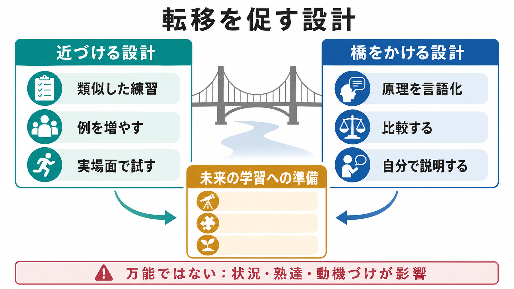
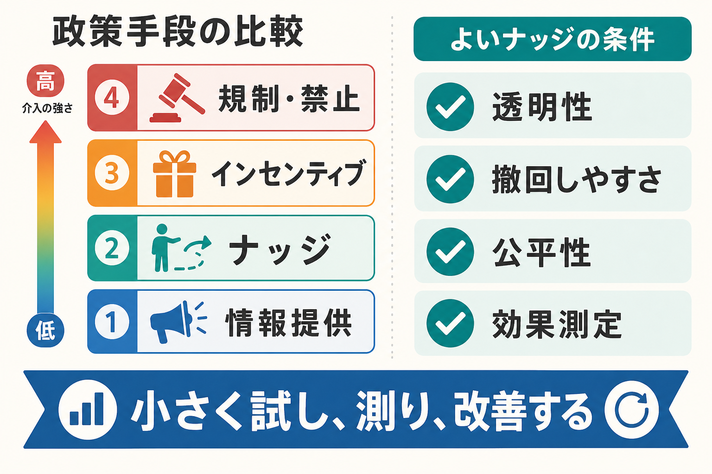
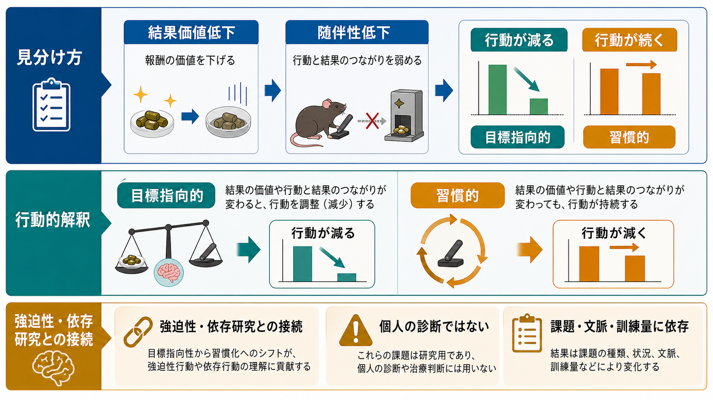

# 好奇心は学習をどう促すのか

## 要点

- 好奇心は、単なる「楽しい気分」ではなく、知っていることと知らないことの差、つまり情報ギャップを埋めようとする動機づけとして理解できる [1]。
- 新奇性、意外性、適度な不確実性は、注意を対象へ向け、探索行動を増やし、情報を得るためのコスト支払いを促す [2][6]。
- 好奇心が高い状態では、報酬系と海馬を含む回路が関与し、答えそのものだけでなく、その近くで出会った偶発的な情報の記憶も高まりうる [4][7]。
- ただし、情報ギャップが大きすぎる、失敗コストが高い、不安や脅威が強い場合、好奇心は探索ではなく回避に変わることがある [7][8]。

## この記事で答える問い

この記事では、[[学習とは何か]]、[[動機づけとは何か]]、[[内発的動機づけとは何か]]と接続しながら、次の問いに答える。

1. 好奇心は、なぜ情報を探しに行く行動を生むのか。
2. 情報ギャップや新奇性は、どのように注意と記憶形成を変えるのか。
3. 報酬系、ドーパミン、海馬は、好奇心に基づく学習でどのような役割をもつのか。
4. 教育・研究・臨床に応用するとき、どこに限界があるのか。

## まず結論

好奇心は、脳が「これはまだ分からないが、分かれば価値がある」と評価したときに生じる探索の構えである。好奇心が生じると、学習者は問いを保持し、手がかりを探し、答えに到達するまで注意を向け続けやすくなる。さらに、答えを待つ時間そのものが記憶システムを準備し、後で提示される情報を覚えやすくすることがある [3][4]。

重要なのは、好奇心が「情報の報酬価値」と「不確実性の解消」を同時に含む点である。情報はお金や食物のような外的報酬ではないが、分かること自体が価値をもつ場合がある。そのため、好奇心は[[報酬系とは何か]]や[[報酬予測誤差とは何か]]と無関係ではない。実験研究では、好奇心の高い問題で報酬関連領域が活動し、記憶成績も高まることが示されている [3][4]。

## 背景

古典的には、好奇心は新奇性、複雑性、不確実性、葛藤によって引き起こされる探索傾向として論じられてきた [2]。その後、Loewenstein は、好奇心を「知識の欠落を自覚したときに生じる認知的な欠乏状態」として再解釈した [1]。この情報ギャップ理論では、完全に何も知らない対象よりも、「少し知っているが、肝心なところが分からない」対象のほうが好奇心を引き起こしやすい。

この見方は、教育実践にも直感的に合う。答えだけを最初に与える説明は、情報ギャップを閉じてしまう。一方で、問い、矛盾、予想外の例を先に置くと、学習者は自分の知識の穴に気づき、その穴を埋めるために説明を聞きやすくなる。ただし、穴が大きすぎて何を調べればよいか分からない場合、好奇心ではなく混乱や無力感が生じる。

## 基本概念

### 情報ギャップ

情報ギャップとは、現在の知識状態と、知りたい目標状態の差である [1]。たとえば「なぜ睡眠不足だと記憶が悪くなるのか」という問いを見たとき、睡眠と記憶が関係することは知っているが、その機序は分からない。この差が、続きを読みたいという動機づけになる。

情報ギャップは大きければ大きいほどよいわけではない。ほとんど何も知らない対象では、どこに穴があるのかも分からない。逆に、すでに答えを知っている対象では、ギャップが小さすぎて探索する理由がない。好奇心が強くなりやすいのは、既有知識が足場になり、あと少しで分かりそうだと感じられる場合である。

### 新奇性と予測誤差

新奇性とは、過去の経験や予測から外れた刺激や状況である。新奇な情報は注意を引き、既存のモデルを更新する必要を示す。計算論的には、予測と入力のずれ、すなわち予測誤差として考えることができる [7]。

この点で、好奇心は[[価値学習とは何か]]や[[強化学習とは何か]]とも接続する。報酬を直接得るための学習だけでなく、「どの情報を得れば今後の予測がよくなるか」を選ぶ学習もある。好奇心は、情報そのものに価値を置く探索として位置づけられる [5][6]。

### 認識的好奇心

認識的好奇心は、事実、理由、仕組みを知りたいという知的探索の動機である。雑学問題、科学的疑問、臨床仮説、読書中の「なぜそうなるのか」という問いが典型である。Kang らの研究では、雑学問題に対する好奇心が高いほど、答えを見るために資源を支払う傾向が強まり、記憶も高まった [3]。

## 仕組み

### 1. 問いが注意の焦点を作る

好奇心は、注意を広く散らすのではなく、「いま何を知りたいのか」という焦点を作る。問いがあると、学習者は関連する手がかりを拾いやすくなり、無関係な情報を流しやすくなる。Gottlieb らは、情報探索、注意、眼球運動、機械学習の研究を統合し、情報を得ること自体が行動を組織化する報酬になりうると整理している [6]。

教育的には、これは「説明の前に問いを置く」ことの意味を説明する。ただし、問いは難しすぎても弱すぎても機能しない。学習者が何を探せばよいか分かる程度に具体的で、既有知識と結びつく必要がある。

### 2. 期待と答えの差が学習信号になる

好奇心は、答えをただ受け取る過程ではなく、予想、待機、確認、修正を含む過程である。Marvin と Shohamy は、情報にも予測と結果の差があり、その情報予測誤差が学習を高めると論じた [5]。これは[[報酬予測誤差とは何か]]の考え方を、金銭や食物ではなく情報へ広げたものとして読める。

たとえば「人はなぜネガティブな情報を避けることがあるのか」と予想してから結果を見ると、予想と結果の差が記憶に残りやすい。答えが予想どおりならモデルは安定し、予想外ならモデル更新が必要になる。

### 3. 報酬系と海馬が記憶を準備する

Gruber らの fMRI 研究では、雑学問題に対する好奇心が高い状態で、中脳、側坐核、海馬を含む回路の活動が変化し、後の記憶成績が高まった [4]。興味深いのは、記憶が高まったのが答えそのものだけではない点である。好奇心が高い待機状態に挿入された無関係な顔画像の記憶も高まった。

この結果は、好奇心が「答えを見た瞬間」だけでなく、答えを待つ状態にも作用することを示す。PACE フレームワークでは、予測、評価、好奇心、探索のサイクルが、注意と探索を高め、ドーパミン作動性回路を介して海馬の符号化・固定を支えると整理されている [7]。

### 4. 探索と活用のバランスを変える

好奇心は、新しい情報を得るための探索を増やす。一方、すでに分かっている方法を使う活用も学習には必要である。これは[[探索と活用のジレンマとは何か]]の問題である。好奇心が強いと、未知の選択肢、未解決の問い、まだ読んでいない資料へ向かいやすくなる。しかし、試験直前や臨床判断のように時間とリスクが大きい場面では、探索を増やしすぎることが逆効果になる。

したがって、好奇心を学習に使うには、探索の入口と活用の出口を設計する必要がある。問いを立てる、仮説を作る、資料を読む、答えをまとめる、練習問題で使う、という流れにすることで、好奇心は単なる寄り道ではなく知識の定着へ接続される。

## 図解

図1は、情報ギャップ、新奇性、探索行動、報酬予期、注意、記憶形成の関係を概念地図として示している。中心にあるのは「知りたい」という主観的経験だが、その背後には予測、価値評価、注意配分、記憶固定がある。

図2は、好奇心状態が中脳/VTA、側坐核、海馬を含む回路を通じて記憶形成を高めるという仮説を示している。実際の神経機構は単一経路ではないが、好奇心、報酬、海馬依存記憶の結びつきを理解するための入口になる。

図3は、情報ギャップが小さすぎる場合、適度な場合、大きすぎる場合を比較している。学習設計では、ギャップを「最適な困難さ」に調整することが重要である。

## 臨床・研究との接続

研究では、好奇心は自己報告、選択行動、情報を見るためのコスト支払い、眼球運動、記憶成績、fMRI などで測定される [3][4][6]。ただし、どの指標を好奇心の代理とみなすかによって結論は変わる。自己報告上の「知りたい」と、実際に情報を取りに行く行動は一致しないことがある。

臨床・教育的文脈では、好奇心は学習支援の補助概念として有用である。うつ、不安、依存、発達特性、加齢、神経疾患では、報酬処理、探索行動、注意、認知的努力の調整が変化しうる。ただし、好奇心の低下を直ちに診断指標にしたり、個別治療の方針として断定したりすることはできない。研究知見は、個別診断ではなく、課題設計や支援環境を考えるための仮説として扱う必要がある。

教育では、次のような使い方が現実的である。

- 導入で、学習者の既有知識と少しずれた問いを置く。
- 答えをすぐに示さず、短い予想時間を作る。
- 答え合わせの後に、予想との違いを言語化する。
- 関連する偶発情報も拾えるように、例やケースを配置する。
- 不確実性が不安に変わる学習者には、手がかり、選択肢、部分的な足場を与える。

## よくある誤解

### 好奇心があれば自動的に学習できる

好奇心は学習を始める力になるが、練習、検索、フィードバック、反復を代替しない。興味深い動画を見ても、後で説明できるとは限らない。好奇心を記憶に変えるには、問いを保持し、答えを自分の言葉で再構成し、使う場面を作る必要がある。

### 新奇なものを増やせばよい

新奇性は注意を引くが、無秩序な新奇性は理解を妨げる。好奇心を促す新奇性は、既有知識と接続できる予想外さである。背景知識がないまま複雑な情報を大量に出すと、好奇心ではなく認知負荷に近い問題が生じる可能性がある。

### 答えを隠せば好奇心が高まる

答えを隠すだけでは不十分である。学習者が「自分にも分かりそうだ」「分かると意味がある」と評価できなければ、情報ギャップは動機づけにならない。ギャップには、到達可能性と価値の評価が必要である [7]。

### 好奇心は常にポジティブな情報へ向かう

人は不確実性を減らしたい一方で、知りたくない情報を避けることもある。近年の研究は、情報探索が不確実性だけでなく、情報の感情価や知った後の気分にも左右されることを示している [8]。医療検査、リスク情報、対人評価では、この点が特に重要である。

## 関連ノート

既存ノート:

- [[学習とは何か]]
- [[動機づけとは何か]]
- [[内発的動機づけとは何か]]
- [[探索と活用のジレンマとは何か]]
- [[報酬系とは何か]]
- [[報酬予測誤差とは何か]]
- [[強化学習とは何か]]
- [[価値学習とは何か]]

今後の作成候補:

- 情報ギャップ理論とは何か
- 好奇心と海馬依存記憶
- 情報予測誤差とは何か
- PACEフレームワークとは何か

MOC更新候補:

- `content/00_MOC/` 配下の認知科学・心理学、学習・動機づけ、神経科学関連 MOC に追加候補。
- 並列ジョブとの競合を避けるため、このタスクでは MOC 本体は更新しない。

## 理解チェック

1. 情報ギャップ理論では、好奇心はどのような状態から生じると考えるか。
2. 情報ギャップが大きすぎると、なぜ探索ではなく混乱や回避につながりうるのか。
3. 好奇心が高い状態で、答え以外の偶発情報の記憶も高まりうるのはなぜか。
4. 情報予測誤差は、通常の報酬予測誤差とどこが似ていて、どこが違うか。
5. 教育場面で、好奇心を「記憶に残る学習」へ接続するには、どのような活動が必要か。

## 参考文献

[1] Loewenstein, G. (1994). The psychology of curiosity: A review and reinterpretation. *Psychological Bulletin, 116*(1), 75-98. https://doi.org/10.1037/0033-2909.116.1.75

[2] Berlyne, D. E. (1966). Curiosity and exploration. *Science, 153*(3731), 25-33. https://doi.org/10.1126/science.153.3731.25

[3] Kang, M. J., Hsu, M., Krajbich, I. M., Loewenstein, G., McClure, S. M., Wang, J. T., & Camerer, C. F. (2009). The wick in the candle of learning: Epistemic curiosity activates reward circuitry and enhances memory. *Psychological Science, 20*(8), 963-973. https://doi.org/10.1111/j.1467-9280.2009.02402.x

[4] Gruber, M. J., Gelman, B. D., & Ranganath, C. (2014). States of curiosity modulate hippocampus-dependent learning via the dopaminergic circuit. *Neuron, 84*(2), 486-496. https://doi.org/10.1016/j.neuron.2014.08.060

[5] Marvin, C. B., & Shohamy, D. (2016). Curiosity and reward: Valence predicts choice and information prediction errors enhance learning. *Journal of Experimental Psychology: General, 145*(3), 266-272. https://doi.org/10.1037/xge0000140

[6] Gottlieb, J., Oudeyer, P.-Y., Lopes, M., & Baranes, A. (2013). Information-seeking, curiosity, and attention: Computational and neural mechanisms. *Trends in Cognitive Sciences, 17*(11), 585-593. https://doi.org/10.1016/j.tics.2013.09.001

[7] Gruber, M. J., & Ranganath, C. (2019). How curiosity enhances hippocampus-dependent memory: The Prediction, Appraisal, Curiosity, and Exploration (PACE) framework. *Trends in Cognitive Sciences, 23*(12), 1014-1025. https://doi.org/10.1016/j.tics.2019.10.003

[8] van Lieshout, L. L. F., de Lange, F. P., & Cools, R. (2020). Why so curious? Quantifying mechanisms of information seeking. *Current Opinion in Behavioral Sciences, 35*, 112-117. https://doi.org/10.1016/j.cobeha.2020.08.005

## 未解決問題

- 好奇心の効果は、対象知識、年齢、発達段階、文化、臨床状態によってどの程度変わるのか。
- 自己報告の好奇心、情報選択、眼球運動、記憶成績、神経活動のどれを主要指標にするのが妥当か。
- 教育実践で、情報ギャップをどの程度に調整すると最も学習効果が高いのか。
- 好奇心による偶発記憶の増強は、長期的な理解や転移にもつながるのか。

## 更新ログ

- 2026-04-28: 初稿作成。情報ギャップ、新奇性、探索行動、報酬系、海馬依存記憶、PACE フレームワーク、研究・教育・臨床との接続を整理し、画像 3 枚と主要文献 8 件を追加。
