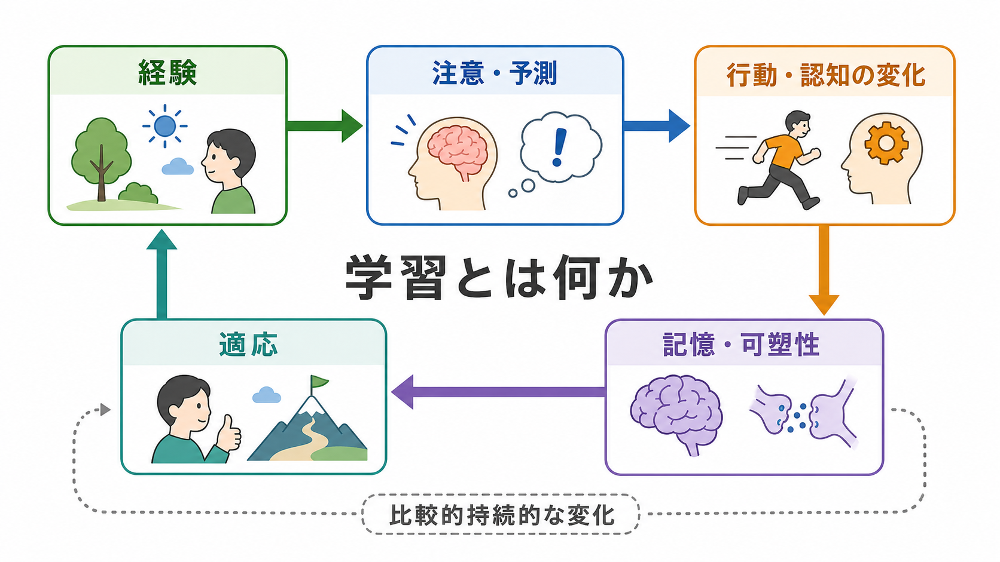
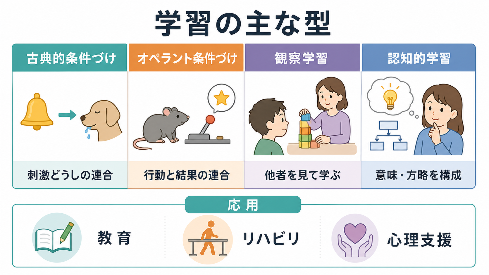
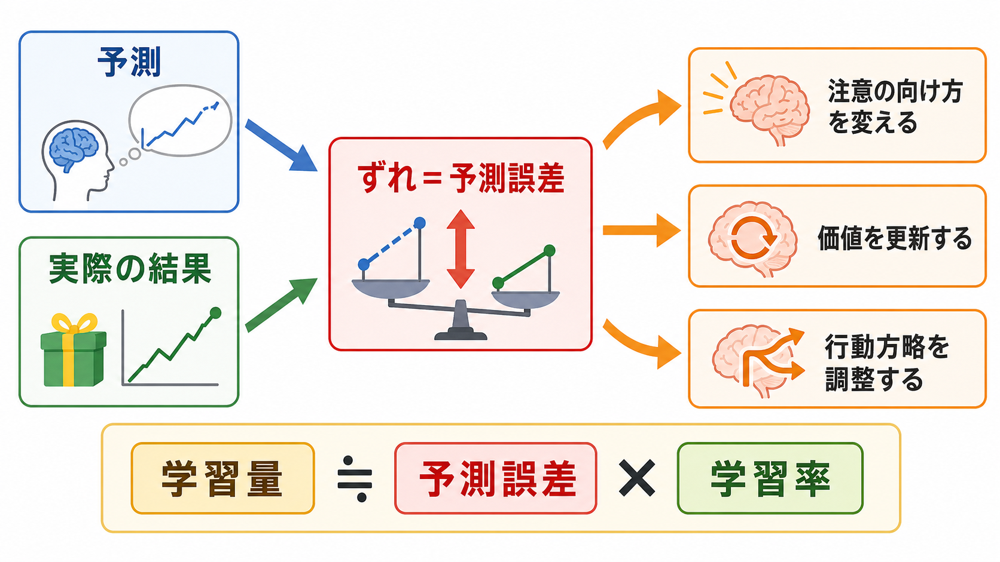

# 学習とは何か

## 要点

- 学習とは、経験によって行動、知識、期待、注意、価値づけ、方略が比較的持続的に変化する過程である[1]。
- 反射や本能と違い、学習は環境との相互作用、練習、観察、フィードバック、結果の経験を通じて更新される[1]。
- 古典的条件づけ、オペラント条件づけ、観察学習、認知的学習は、学習を別々の角度から見るための代表的な枠組みである[1][2][3][4]。
- 重要なのは「経験があったか」だけではなく、「何が予測とずれたか」「どの行動がどの結果に結びついたか」「何が記憶として残ったか」である[2][5][6]。
- 臨床・教育・リハビリでは、学習を個人の性格や意志の強さだけに還元せず、環境、報酬、注意、記憶、予測、反復練習の設計として扱うことが重要である[7][8]。

## この記事で答える問い

1. 学習とは、単に「覚えること」なのか。
2. 条件づけ、強化、観察学習、認知的学習はどのように違うのか。
3. 予測誤差や記憶システムは、学習のどこで重要になるのか。
4. 教育、臨床、リハビリ、研究で「学習」を使うとき、どのような注意が必要か。

## まず結論

学習とは、経験を通じて、次に何が起こるか、何をすればよいか、何に注意を向けるべきか、どの方略を使うべきかが更新される過程である。日常語では「知識を覚えること」と思われやすいが、心理学・神経科学では、行動の変化、反応の変化、期待の変化、価値づけの変化、技能の変化、記憶システムの変化まで含む広い概念として扱う[1][5]。

たとえば、熱い鍋に触れて手を引っ込める反射そのものは生得的な反応である。しかし、その経験のあとで「この鍋は危ない」と予測し、次から鍋つかみを使うなら、そこには学習がある。何度も練習してピアノの指使いが滑らかになること、発表でうまくいった方法を次回も使うこと、他者の失敗を見て自分の行動を変えることも学習である[1][4]。

## 背景

学習は、心理学のほぼすべての領域にまたがる基礎概念である。行動主義は、観察可能な刺激、反応、結果の関係として学習を分析した。古典的条件づけでは、刺激どうしの連合が問題になる。オペラント条件づけでは、行動と結果の関係が問題になる[1][2][3]。

その後、認知心理学と神経科学は、学習を単なる反応頻度の変化ではなく、記憶、期待、注意、表象、予測、方略の更新として扱うようになった。たとえば、記憶研究では、意識的に思い出せる宣言的記憶と、技能・習慣・条件づけのような非宣言的記憶が区別される[5]。また、神経科学では、経験に応じてシナプス結合や神経回路の働きが変わることが、学習と記憶の生物学的基盤として研究されてきた[6]。

## 基本概念

### 経験による比較的持続的な変化

学習の標準的な定義では、「経験による比較的持続的な行動または知識の変化」が強調される[1]。ここで「比較的持続的」と言うのは、一時的な疲労、薬物、睡眠不足、空腹、気分だけで変わった反応を、すぐに学習と呼ばないためである。

ただし、学習は必ず外から見える行動変化として現れるとは限らない。まだ実行していなくても、状況の見方、期待、意味づけ、方略、恐れ、安心感、自己効力感が変わっていることがある。したがって、学習を観察するときは、行動だけでなく、どのような予測や価値づけが更新されたかを見る必要がある。

### 学習の主な型

[[古典的条件づけとは何か]]は、刺激どうしの関係を学ぶ過程である。ある音、場所、匂い、人、身体感覚が、快・不快・安全・危険などの出来事と結びつくと、それ自体が反応を引き起こす手がかりになる[1][2]。

[[オペラント条件づけとは何か]]は、行動と結果の関係を学ぶ過程である。ある行動の後に望ましい結果が続けば、その行動は起こりやすくなる。逆に、望ましい結果が失われたり、不快な結果が続いたりすれば、その行動は起こりにくくなる[1][3]。このとき中心になる概念が[[強化とは何か]]である。

[[観察学習とは何か]]は、他者の行動と結果を観察することで、自分の行動や期待が変わる過程である。Bandura らの研究は、子どもが他者の行動を観察し、直接同じ経験をしていなくても行動レパートリーを変えることを示した[4]。

認知的学習は、意味、規則、構造、方略、問題解決のしかたを更新する過程である。これは単なる刺激反応の連合ではなく、何が重要か、どの表象を使うか、どの手順を選ぶかを変える学習である。

## 仕組み

### 予測誤差による更新

学習を理解するうえで重要なのは、予測と実際の結果のずれである。Rescorla-Wagner モデルは、古典的条件づけを「予測された結果」と「実際の結果」のずれによって連合強度が更新される過程として定式化した[2]。

単純化すると、次のように考えられる。

$$
\Delta V = \alpha(\lambda - V)
$$

ここで $V$ は現在の予測、$\lambda$ は実際に起きた結果、$\lambda - V$ は予測誤差、$\alpha$ は学習率である。予測より結果が大きければ学習は増え、予測どおりなら変化は小さくなる。これは「何度も同じことを経験すれば必ず学習する」というより、「予測をどれだけ更新する必要があるか」が学習量を左右する、という見方である。

報酬学習でも、予測誤差は中心的な概念である。Schultz、Dayan、Montague は、ドーパミンニューロンの活動が報酬そのものだけでなく、報酬予測のずれに関係することを示し、強化学習モデルと神経活動をつなぐ重要な根拠を与えた[7]。

### 記憶システムとしての学習

学習は、経験が何らかの形で保存され、後の認知や行動に影響することを含む。この保存は単一の「記憶箱」ではなく、複数の記憶システムに支えられる。Squire は、海馬を中心とする宣言的記憶と、線条体、扁桃体、小脳などを含む非宣言的記憶システムを区別し、記憶が複数の脳システムから成ることを整理した[5]。

この区別は、学習を考えるときに役立つ。試験範囲の内容を説明できること、恐怖刺激に身体が反応すること、自転車に乗れること、報酬につられて同じ行動を繰り返すことは、すべて学習に含まれるが、同じ種類の記憶ではない。

### 可塑性としての学習

神経科学では、学習は経験に応じた神経回路の可塑的変化としても理解される。Kandel の研究は、短期記憶と長期記憶がシナプス機能、遺伝子発現、タンパク質合成などの異なる生物学的過程に支えられることを示し、学習と記憶を分子・細胞レベルで研究する道を開いた[6]。

ただし、「脳が変わる」という表現だけで学習を説明しきれるわけではない。どの経験が、どの注意、どの報酬、どの文脈、どの反復、どの意味づけを通じて変化を生んだのかを見なければ、教育や臨床の設計にはつながりにくい。

## 図解

上の3枚の図は、学習を次の3層で整理している。

| 図 | 何を示すか | 読み方 |
|---|---|---|
| 図1 | 学習の全体像 | 経験が注意・予測、行動・認知、記憶・可塑性、適応へつながる |
| 図2 | 予測誤差 | 予測と実際の結果のずれが、注意、価値、行動方略を更新する |
| 図3 | 学習の型 | 古典的条件づけ、オペラント条件づけ、観察学習、認知的学習を比較する |

## 臨床・研究との接続

教育では、学習を「説明を聞いたか」だけで評価すると不十分である。検索練習、分散学習、自己説明、練習問題、フィードバックなどは、記憶の保持や転移を左右する。Dunlosky らのレビューは、学習方略の有効性には差があり、再読や下線引きだけに頼るより、検索練習や分散練習のような方略が有望であることを整理している[8]。

臨床や心理支援では、学習理論は不安、回避、習慣、依存、対人行動、リハビリ参加、セルフケアの理解に使われる。ただし、ここでの説明は教育・研究目的であり、個別の診断や治療指示ではない。たとえば回避行動は、短期的には不安を下げるため負の強化として維持されることがある。一方で、長期的には生活範囲を狭める可能性がある。したがって、臨床応用では「どの行動が、どの結果によって維持されているか」を慎重に見る必要がある。

研究では、学習は行動実験、神経画像、計算モデル、動物実験、教育介入研究をつなぐ共通語になる。予測誤差、学習率、価値更新、記憶固定、消去、般化、文脈依存性といった概念は、心理学と神経科学、機械学習、計算論的精神医学を接続するための足場になる。

## よくある誤解

### 誤解1: 学習とは暗記のことである

暗記は学習の一部である。しかし、学習はそれだけではない。恐怖反応、技能、習慣、価値判断、注意の向け方、問題解決の方略も経験によって変わる。

### 誤解2: 反復すれば必ず学習する

反復は重要だが、反復だけでは十分ではない。何に注意を向けるか、どのタイミングでフィードバックを受けるか、予測誤差があるか、既有知識と結びつくかによって学習は変わる[2][8]。

### 誤解3: 学習はすべて意識的に起こる

学習には、意識的に説明できるものと、説明できないが行動や身体反応に現れるものがある。技能、条件づけ、習慣、情動反応は、非宣言的記憶システムとも関係する[5]。

### 誤解4: 学習できないのは意志が弱いからである

学習の成否は、意志だけでは説明できない。環境、報酬、負荷、睡眠、注意、フィードバック、既有知識、発達段階、社会的支援が関わる。学習を支えるには、本人を責めるより、学習が起こりやすい条件を設計するほうが実践的である。

## 関連ノート

- [[古典的条件づけとは何か]]
- [[オペラント条件づけとは何か]]
- [[強化とは何か]]
- [[観察学習とは何か]]

### 関連ノート候補

- 記憶とは何か
- 予測誤差とは何か
- 学習率とは何か
- 消去学習とは何か
- 分散学習とは何か
- 検索練習とは何か

### MOC更新候補

- `content/00_MOC/` 配下の認知科学・心理学系 MOC に、本記事へのリンクを追加する。
- 並列ジョブとの競合を避けるため、このタスクでは MOC 本体は更新しない。

## 理解チェック

1. 学習を「経験による比較的持続的な変化」と呼ぶとき、一時的な疲労や気分変化とどう区別できるか。
2. 古典的条件づけ、オペラント条件づけ、観察学習を、自分の日常例で1つずつ説明できるか。
3. 「予測誤差が大きいほど学習が進みやすい」とは、どのような意味か。
4. 学習が行動変化としてまだ現れていなくても、何が変わっている可能性があるか。
5. 教育や臨床で、学習を意志の問題だけにしないためには、どの条件を見る必要があるか。

## 未解決問題

- 実験室で測定される学習率や予測誤差が、日常生活の複雑な学習にどこまで一般化できるのか。
- 宣言的記憶、習慣、情動学習、社会的学習が、現実の行動変化の中でどのように相互作用するのか。
- 教育・臨床・リハビリで、個人差に合わせた学習環境をどの程度まで設計できるのか。
- AIや機械学習の「学習」と、人間・動物の学習をどこまで同じ枠組みで比較できるのか。

## 参考文献

[1] OpenStax. (2019). *Psychology 2e*, 6.1 What Is Learning? https://openstax.org/books/psychology-2e/pages/6-1-what-is-learning

[2] Rescorla, R. A., & Wagner, A. R. (1972). A theory of Pavlovian conditioning: Variations in the effectiveness of reinforcement and nonreinforcement. In A. H. Black & W. F. Prokasy (Eds.), *Classical Conditioning II: Current Research and Theory* (pp. 64-99). Appleton-Century-Crofts. https://www.scirp.org/reference/referencespapers?referenceid=3240590

[3] Skinner, B. F. (1938). *The Behavior of Organisms: An Experimental Analysis*. Appleton-Century. https://www.bfskinner.org/product/the-behavior-of-organisms-pdf/

[4] Bandura, A., Ross, D., & Ross, S. A. (1961). Transmission of aggression through imitation of aggressive models. *The Journal of Abnormal and Social Psychology, 63*, 575-582. https://doi.org/10.1037/h0045925

[5] Squire, L. R. (2004). Memory systems of the brain: A brief history and current perspective. *Neurobiology of Learning and Memory, 82*(3), 171-177. https://doi.org/10.1016/j.nlm.2004.06.005

[6] Kandel, E. R. (2000). The molecular biology of memory storage: A dialogue between genes and synapses. Nobel Lecture. https://www.nobelprize.org/prizes/medicine/2000/kandel/lecture/

[7] Schultz, W., Dayan, P., & Montague, P. R. (1997). A neural substrate of prediction and reward. *Science, 275*(5306), 1593-1599. https://doi.org/10.1126/science.275.5306.1593

[8] Dunlosky, J., Rawson, K. A., Marsh, E. J., Nathan, M. J., & Willingham, D. T. (2013). Improving students' learning with effective learning techniques: Promising directions from cognitive and educational psychology. *Psychological Science in the Public Interest, 14*(1), 4-58. https://doi.org/10.1177/1529100612453266
