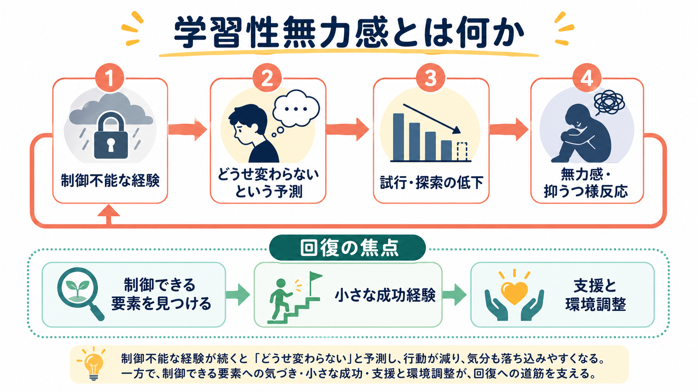
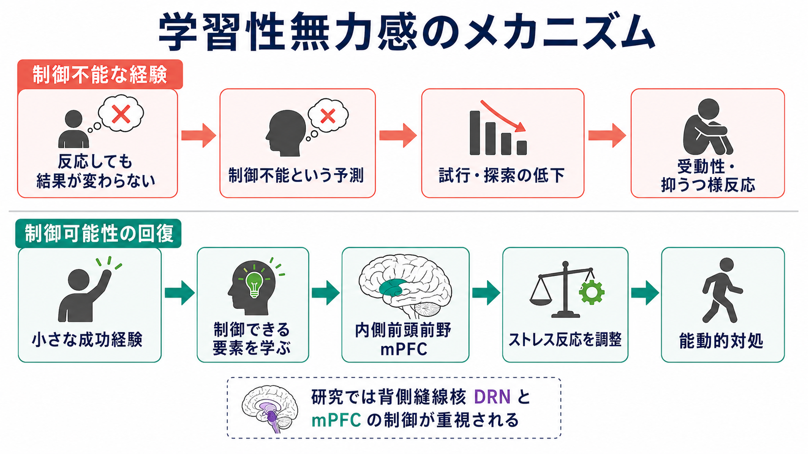
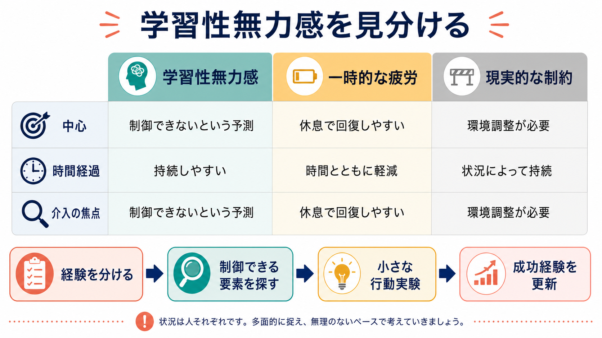

# 学習性無力感とは何か

## 要点

- 学習性無力感とは、反応しても結果を変えられない経験のあとに、逃避・探索・問題解決の試行が減る現象である。
- 古典的には「自分の行動と結果が独立している」と学習することが中心に置かれたが、近年の神経科学的整理では、受動性は長い嫌悪刺激への初期反応であり、むしろ「制御できる」と学ぶことが能動的対処を回復させると考えられている[1][2]。
- 人間では、単なる失敗経験ではなく、「なぜ失敗したか」を安定的・全般的・内的に帰属するかどうかが、持続的な無力感や抑うつ様反応と関わる[3]。
- 臨床的には[[セロトニン仮説はうつ病をどこまで説明できるのか]]や[[前頭前野は情動制御にどう関わるのか]]と接続するが、学習性無力感だけでうつ病全体を説明することはできない。

## この記事で答える問い

1. 学習性無力感は「やる気がない」ことと何が違うのか。
2. 制御不能な経験は、どのように行動停止や抑うつ様反応につながるのか。
3. 古典的な学習理論と、近年の神経科学的理解はどこが変わったのか。
4. 臨床・教育・研究でこの概念を使うとき、どこに注意すべきか。

## まず結論

学習性無力感は、「失敗したから落ち込む」という単純な反応ではない。重要なのは、行動と結果の随伴性が見えなくなり、「何をしても変わらない」という予測が形成される点である。この予測が強いほど、次に制御可能な場面が現れても、探索しない、逃避しない、助けを求めない、課題に取り組まないといった行動低下が起こりやすくなる。

ただし、近年の理解では、無力感を「受動性を学習した結果」とだけ見るのは不十分である。動物研究では、長く続く制御不能ストレスが背側縫線核（dorsal raphe nucleus; DRN）を含むセロトニン系の反応を高め、逃避行動を抑える一方、制御可能性を経験すると内側前頭前野（medial prefrontal cortex; mPFC）がDRNを調整し、後のストレスにも能動的に対処しやすくなることが示されている[2][4][5]。

## 背景

学習性無力感の古典的研究は、制御できない嫌悪刺激を経験した後、後続の逃避学習が妨げられるという現象から出発した。Seligman と Maier の研究では、先に逃れられない嫌悪経験を受けた群が、後に逃避可能な状況に置かれても逃避行動を学習しにくいことが示された[1]。ここから、「反応と結果が独立している」という随伴性の学習が、後の行動を阻害するという仮説が生まれた。

この発見は[[オペラント条件づけとは何か]]や[[強化とは何か]]の枠組みと深く関係する。通常のオペラント学習では、行動が結果を変えるからこそ、行動の頻度が増減する。ところが、どの反応をしても結果が変わらない経験が続くと、行動を変える意味が学習されにくくなる。学習性無力感は、報酬や罰の量だけでなく、「制御できるかどうか」という構造が行動を決めることを示した点で重要である。

## 基本概念

学習性無力感を理解するには、少なくとも三つの水準を分ける必要がある。

第一に、行動水準では、逃避、探索、問題解決、援助要請、学習課題への再挑戦が減る。これは単なる怠惰ではなく、「行動しても結果は変わらない」という予測のもとで、行動の期待価値が下がる状態である。

第二に、認知水準では、結果の原因についての説明が変わる。人間研究では、失敗を「自分の能力のせい」「いつも同じ」「他の場面でも同じ」と解釈するほど、無力感が広がり、持続しやすいと考えられた[3]。この点は[[自己効力感とは何か]]と対になる。自己効力感が「自分はこの行動を実行できる」という予測なら、学習性無力感は「実行しても結果が変わらない」という予測に近い。

第三に、神経水準では、ストレス反応と制御可能性の検出が問題になる。DRN、セロトニン、mPFCの回路は、制御不能ストレスがなぜ逃避・探索の低下を生むのか、また制御可能な経験がなぜ後のストレス耐性を高めるのかを説明する有力な枠組みになっている[4][5][6]。

## 仕組み

### 1. 「結果が変わらない」という随伴性の崩れ

行動と結果の関係が明確な場面では、人は試行錯誤しながら方略を変える。これは[[強化学習とは何か]]でいう価値更新に近い。ところが、努力しても叱責される、相談しても状況が変わらない、課題に取り組んでも失敗だけが返ってくる、といった経験が続くと、行動が結果に影響するという信念が弱まる。

このとき問題は、失敗そのものではなく、失敗から学べる構造が失われることである。失敗しても、方略を変えれば結果が変わるなら、学習は続く。反対に、どの方略でも結果が同じなら、探索の価値が下がる。

### 2. 受動性は「学習された反応」だけではない

2016年のレビューは、古典理論の重要な修正を提案している。制御不能な嫌悪刺激のあとに受動的になるのは、「受動性を学んだ」からというより、長く続く嫌悪刺激へのデフォルト反応が表面化するからであり、制御可能性を学ぶことでその反応が抑えられる、という見方である[2]。

この修正は大きい。学習される中心は「無力」そのものではなく、「制御できる」という経験である。制御可能なストレスを経験した動物では、後に制御不能なストレスにさらされても、DRNの過剰な活性化や行動抑制が弱まりやすい[6]。つまり、能動的対処は単なる気合いではなく、制御可能性を検出し、それを後に使えるようにする学習に支えられている。

### 3. mPFC と DRN の回路

制御不能ストレスでは、DRNのセロトニン系が感作され、後続の入力に対して強いセロトニン放出が起こりやすくなる。この変化は、逃避行動の阻害や恐怖条件づけの増強などと関係する[4]。一方、ストレスを制御できる状況では、腹内側前頭前野を含むmPFC領域が「制御可能性」を検出し、DRNの活動を抑制することで、制御不能ストレス特有の行動変化を防ぐと考えられている[5]。

この機序は、[[前頭前野は情動制御にどう関わるのか]]や[[レジリエンスは脳内でどう支えられているのか]]と接続する。レジリエンスを「強い人の性格」と見るより、制御可能性を検出し、ストレス反応を調整する学習済みの回路機能として見ると、研究上の問いが明確になる。

## 図解

この図のポイントは、学習性無力感を「疲労」や「現実的制約」と混同しないことである。疲労なら休息で回復しやすい場合がある。現実的制約なら、個人の努力より環境調整が必要になる。学習性無力感では、制御できる余地がある場面でも「どうせ変わらない」という予測が先に立ち、行動実験が起こりにくくなる。

## 臨床・研究との接続

学習性無力感は、うつ病研究に大きな影響を与えた。特に、失敗や喪失を安定的・全般的・内的に帰属する傾向は、抑うつ症状と関連することがメタ分析でも検討されている[7]。その後、絶望感理論では、否定的出来事を将来にわたり避けられないものとして予測することが、特定の抑うつサブタイプに関わると提案された[8]。

ただし、ここで注意が必要である。学習性無力感は、うつ病の一部の側面を説明するモデルであって、うつ病そのものの診断基準ではない。抑うつには、睡眠、食欲、精神運動、身体疾患、炎症、報酬系、社会的要因など多くの経路が関わる。したがって、個人の苦痛を「無力感を学んだだけ」と単純化してはいけない。教育・研究目的の概念として使い、個別の診断や治療指示に置き換えないことが重要である。

研究面では、学習性無力感は[[報酬予測誤差とは何か]]や[[予測処理とは何か]]とも接続できる。制御不能な環境では、行動によって予測誤差を減らす機会が乏しくなる。すると、環境モデルは「自分の行動は効かない」という方向に固定されやすい。逆に、小さくても制御可能な経験があると、予測誤差を通じて「この場面では変えられる」というモデル更新が起こる。

## よくある誤解

### 誤解1: 学習性無力感は「性格が弱い」ことを意味する

そうではない。学習性無力感は、制御不能な経験と、その後の予測・行動変化を説明する概念である。個人の人格を評価する言葉ではない。

### 誤解2: 努力すれば必ず回復する

これも不正確である。現実に制御不能な環境では、個人の努力だけでは状況が変わらない。必要なのは、本人の努力を増やすことではなく、制御可能な要素を切り分け、環境調整、支援、休息、再学習の条件を整えることである。

### 誤解3: 無力感はすべて悪い

短期的には、何をしても変わらない場面で行動を止めることは、エネルギーを守る適応的反応でもありうる。問題は、その予測が制御可能な場面にまで過剰に一般化し、必要な探索や援助要請を妨げる場合である。

## 関連ノート

- [[オペラント条件づけとは何か]]
- [[強化とは何か]]
- [[強化学習とは何か]]
- [[報酬予測誤差とは何か]]
- [[動機づけとは何か]]
- [[自己効力感とは何か]]
- [[予測処理とは何か]]
- [[セロトニン仮説はうつ病をどこまで説明できるのか]]
- [[前頭前野は情動制御にどう関わるのか]]
- [[レジリエンスは脳内でどう支えられているのか]]

MOC更新候補: `content/00_MOC/` 配下の認知科学・心理学、学習・動機づけ、精神疾患関連MOCに追加候補。並列ジョブとの競合を避けるため、本記事ではMOC本体を更新しない。

## 理解チェック

1. 学習性無力感で低下するのは、単なる気分だけでなく、どのような行動か。
2. 古典理論では「何を学習する」と考えられていたか。
3. 近年の神経科学的整理では、受動性と制御可能性の学習はどのように位置づけ直されたか。
4. 学習性無力感と、疲労や現実的制約を混同すると、どのような実践上の問題が起こるか。
5. 学習性無力感をうつ病の説明に使うとき、なぜ単純化を避ける必要があるか。

## 参考文献

[1] Seligman, M. E. P., & Maier, S. F. (1967). Failure to escape traumatic shock. *Journal of Experimental Psychology*, 74(1), 1-9. https://doi.org/10.1037/h0024514

[2] Maier, S. F., & Seligman, M. E. P. (2016). Learned helplessness at fifty: Insights from neuroscience. *Psychological Review*, 123(4), 349-367. https://doi.org/10.1037/rev0000033

[3] Abramson, L. Y., Seligman, M. E. P., & Teasdale, J. D. (1978). Learned helplessness in humans: Critique and reformulation. *Journal of Abnormal Psychology*, 87(1), 49-74. https://doi.org/10.1037/0021-843X.87.1.49

[4] Maier, S. F., & Watkins, L. R. (2005). Stressor controllability and learned helplessness: The roles of the dorsal raphe nucleus, serotonin, and corticotropin-releasing factor. *Neuroscience & Biobehavioral Reviews*, 29(4-5), 829-841. https://doi.org/10.1016/j.neubiorev.2005.03.021

[5] Amat, J., Baratta, M. V., Paul, E., Bland, S. T., Watkins, L. R., & Maier, S. F. (2005). Medial prefrontal cortex determines how stressor controllability affects behavior and dorsal raphe nucleus. *Nature Neuroscience*, 8, 365-371. https://doi.org/10.1038/nn1399

[6] Amat, J., Paul, E., Zarza, C., Watkins, L. R., & Maier, S. F. (2006). Previous experience with behavioral control over stress blocks the behavioral and dorsal raphe nucleus activating effects of later uncontrollable stress: Role of the ventral medial prefrontal cortex. *The Journal of Neuroscience*, 26(51), 13264-13272. https://doi.org/10.1523/JNEUROSCI.3630-06.2006

[7] Sweeney, P. D., Anderson, K., & Bailey, S. (1986). Attributional style in depression: A meta-analytic review. *Journal of Personality and Social Psychology*, 50(5), 974-991. https://doi.org/10.1037/0022-3514.50.5.974

[8] Abramson, L. Y., Metalsky, G. I., & Alloy, L. B. (1989). Hopelessness depression: A theory-based subtype of depression. *Psychological Review*, 96(2), 358-372. https://doi.org/10.1037/0033-295X.96.2.358

## 未解決問題

- 動物モデルの「逃避失敗」と、人間の日常的な無力感・抑うつ症状をどの範囲まで対応させられるか。
- 制御可能性の学習が、教育、職場、家庭、臨床支援でどのように一般化するか。
- mPFC-DRN回路の知見を、心理療法・行動活性化・環境調整の研究とどう統合できるか。
