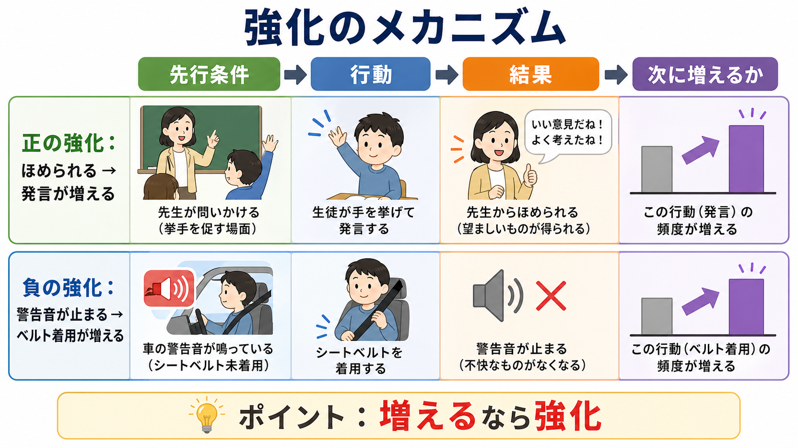

# 強化とは何か

## 要点

- 強化とは、ある行動のあとに起きた結果によって、その行動が将来増えることである [1]。
- 正の強化は、行動のあとに刺激や出来事が「加わり」、その行動が増える場合をいう。
- 負の強化は、行動のあとに不快な刺激や状態が「取り除かれ」、その行動が増える場合をいう。
- 「正」はよい、「負」は悪いという意味ではない。正は追加、負は除去であり、どちらも行動を増やす。
- 罰は行動を減らす過程である。したがって、負の強化と罰を混同すると、学習や臨床応用を誤解しやすい。

## この記事で答える問い

この記事の問いは、「強化とは何か」である。より具体的には、次の三つを整理する。

1. 強化は「報酬を与えること」なのか、それとも行動変化の概念なのか。
2. 正の強化と負の強化は、何が同じで何が違うのか。
3. 強化の考え方は、学習研究、神経科学、臨床・教育実践とどう接続するのか。

## まず結論

強化は、行動のあとに起きる結果によって、その行動が将来起こりやすくなる過程である。したがって、ある出来事が強化子かどうかは、その出来事が本人にとって快いかどうかだけでは決まらない。観察すべきなのは、その結果のあとに同じ行動が増えたかどうかである [1]。

たとえば、子どもが手を挙げて発言したあとに教師から「よく考えたね」と言われ、その後に発言が増えたなら、その称賛は正の強化として働いた可能性がある。一方、車の警告音が鳴っているときにシートベルトを締め、警告音が止まり、その後にシートベルト着用が増えたなら、警告音の停止は負の強化として働いた可能性がある。

重要なのは、正の強化も負の強化も、行動を増やす点では同じだということである。違いは、行動のあとに何かが加わるか、取り除かれるかにある。

## 背景

強化の概念は、オペラント条件づけの中心にある。古典的条件づけでは、刺激と反応の連合が問題になるのに対し、オペラント条件づけでは、行動とその結果の関係が問題になる。Skinner は、行動を結果との関係から実験的に分析する枠組みを整え、レバー押しやキーつつきのような行動が、食物などの結果によって増減することを体系的に研究した [2]。

その後、Ferster と Skinner は、強化が毎回与えられるのか、一定回数ごとなのか、一定時間ごとなのか、不規則なのかによって、行動の持続性や反応パターンが変わることを詳しく記述した [3]。この観点は、学習を「覚えたかどうか」だけでなく、「どのような環境条件のもとで、どの行動が維持されるか」として見るために重要である。

日常語では、強化は「ごほうびを与える」「よいことをする」と理解されがちである。しかし行動分析では、強化は価値判断ではなく機能的な用語である。つまり、強化とは、ある結果が実際に行動を増やしたという関係を指す。

## 基本概念

### 強化子

強化子とは、ある行動のあとに生じ、その行動を増やすように働く刺激や出来事である。食物、称賛、休憩、痛みの軽減、注意、情報、達成感、金銭、ゲーム内ポイントなど、多くのものが強化子になりうる。ただし、あるものが常に強化子であるとは限らない。

たとえば、空腹のときの食物は強化子になりやすいが、満腹のときにはそうでないかもしれない。称賛も、信頼する相手からのものなら行動を増やすが、恥ずかしさや圧力として働く文脈では逆効果になることがある。このため、強化子は「もの」そのものではなく、個体の状態、学習歴、文脈、行動との関係の中で判断する必要がある。

### 正の強化

正の強化は、行動のあとに刺激が加わり、その行動が増える場合である [1]。

例を挙げる。

| 場面 | 行動 | 結果 | その後 |
|---|---|---|---|
| 授業 | 手を挙げて発言する | 教師にほめられる | 発言が増える |
| 家庭 | 皿洗いをする | 感謝される、自由時間が増える | 手伝いが増える |
| 職場 | 報告を早めに出す | 上司から具体的な承認を得る | 早めの報告が増える |
| リハビリ | 課題を達成する | 達成感やフィードバックを得る | 練習への参加が増える |

ここでの「正」は、道徳的に正しいという意味ではない。行動のあとに何かが加わる、という意味である。

### 負の強化

負の強化は、行動のあとに嫌悪的な刺激や不快な状態が取り除かれ、その行動が増える場合である [1][5]。

例を挙げる。

| 場面 | 行動 | 結果 | その後 |
|---|---|---|---|
| 車 | シートベルトを締める | 警告音が止まる | 着用が増える |
| 身体症状 | 頭痛薬を飲む | 頭痛が和らぐ | 頭痛時の服薬が増える |
| 学習 | 宿題を早く終える | 親の催促がなくなる | 早めに宿題をすることが増える |
| 対人場面 | 苦手な話題を避ける | 不安が下がる | 回避が増える |

負の強化は罰ではない。罰は行動を減らす。負の強化は、何かが取り除かれることで行動を増やす。この違いは、不安、回避、依存、慢性疼痛、強迫的行動などを考えるときに特に重要である。

## 仕組み

強化を理解する最小単位は、「先行条件」「行動」「結果」「将来の行動頻度」である。これはしばしば ABC、すなわち Antecedent, Behavior, Consequence として整理される。

### 1. 先行条件

先行条件とは、行動が起きる前の状況である。教師が問いかける、スマートフォンの通知が鳴る、痛みがある、誰かに見られている、課題が難しいなどが含まれる。

先行条件は、行動を直接「強化」するわけではない。しかし、どの行動が起こりやすいか、どの結果が強化子として働きやすいかを大きく左右する。

### 2. 行動

行動は、観察可能な動きだけでなく、発話、選択、回避、接近、練習、休む、助けを求めるといった環境への働きかけを含む。行動分析では、できるだけ具体的に記述することが重要である。

「やる気がない」ではなく、「課題を始めるまでに20分以上かかる」。「不安が強い」ではなく、「発表前に欠席する」。「衝動的」ではなく、「待ち時間があると席を立つ」。このように具体化すると、どの結果が行動を維持しているのかを検討しやすくなる。

### 3. 結果

結果とは、行動のあとに起きる変化である。称賛、食物、休憩、注意、痛みの軽減、不安の低下、嫌な課題からの解放などがある。

ここで注意すべきなのは、同じ結果でも人や文脈によって機能が変わることである。ある子どもにとって教師の注目は強化子かもしれないが、別の子どもにとっては恥ずかしい刺激かもしれない。したがって、結果の意味は、行動の変化を見て判断する。

### 4. 将来の行動頻度

強化かどうかは、最終的には将来の行動頻度によって判断する。意図としてほめた、報酬を出した、不快を取り除いた、というだけでは強化とは言えない。その後に行動が増えたとき、その結果が強化として働いたと推定できる。

## 図解

正の強化、負の強化、正の罰、負の罰は、次の二軸で整理できる。

- 行動が増えるか、減るか。
- 刺激を加えるか、取り除くか。

この分類は便利だが、現実場面では単純でない。たとえば、宿題を終えると「親の小言がなくなる」だけでなく、「ほめられる」「自由時間が増える」「安心する」かもしれない。このとき、同じ行動が正の強化と負の強化の両方で維持されている可能性がある。正の強化と負の強化の区別には曖昧さがあり、行動分析の内部でも、その区別をどう使うべきか議論されてきた [4]。

したがって、実践上は「これは正か負か」を急いで決めるよりも、次の問いを優先するとよい。

1. どの行動が増えているのか。
2. 行動の直後に何が変わっているのか。
3. その変化は、誰にとって、どの文脈で意味をもつのか。
4. その結果は短期的には役立つが、長期的には問題を維持していないか。

## 臨床・研究との接続

### 教育・支援

教育場面では、強化は「ほめる技術」だけではない。重要なのは、望ましい行動が起きやすい環境を整え、その行動の直後に本人にとって意味のある結果が生じるようにすることである。

たとえば、課題を細かいステップに分け、できた部分に即時フィードバックを返すと、学習行動が維持されやすくなる。これは、複雑な行動を一度に求めるのではなく、近い近似行動を段階的に強化する「シェイピング」の考え方と関係する [1][2]。

### 不安と回避

負の強化は、不安や回避の理解に有用である。発表が不安な人が発表を避けると、その瞬間には不安が下がる。この不安低下が回避行動を強化し、次回も避けやすくなることがある。

この説明は、本人を責めるためのものではない。むしろ、回避が短期的には合理的に機能していることを理解するための枠組みである。臨床的には、短期的な不安低下と長期的な生活範囲の狭まりを分けて考える必要がある。

### 依存・習慣・報酬系

神経科学では、報酬や強化はドーパミン系、線条体、前頭前野、行動選択と結びつけて研究されてきた。Schultz らは、ドーパミンニューロンが単なる快感ではなく、予測された報酬と実際の報酬のずれ、すなわち報酬予測誤差に関わることを示した [6]。この観点は、[[ドパミンは報酬だけの物質なのか]]、[[直接路と間接路は行動選択をどう制御するのか]]、[[依存症は報酬学習の病態としてどう理解できるのか]]と接続する。

ただし、行動分析の「強化」と神経科学の「報酬信号」は同じものではない。行動分析は、行動と環境の関係を機能的に記述する。神経科学は、その関係を支える脳内メカニズムを調べる。両者をつなぐには、行動指標、文脈、主観的価値、神経活動を同時に扱う必要がある。

### 臨床応用での注意

強化の考え方は、教育、リハビリテーション、親子支援、行動療法、応用行動分析で広く使われる。一方で、臨床実践では、単に行動を増やせばよいわけではない。増やそうとしている行動が本人の生活の質、自己決定、関係性、安全、長期的な適応にどう関わるかを考える必要がある。

また、正の強化と呼ばれる手続きにも、競争、依存、過剰な外的動機づけ、不公平感、嫌悪的機能が含まれる場合がある。Perone は、正の強化が常に望ましい手続きとは限らず、理論的・実践的な副作用を検討する必要があると論じている [7]。そのため、臨床・教育場面では、効果だけでなく倫理性と本人の経験を合わせて評価する。

## よくある誤解

### 誤解1: 強化とは報酬を与えることである

強化は、報酬を与えるという手続きそのものではない。行動が増えたという結果を含む概念である。報酬を与えても行動が増えなければ、少なくともその文脈では強化として機能していない。

### 誤解2: 負の強化とは罰である

負の強化は行動を増やす。罰は行動を減らす。負という言葉がつくため混同されやすいが、ここでの負は「取り除く」という意味である [1][5]。

### 誤解3: ほめれば必ず正の強化になる

ほめ言葉は正の強化として働くことがある。しかし、全員に同じように働くとは限らない。人前でほめられることが恥ずかしい人、ほめられることで次も成功しなければならないと感じる人、ほめ手との関係に不信感がある人では、行動が増えないこともある。

### 誤解4: 強化は本人の内面を無視する考え方である

行動分析は、内面を否定するというより、まず観察可能な行動と環境の関係を精密に見る。現代の学習研究では、強化の概念は、価値、予測、注意、情動、身体状態、神経可塑性とも接続して考えられる。関連して、[[神経可塑性は発達と学習をどう支えるのか]]や[[予測処理とは何か]]も参照できる。

## 関連ノート

- [[ドパミンは報酬だけの物質なのか]]
- [[直接路と間接路は行動選択をどう制御するのか]]
- [[依存症は報酬学習の病態としてどう理解できるのか]]
- [[報酬系の異常はうつ病をどう説明するのか]]
- [[ADHDは前頭線条体回路の障害として説明できるのか]]
- [[神経可塑性は発達と学習をどう支えるのか]]
- [[予測処理とは何か]]

MOC 更新候補: `content/00_MOC/MOC｜認知科学・心理学.md` に「学習・行動・動機づけ」の項目として追加する。

今後の作成候補: 「オペラント条件づけとは何か」「罰とは何か」「シェイピングとは何か」「強化スケジュールとは何か」「応用行動分析とは何か」。

## 理解チェック

1. 「正の強化」の正は、なぜ「よい」という意味ではないのか。
2. シートベルトの警告音が止まることで着用が増える例は、なぜ負の強化なのか。
3. ある結果が強化子として働いたかどうかを、どのような観察から判断できるか。
4. 回避行動が短期的には合理的でも、長期的には問題を維持することがあるのはなぜか。

## 未解決問題

- 正の強化と負の強化の区別は、実験・教育・臨床のどの場面で有用で、どの場面で曖昧さを生むのか。
- 行動頻度の増加という機能的定義と、主観的な快・不快、動機づけ、報酬予測誤差をどう統合できるのか。
- 強化を用いる介入で、短期的な行動変化と長期的な自律性・関係性・生活の質をどう両立するか。

## 参考文献

[1] OpenStax. (2019). *Psychology 2e*, 6.3 Operant Conditioning. https://openstax.org/books/psychology-2e/pages/6-3-operant-conditioning

[2] Skinner, B. F. (1938). *The Behavior of Organisms: An Experimental Analysis*. D. Appleton-Century. https://openlibrary.org/books/OL6377198M/The_behavior_of_organisms

[3] Ferster, C. B., & Skinner, B. F. (1957). *Schedules of Reinforcement*. Appleton-Century-Crofts. https://openlibrary.org/books/OL19830344M/Schedules_of_reinforcement

[4] Baron, A., & Galizio, M. (2006). The distinction between positive and negative reinforcement: Use with care. *The Behavior Analyst, 29*(1), 141-151. https://pmc.ncbi.nlm.nih.gov/articles/PMC2223166/

[5] Iwata, B. A. (1987). Negative reinforcement in applied behavior analysis: An emerging technology. *Journal of Applied Behavior Analysis, 20*(4), 361-378. https://doi.org/10.1901/jaba.1987.20-361

[6] Schultz, W., Dayan, P., & Montague, P. R. (1997). A neural substrate of prediction and reward. *Science, 275*(5306), 1593-1599. https://doi.org/10.1126/science.275.5306.1593

[7] Perone, M. (2003). Negative effects of positive reinforcement. *The Behavior Analyst, 26*(1), 1-14. https://doi.org/10.1007/BF03392064
