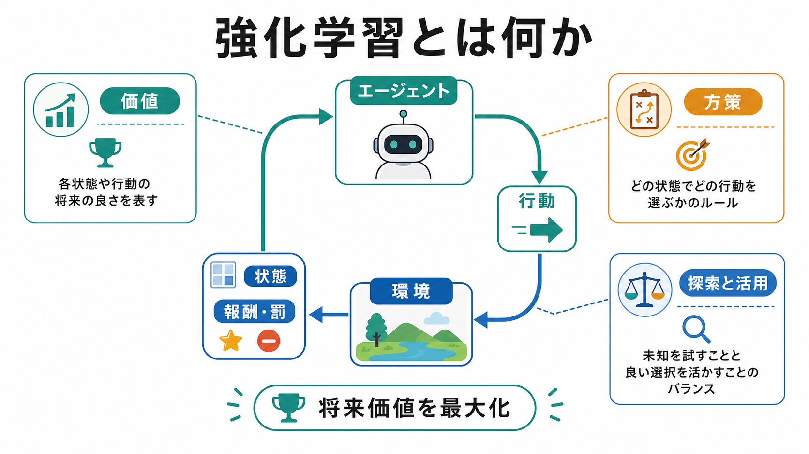
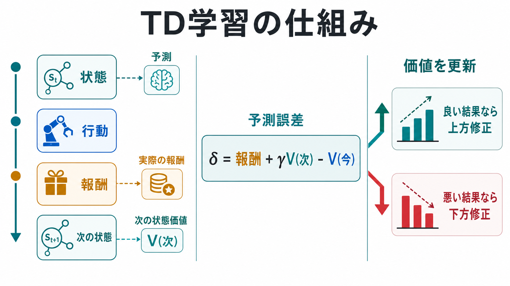
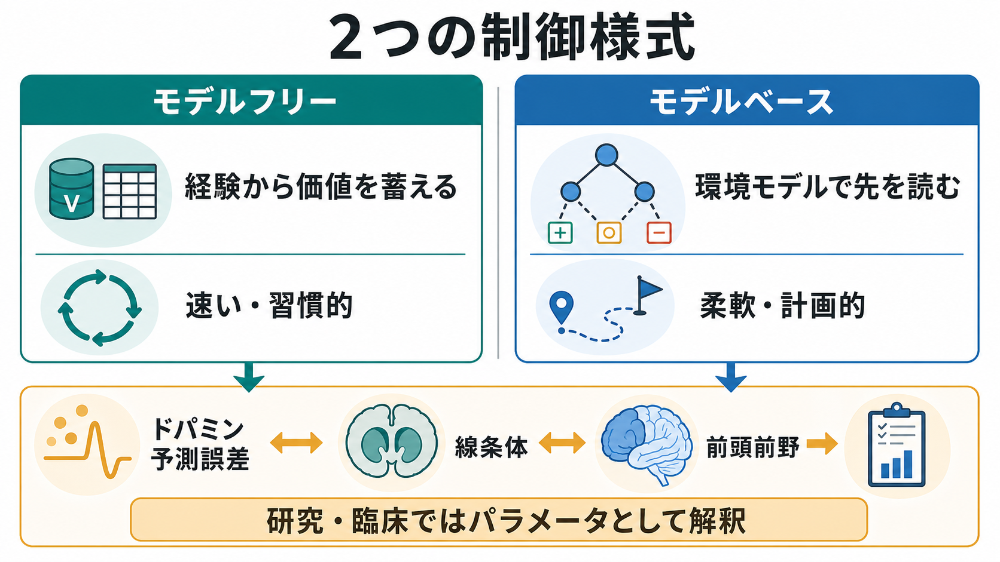

# 強化学習とは何か

## 要点

- 強化学習は、エージェントが環境と相互作用し、行動の後に得られる報酬や罰を手がかりに、長期的な累積報酬を大きくする行動方策を学ぶ枠組みである[1]。
- 重要なのは「すぐ得をする行動」ではなく、将来の結果まで含めた価値を推定する点である。このため、状態、行動、報酬、価値、方策、割引率、探索と活用が基本概念になる[1]。
- 時間差分学習では、予測と実際の結果のずれである予測誤差を使って価値を更新する。この考え方は Q 学習やドパミン報酬予測誤差の理解にもつながる[2][4]。
- 脳研究では、ドパミン、線条体、前頭前野、大脳基底核回路が、価値学習、習慣的制御、計画的制御に関わる候補として検討されてきた[4][5][6]。
- 臨床・計算論的精神医学では、強化学習モデルを診断そのものではなく、学習率、報酬感受性、罰感受性、探索傾向などを推定する研究道具として用いる[7][8]。

## この記事で答える問い

この記事では、[[意思決定とは何か]]、[[リスク下の意思決定はどのように行われるのか]]、[[ドパミンは報酬だけの物質なのか]]と接続しながら、次の問いに答える。

1. 強化学習は、教師あり学習や単なる条件づけと何が違うのか。
2. 報酬、罰、価値、方策はどのように結びつくのか。
3. 予測誤差による価値更新は、なぜ神経科学や精神医学研究で重要なのか。
4. 強化学習モデルを人間理解に使うとき、どこに限界があるのか。

## まず結論

強化学習とは、「ある状況でどの行動を選ぶと、将来まで含めてどれだけよい結果に近づくか」を、試行錯誤から学ぶ理論である。環境は、行動の直後に必ず正解を教えてくれるとは限らない。報酬が遅れて現れたり、罰が不確実だったり、短期的には損でも長期的には得になる行動があったりする。強化学習は、そのような場面で、経験から価値を更新し、行動方策を改善するための数理的な言語を与える[1]。

人間や動物の学習を考えるとき、強化学習は「快楽を追うだけの理論」ではない。報酬は、食物や金銭のような外的報酬だけでなく、痛みの回避、安心、社会的承認、好奇心、目標達成なども含みうる。ただし、現実の人間行動は価値だけで決まらず、記憶、注意、身体状態、社会的文脈、言語的な意味づけにも左右される。そのため強化学習は、人間理解の全体理論というより、行動選択と学習の一部を精密に記述する道具として使うのがよい。

## 背景

強化学習は、心理学の古典的条件づけ・オペラント条件づけ、制御理論、動的計画法、機械学習、神経科学が交わる領域で発展した。Sutton と Barto の教科書は、強化学習を「目標へ向かうエージェントが環境と相互作用しながら学ぶ問題」として体系化している[1]。

心理学では、行動の後に報酬があると行動が増え、罰や報酬の消失があると行動が変わることが古くから研究されてきた。強化学習は、この直感を「価値関数」「方策」「予測誤差」「探索」といった量に分解し、何がどの程度学習されたのかを数式で追跡できる形にした。

神経科学では、予測よりよい報酬が得られたときに中脳ドパミンニューロン活動が上がり、予測された報酬が来ないと活動が下がるという発見が、強化学習と脳をつなぐ重要な手がかりになった[4]。この話題は、[[神経可塑性は発達と学習をどう支えるのか]]や[[直接路と間接路は行動選択をどう制御するのか]]とも深く関係する。

## 基本概念

### エージェントと環境

強化学習では、学習して行動を選ぶ主体をエージェント、エージェントが働きかける外界を環境と呼ぶ。人間の例でいえば、課題中の参加者、ゲームを遊ぶ人工知能、薬物を求める行動を学習してしまった個体などがエージェントとしてモデル化される。

### 状態、行動、報酬

状態は、行動を選ぶために利用できる状況の表現である。行動は、状態に対して選ばれる選択肢である。報酬は、行動の後に得られる結果の良し悪しを数値化したもので、罰は負の報酬として扱われることが多い[1]。

ただし、人間研究では「何を報酬とみなすか」が実験設計の核心になる。金銭報酬、社会的評価、痛みの回避、予測可能性の上昇は同じものではない。したがって、報酬を単純に快感と同一視せず、課題内で定義された結果変数として読む必要がある。

### 価値と方策

価値とは、ある状態や行動が将来どれだけよい結果へつながるかの推定である。状態価値 $V(s)$ は「状態 $s$ にいることの将来価値」、行動価値 $Q(s,a)$ は「状態 $s$ で行動 $a$ を選ぶことの将来価値」を表す。

方策 $\pi(a|s)$ は、状態 $s$ で行動 $a$ をどの確率で選ぶかを表すルールである。価値を学ぶだけでは行動は決まらない。学んだ価値をどの程度そのまま使うか、未知の選択肢をどの程度試すかが方策に反映される。

### 探索と活用

探索は、まだよくわからない行動を試すことである。活用は、すでに価値が高いとわかっている行動を選ぶことである。探索が少なすぎると、局所的によい行動に固着する。探索が多すぎると、せっかく学んだ価値を活かせない。[[リスク下の意思決定はどのように行われるのか]]で扱う不確実性とも重なるが、強化学習では「学ぶためにあえて試す」側面が特に重要になる。

## 仕組み

強化学習の基本的な流れは、次の循環として理解できる。

1. エージェントが現在の状態 $s_t$ を観察する。
2. 方策に従って行動 $a_t$ を選ぶ。
3. 環境から報酬 $r_t$ と次の状態 $s_{t+1}$ を受け取る。
4. 予測していた価値と実際の結果の差を使って、価値や方策を更新する。
5. 更新された価値に基づいて、次の選択が少し変わる。

### 時間差分学習

時間差分学習は、今の予測と、報酬を受け取った後の新しい予測との差を使って価値を更新する方法である。代表的な予測誤差は次のように書ける。

$$
\delta_t = r_t + \gamma V(s_{t+1}) - V(s_t)
$$

ここで、$\delta_t$ は予測誤差、$r_t$ は得られた報酬、$\gamma$ は将来報酬をどれだけ重視するかを表す割引率、$V(s_t)$ は現在状態の価値、$V(s_{t+1})$ は次状態の価値である[1][5]。

予測よりよい結果なら $\delta_t$ は正になり、価値は上がる。予測より悪い結果なら $\delta_t$ は負になり、価値は下がる。これにより、遠い将来の結果も、状態の連鎖を通じて少しずつ現在の選択へ反映される。

### Q 学習

Q 学習は、状態と行動の組み合わせに価値を割り当てる代表的なアルゴリズムである。現在の行動価値 $Q(s_t,a_t)$ を、得られた報酬と次状態で取りうる最良行動の価値に近づける。Watkins と Dayan は、一定条件のもとで Q 学習が最適行動価値へ収束することを示した[2]。

直感的には、Q 学習は「この状況でこの行動をしたら、その後の最良の展開まで含めてどれくらいよいか」を学ぶ方法である。教師あり学習のように、各行動に正解ラベルが与えられるわけではない。報酬の時系列から、後でわかる良し悪しを前の選択へ割り戻していく。

### 深層強化学習

深層強化学習は、価値関数や方策をニューラルネットワークで近似する。Mnih らの Deep Q-Network は、ゲーム画面のピクセルから行動価値を学び、複数の Atari ゲームで高い成績を示した代表例である[3]。

この成果は、強化学習が小さな表形式の課題だけでなく、高次元の感覚入力を扱えることを示した。ただし、深層強化学習は大量の試行、報酬設計、安定化技術を必要とする。人間の少数試行学習や意味理解をそのまま説明するものではない。

## 図解

図1は、強化学習を「エージェント、環境、状態、行動、報酬、価値、方策」の循環として整理したものである。要点は、報酬が行動の直後の快・不快だけでなく、将来価値の更新に使われる点である。

図2は、TD 学習の中心である予測誤差を示す。現在の予測 $V(s_t)$ と、実際の報酬および次状態価値 $r_t + \gamma V(s_{t+1})$ の差が、次回以降の価値推定を変える。

図3は、モデルフリー制御とモデルベース制御の違いを示す。モデルフリー制御は、経験から蓄えた価値に基づいて速く選ぶ。モデルベース制御は、環境の構造を使って先の結果をシミュレーションする。Daw らは、この違いを、線条体に関わる習慣的制御と前頭前野に関わる計画的制御の競合として整理した[6]。

## 臨床・研究との接続

強化学習モデルは、脳・行動・精神症状をつなぐ仮説を作るために使われる。たとえば、[[ドパミンは報酬だけの物質なのか]]で扱う報酬予測誤差は、強化学習でいう TD 誤差と対応づけて議論されることが多い[4][5]。また、線条体や大脳基底核回路は、価値学習、行動選択、習慣形成の神経基盤として研究されている[5][6]。

精神医学・神経疾患研究では、強化学習モデルから、学習率、報酬への感受性、罰への感受性、探索傾向、モデルベース制御の強さなどを推定する。Maia と Frank は、パーキンソン病、ADHD、依存症、統合失調症などを、ドパミン系や皮質-基底核-視床-皮質回路の強化学習モデルから理解する研究を整理している[7]。[[依存症は報酬学習の病態としてどう理解できるのか]]や[[報酬系の異常はうつ病をどう説明するのか]]も、この延長線上に置ける。

ただし、これらのモデルは個別診断や治療指示を直接与えるものではない。計算論的精神医学では、理論駆動型モデルを使って、同じ症状に見える行動の背後に異なる学習機構がありうることを検討する[8]。教育・研究目的では有用だが、臨床判断では面接、生活史、身体疾患、薬物、社会環境などを含む総合評価が必要である。

## よくある誤解

### 強化学習は「報酬で釣る」だけの理論ではない

強化学習の報酬は、単なるご褒美ではない。将来の結果を評価するための数値信号である。短期的な報酬が高い行動でも、長期的な罰や機会損失が大きければ、価値は下がりうる。

### 罰を強くすれば学習がよくなるわけではない

罰は行動を変える信号になりうるが、恐怖、回避、探索の低下、文脈依存的な学習を生むこともある。強化学習モデルでは負の報酬として扱えるが、人間の教育や臨床では、罰の心理的・社会的影響を単純化してはいけない。

### ドパミンは報酬そのものではない

ドパミンは報酬、予測誤差、動機づけ、行動の活性化、運動制御に関わるが、快感そのものと同一ではない。強化学習とドパミンを対応づけるときは、どの回路、どの時間スケール、どの課題で観察された信号なのかを区別する必要がある[4][5]。

### モデルフリーは低級、モデルベースは高級という意味ではない

モデルフリー制御は習慣的で速く、安定した環境では有効である。モデルベース制御は柔軟だが、計算負荷が高い。現実の行動は、両者のどちらか一方ではなく、状況に応じた重みづけで生じる[6]。

## 関連ノート

- [[意思決定とは何か]]
- [[リスク下の意思決定はどのように行われるのか]]
- [[ドパミンは報酬だけの物質なのか]]
- [[神経可塑性は発達と学習をどう支えるのか]]
- [[直接路と間接路は行動選択をどう制御するのか]]
- [[依存症は報酬学習の病態としてどう理解できるのか]]
- [[報酬系の異常はうつ病をどう説明するのか]]
- [[妄想は予測誤差処理の異常として説明できるのか]]

### MOC 更新候補

- `content/00_MOC/MOC｜認知科学・心理学.md`
- `content/00_MOC/MOC｜データ解析・機械学習.md`
- `content/00_MOC/MOC｜計算論的精神医学.md`
- `content/00_MOC/MOC｜数理モデル・計算論.md`

## 理解チェック

1. 強化学習における「状態」「行動」「報酬」「方策」を、自分の日常行動の例で説明できるか。
2. 即時報酬が高い行動と、長期価値が高い行動はどのようにずれうるか。
3. TD 予測誤差 $\delta_t = r_t + \gamma V(s_{t+1}) - V(s_t)$ の各項が何を意味するか。
4. モデルフリー制御とモデルベース制御は、どちらが常に優れているわけではない理由を説明できるか。
5. 強化学習モデルを精神医学研究に使うとき、個別診断と混同してはいけない理由を説明できるか。

## 未解決問題

- 人間が少数の経験から柔軟に一般化できる仕組みを、標準的な強化学習だけでどこまで説明できるか。
- 報酬、意味、社会的文脈、身体状態を同じ価値関数へ統合してよいのか。
- 計算論的精神医学で推定される学習率や報酬感受性が、臨床的にどの程度再現性と予測力を持つか。
- モデルフリー・モデルベースの二分法を、実際の脳回路の多層的な制御へどう拡張するか。

## 参考文献

[1] Sutton, R. S., & Barto, A. G. (2018). *Reinforcement Learning: An Introduction* (2nd ed.). MIT Press. https://incompleteideas.net/book/the-book-2nd.html

[2] Watkins, C. J. C. H., & Dayan, P. (1992). Q-learning. *Machine Learning, 8*, 279-292. https://doi.org/10.1007/BF00992698

[3] Mnih, V., Kavukcuoglu, K., Silver, D., et al. (2015). Human-level control through deep reinforcement learning. *Nature, 518*, 529-533. https://doi.org/10.1038/nature14236

[4] Schultz, W., Dayan, P., & Montague, P. R. (1997). A neural substrate of prediction and reward. *Science, 275*(5306), 1593-1599. https://doi.org/10.1126/science.275.5306.1593

[5] Niv, Y. (2009). Reinforcement learning in the brain. *Journal of Mathematical Psychology, 53*(3), 139-154. https://doi.org/10.1016/j.jmp.2008.12.005

[6] Daw, N. D., Niv, Y., & Dayan, P. (2005). Uncertainty-based competition between prefrontal and dorsolateral striatal systems for behavioral control. *Nature Neuroscience, 8*, 1704-1711. https://doi.org/10.1038/nn1560

[7] Maia, T. V., & Frank, M. J. (2011). From reinforcement learning models to psychiatric and neurological disorders. *Nature Neuroscience, 14*, 154-162. https://doi.org/10.1038/nn.2723

[8] Huys, Q. J. M., Maia, T. V., & Frank, M. J. (2016). Computational psychiatry as a bridge from neuroscience to clinical applications. *Nature Neuroscience, 19*, 404-413. https://doi.org/10.1038/nn.4238
