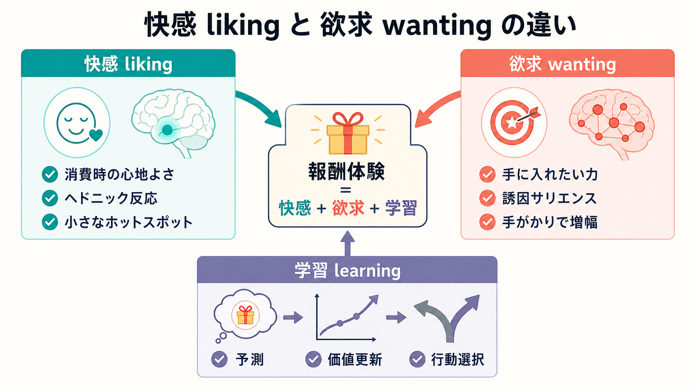
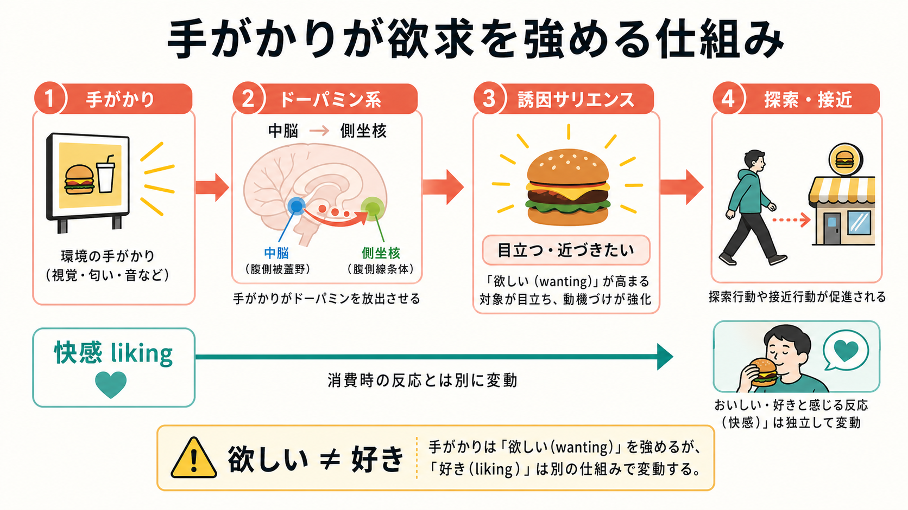
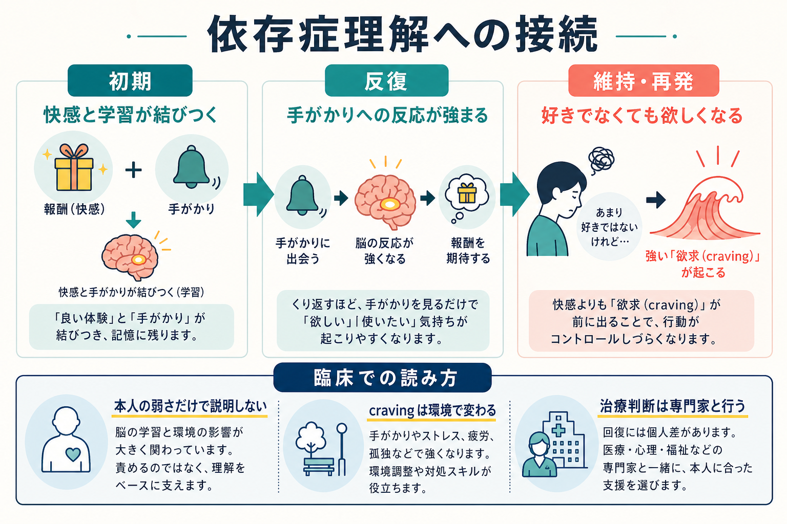

# 快感と欲求は何が違うのか

## 要点

- 快感は「好き」「心地よい」と感じる liking であり、欲求は「手に入れたい」「近づきたい」と対象に引き寄せられる wanting である。
- 報酬は単一の心的機能ではなく、少なくとも liking、wanting、learning の組み合わせとして理解すると見通しがよい [1]。
- ドーパミンは単純な快感物質ではなく、予測誤差、手がかりへの反応、誘因サリエンス、行動の活性化に深く関わる [2][3]。
- 依存症では、薬物や行動を「好き」と感じる程度が増えなくても、手がかりによって「欲しい」が過剰に立ち上がることがある [4][5]。
- この区別は、本人の意志の弱さだけで craving や再発を説明しないための、教育・研究上の重要な枠組みである。

## この記事で答える問い

この記事では、次の問いに答える。

1. 「好き」と「欲しい」は、なぜ同じではないのか。
2. liking、wanting、learning は報酬処理の中でどう分担しているのか。
3. ドーパミンは快感そのものなのか、それとも別の機能を担うのか。
4. この区別は、依存症や craving の理解にどう役立つのか。

## まず結論

快感と欲求の違いは、「消費したときの心地よさ」と「対象へ向かわせる動機づけ」の違いである。甘いものを食べておいしいと感じるのは liking に近い。一方で、店の匂い、通知音、飲酒場面、薬物関連の道具、ゲーム画面のような手がかりを見た瞬間に、まだ快感を得ていないのに近づきたくなる力は wanting に近い。

ふだんの生活では liking と wanting はよく一緒に動く。好きなものを欲しくなり、欲しかったものを得ると快く感じる。しかし、脳内では両者を支える仕組みが完全には重ならない。Berridge らは、報酬を liking、wanting、learning という分離可能な構成要素として整理した [1]。この見方を使うと、「もうそれほど楽しくないのに、なぜ続けてしまうのか」という依存症の難問も、少なくとも一部は説明しやすくなる [4][5]。

## 背景

日常語では「報酬」「快感」「欲求」「動機づけ」が混ざりやすい。たとえば「スマートフォンが好きだから何度も見る」と言うとき、その中には、画面を見る快感、通知への期待、退屈の回避、社会的承認の学習、習慣化された行動などが含まれる。心理学や神経科学では、これらを分けて扱わないと、同じ行動を別々の機構で説明してしまう。

学習心理学では、行動の後に起きる結果がその行動の将来頻度を変える過程を[[強化とは何か]]として扱う。また、行動と結果の関係は[[オペラント条件づけとは何か]]の中心であり、手がかりと反応の結びつきは[[古典的条件づけとは何か]]とも関係する。liking / wanting の区別は、こうした学習の枠組みに、報酬の主観的快さと動機づけの分離という神経科学的な見取り図を与える。

## 基本概念

### liking: 快感

liking は、報酬を消費したときのヘドニックな反応である。食べ物の甘さ、温かさ、性的快感、音楽の心地よさ、安心感など、「よい」と感じる反応がここに入る。Berridge と Kringelbach は、快感が脳全体に一様に生じるのではなく、側坐核や腹側淡蒼球などの限られた「ヘドニック・ホットスポット」を含むネットワークで調整されると論じている [6]。

ただし liking は、単なる言語報告だけでは測れない。動物研究や乳児研究では、甘味への顔面反応など、快・不快の微細な反応が手がかりとして使われる [7]。この点は、本人が「好き」と言えるかどうかだけでなく、身体反応や行動指標も合わせて考える必要があることを示している。

### wanting: 欲求

wanting は、対象を「欲しい」「手に入れたい」「近づきたい」ものとして目立たせる動機づけである。Berridge らは、この心理的な引力を「誘因サリエンス」と呼ぶ [1][8]。ここでの wanting は、冷静な計画や価値判断としての「欲しい」だけではない。むしろ、手がかりを見た瞬間に注意が奪われ、身体が動きそうになり、対象が急に魅力的に見えるような過程を含む。

重要なのは、wanting は liking と同じではないという点である。ある対象を強く欲していても、その対象を得たときの快感が大きいとは限らない。逆に、快い経験であっても、特定の手がかりや環境と結びついていなければ、強い接近行動を引き起こさないこともある。

### learning: 学習

learning は、何が報酬を予測するのか、どの行動が結果を変えるのか、どの文脈で価値が高まるのかを更新する過程である。報酬予測誤差に関する研究では、ドーパミン信号が、期待された報酬と実際の報酬のずれに応答することが示されてきた [2][3]。これは、ドーパミンを単純に「快感そのもの」と見なすよりも、予測、価値更新、行動選択に関わる信号として見るべきことを示している。

## 仕組み

### 手がかりが「欲しい」を増幅する

誘因サリエンスの中心は、報酬そのものだけでなく、報酬を予告する手がかりが動機づけを帯びる点にある。食べ物の匂い、酒の看板、薬物関連の場所、ギャンブル画面、通知音などは、それ自体が快感を与える前に、接近や探索を引き起こす。

この過程では、中脳から側坐核などへ向かう中脳辺縁系ドーパミン系が重要な役割を担う。Robinson と Berridge の誘因感作理論では、反復的な薬物使用などによってこの系が感作されると、薬物や薬物関連手がかりへの wanting が長期的に高まりうるとされる [4][5]。ここで増えるのは、必ずしも快感としての liking ではない。

### 「欲しい」と「好き」がずれる場面

liking と wanting がずれる例は多い。空腹時には食べ物を強く欲するが、満腹後には同じ食べ物への wanting は下がる。ストレスや孤独の下では、普段より飲酒、喫煙、過食、ゲーム、SNS への接近が強まることがある。依存症では、本人が「もう楽しくない」「むしろ苦しい」と語っていても、手がかりや文脈によって craving が急に高まることがある [5]。

このずれは、本人の内面が矛盾しているというより、報酬処理が複数の仕組みに分かれていることを反映している。快感の大きさ、手がかりに引き寄せられる力、予測や習慣、回避したい不快感は、それぞれ異なる時間スケールで変化する。

### ドーパミンは「快感物質」だけではない

ドーパミンはしばしば快感物質と呼ばれるが、この表現はかなり粗い。報酬予測誤差研究では、ドーパミンニューロンは予測外の報酬や報酬を予告する手がかりに応答し、学習に必要な更新信号を担うとされてきた [2]。一方、誘因サリエンス研究では、ドーパミンは liking よりも wanting を強く調整すると考えられている [1][8]。

したがって、「ドーパミンが出るから気持ちいい」とだけ言うと、報酬処理の重要な部分を落としてしまう。より正確には、ドーパミンは報酬の予測、手がかりの目立ちやすさ、接近行動の準備、価値更新に関わる信号であり、快感そのものはオピオイド系や内因性カンナビノイド系を含む別の回路とも関係する [6][7]。

## 図解

3枚の図は、次の読み方を想定している。

| 図 | 主題 | 読み方 |
|---|---|---|
| 図1 | liking・wanting・learning の全体像 | 報酬体験は、快感、欲求、学習の合成として理解する |
| 図2 | 手がかりと誘因サリエンス | 手がかりは、消費前に wanting を立ち上げる |
| 図3 | 依存症理解への接続 | 好きでなくても欲しくなる状態を、非難ではなく機構として読む |

## 臨床・研究との接続

依存症研究では、liking と wanting の分離は大きな意味を持つ。誘因感作理論は、依存症を「薬物がどんどん好きになる病気」としてだけでなく、「薬物や関連手がかりに対する wanting が過敏になる状態」として説明する [4][5]。この見方では、再発リスクは単なる快感追求ではなく、環境手がかり、ストレス、注意捕捉、接近傾向、学習履歴に左右される。

臨床的には、この区別は教育的な説明として有用である。本人が「好きではないのに欲しくなる」と感じるとき、それを意志の弱さや道徳的失敗としてだけ説明すると、現象を見誤りやすい。むしろ、手がかりを減らす、文脈を変える、 craving の波を観察する、代替行動を準備する、専門職と治療計画を立てるといった介入を考えるための足場になる。

ただし、ここで述べる内容は教育・研究目的の整理であり、個別の診断や治療指示ではない。依存症や強い craving、生活機能の低下がある場合は、医療・心理・福祉の専門家と相談して評価と支援を組み立てる必要がある。

## よくある誤解

### 誤解1: 欲しいなら本当は好きなはずだ

欲しいことと好きなことは重なることが多いが、同一ではない。依存症や強迫的行動では、本人が楽しさをあまり感じていなくても、手がかりや文脈によって wanting が強く立ち上がることがある [5]。

### 誤解2: ドーパミンは快感だけを作る

ドーパミンは快感そのものだけでなく、予測誤差、誘因サリエンス、接近行動、価値更新に関わる。快感のヘドニック成分は、より限定されたホットスポットやオピオイド系などとも関係する [2][6]。

### 誤解3: 依存症は報酬が強すぎるだけで説明できる

依存症では、報酬の快感、離脱や不快感の回避、習慣、衝動制御、社会環境、手がかり反応性が絡む。誘因感作理論はその中でも「手がかりによって wanting が過剰に高まる」側面を説明する理論であり、依存症全体を単独で説明するものではない [5]。

### 誤解4: craving が起きるなら本人は治る気がない

craving は環境、身体状態、ストレス、学習履歴によって変わる。本人の価値観や治療意欲と、瞬間的に立ち上がる wanting は分けて考える必要がある。

## 関連ノート

既存ノート:

- [[強化とは何か]]
- [[オペラント条件づけとは何か]]
- [[古典的条件づけとは何か]]
- [[恐怖条件づけとは何か]]
- [[罰とは何か]]

MOC 更新候補:

- `content/00_MOC/` 配下の認知科学・心理学、学習・行動・動機づけ、神経科学系 MOC に、本記事へのリンクを追加する。
- 並列ジョブとの競合を避けるため、このタスクでは MOC 本体は更新しない。

今後の作成候補:

- 「誘因サリエンスとは何か」
- 「ドーパミンは報酬だけの物質なのか」
- 「craving とは何か」
- 「依存症における手がかり反応性とは何か」
- 「報酬予測誤差とは何か」

## 理解チェック

1. liking と wanting は、それぞれ何を指すか。
2. 手がかりが wanting を強めるとは、どのような現象か。
3. ドーパミンを「快感物質」とだけ呼ぶと、何が見えにくくなるか。
4. 依存症で「好きではないのに欲しくなる」と言えるのはなぜか。
5. craving を本人の弱さだけで説明すると、臨床的にどのような問題が起こりうるか。

## 参考文献

[1] Berridge, K. C., Robinson, T. E., & Aldridge, J. W. (2009). Dissecting components of reward: 'liking', 'wanting', and learning. *Current Opinion in Pharmacology, 9*(1), 65-73. https://doi.org/10.1016/j.coph.2008.12.014

[2] Schultz, W., Dayan, P., & Montague, P. R. (1997). A neural substrate of prediction and reward. *Science, 275*(5306), 1593-1599. https://doi.org/10.1126/science.275.5306.1593

[3] Schultz, W. (2016). Dopamine reward prediction-error signalling: a two-component response. *Nature Reviews Neuroscience, 17*, 183-195. https://doi.org/10.1038/nrn.2015.26

[4] Robinson, T. E., & Berridge, K. C. (2000). The psychology and neurobiology of addiction: an incentive-sensitization view. *Addiction, 95*(Suppl 2), S91-S117. https://doi.org/10.1080/09652140050111681

[5] Robinson, T. E., & Berridge, K. C. (2025). The incentive-sensitization theory of addiction 30 years on. *Annual Review of Psychology, 76*, 29-58. https://doi.org/10.1146/annurev-psych-011624-024031

[6] Berridge, K. C., & Kringelbach, M. L. (2015). Pleasure systems in the brain. *Neuron, 86*(3), 646-664. https://doi.org/10.1016/j.neuron.2015.02.018

[7] Berridge, K. C., & Kringelbach, M. L. (2013). Neuroscience of affect: brain mechanisms of pleasure and displeasure. *Current Opinion in Neurobiology, 23*(3), 294-303. https://doi.org/10.1016/j.conb.2013.01.017

[8] Berridge, K. C. (2012). From prediction error to incentive salience: mesolimbic computation of reward motivation. *European Journal of Neuroscience, 35*(7), 1124-1143. https://doi.org/10.1111/j.1460-9568.2012.07990.x

## 未解決問題

- liking と wanting の分離を、人間の主観報告、行動指標、神経画像でどこまで一貫して測定できるのか。
- 薬物依存、ギャンブル、過食、SNS 使用などで、誘因サリエンスの機構はどこまで共通し、どこから領域固有になるのか。
- craving を下げる介入は、手がかり反応性、ストレス反応、習慣、社会的孤立のどの成分に最も効いているのか。
