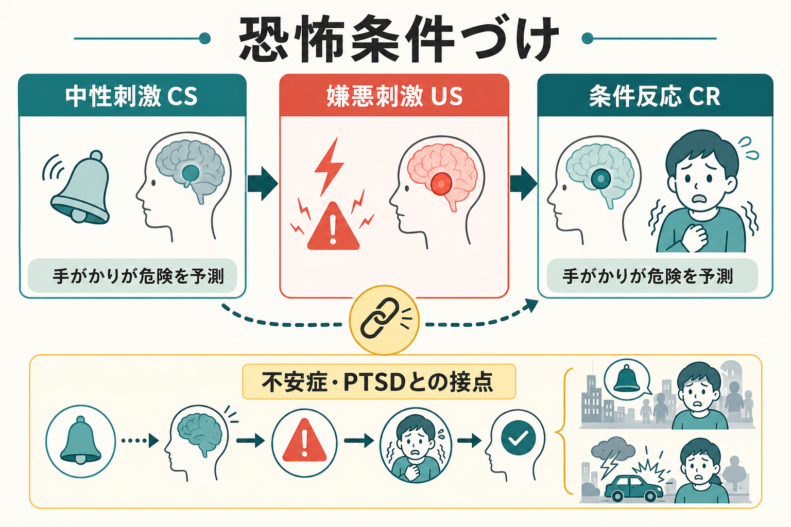
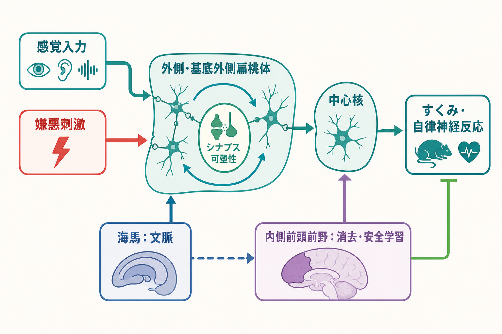
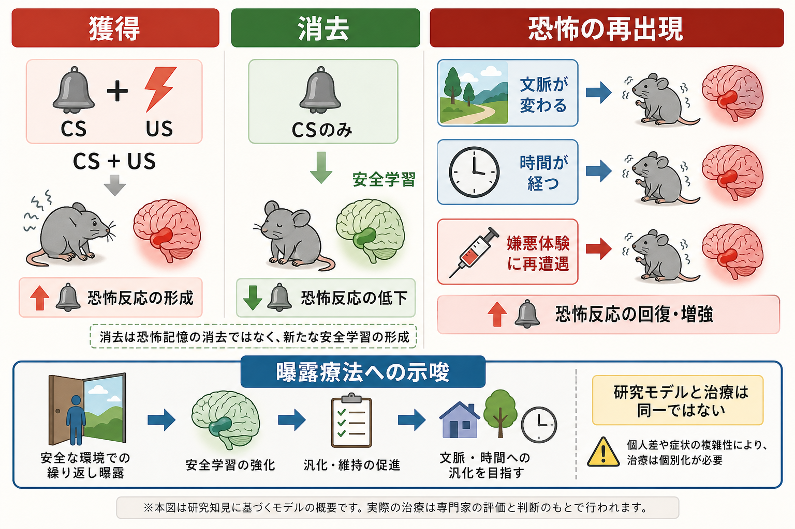

# 恐怖条件づけとは何か

## 要点

- 恐怖条件づけは、もともと中立だった手がかりが、痛み・危険・強い不快体験などの嫌悪刺激を予測するようになり、その手がかりだけで防御反応が起きる学習である。
- 実験では、音や画像などの条件刺激（CS）と、電気刺激や大きな音などの無条件刺激（US）を対にして、すくみ、皮膚コンダクタンス、心拍、驚愕反射、主観的恐怖などを測ることが多い[1][2]。
- 神経回路としては、外側・基底外側[[扁桃体過活動は不安症やPTSDにどう関わるのか|扁桃体]]で手がかりと嫌悪刺激の情報が結びつき、中心核や脳幹・視床下部を介して防御反応が表出する。[[海馬回路は記憶をどう形成するのか|海馬]]は文脈、[[前頭前野は情動制御にどう関わるのか|内側前頭前野]]は消去・安全学習に関わる[2][3][4]。
- 不安症や[[PTSDでは恐怖記憶ネットワークに何が起きているのか|PTSD]]との関係は、「恐怖が強い人は弱い人より恐怖条件づけが多い」という単純な話ではない。むしろ、恐怖の般化、文脈に応じた制御、消去学習、恐怖の再出現が重要である[4][5][6]。
- 医療・臨床への接続は研究モデルとしての説明であり、個別の診断や治療指示ではない。

## この記事で答える問い

1. 恐怖条件づけでは何が「学習」されるのか。
2. CS、US、CR、消去、般化、文脈とは何か。
3. 扁桃体、海馬、内側前頭前野はそれぞれどのような役割を持つのか。
4. なぜ不安症・PTSD・曝露療法の理解に関係するのか。
5. 恐怖条件づけモデルを臨床へ使うとき、どこを単純化してはいけないのか。

## まず結論

恐怖条件づけとは、「危険そのもの」ではなく「危険を予測する手がかり」を学ぶ仕組みである。たとえば、強い痛みや事故そのものではなく、その直前に聞こえた音、見た場所、匂い、身体感覚、時間帯などが危険の予測信号になる。すると、実際の危険がなくても、その手がかりだけで緊張、すくみ、回避、心拍上昇、発汗、注意の固定が生じる。

この仕組みは適応的である。過去に危険と結びついた合図へ素早く反応できれば、生存上は有利だからである。しかし、手がかりと危険の結びつきが強すぎる、似た刺激へ広がりすぎる、文脈に応じて抑えられない、消去後にも戻りやすい場合には、日常生活で過剰な警戒や回避が維持される。ここが不安症やPTSDの研究とつながる[3][5][6]。

## 背景

恐怖条件づけは、古典的条件づけの一種である。Pavlov 型の学習では、もともと特別な意味を持たない刺激が、重要な結果を予測するようになる。恐怖条件づけでは、その結果が嫌悪的であるため、学習後の反応は防御反応として現れる。

動物研究では、音と軽い電気刺激を組み合わせ、学習後に音だけを出したときのすくみ反応を測る課題がよく使われる。ヒト研究では、色・図形・音・写真などの手がかりと、弱い電気刺激、大きな音、不快画像などを組み合わせ、皮膚コンダクタンス、驚愕反射、瞳孔、脳画像、主観的予測を測る[2][7]。この単純な課題は、[[シナプス可塑性とは何か|シナプス可塑性]]、記憶、情動、身体反応、予測誤差、臨床症状を橋渡しする実験モデルとして使われてきた。

## 基本概念

### 条件刺激、無条件刺激、条件反応

条件刺激（conditioned stimulus: CS）は、学習前には恐怖をほとんど引き起こさない手がかりである。音、色、場所、匂い、身体感覚などが例になる。無条件刺激（unconditioned stimulus: US）は、学習前から防御反応を引き起こしやすい嫌悪刺激である。条件反応（conditioned response: CR）は、CS が US を予測するようになったあと、CS だけで生じる反応である。

重要なのは、CS が「危険そのもの」になるのではなく、「危険を予測する信号」として処理される点である。したがって、恐怖条件づけは刺激と刺激の単なる同時発生ではなく、予測の学習として理解するほうが正確である[1][8]。

### 獲得、表出、消去

獲得とは、CS と US の結びつきが形成される過程である。表出とは、学習された手がかりによって恐怖反応が実際に出ることである。消去とは、CS を繰り返し提示しても US が起きない経験を通じて、恐怖反応が低下する過程である。

ただし、消去は古い恐怖記憶を単純に消す過程ではない。多くの研究は、消去が「この文脈では CS は危険を予測しない」という新しい安全学習を作る過程だと考えている[4][5]。このため、時間が経つ、文脈が変わる、再び嫌悪体験が起きると、恐怖が再出現することがある。

### 般化と弁別

般化とは、学習した CS に似た別の刺激にも恐怖反応が広がることである。たとえば、ある音と嫌悪体験が結びついたあと、似た高さの音にも反応する場合である。弁別とは、危険を予測する手がかりと、そうでない手がかりを区別することである。

不安症やPTSDでは、実際には安全な手がかりまで危険信号として処理されることがある。このとき問題になるのは「恐怖反応があること」自体ではなく、危険と安全の区別が粗くなり、回避が生活範囲を狭めることである[5][6]。

## 仕組み

### 1. 手がかりと嫌悪刺激が扁桃体で結びつく

恐怖条件づけの中心には、外側・基底外側扁桃体での連合学習がある。感覚入力として入ってきた CS と、嫌悪刺激に関する情報が同じ回路へ集まり、[[長期増強LTPとは何か|LTP]] に似た可塑的変化を通じて、CS が防御反応を引き出しやすくなる[2][3]。扁桃体中心核は、視床下部や脳幹へ出力し、すくみ、自律神経反応、ホルモン反応、注意の偏りなどを支える。

### 2. 海馬は「どの文脈で危険だったか」を支える

同じ音でも、危険な場所で聞いた音と安全な場所で聞いた音では意味が違う。海馬は、場所、時間、状況、出来事のまとまりを文脈として扱う。恐怖条件づけに文脈が関わるとき、海馬は「この手がかりはどの状況で危険だったのか」「いまの状況は過去の危険場面とどれくらい似ているのか」を調整する[2][4]。

この文脈制御が弱いと、過去の危険場面に似た一部の特徴だけで、現在の安全な環境にも恐怖反応が侵入しやすくなる。PTSDのフラッシュバックや過覚醒を説明するモデルでは、この文脈処理の不安定さがしばしば論点になる。

### 3. 内側前頭前野は消去と安全学習を支える

消去学習では、CS が提示されても US が起きない経験が重ねられる。このとき内側前頭前野、特にヒトの腹内側前頭前野に相当する領域は、扁桃体反応を文脈に応じて抑制し、安全信号の想起に関わると考えられている[4][5]。

ここでの抑制は、恐怖を理性で押さえ込むという単純な意味ではない。より正確には、「この状況では以前の予測は当てはまらない」という新しい予測を使って、防御反応の優先度を下げる過程である。[[ノルアドレナリン系は不安と覚醒にどう関わるのか|ノルアドレナリン系]]やストレス反応が強いと、この安全学習の想起が不安定になる可能性がある。

### 4. 予測誤差が学習の更新を動かす

CS のあとに US が来ると予測していたのに来なかった、あるいは来ないと思っていたのに来た。この「予測と結果のずれ」が予測誤差であり、恐怖の獲得、消去、再固定化の研究で重要な概念である[6][8]。曝露療法をめぐる近年の議論でも、単に不安が下がるまで待つより、「予測していた破局的結果が起きない」経験を明確に作ることが重視される[6]。

## 図解

図1は、CS、US、CR の基本関係を示している。図2は、扁桃体を中心に、海馬による文脈情報、内側前頭前野による消去・安全学習が加わる回路モデルを示している。図3は、獲得、消去、恐怖の再出現、曝露療法への示唆を比較している。

## 臨床・研究との接続

恐怖条件づけは、不安症やPTSDを理解するための強力な研究モデルである。限局性恐怖症、パニック症、社交不安症、強迫症、PTSDなどでは、特定の手がかり、身体感覚、場所、記憶、対人状況が危険予測と結びつき、回避や安全確保行動によって修正されにくくなることがある[5][6]。

曝露療法は、恐怖条件づけ研究と深く関係する。ただし、曝露療法は「恐怖刺激に慣れればよい」という単純な手続きではない。近年の抑制学習モデルでは、恐怖が一時的に下がることよりも、「予測した危険が起きない」「複数の文脈で安全を学ぶ」「安全行動を減らして新しい学習を妨げない」「再出現を前提に再学習できるようにする」といった点が重視される[6]。

PTSDでは、恐怖条件づけだけで症状全体を説明できるわけではない。トラウマ記憶、解離、罪悪感、怒り、睡眠、対人関係、社会的支援、身体疾患、発達歴などが関わる。恐怖条件づけモデルは、過覚醒、侵入記憶、回避、手がかり反応性を理解するための一部の地図として使うべきであり、個別診断や治療方針を直接決めるものではない[5][7]。

## よくある誤解

### 恐怖条件づけは「恐怖を植えつける実験」なのか

研究倫理のもとで行われるヒト研究では、刺激の強度、同意、撤回可能性、安全性が管理される。目的は恐怖を植えつけることではなく、学習・記憶・予測・身体反応がどのように変わるかを測定することである[7]。

### 消去は恐怖記憶を消すことなのか

多くの場合、消去は削除ではなく新しい安全学習である。だからこそ、文脈が変わると恐怖が戻る renewal、時間経過で戻る spontaneous recovery、再び嫌悪刺激に出会って戻る reinstatement が起こりうる[4][5]。

### 扁桃体が過活動なら必ず不安症やPTSDなのか

そうではない。扁桃体反応は課題、刺激、個人差、発達、薬物、睡眠、ストレス、解析法によって変わる。診断は単一の脳部位の活動では決まらない。臨床的には、症状、生活機能、経過、併存症、本人の文脈を含めて評価する必要がある。

### 曝露療法はただ怖いものに慣れる練習なのか

曝露は単なる我慢練習ではない。治療として行う場合は、目標、同意、安全性、段階づけ、予測の確認、回避や安全行動の扱い、生活上の価値との接続を含む専門的な介入である[6]。この記事は教育・研究目的の説明であり、自己判断で危険な曝露を行うことを勧めるものではない。

## 関連ノート

- [[PTSDでは恐怖記憶ネットワークに何が起きているのか]]
- [[扁桃体過活動は不安症やPTSDにどう関わるのか]]
- [[前頭前野は情動制御にどう関わるのか]]
- [[海馬回路は記憶をどう形成するのか]]
- [[シナプス可塑性とは何か]]
- [[長期増強LTPとは何か]]
- [[ノルアドレナリン系は不安と覚醒にどう関わるのか]]

今後の作成候補: 古典的条件づけとは何か、消去学習とは何か、恐怖の般化とは何か、曝露療法と抑制学習とは何か。

## 理解チェック

1. CS、US、CR を、それぞれ自分の言葉で説明できるか。
2. 消去が「記憶の削除」ではなく「安全学習」と呼ばれる理由を説明できるか。
3. 扁桃体、海馬、内側前頭前野の役割を一文ずつで区別できるか。
4. 恐怖条件づけモデルをPTSDや不安症へ当てはめるとき、単純化しすぎてはいけない点を挙げられるか。
5. 曝露療法への示唆と、実際の治療そのものの違いを説明できるか。

## 参考文献

[1] Phelps, E. A., & LeDoux, J. E. (2005). Contributions of the amygdala to emotion processing: From animal models to human behavior. *Neuron, 48*(2), 175-187. https://doi.org/10.1016/j.neuron.2005.09.025

[2] Maren, S., & Quirk, G. J. (2004). Neuronal signalling of fear memory. *Nature Reviews Neuroscience, 5*(11), 844-852. https://doi.org/10.1038/nrn1535

[3] Tovote, P., Fadok, J. P., & Luthi, A. (2015). Neuronal circuits for fear and anxiety. *Nature Reviews Neuroscience, 16*(6), 317-331. https://doi.org/10.1038/nrn3945

[4] Milad, M. R., & Quirk, G. J. (2012). Fear extinction as a model for translational neuroscience: Ten years of progress. *Annual Review of Psychology, 63*, 129-151. https://doi.org/10.1146/annurev.psych.121208.131631

[5] Graham, B. M., & Milad, M. R. (2011). Translational research in the neuroscience of fear extinction: Implications for anxiety disorders. *American Journal of Psychiatry, 168*(12), 1255-1265. https://doi.org/10.1176/appi.ajp.2011.11040557

[6] Craske, M. G., Treanor, M., Conway, C. C., Zbozinek, T., & Vervliet, B. (2014). Maximizing exposure therapy: An inhibitory learning approach. *Behaviour Research and Therapy, 58*, 10-23. https://doi.org/10.1016/j.brat.2014.04.006

[7] Lonsdorf, T. B., Klingelhofer-Jens, M., Andreatta, M., Beckers, T., Chalkia, A., Gerlicher, A., Jentsch, V. L., Drexler, S. M., Mertens, G., Richter, J., Sjouwerman, R., Wendt, J., & Merz, C. J. (2019). Navigating the garden of forking paths for data exclusions in fear conditioning research. *eLife, 8*, e52465. https://doi.org/10.7554/eLife.52465

[8] Sevenster, D., Beckers, T., & Kindt, M. (2013). Prediction error governs pharmacologically induced amnesia for learned fear. *Science, 339*(6121), 830-833. https://doi.org/10.1126/science.1231357
