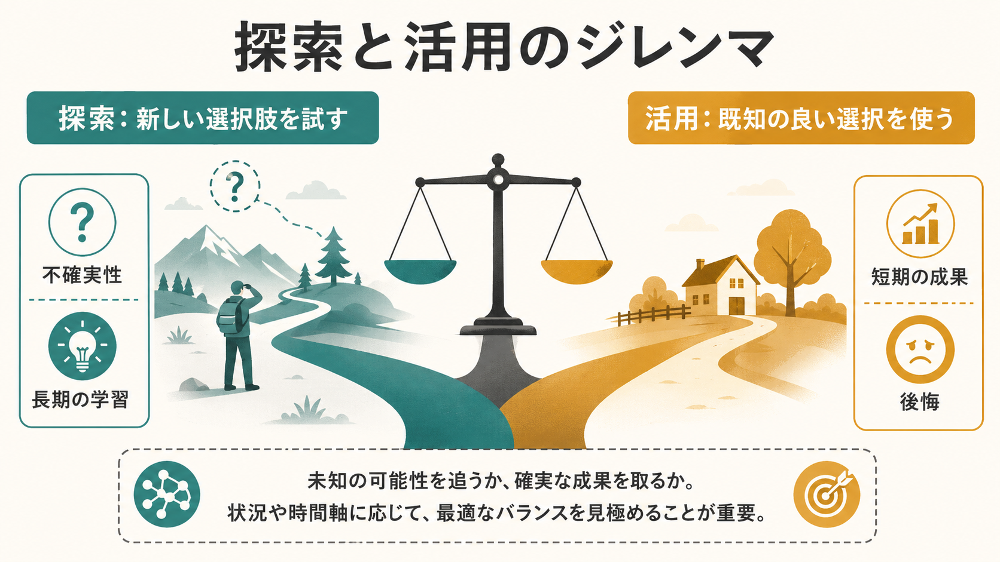
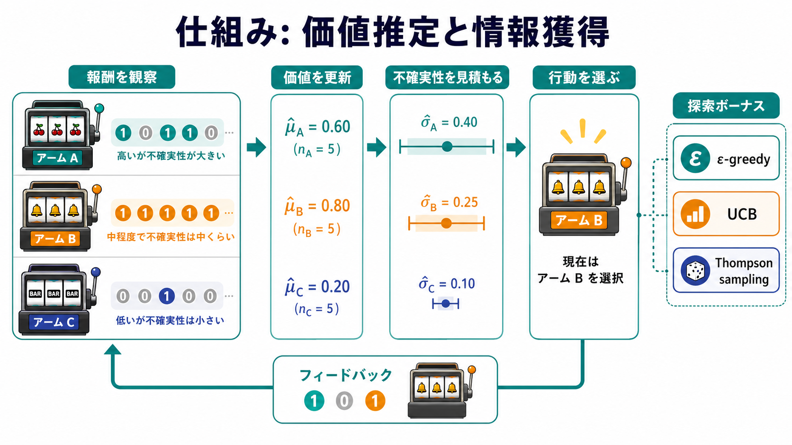
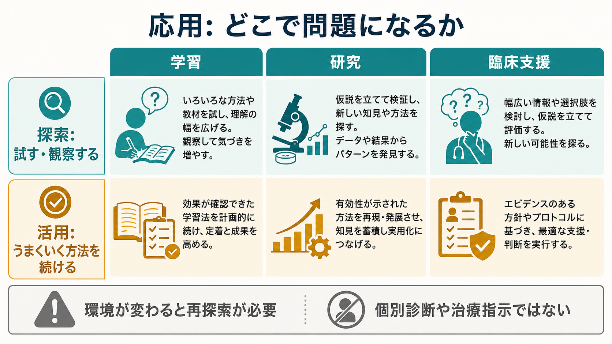

# 探索と活用のジレンマとは何か

## 要点

- 探索とは、まだよく分からない選択肢を試して情報を得ることである。活用とは、すでに良いと分かっている選択肢を使って報酬や成果を得ることである[1][2]。
- 探索は長期的な学習に役立つが、短期的には損をすることがある。活用は短期的な成果を安定させるが、環境が変わると古い成功パターンに固着しやすい[1][5]。
- 強化学習では、多腕バンディット問題がこのジレンマの基本例になる。エージェントは「いま最も良さそうな腕を引くか」「不確実な腕を試すか」を逐次的に決める[2][3]。
- 人間の探索には、ランダムに揺らして試す探索と、不確実性の高い選択肢を意図的に選ぶ探索があると考えられている[7][8]。
- 臨床・教育・研究への応用では、この概念を個別診断や治療指示に直接変換せず、行動選択と学習環境を理解するための教育・研究上の枠組みとして扱う。

## この記事で答える問い

1. 探索と活用は、それぞれ何を意味するのか。
2. なぜ「探索も活用も必要」なのに、両立が難しいのか。
3. 多腕バンディット、UCB、Thompson sampling は、この問題をどう表現するのか。
4. 人間の意思決定、研究、臨床支援を考えるとき、どこまで使える概念なのか。

## まず結論

探索と活用のジレンマは、「まだ知らない可能性を調べるか、すでに良いと分かっている選択を続けるか」という、学習する主体に必ず生じる配分問題である。探索をしなければ、より良い選択肢を見つけにくい。活用をしなければ、せっかく得た知識を成果に変えにくい。

このジレンマが難しいのは、正解が選択前には分からないからである。新しい選択肢を試すと情報は増えるが、その試行は短期的には失敗かもしれない。反対に、既知の良い選択を続けると今の成果は安定するが、環境変化や隠れたより良い選択肢を見落とすかもしれない。したがって、重要なのは「探索か活用か」の二択ではなく、時間軸、環境の変化、不確実性、失敗コストに応じて比率を変えることである[1][5]。

## 背景

この問題は、機械学習だけでなく、組織学習、認知科学、神経科学、教育、臨床支援、日常の意思決定にまたがる。March は組織学習の文脈で、exploration を新しい可能性の探索、exploitation を既存知識の利用として整理した。彼の重要な指摘は、活用は短期的に成果を出しやすいため強化されやすいが、それが長期的には探索不足を招きうるという点である[1]。

強化学習では、エージェントが環境と相互作用しながら累積報酬を最大化しようとする。このとき、まだ試していない行動の価値は分からない。したがって、[[オペラント条件づけとは何か]]のように「行動の結果から学ぶ」枠組みを数理的に拡張すると、行動価値の推定と情報獲得の配分問題が前面に出てくる[2]。

認知科学では、この問題は[[選択的注意はどのように働くのか|注意]]、[[認知負荷とは何か|認知負荷]]、意思決定、好奇心、学習方略と接続する。人間は完全な最適化計算をしているわけではないが、不確実な選択肢へ意図的に向かう場合もあれば、選択にノイズを入れるように偶然的に試す場合もある[7][8]。

## 基本概念

### 探索

探索は、未知または不確実な選択肢を試して情報を得ることである。たとえば、いつもの参考書ではなく新しい教材を試す、既存の実験手法ではなく別の測定法を試す、まだ効果がよく分からない学習方略を小さく試す、といった行動が探索にあたる。

探索の利点は、将来の選択を改善する情報を得られることである。欠点は、その試行が短期的には成果を下げる可能性があることである。探索は「気まぐれ」ではなく、環境についての不確実性を減らすための投資として理解できる[2][5]。

### 活用

活用は、これまでの経験から高い価値が見込まれる選択肢を使うことである。いつものよく効く勉強法を続ける、成功率の高い研究デザインを使う、効果が確認された支援方針を丁寧に実行する、といった行動である。

活用の利点は、短期的な成果を得やすいことである。欠点は、環境が変わったときや、より良い選択肢が未発見のときに、古い選択へ過剰に固着しやすいことである[1]。

### 後悔

バンディット問題では、最適な選択を知っていれば得られた報酬と、実際に得た報酬との差を「後悔」と呼ぶ。探索と活用の良い方略は、短期的な後悔を完全になくすものではなく、長期的な累積後悔を小さくする方略として評価される[3]。

## 仕組み

### 多腕バンディットで考える

最も単純な例は、多腕バンディット問題である。複数のスロットマシンの腕があり、それぞれ報酬確率が異なるが、最初はどれが良いか分からない。プレイヤーは各試行で1つの腕を選び、報酬を観察し、次の選択へ反映する[3]。

この課題では、価値推定と不確実性推定が分かれる。何度も試して平均報酬が高い腕は、活用したくなる。一方、まだ試行回数が少ない腕は、平均報酬の推定が不確かであり、実は最良かもしれない。この「平均の高さ」と「不確実性の大きさ」の両方をどう扱うかが、探索方略の中心になる。

### 代表的な方略

| 方略 | 直感 | 長所 | 注意点 |
|---|---|---|---|
| ε-greedy | ふだんは最良推定を選び、一定確率でランダムに試す | 単純で実装しやすい | 不確実性の大きい選択肢を狙って試すわけではない |
| UCB | 推定価値に「不確実性ボーナス」を加える | 試行不足の選択肢を体系的に試せる | 前提やボーナス設計に依存する |
| Thompson sampling | 報酬確率への信念分布からサンプルして選ぶ | 不確実性を確率的に自然に反映しやすい | 事前分布やモデル化の妥当性が重要になる |

UCB は、既知の平均報酬だけでなく「まだよく分からない」こと自体に探索ボーナスを与える。Auer らの有限時間解析は、多腕バンディットにおける後悔の制御を考える代表的な理論的基盤である[3]。Thompson sampling は、各選択肢が最良である確率に応じて選ばれやすくなるため、価値推定と不確実性を一つの確率的方略として扱える[4]。

### 人間の探索は一種類ではない

人間の探索は、単なるランダム性だけでは説明しにくい。Wilson らは、人間が探索と活用のジレンマを解くとき、選択のばらつきによるランダム探索と、不確実性の高い選択肢へ向かう方向づけられた探索を使い分けることを示した[7]。Schulz と Gershman のレビューも、人間の探索にはランダム探索、不確実性指向の探索、構造知識を使った探索など複数のアルゴリズム的成分があると整理している[8]。

神経科学的には、Daw らの fMRI 研究が、探索的選択に前頭極皮質などの関与を示した[6]。また、Cohen らは、報酬、不確実性、神経調節系、前頭前野の制御を含む広い枠組みから探索と活用の調整を論じている[5]。ただし、これらは「探索中枢」が一つあるという意味ではない。課題設計、時間スケール、報酬構造、注意、動機づけによって関与する過程は変わる。

## 図解

図1は、探索と活用の基本的な対立を示している。探索は不確実性と長期の学習に向かい、活用は短期の成果と既知の選択に向かう。どちらかが常に正しいのではなく、状況と時間軸に応じて重みづけが変わる。

図2は、多腕バンディットでの基本メカニズムである。報酬を観察し、各腕の価値を更新し、不確実性を見積もり、次の行動を選ぶ。探索ボーナスを入れる方略では、単に平均報酬が高い選択肢だけでなく、まだ十分に試していない選択肢も選ばれやすくなる。

図3は、応用場面の整理である。学習では新しい教材や方略を試すこと、研究では仮説や測定法を広げること、臨床支援では幅広い情報や選択肢を検討することが探索にあたる。一方で、効果が確認された方法を丁寧に継続することは活用である。

## 臨床・研究との接続

研究では、探索は新しい仮説、測定法、解析方略を生む。一方で、活用は確立した方法を使って再現性を高め、知見を積み上げる。探索的研究と確認的研究を区別することは、探索と活用の役割分担を明確にする実践でもある。探索だけでは仮説が増えすぎ、活用だけでは新しい可能性が見えにくくなる。

教育や学習支援では、学習者が新しい方略を試す時間と、うまくいく方略を反復して定着させる時間の両方が必要になる。初心者には探索の自由度が高すぎると[[認知負荷とは何か|認知負荷]]が増えやすい。逆に、熟達してきた学習者には、少し不確実な課題を試すことが理解を広げる場合がある。

臨床・精神医学に近い文脈では、探索と活用は、症状の個別診断や治療選択を直接決める道具ではない。むしろ、行動の固着、回避、習慣化、新しい対処方略の試行、支援計画の見直しを考えるための研究上の補助線である。たとえば、既知の安全行動を続けることが短期的な不安低減には役立っても、長期的には新しい学習機会を狭める場合がある。ただし、このような解釈は個別ケースの評価や専門職との相談を置き換えるものではない。

## よくある誤解

### 誤解1: 探索は常に良い

探索は情報を増やすが、常に得ではない。時間が短い課題、失敗コストが高い状況、すでに十分な情報がある状況では、活用の比率を高める方が合理的な場合がある[2][3]。

### 誤解2: 活用は保守的で悪い

活用は、学習で得た知識を成果に変える過程である。問題になるのは活用そのものではなく、環境が変わったのに古い方略を続けること、または未探索の可能性が大きいのに試さないことである[1]。

### 誤解3: ランダムに選べば探索になる

ランダム選択は探索の一形態だが、十分ではない。不確実性の大きい選択肢を狙って試す方向づけられた探索や、選択肢間の構造を利用する探索もある[7][8]。

### 誤解4: 脳には探索専用の単一部位がある

探索には前頭極皮質、前頭前野、報酬系、神経調節系などが関与しうるが、単一部位に還元するのは不適切である[5][6]。課題の種類、報酬構造、時間軸、不確実性の種類によって、関連する神経過程は変わる。

## 関連ノート

既存ノート:

- [[オペラント条件づけとは何か]]
- [[古典的条件づけとは何か]]
- [[選択的注意はどのように働くのか]]
- [[認知負荷とは何か]]
- [[ドパミンは報酬だけの物質なのか]]

今後の作成候補:

- 強化学習とは何か
- 多腕バンディット問題とは何か
- 報酬予測誤差とは何か
- 意思決定とは何か
- 好奇心とは何か
- Thompson sampling とは何か

MOC 更新候補:

- `content/00_MOC/MOC｜認知科学・心理学.md`
- `content/00_MOC/MOC｜データ解析・機械学習.md`
- `content/00_MOC/MOC｜数理モデル・計算論.md`

このジョブでは並列編集競合を避けるため、MOC 本体は更新しない。

## 理解チェック

1. 探索と活用を、それぞれ日常の学習例で説明できるか。
2. 多腕バンディット問題では、なぜ「平均報酬が高い腕」だけを選ぶと問題が起こりうるか。
3. ε-greedy、UCB、Thompson sampling は、不確実性をどのように扱うか。
4. ランダム探索と方向づけられた探索は何が違うか。
5. 臨床・教育にこの概念を使うとき、個別診断や治療指示と混同してはいけない理由は何か。

## 参考文献

[1] March, J. G. (1991). Exploration and exploitation in organizational learning. *Organization Science, 2*(1), 71-87. https://doi.org/10.1287/orsc.2.1.71

[2] Sutton, R. S., & Barto, A. G. (2018). *Reinforcement Learning: An Introduction* (2nd ed.). MIT Press. http://incompleteideas.net/book/the-book-2nd.html

[3] Auer, P., Cesa-Bianchi, N., & Fischer, P. (2002). Finite-time analysis of the multiarmed bandit problem. *Machine Learning, 47*, 235-256. https://doi.org/10.1023/A:1013689704352

[4] Russo, D. J., Van Roy, B., Kazerouni, A., Osband, I., & Wen, Z. (2018). *A Tutorial on Thompson Sampling*. Foundations and Trends in Machine Learning. https://doi.org/10.1561/9781680834710

[5] Cohen, J. D., McClure, S. M., & Yu, A. J. (2007). Should I stay or should I go? How the human brain manages the trade-off between exploitation and exploration. *Philosophical Transactions of the Royal Society B, 362*(1481), 933-942. https://doi.org/10.1098/rstb.2007.2098

[6] Daw, N. D., O'Doherty, J. P., Dayan, P., Seymour, B., & Dolan, R. J. (2006). Cortical substrates for exploratory decisions in humans. *Nature, 441*, 876-879. https://doi.org/10.1038/nature04766

[7] Wilson, R. C., Geana, A., White, J. M., Ludvig, E. A., & Cohen, J. D. (2014). Humans use directed and random exploration to solve the explore-exploit dilemma. *Journal of Experimental Psychology: General, 143*(6), 2074-2081. https://doi.org/10.1037/a0038199

[8] Schulz, E., & Gershman, S. J. (2019). The algorithmic architecture of exploration in the human brain. *Current Opinion in Neurobiology, 55*, 7-14. https://doi.org/10.1016/j.conb.2018.11.003

## 未解決問題

- 人間がどの条件でランダム探索、方向づけられた探索、構造知識を使う探索を切り替えるのかは、まだ完全には分かっていない。
- 神経調節系、前頭前野、報酬系が、時間スケールの異なる探索と活用をどのように分担するのかは議論が続いている。
- 教育・臨床支援の現場で、探索の自由度と活用の安定性をどのように設計すべきかは、対象者、課題、環境によって変わる。

## 更新ログ

- 2026-04-27: 初稿作成。探索と活用の定義、多腕バンディット、代表的方略、人間の探索、研究・臨床との接続、画像3枚、主要参考文献を追加。
