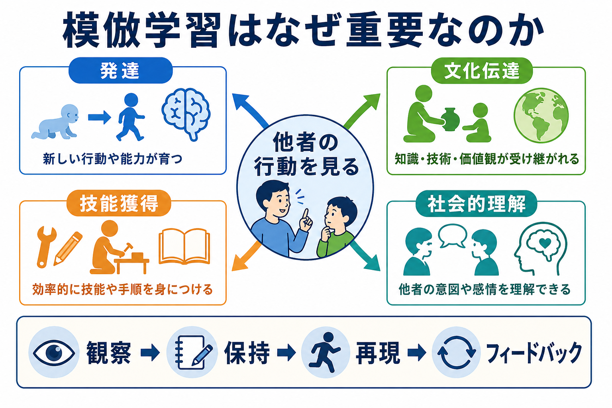
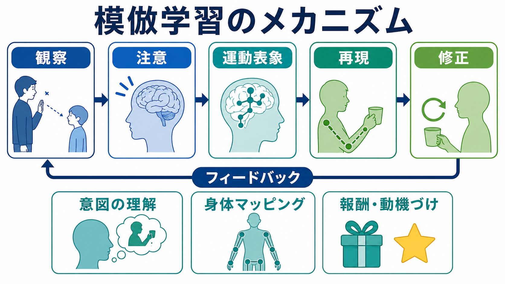
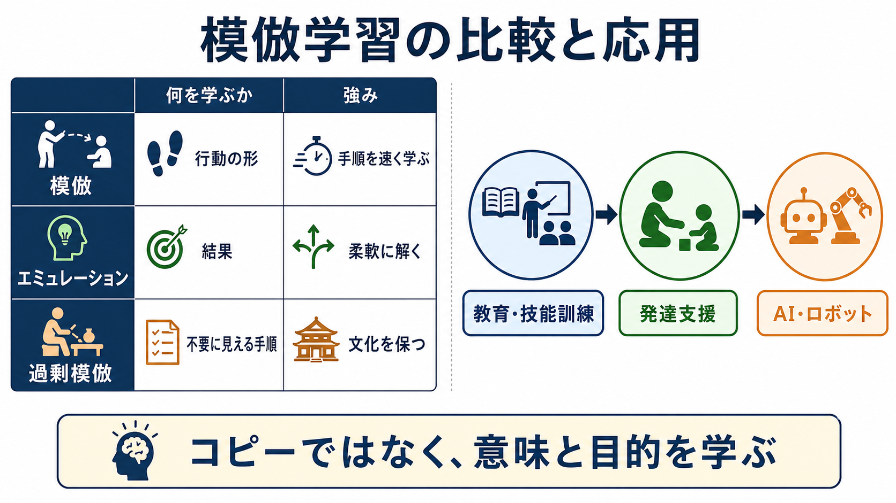

# 模倣学習はなぜ重要なのか

## 要点

- 模倣学習とは、他者の行動を観察し、その行動の形、目的、結果、文脈を手がかりに自分の行動を形成する学習である。
- 重要なのは、単なるコピーではなく、他者の行動を自分の身体・目標・状況へ変換する点にある。
- 発達では、模倣は言語、道具使用、共同注意、社会的ルールの獲得を支える。
- 文化伝達では、個人が試行錯誤だけでは到達しにくい手順、慣習、技能を世代内・世代間で受け渡す。
- 技能獲得では、熟達者の動作を見ることで、何に注意し、どの順序で実行し、どこを修正すべきかを学びやすくなる。
- 臨床・教育・AI研究では、模倣の困難さや過剰さを「診断名そのもの」ではなく、支援設計や学習環境を考える視点として扱う必要がある。

## この記事で答える問い

1. 模倣学習は、試行錯誤や説明による学習と何が違うのか。
2. 模倣は、発達や社会的理解にどのように関わるのか。
3. 文化や技能は、なぜ模倣によって伝わりやすくなるのか。
4. 模倣学習を研究・臨床・教育・AIへ接続するとき、どこに注意すべきか。

## まず結論

模倣学習が重要なのは、他者の経験を自分の学習資源に変えられるからである。すべてを自分で試行錯誤する必要があれば、危険で時間がかかる。すべてを言語で説明する必要があれば、幼児、初心者、暗黙的技能の学習には限界がある。模倣はこの中間にあり、「見ればわかる」情報を、身体化された行動へ変換する。

ただし、模倣は機械的コピーではない。他者の動作を見て、注意を向け、目的を推測し、自分の身体で再現し、結果を見て修正する循環である。この循環は、[[自己と他者はどのように区別されるのか]]、[[心の理論とは何か]]、[[運動ネットワークは随意運動をどう生み出すのか]]、[[神経可塑性は発達と学習をどう支えるのか]]と接続して理解できる。

## 背景

模倣学習の古典的出発点の一つは、Banduraらの観察学習研究である。子どもは、他者が攻撃的行動を示す場面を見るだけで、類似した行動を後で再現しやすくなることが示された[1]。この研究は、学習が直接報酬や罰だけで成立するのではなく、他者の行動を観察することでも起こることを明確にした。

発達研究では、新生児模倣をめぐる議論が長く続いてきた。MeltzoffとMooreは、新生児が成人の顔や手の動きを模倣する可能性を報告し、模倣がかなり早期から自己と他者の対応づけに関わるという見方を促した[2]。ただし、この領域には再現性や解釈をめぐる議論もあるため、「新生児がすべての模倣能力を備えている」と読むべきではない。重要なのは、発達の早期から他者の行動が学習環境の中心にあるという点である。

文化伝達の観点では、Tomaselloらが、ヒトの文化学習には、他者を意図や目標を持つ存在として理解する能力が深く関わると論じた[3]。単に結果を見て同じ結果に到達するだけなら、個体学習やエミュレーションでも可能である。しかし、手順、道具の使い方、儀礼、社会規範のように、「なぜこの順序で行うのか」まで含む行動は、模倣によって伝わりやすい。

## 基本概念

### 模倣

模倣とは、他者の行動の形や順序を、自分の身体で再現する学習である。例として、箸の持ち方、楽器の運指、スポーツのフォーム、面接技法、手洗い手順、表情や挨拶の仕方がある。模倣では、見ることと動くことが結びつくため、[[手続き記憶とは何か]]や[[アフォーダンスとは何か]]とも関係する。

### 観察学習

観察学習は、他者の行動と結果を見て、自分の行動傾向を変える広い概念である。模倣は観察学習の一部だが、観察学習は必ずしも同じ動作の再現を含まない。たとえば、誰かが危険な選択で失敗するのを見て、自分はその選択を避ける場合、行動の形をコピーしていなくても観察学習は起きている。

### エミュレーション

エミュレーションは、他者の行動の形よりも、結果や環境変化を学ぶ過程である。たとえば、熟達者が箱を開けて報酬を得るのを見て、自分は別の手順で箱を開ける場合である。これは柔軟だが、細かな技能や文化的手順の伝達には不足することがある。

### 過剰模倣

過剰模倣とは、目的達成には不要に見える手順まで子どもが再現する現象である。Lyonsらは、子どもが因果的に不要な動作まで忠実に再現しやすいことを示し、そこには「大人が示した手順には隠れた意味があるかもしれない」という解釈が関わる可能性を論じた[7]。過剰模倣は非合理なコピーに見える一方、文化的慣習や社会的ルールを保つ仕組みとしても理解できる。

## 仕組み

模倣学習は、おおまかに「観察、注意、運動表象、再現、修正」の循環として整理できる。

1. 観察: 他者の行動、表情、視線、道具、結果を見る。
2. 注意: どの部分が重要かを選ぶ。初心者は全体を眺めがちだが、熟達者は要点を見る。
3. 運動表象: 見た行動を、自分が実行可能な身体運動へ変換する。
4. 再現: 実際に動いてみる。ここでタイミング、力加減、順序のずれが表面化する。
5. 修正: 結果とフィードバックを使い、次の試行を調整する。

神経科学では、他者の行動を見ることと自分が行動することの対応づけに、ミラーニューロン系を含む前頭・頭頂・運動関連ネットワークが関わると議論されてきた[4]。ただし、ミラーニューロン系だけで模倣、意図理解、共感をすべて説明できるわけではない。模倣には、視覚処理、運動計画、身体表象、報酬・動機づけ、実行制御、記憶が広く関わる。

Heyesは、文化学習の能力そのものも、文化的環境の中で形成されると論じた[5]。つまり、模倣は生得的な単一モジュールというより、見ること、動くこと、他者から修正されること、共同活動に参加することを通じて発達する複合的技能と考えるほうがよい。

## 図解

この記事の図は、次のように読むと整理しやすい。

| 図 | 主題 | 読み方 |
|---|---|---|
| 図1 | 模倣学習の全体像 | 他者の行動を見ることが、発達、文化伝達、技能獲得、社会的理解へ広がる。 |
| 図2 | メカニズム | 観察した行動は、注意、運動表象、再現、修正を通じて自分の行動になる。 |
| 図3 | 比較と応用 | 模倣、エミュレーション、過剰模倣を区別し、教育・発達支援・AI研究へ接続する。 |

## 臨床・研究との接続

### 発達支援

発達支援では、模倣の有無だけを見るのではなく、どの段階でつまずいているかを分けて考える必要がある。相手を見ていないのか、見ているが要点に注意が向かないのか、目的は理解しているが身体運動へ変換しにくいのか、実行後のフィードバックを使いにくいのかで、支援は変わる。これは[[自己意識はどのように発達するのか]]や[[心の理論とは何か]]の問題とも重なる。

医療・心理支援では、模倣の困難さを個別診断や治療指示として断定せず、教育・研究目的で、コミュニケーション、共同注意、感覚運動、動機づけ、環境調整を分けて記述することが重要である。

### 教育と技能訓練

模倣は、教育で「見本を見せる」ことの認知科学的な基盤である。ただし、見本を見せれば自動的に学べるわけではない。学習者が見るべき箇所を知らなければ、要点ではなく目立つ動きだけをコピーする。したがって、熟達者の実演、短い言語説明、分割練習、即時フィードバックを組み合わせると、模倣は技能獲得へつながりやすい。

### 文化伝達

Whitenらは、模倣、エミュレーション、過剰模倣の区別を通じて、ヒト文化の伝達範囲を検討している[6]。文化は、個人の発明だけで維持されるのではない。多くの人が手順を見て、真似し、修正し、次の人へ渡すことで、道具、言語、儀礼、職業技能が蓄積される。

### AI・ロボット

AIやロボット工学では、模倣学習は「learning from demonstration」または「apprenticeship learning」として扱われる。Argallらのレビューは、ロボットが人間のデモンストレーションから方策や動作を学ぶ研究領域を整理している[8]。ここでの関心は、人間発達の説明だけではなく、少ない試行で安全に行動を学ぶ方法にある。これは[[転移学習とは何か]]のような機械学習上の問題とも接続しうる。

## よくある誤解

### 誤解1: 模倣は創造性の反対である

模倣は創造性を妨げるだけではない。初心者は、まず有効な型を借りることで探索空間を狭められる。そのうえで、目的や制約を理解すれば、型を変形して新しい解に進める。文化的創造は、しばしば既存の模倣可能な手順の組み替えから生じる。

### 誤解2: 模倣は低次のコピーで、理解は不要である

単純な模倣には表面的コピーも含まれる。しかし、重要な模倣学習では、他者が何を達成しようとしているのか、どの動きが因果的に重要なのか、どこが社会的慣習なのかを推測する。したがって模倣は、[[メタ認知とは何か]]や[[ワーキングメモリとは何か]]のような高次認知とも関係する。

### 誤解3: ミラーニューロンがあれば模倣は説明できる

ミラーニューロン系は重要な候補機構だが、それだけで模倣学習全体は説明できない。模倣には、注意、記憶、身体所有感、自己他者区別、報酬、実行制御、社会的文脈が関わる。単一の脳領域や単一メカニズムへ縮約すると、発達支援や教育への応用を誤りやすい。

### 誤解4: 過剰模倣は非合理な失敗である

過剰模倣は、短期的には不要な手順のコピーに見える。しかし、子どもにとっては「大人が示した行為には、まだ理解できない因果的・社会的意味があるかもしれない」と判断することが合理的な場合もある。文化的手順を保つには、時に厳密な再現が役立つ。

## 関連ノート

- [[自己と他者はどのように区別されるのか]]
- [[心の理論とは何か]]
- [[自己意識はどのように発達するのか]]
- [[運動ネットワークは随意運動をどう生み出すのか]]
- [[神経可塑性は発達と学習をどう支えるのか]]
- [[手続き記憶とは何か]]
- [[アフォーダンスとは何か]]
- [[メタ認知とは何か]]
- [[ワーキングメモリとは何か]]
- [[転移学習とは何か]]

## MOC更新候補

- `content/00_MOC/MOC｜認知科学・心理学.md` に、学習・行動・動機づけ領域の記事として追加候補。
- 並列ジョブとの競合を避けるため、このタスクでは MOC 本体は更新しない。

## 理解チェック

1. 模倣学習と観察学習は、どのように重なり、どこが違うか。
2. 模倣学習で「観察」と「再現」の間に、注意や運動表象が必要になるのはなぜか。
3. 過剰模倣は、どのような意味で文化伝達に役立つ可能性があるか。
4. 発達支援で、模倣の困難さを単に「できる・できない」で見ないほうがよい理由は何か。

## 未解決問題

- 新生児模倣の範囲と再現性を、どの課題・測定法で最も妥当に評価できるか。
- 模倣、エミュレーション、過剰模倣の境界を、発達段階や文化差を含めてどこまで一般化できるか。
- ミラーニューロン系、報酬系、実行制御、社会的認知の相互作用を、個人差や発達支援にどう結びつけるか。
- AIの模倣学習で得られた知見を、人間の教育や臨床支援へどこまで戻して考えられるか。

## 参考文献

[1] Bandura, A., Ross, D., & Ross, S. A. (1961). Transmission of aggression through imitation of aggressive models. *Journal of Abnormal and Social Psychology*, 63(3), 575-582. https://doi.org/10.1037/h0045925

[2] Meltzoff, A. N., & Moore, M. K. (1977). Imitation of facial and manual gestures by human neonates. *Science*, 198(4312), 75-78. https://doi.org/10.1126/science.198.4312.75

[3] Tomasello, M., Kruger, A. C., & Ratner, H. H. (1993). Cultural learning. *Behavioral and Brain Sciences*, 16(3), 495-552. https://doi.org/10.1017/S0140525X0003123X

[4] Rizzolatti, G., & Craighero, L. (2004). The mirror-neuron system. *Annual Review of Neuroscience*, 27, 169-192. https://doi.org/10.1146/annurev.neuro.27.070203.144230

[5] Heyes, C. (2012). Grist and mills: On the cultural origins of cultural learning. *Trends in Cognitive Sciences*, 16(7), 369-377. https://doi.org/10.1016/j.tics.2012.06.005

[6] Whiten, A., McGuigan, N., Marshall-Pescini, S., & Hopper, L. M. (2009). Emulation, imitation, over-imitation and the scope of culture for child and chimpanzee. *Philosophical Transactions of the Royal Society B*, 364(1528), 2417-2428. https://doi.org/10.1098/rstb.2009.0069

[7] Lyons, D. E., Young, A. G., & Keil, F. C. (2007). The hidden structure of overimitation. *Proceedings of the National Academy of Sciences*, 104(50), 19751-19756. https://doi.org/10.1073/pnas.0704452104

[8] Argall, B. D., Chernova, S., Veloso, M., & Browning, B. (2009). A survey of robot learning from demonstration. *Robotics and Autonomous Systems*, 57(5), 469-483. https://doi.org/10.1016/j.robot.2008.10.024

