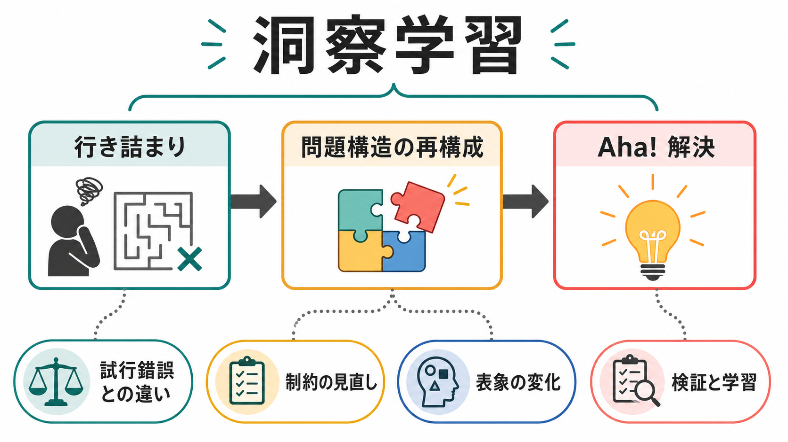
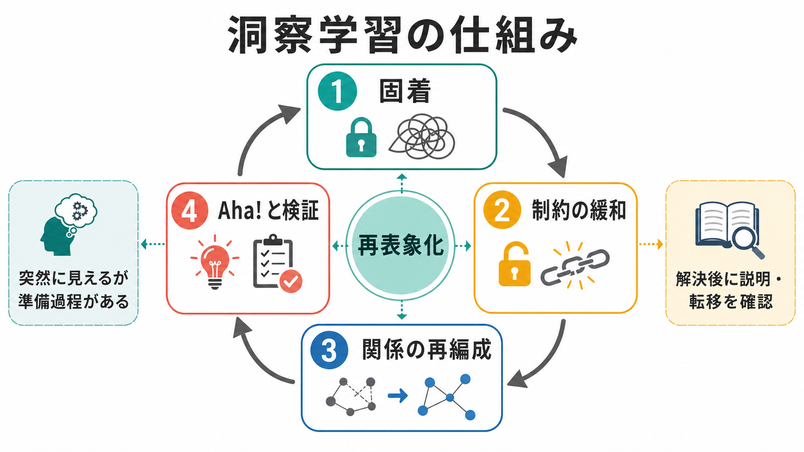
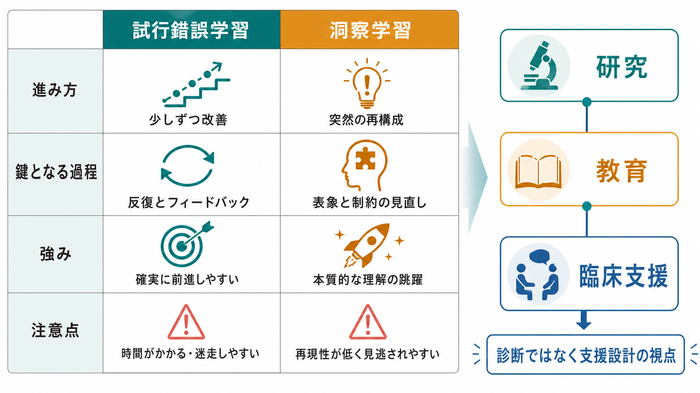

# 洞察学習とは何か

## 要点

- 洞察学習とは、反応を少しずつ強めるだけでなく、問題の見え方や制約の置き方が組み替わることで、突然に解決が生じるように見える学習である[1][7]。
- 古典的には、Kohler のチンパンジー研究が、道具や環境の関係を把握して解決へ至る行動を「洞察」として強調した[1]。
- Thorndike の試行錯誤学習は、成功反応が経験を通じて選択される過程を重視する。洞察学習はこれと対立するだけでなく、表象の再構成がいつ必要になるかを説明する補助線になる[2][7]。
- 洞察には「Aha!」という主観的体験が伴うことが多いが、Aha体験と実際の再構成は完全には同一ではない[4][7]。
- 教育・研究・臨床支援では、洞察を「才能」や「ひらめき待ち」として扱うのではなく、固着をゆるめ、制約を見直し、別の表象を作れる環境を設計することが重要である[5][6]。

## この記事で答える問い

1. 洞察学習は、試行錯誤学習と何が違うのか。
2. 「突然わかった」は、心理学的にはどのような過程として説明できるのか。
3. 固着、制約緩和、再表象化、Aha体験はどう関係するのか。
4. 教育・研究・臨床支援では、洞察学習をどう使うとよいのか。

## まず結論

洞察学習は、答えが偶然降ってくる現象ではない。解き手が問題をどう表象しているか、どの制約を当然だと思っているか、どの道具や関係に注意を向けているかが変わることで、探索できる解の空間そのものが変化する。その結果、外から見ると「急に解けた」ように見える。

この意味で、洞察学習は [[問題解決とは何か|問題解決]] の特殊な一部である。通常の問題解決では、既に見えている問題空間の中を探索することが多い。洞察問題では、探索の前提になっている問題空間を作り直すことが重要になる。そこには [[注意とは何か|注意]]、[[ワーキングメモリとは何か|ワーキングメモリ]]、[[実行機能とは何か|実行機能]]、[[推論とは何か|推論]]、既有知識がまとめて関わる。

## 背景

洞察学習は、ゲシュタルト心理学と動物学習研究の交差点から発展した。Kohler は、チンパンジーが箱や棒を単に無作為に動かすだけでなく、目標、障害物、道具の関係を一つの構造として把握するように見える行動を記述した[1]。これは、学習を刺激と反応の連合だけで説明する立場への重要な問題提起になった。

一方、Thorndike はネコの問題箱実験などから、動物が試行錯誤を通じて有効な反応を選択していく過程を示した[2]。この系譜では、成功と失敗のフィードバックが反応選択を変える点が重視される。現在の視点では、試行錯誤と洞察は単純な二分法ではない。多くの問題解決では、試行、失敗、部分的な手がかり、表象の見直しが混在する。

人間の問題解決研究では、Duncker の機能的固着研究が重要である。対象をいつもの用途でしか見られないと、別の使い方が必要な解決に到達しにくくなる[3]。洞察学習は、このような固着がゆるみ、問題の要素同士の関係が再編成される場面で目立つ。

## 基本概念

### 洞察学習

洞察学習とは、反復による少しずつの改善だけでなく、問題の構造を新しく見直すことで解決が生じる学習である。ここでいう「構造」とは、目標、制約、利用可能な道具、手順、関係、評価基準のまとまりである。

たとえば、ある道具を「固定するもの」とだけ見ていると解けない問題が、その道具を「支える台」と見直した瞬間に解けることがある。このとき変わったのは筋力や記憶量だけではなく、問題の表象である。

### 試行錯誤学習

試行錯誤学習では、行動を試し、その結果から次の行動選択が変わる。これは学習の基礎として重要であり、洞察学習と競合する概念ではない。ただし、試行錯誤だけでは、そもそも候補として思いついていない行動や、誤った制約の外にある解を見つけにくい。

### 固着

固着とは、過去の経験、慣れた使い方、最初の解釈に縛られ、別の見方が取りにくくなる状態である[3][8]。固着は必ず悪いわけではない。日常では、慣れた解釈が素早い判断を助ける。しかし洞察問題では、慣れた解釈が解を隠すことがある。

### Aha体験

Aha体験とは、解決が突然で、明瞭で、確信を伴って現れる主観的経験である。Metcalfe と Wiebe は、非洞察問題では解に近づく感覚が徐々に高まりやすい一方、洞察問題では解決直前まで「近づいている感じ」が乏しく、急に解が出る傾向を示した[4]。

ただし、近年のレビューでは、Aha体験と再構成は重なるが同一ではないと整理されている。再構成があっても強いAha体験がない場合や、Aha体験があっても解が誤っている場合がある[7]。

## 仕組み

洞察学習の中心は、再表象化である。再表象化とは、問題を構成する要素や制約を、以前とは違うまとまりとして捉え直すことである[6][7]。

### 1. 行き詰まり

洞察は、しばしば行き詰まりから始まる。解き手は一見もっともらしい方略を試すが、うまくいかない。それでも同じ見方を続けると、探索は狭い範囲を回り続ける。

この段階では、問題が難しいというより、問題の読み方が偏っていることがある。機能的固着、不要な制約、誤った前提、過去経験への過剰な依存が、探索範囲を狭める。

### 2. 制約の緩和

次に重要なのは、暗黙の制約をゆるめることである。たとえば「この部品は動かせない」「この道具はこの用途にしか使えない」「線はこの枠の中に収めるべきだ」といった前提が、明示されないまま探索を制限していることがある。

制約を緩和すると、問題空間そのものが変わる。これは単に候補を増やすことではなく、何を候補とみなすかを変える操作である。

### 3. 関係の再編成

洞察では、個々の要素よりも、要素同士の関係が変わる。道具と目標、障害物と経路、単語と意味、図形と余白の関係が見直されると、以前は見えなかった解が現れる。

Bowden らは、洞察研究を古典的な少数課題だけに頼らず、短い洞察課題、主観報告、行動指標、神経科学的方法を組み合わせる必要を論じた[5]。これは、洞察を神秘化せず、構成要素に分けて調べる方向を示している。

### 4. Ahaと検証

洞察解は、主観的には「急にわかった」と感じられやすい。しかし、心理学的には、その前に固着、探索、手がかり処理、注意の向きの変化がある。Kounios と Beeman は、洞察には右半球の広い意味処理や内向き注意などが関わる可能性を整理している[6]。

重要なのは、Aha体験をそのまま正解とみなさないことである。解が出た後には、条件を満たしているか、別の場面へ転移できるか、説明可能かを確認する必要がある。

## 図解

図1は、洞察学習を「行き詰まり」「問題構造の再構成」「Aha! 解決」の流れとして示している。試行錯誤との違いは、反復の量だけでなく、問題の見え方そのものが変わる点にある。

図2は、中心メカニズムを示している。固着が生じ、制約が緩和され、関係が再編成されると、再表象化を通じて解が急に見えることがある。

図3は、試行錯誤学習と洞察学習の比較である。教育や臨床支援では、洞察を診断名や能力ラベルにせず、支援設計の視点として扱う。

## 臨床・研究との接続

研究では、洞察学習は創造性、問題解決、意味処理、注意制御、神経活動の時間経過と接続する。神経科学的には、単一の「洞察中枢」があるというより、意味ネットワーク、注意ネットワーク、前頭前野を含む制御系が状況に応じて関わると考えるほうが妥当である[6]。

教育では、洞察を待つだけでは不十分である。学習者が固着している場合、追加の反復よりも、問題の条件を言い換える、図や具体物で関係を変える、誤った前提を明示する、類似問題と対比する、といった支援が有効なことがある。

臨床・支援場面では、洞察学習を個別診断や治療指示として使うべきではない。むしろ、本人が困っている課題について、目標、制約、使える資源、評価基準を一緒に整理し直すための枠組みとして使うのが安全である。これは、問題解決支援、認知的柔軟性、環境調整の話題とつながる。

## よくある誤解

### 誤解1: 洞察は天才だけに起こる

洞察は特別な才能だけでなく、問題表象、手がかり、制約、既有知識、注意の向きに左右される。環境や問い方を変えることで、洞察が起こりやすくなる場合がある。

### 誤解2: 洞察は試行錯誤と反対である

実際には、試行錯誤の失敗が固着を明らかにし、再表象化のきっかけになることがある。違いは、学習が少しずつの反応選択だけで説明できるか、問題の見方の変化が必要かにある。

### 誤解3: Ahaと感じたら正しい

Aha体験は強い確信を伴うが、正答保証ではない。研究上も、Aha体験と再構成、正答率は分けて測る必要がある[7]。

### 誤解4: ヒントを出すと洞察ではなくなる

ヒントは、答えを直接教えるものだけではない。注意の向きを変える、不要な制約を外す、別の表象を促すヒントは、洞察過程を支援することがある。

## 関連ノート

- [[問題解決とは何か]]
- [[推論とは何か]]
- [[注意とは何か]]
- [[ワーキングメモリとは何か]]
- [[実行機能とは何か]]
- [[認知負荷とは何か]]
- [[熟達者の認知は初心者と何が違うのか]]

MOC 更新候補: `content/00_MOC/MOC｜認知科学・心理学.md` に、学習・問題解決・創造性の関連ノートとして追加する。

## 理解チェック

1. 洞察学習を「表象」「制約」「再構成」という語を使って説明できるか。
2. 試行錯誤学習と洞察学習の違いを、どちらか一方を否定せずに説明できるか。
3. 機能的固着が洞察を妨げる理由を説明できるか。
4. Aha体験と正答、Aha体験と再構成が完全には同じでない理由を説明できるか。
5. 教育や支援で、反復練習より再表象化の支援が必要になる場面を一つ挙げられるか。

## 未解決問題

- Aha体験、再構成、正答の三者を、課題横断的にどこまで分離して測定できるのか。
- 洞察を促すヒントは、どの程度まで解き手自身の学習を保ちながら支援できるのか。
- 神経活動の変化を、個人の創造性や教育成果へどこまで一般化できるのか。
- AI や外部ツールは、人間の洞察を補助するのか、それとも再表象化の機会を減らすのか。

## 参考文献

[1] Kohler, W. (1925). *The Mentality of Apes*. Kegan Paul, Trench, Trubner & Co.; Harcourt, Brace & Co. https://openlibrary.org/books/OL6674927M/The_mentality_of_apes

[2] Thorndike, E. L. (1898). Animal intelligence: An experimental study of the associative processes in animals. *Psychological Review: Monograph Supplements, 2*, 4-160. https://doi.org/10.1037/10780-000

[3] Duncker, K. (1945). On problem-solving. *Psychological Monographs, 58*(5), i-113. https://doi.org/10.1037/h0093599

[4] Metcalfe, J., & Wiebe, D. (1987). Intuition in insight and noninsight problem solving. *Memory & Cognition, 15*(3), 238-246. https://doi.org/10.3758/BF03197722

[5] Bowden, E. M., Jung-Beeman, M., Fleck, J., & Kounios, J. (2005). New approaches to demystifying insight. *Trends in Cognitive Sciences, 9*(7), 322-328. https://doi.org/10.1016/j.tics.2005.05.012

[6] Kounios, J., & Beeman, M. (2014). The cognitive neuroscience of insight. *Annual Review of Psychology, 65*, 71-93. https://doi.org/10.1146/annurev-psych-010213-115154

[7] Wiley, J., & Danek, A. H. (2024). Restructuring processes and Aha! experiences in insight problem solving. *Nature Reviews Psychology, 3*, 42-55. https://doi.org/10.1038/s44159-023-00257-x

[8] Weisberg, R. W., & Alba, J. W. (1981). An examination of the alleged role of "fixation" in the solution of several "insight" problems. *Journal of Experimental Psychology: General, 110*(2), 169-192. https://doi.org/10.1037/0096-3445.110.2.169
