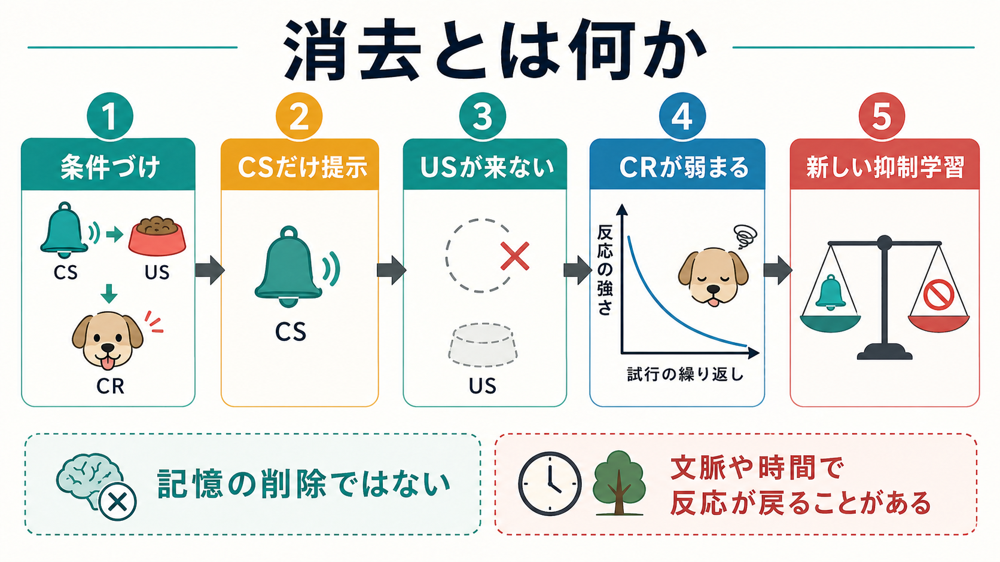
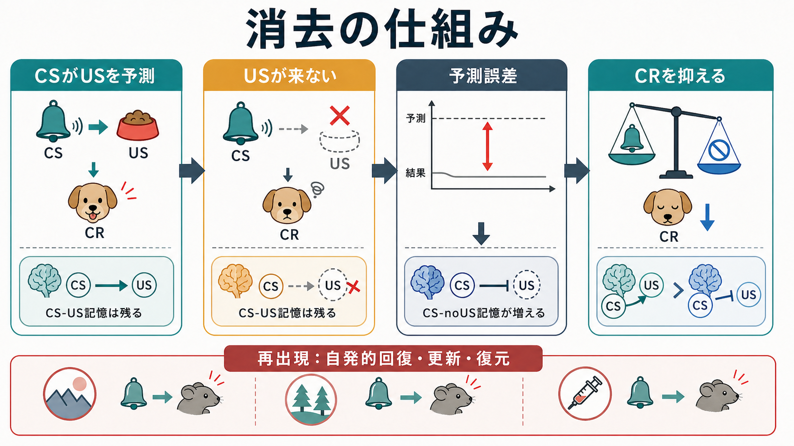

# 消去とは何か

## 要点

- 消去とは、いったん条件づけられた反応が、強化されない経験の反復によって弱まる過程である。
- 古典的条件づけでは、条件刺激（CS）が無条件刺激（US）をもはや伴わないと、条件反応（CR）が低下する。
- 重要なのは、消去は単なる「忘却」や「記憶の削除」ではなく、多くの場合、元の学習を残したまま「この文脈では反応しなくてよい」という新しい抑制学習を加える点である[1][2]。
- そのため、時間経過、文脈変化、US の再提示などで反応が戻ることがある[1][3]。
- 恐怖消去は、曝露療法、PTSD、不安症、[[扁桃体過活動は不安症やPTSDにどう関わるのか]]、[[PTSDでは恐怖記憶ネットワークに何が起きているのか]]を理解する基礎モデルになる[4][5][6]。

## この記事で答える問い

1. 消去は、条件づけで何が起きたときに生じるのか。
2. 消去は「忘れること」や「記憶を消すこと」と何が違うのか。
3. なぜ、いったん弱まった反応が戻ることがあるのか。
4. 消去は、研究や臨床でどのように使われるのか。

## まず結論

消去とは、予測していた結果が起こらない経験を繰り返すことで、条件刺激への反応が弱まる学習過程である。たとえば、ベルの音（CS）の後に食物（US）が出る経験を重ねると、ベルだけで唾液や接近などの反応（CR）が起こる。ところが、その後ベルだけを提示し、食物を出さない試行を繰り返すと、ベルへの反応は弱まる。これが古典的条件づけにおける消去である。

ただし、反応が弱まったからといって、CS-US の元の結びつきが完全に消えたとは限らない。Bouton のレビューは、消去後にも自発的回復、更新、復元が起こることをふまえ、消去を文脈依存的な新しい学習として理解する必要を強調している[1]。つまり消去は、[[忘却はなぜ起こるのか]]とは重なる部分をもちながらも、より能動的な「反応を抑える学習」である。

## 背景

条件づけ研究では、学習を「刺激と結果」「行動と結果」の関係として扱う。古典的条件づけでは、CS と US の関係が中心になる。オペラント条件づけでは、行動と強化子の関係が中心になる。どちらの場合も、強化されなくなると反応は弱まる。前者では CS への CR が低下し、後者では強化されなくなった行動の頻度が低下する[7]。

この見方は、[[長期記憶とは何か]]や[[神経可塑性は発達と学習をどう支えるのか]]とも関係する。学習された結合は、単に「オン」か「オフ」かで保存されるのではなく、文脈、予測、行動の結果、検索手がかりによって表れ方が変わる。消去は、記憶が行動として表れる条件を変える過程でもある。

## 基本概念

**CS（条件刺激）**は、学習後に反応を引き起こす刺激である。ベル、場所、匂い、音、人物、内的感覚などが CS になりうる。

**US（無条件刺激）**は、学習前から反応を引き起こす刺激である。食物、痛み、不快刺激などが典型例である。

**CR（条件反応）**は、CS によって引き起こされる学習後の反応である。唾液、接近、回避、恐怖反応、期待などが含まれる。

**強化されない試行**とは、CS の後に US が来ない、または行動の後に強化子が来ない試行である。消去では、この「期待された結果が来ない」経験が反復される。

**再出現**とは、消去後に弱まった反応が戻る現象である。代表例として、時間が経つと反応が戻る自発的回復、消去した文脈とは別の文脈で反応が戻る更新、US の再提示後に反応が戻る復元がある[1][3]。

## 仕組み

消去の中心には、予測と結果のずれがある。Rescorla-Wagner モデルでは、学習は「予測された US」と「実際に起きた US」の差によって更新される。CS が US を予測しているのに US が来ない場合、負の予測誤差が生じ、CS が US を予測する強さは低下する[8]。この考え方は、広い意味で[[予測処理とは何か]]とも接続できる。

一方、行動研究は、消去を単なる連合強度の低下だけでは説明しにくいことを示してきた。消去後にも反応が戻ることがあるためである。現在の有力な理解では、消去は「CS-US 記憶を消す」というより、元の記憶の表出を抑える CS-noUS 記憶、または文脈依存的な抑制学習を形成する過程と考えられる[1][2]。

恐怖条件づけの研究では、扁桃体、内側前頭前野、海馬が重要な回路として扱われる。扁桃体は恐怖連合の形成と表出に、内側前頭前野は消去記憶の獲得・保持・検索に、海馬は文脈情報に関わると整理される[4][5]。この神経回路レベルの理解は、[[シナプス可塑性とは何か]]や[[長期記憶とは何か]]の具体例でもある。

## 図解

| 観点 | 条件づけ | 消去 |
|---|---|---|
| 経験 | CS の後に US が来る | CS の後に US が来ない |
| 予測 | CS が US を予測する | 予測が外れる |
| 反応 | CR が強まる | CR が弱まる |
| 記憶 | CS-US 記憶が形成される | CS-noUS の抑制学習が加わる |
| 注意点 | 反応の獲得を説明する | 反応の低下と再出現を説明する |

図で見ると、消去は「反応を下げるボタン」ではなく、「この条件では反応しなくてよい」という新しい条件つきの学習である。したがって、文脈が変わると元の反応が再び検索されることがある。

## 臨床・研究との接続

消去は、恐怖や不安の臨床研究で特に重要である。曝露療法では、恐れている刺激や状況に安全な形で接触し、予測された破局的結果が起こらない経験を重ねる。抑制学習モデルでは、曝露の目標は単に不安がその場で下がることではなく、「予測が外れた」という学習を強め、さまざまな文脈で検索できるようにすることだと考える[6]。

ただし、これは個別の治療指示ではない。臨床での曝露は、症状、併存状態、安全性、治療関係、本人の同意、段階づけをふまえて専門家が設計する必要がある。この記事で扱うのは、教育・研究目的の学習原理である。

研究面では、消去は動物実験からヒト fMRI、心理療法研究までをつなぐ翻訳的モデルである。Milad と Quirk は、恐怖消去研究がげっ歯類とヒト研究を橋渡しし、扁桃体、前頭前野、海馬の役割を検討する枠組みとして発展してきたことを整理している[5]。

## よくある誤解

**誤解 1: 消去は記憶を消すことである。**  
消去後にも反応が戻ることがあるため、元の記憶が完全に消えたとは考えにくい。より正確には、元の記憶の表出を抑える新しい学習が形成される[1][2]。

**誤解 2: 反応が下がれば消去は完了である。**  
反応低下は重要な指標だが、文脈が変わると反応が戻ることがある。消去学習がどの文脈で検索されるかも重要である[1][3]。

**誤解 3: 消去は古典的条件づけだけの概念である。**  
オペラント行動でも、強化子が撤去されると行動頻度が低下する。近年のレビューは、道具的・オペラント学習の消去にも文脈依存性があることを示している[7]。

**誤解 4: 臨床では恐怖を慣れさせればよい。**  
曝露療法の抑制学習モデルでは、その場の慣れだけでなく、期待違反、文脈の多様化、安全行動の扱い、検索手がかりなどが問題になる[6]。

## 関連ノート

- [[忘却はなぜ起こるのか]]
- [[長期記憶とは何か]]
- [[神経可塑性は発達と学習をどう支えるのか]]
- [[シナプス可塑性とは何か]]
- [[予測処理とは何か]]
- [[扁桃体過活動は不安症やPTSDにどう関わるのか]]
- [[PTSDでは恐怖記憶ネットワークに何が起きているのか]]

MOC 更新候補: `content/00_MOC/MOC｜認知科学・心理学.md`、必要に応じて `content/00_MOC/MOC｜臨床実践・治療.md`。

## 理解チェック

1. 消去で弱まるのは、何に対するどのような反応か。
2. 「消去は記憶の削除ではない」と考える根拠は何か。
3. 自発的回復、更新、復元は、それぞれどのような再出現か。
4. 曝露療法の抑制学習モデルでは、なぜ「その場で不安が下がること」だけでは不十分なのか。

## 参考文献

[1] Bouton, M. E. (2004). Context and behavioral processes in extinction. *Learning & Memory*, 11(5), 485-494. https://doi.org/10.1101/lm.78804

[2] Myers, K. M., & Davis, M. (2007). Mechanisms of fear extinction. *Molecular Psychiatry*, 12, 120-150. https://doi.org/10.1038/sj.mp.4001939

[3] Bouton, M. E., & Moody, E. W. (2004). Memory processes in classical conditioning. *Neuroscience & Biobehavioral Reviews*, 28(7), 663-674. https://doi.org/10.1016/j.neubiorev.2004.09.001

[4] Quirk, G. J., & Mueller, D. (2008). Neural mechanisms of extinction learning and retrieval. *Neuropsychopharmacology*, 33, 56-72. https://doi.org/10.1038/sj.npp.1301555

[5] Milad, M. R., & Quirk, G. J. (2012). Fear extinction as a model for translational neuroscience: Ten years of progress. *Annual Review of Psychology*, 63, 129-151. https://doi.org/10.1146/annurev.psych.121208.131631

[6] Craske, M. G., Treanor, M., Conway, C. C., Zbozinek, T., & Vervliet, B. (2014). Maximizing exposure therapy: An inhibitory learning approach. *Behaviour Research and Therapy*, 58, 10-23. https://doi.org/10.1016/j.brat.2014.04.006

[7] Bouton, M. E., & Todd, T. P. (2014). A fundamental role for context in instrumental learning and extinction. *Behavioural Processes*, 104, 13-19. https://doi.org/10.1016/j.beproc.2014.02.012

[8] Rescorla, R. A., & Wagner, A. R. (1972). A theory of Pavlovian conditioning: Variations in the effectiveness of reinforcement and nonreinforcement. In A. H. Black & W. F. Prokasy (Eds.), *Classical Conditioning II: Current Research and Theory* (pp. 64-99). Appleton-Century-Crofts. https://cir.nii.ac.jp/crid/1573668925942365824

## 未解決問題

- 消去で形成される抑制学習は、どの条件で長期保持され、どの条件で検索されにくくなるのか。
- 恐怖消去で得られた知見は、報酬学習、依存、強迫、慢性疼痛などにどこまで一般化できるのか。
- 個人差、発達段階、ストレス、睡眠、薬物療法は、消去学習の獲得・固定・検索にどのように影響するのか。
