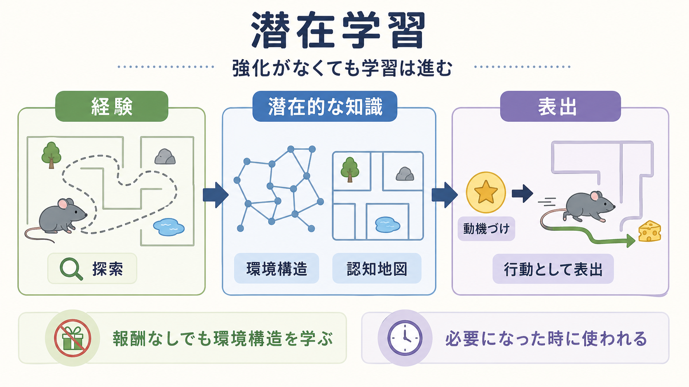
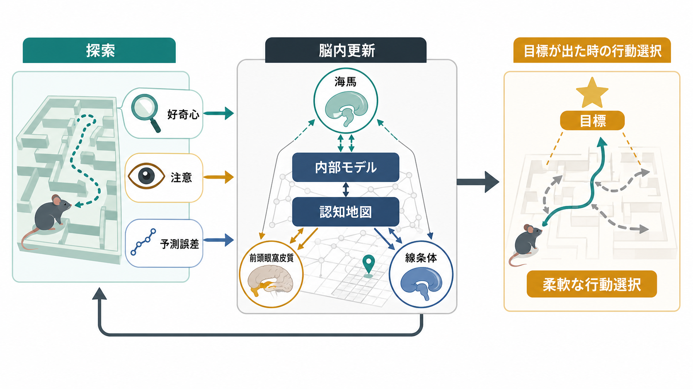
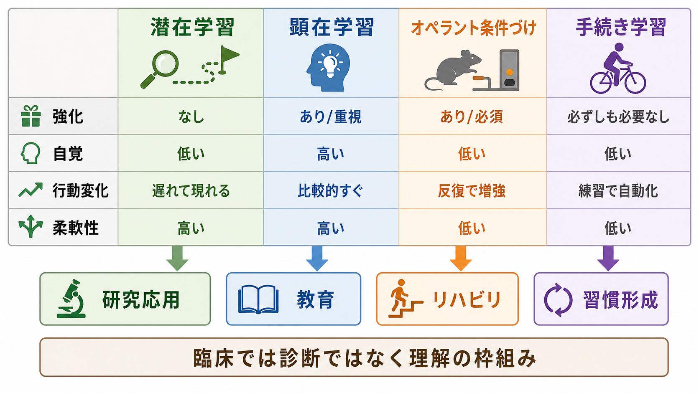

# 潜在学習とは何か

## 要点

- 潜在学習とは、学習した内容がすぐには行動として見えず、後で報酬・目標・課題要求が現れたときに表出する学習である。
- 古典的には、ラットが報酬なしで迷路を探索している間にも迷路構造を学び、後から食餌報酬が導入されると急に成績が改善する現象として示された[1]。
- 潜在学習は、単純な刺激反応連合だけでなく、環境の構造を表す「認知地図」という考え方と結びついている[2]。
- 人間研究では、人工文法学習や系列反応時間課題のように、本人が規則を明示的に説明できなくても成績が変わる暗黙学習と重なる部分がある[3][4]。
- 神経科学的には、潜在学習を単一の脳部位で説明するより、海馬を含む宣言的記憶系、線条体を含む習慣・手続き系、前頭前野系の相互作用として見る方がよい[5][7]。

## この記事で答える問い

1. 潜在学習は、[[オペラント条件づけとは何か|オペラント条件づけ]]や明示的な勉強と何が違うのか。
2. 報酬や自覚がなくても、何が学ばれていると言えるのか。
3. 認知地図、暗黙学習、[[長期記憶とは何か|長期記憶]]、[[自動化された認知処理とは何か|自動化された処理]]とはどう関係するのか。
4. 教育・リハビリテーション・臨床研究で、潜在学習の考え方をどう扱えばよいのか。

## まず結論

潜在学習は、「強化がないのに何かが魔法のように身につく」という話ではない。より正確には、探索・観察・反復経験のなかで、環境の配置、刺激間の規則性、行動と結果のゆるい関係、課題の統計構造などが内部表現として変化するが、その変化がすぐに測定可能な行動として現れない学習である。

典型例は迷路学習である。食餌がない状態で迷路を歩き回るラットは、目立った成績改善を示さないことがある。しかし後から食餌が置かれると、以前の探索経験を利用して急に効率よく移動する。このとき「報酬が入ってから初めて学習した」のではなく、報酬導入前から迷路構造の知識が形成されていたと解釈できる[1][2]。

人間でも同じ発想は使える。毎日通る街の店の位置、文章や音楽に含まれる規則性、操作手順の癖、対人場面の暗黙のパターンなどは、明示的に覚えようとしなくても蓄積される。ただし、その知識が本当にあるかどうかは、後で「使う理由」が生じたとき、あるいは適切な課題で測定したときに初めて見える。

## 背景

潜在学習という考え方は、20世紀前半の行動主義心理学への重要な問題提起として現れた。当時の強い行動主義的説明では、学習は強化された反応が増える過程として理解されやすかった。これに対して Tolman と Honzik の迷路実験は、強化がなくても動物は環境構造を学びうることを示した[1]。

Tolman はさらに、動物や人間は単なる刺激反応の鎖ではなく、環境内の場所・手がかり・経路関係を内的に表す「認知地図」を用いて行動すると論じた[2]。この発想は、現在の空間認知、[[エピソード記憶とは何か|エピソード記憶]]、モデルベース学習、好奇心研究にもつながっている。

ただし、古典的な潜在学習研究をそのまま「強化は不要」とだけ読むのは粗い。探索そのものには好奇心、感覚刺激、運動経験、環境への慣れ、期待の形成などが含まれる。現代的には、外的報酬が明示されていなくても、情報獲得や不確実性低減が学習を支える場合があると考えられている[8]。

## 基本概念

### 潜在学習

潜在学習は、獲得時点では行動成績として目立たないが、後から動機づけや課題要求が変わると表出する学習である。ここで「潜在」とは、神秘的・無意識的という意味ではなく、測定される行動にまだ現れていないという意味で使う。

したがって潜在学習を評価するには、学習時の成績だけでなく、後の転移課題、目標導入後の成績、規則性への感度、選択行動の変化を測る必要がある。

### 暗黙学習との関係

暗黙学習は、本人が規則を明示的に説明できないまま、規則性や構造への感度が成績に表れる学習である。Reber の人工文法学習では、参加者は文字列の文法規則を明示的に説明できなくても、新しい文字列が文法に合っているかを偶然以上に分類できることが示された[3]。

潜在学習と暗黙学習は重なるが、同義ではない。潜在学習は「行動表出が遅れる」点に焦点があり、暗黙学習は「知識を言語化しにくい」点に焦点がある。ある学習は潜在的で、かつ暗黙的でもありうる。一方で、後から明示的に説明できる知識が潜在的に獲得されることもある。

### 顕在学習との違い

顕在学習は、本人が学習目標や内容を意識し、言語的に説明しやすい学習である。試験勉強、概念定義の暗記、研究論文の読み方の学習などは典型例である。潜在学習は、顕在学習の反対物というより、経験の別の層で働く学習である。多くの実生活場面では、顕在的な説明と潜在的なパターン学習が同時に働く。

### オペラント条件づけとの違い

[[オペラント条件づけとは何か|オペラント条件づけ]]は、行動の後に生じる結果によって、その行動の将来頻度が変化する学習である。潜在学習は、明示的な強化がなくても、環境構造や課題構造が獲得される点を強調する。

ただし両者は排他的ではない。潜在的に形成された認知地図や規則性の知識は、後から報酬や目標が入ったときに、どの行動を選ぶかを支える。つまり、強化は「知識を作る唯一の原因」ではなく、「既に形成された知識をどのように使うか」を変える要因にもなりうる。

## 仕組み

### 1. 探索が環境構造をサンプリングする

潜在学習の入口は、探索である。動物は迷路を歩き回り、人間は街・画面・文章・対人場面を経験する。その過程で、どの手がかりが一緒に現れるか、どの順序が多いか、どこに分岐があるか、どの行動がどの状態へ移るかがサンプリングされる。

この段階では、報酬がないため行動成績は改善しないかもしれない。しかし内部では、刺激間の関係や状態遷移の表現が少しずつ変わる。

### 2. 内部モデルや認知地図が更新される

Tolman の「認知地図」は、環境内の場所や手がかりの関係を表す内的表現である[2]。現代的に言えば、これは「現在どこにいて、どの行動でどの状態へ移るか」というモデルに近い。[[記憶の固定化とは何か|記憶の固定化]]や[[シナプス可塑性とは何か|シナプス可塑性]]の観点からは、経験に伴って神経回路の重みづけが変化し、後で使える表現が形成されると考えられる。

ただし、すべての潜在学習が海馬だけで説明されるわけではない。記憶システム研究では、意識的想起に関わる宣言的記憶系と、技能・習慣・条件づけなどに関わる非宣言的記憶系が区別される[5]。潜在学習は、この複数システムの境界にまたがる。

### 3. 注意や二重課題が、どの記憶システムを使うかを変える

系列反応時間課題では、参加者が明示的に系列を覚えようとしていなくても、隠れた順序規則に反応時間が敏感になることがある[4]。また、確率分類学習では、健忘患者が明示的記憶に障害をもっていても、フィードバックを通じた分類成績を徐々に改善できることが示された[6]。

これらの研究は、学習が単一の記憶装置で起こるのではなく、課題要求や注意の配分によって異なるシステムが使われることを示す。Poldrack と Packard は、海馬系と線条体系を含む複数の記憶システムが並行して働き、時には競合すると整理した[7]。したがって潜在学習を理解するには、「どの知識が形成されたか」だけでなく、「どの条件で、どのシステムが表出に寄与したか」を見る必要がある。

### 4. 動機づけが表出のスイッチになる

潜在学習で重要なのは、獲得と表出を分けることだ。動物が迷路を学んでいても、食餌がなければ急いでゴールへ向かう理由がない。人間が街の構造を覚えていても、目的地を探す必要がなければ、その知識は行動に表れない。

報酬や目標は、学習の開始ボタンというより、既に形成された表現を使う理由を与える。これが、潜在学習を「成績が見えないから学習していない」と早合点してはいけない理由である。

## 図解

1枚目の図は、潜在学習を「経験」「潜在的な知識」「表出」の3段階で整理している。外的報酬がなくても探索を通じて環境構造が学ばれ、後で動機づけが加わると行動に現れる、という全体像である。

2枚目の図は、探索、注意、予測誤差、好奇心が内部モデルや認知地図を更新し、後の目標場面で柔軟な行動選択に使われる流れを示している。海馬、前頭眼窩皮質、線条体は単独の「潜在学習中枢」ではなく、複数システムの分担を示す手がかりとして読む。

3枚目の図は、潜在学習、顕在学習、オペラント条件づけ、手続き学習を比較している。潜在学習は強化が不要で自覚が低い学習として描けるが、実際の学習場面ではこれらが混ざる。たとえばリハビリテーションでは、明示的な説明、反復練習、フィードバック、環境探索が同時に働く。

## 臨床・研究との接続

### 教育

教育では、学習者がすぐに説明できない知識も、後の問題解決で働くことがある。例題を眺める、複数の事例に触れる、実験器具を操作する、文章を多読する、といった経験は、明示的なテスト成績に直ちに反映されなくても、後の理解や転移を支える可能性がある。

ただし「自覚なしに学べるから説明はいらない」とはならない。潜在的なパターン学習は、誤った規則性や偏った環境にも敏感である。教育では、探索の自由度と明示的なフィードバックを組み合わせる設計が重要になる。

### リハビリテーション

運動技能や日常動作の再学習では、本人が手順を完全に言語化できなくても、反復経験により成績が改善する場合がある。これは[[自動化された認知処理とは何か|自動化された処理]]や手続き学習と重なる。注意資源が限られる人に対しては、過度な言語的説明より、環境設定、反復、フィードバック、成功しやすい課題配置が学習を支えることがある。

一方で、暗黙的・潜在的な学習だけに頼ると、本人が何を学んだかを転移しにくい場合もある。明示的な気づき、目標設定、文脈を変えた練習を組み合わせる必要がある。

### 精神医学・臨床心理学

臨床的には、潜在学習は診断名ではなく、行動や認知傾向を理解する枠組みである。たとえば回避行動、過覚醒、習慣化した安全確認、対人場面での予期などは、本人が明示的に選んでいるというより、過去の経験に基づく予測や行動傾向として形成されていることがある。

ただし、ここから個別の症状を単純に「潜在学習の結果」と断定してはいけない。症状形成には発達、環境、神経生物学、社会的要因、身体状態が関わる。潜在学習は、経験が行動傾向に残る経路の一部として教育・研究目的で用いるのが適切である。

### 研究デザイン

研究では、学習と成績を区別する必要がある。成績が上がらないことは、学習がないことを意味しない。逆に、成績が上がったことだけで、どの知識が形成されたかは分からない。反応時間、エラー率、転移課題、意識報告、二重課題、神経画像、モデル比較を組み合わせることで、潜在的な表現の有無をより慎重に推定できる。

## よくある誤解

### 誤解1: 潜在学習は無意識の万能学習である

潜在学習は、努力なしに何でも身につくという意味ではない。学習には経験の量、注意、環境の規則性、動機づけ、測定方法が関わる。自覚が低い学習でも、入力が乏しければ学習は成立しにくい。

### 誤解2: 強化がまったく関係しない

潜在学習は、明示的な外的強化なしにも知識が形成されることを示す。しかし、後でその知識を使うかどうかは、報酬、目標、不快の回避、社会的文脈によって大きく変わる。強化は学習そのものだけでなく、表出や方略選択にも関わる。

### 誤解3: 暗黙学習と完全に同じである

潜在学習は、獲得と表出のずれに焦点を当てる。暗黙学習は、知識を言語化しにくいことに焦点を当てる。両者は重なるが、同じ概念ではない。

### 誤解4: 潜在学習は常に柔軟でよい学習である

潜在的に形成される知識は、柔軟な認知地図として使われることもあれば、硬い習慣や偏った予測として残ることもある。どちらになるかは、課題構造、注意、フィードバック、文脈の多様性に依存する。

## 関連ノート

既存ノート:

- [[オペラント条件づけとは何か]]
- [[長期記憶とは何か]]
- [[記憶の固定化とは何か]]
- [[シナプス可塑性とは何か]]
- [[ドパミンは報酬だけの物質なのか]]
- [[エピソード記憶とは何か]]
- [[自動化された認知処理とは何か]]

今後の作成候補:

- 暗黙学習とは何か
- 認知地図とは何か
- 系列反応時間課題とは何か
- 人工文法学習とは何か
- モデルベース学習とモデルフリー学習は何が違うのか
- 手続き学習とは何か

MOC更新候補:

- `content/00_MOC/` 配下の認知科学・心理学系 MOC に、本記事 `[[潜在学習とは何か]]` を「学習・行動・動機づけ」または「記憶・学習」領域として追加する。
- 並列ジョブとの競合を避けるため、このタスクでは MOC 本体は更新しない。

## 理解チェック

1. 潜在学習では、なぜ「学習」と「成績」を分けて考える必要があるか。
2. 認知地図という考え方は、単純な刺激反応連合の説明に何を追加するか。
3. 暗黙学習と潜在学習は、どの点で重なり、どの点で異なるか。
4. 二重課題や注意負荷は、どの記憶システムが表出に関わるかをどう変えうるか。
5. 臨床場面で潜在学習を使って説明するとき、個別診断や治療指示として断定しないためには何に注意すべきか。

## 未解決問題

- 潜在学習で形成される「内部モデル」を、行動データだけからどこまで識別できるか。
- 好奇心や情報価値は、外的報酬なしの学習をどの程度説明できるか。
- 海馬系、線条体系、前頭前野系の競合や協調は、課題・発達段階・臨床群によってどう変わるか。
- 潜在的に学ばれた知識を、教育やリハビリテーションで柔軟に転移させる条件は何か。

## 参考文献

[1] Tolman, E. C., & Honzik, C. H. (1930). Introduction and removal of reward, and maze performance in rats. *University of California Publications in Psychology, 4*, 257-275. https://cir.nii.ac.jp/crid/1573387450444605184

[2] Tolman, E. C. (1948). Cognitive maps in rats and men. *Psychological Review, 55*(4), 189-208. https://doi.org/10.1037/h0061626

[3] Reber, A. S. (1967). Implicit learning of artificial grammars. *Journal of Verbal Learning and Verbal Behavior, 6*(6), 855-863. https://doi.org/10.1016/S0022-5371(67)80149-X

[4] Nissen, M. J., & Bullemer, P. (1987). Attentional requirements of learning: Evidence from performance measures. *Cognitive Psychology, 19*(1), 1-32. https://doi.org/10.1016/0010-0285(87)90002-8

[5] Squire, L. R. (2004). Memory systems of the brain: A brief history and current perspective. *Neurobiology of Learning and Memory, 82*(3), 171-177. https://doi.org/10.1016/j.nlm.2004.06.005

[6] Knowlton, B. J., Squire, L. R., & Gluck, M. A. (1994). Probabilistic classification learning in amnesia. *Learning & Memory, 1*(2), 106-120. https://doi.org/10.1101/lm.1.2.106

[7] Poldrack, R. A., & Packard, M. G. (2003). Competition among multiple memory systems: Converging evidence from animal and human brain studies. *Neuropsychologia, 41*(3), 245-251. https://doi.org/10.1016/S0028-3932(02)00157-4

[8] Wang, M. Z., & Hayden, B. Y. (2021). Latent learning, cognitive maps, and curiosity. *Current Opinion in Behavioral Sciences, 38*, 1-7. https://doi.org/10.1016/j.cobeha.2020.06.003

