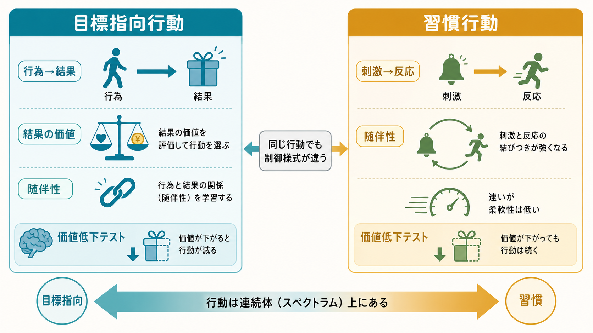
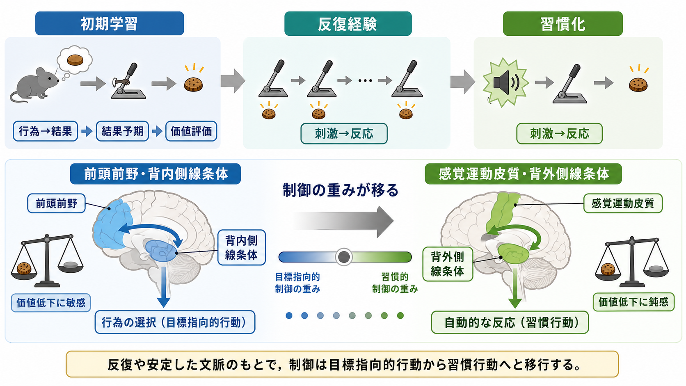

# 目標指向行動と習慣行動は何が違うのか

## 要点

- 目標指向行動は、「この行為をすると、どの結果が起こり、その結果はいま価値があるか」に基づいて選ばれる行動である[1][2]。
- 習慣行動は、「この刺激や文脈では、この反応をする」という刺激反応連合に強く支えられる行動である[1][4]。
- 研究上は、結果価値低下や随伴性低下のあとに行動が減るかどうかで、目標指向的制御と習慣的制御を区別する[2][3]。
- 神経基盤としては、前頭前野と背内側線条体を含む回路が目標指向的制御に、感覚運動皮質と背外側線条体を含む回路が習慣的制御に関わると整理される[4][5]。
- 日常行動は二分法ではなく連続体であり、課題、訓練量、文脈安定性、ストレス、認知負荷によって制御の重みが変わる[6][7]。

## この記事で答える問い

この記事では、[[オペラント条件づけとは何か]]や[[強化学習とは何か]]で扱われる「行動と結果の学習」を背景に、次の問いに答える。

1. 目標指向行動と習慣行動は、何を手がかりに行動を選んでいるのか。
2. なぜ同じ行動でも、結果価値に敏感な場合と鈍感な場合があるのか。
3. 脳内では、どのような回路がこの違いを支えているのか。
4. 強迫性や依存研究に接続するとき、どこまで慎重に読むべきか。

## まず結論

最も短く言えば、目標指向行動は「行為と結果」の関係を使う行動であり、習慣行動は「刺激と反応」の関係を使う行動である。たとえば、冷蔵庫を開ける行動が「水を飲むため」に行われ、満腹や水分補給後には減るなら、結果の価値を参照している。反対に、帰宅して玄関に入るとほとんど考えず同じ場所へ荷物を置くなら、文脈に誘発された反応として理解しやすい。

ただし、この区別は「意識的か無意識的か」と同じではない。本人が説明できる習慣もあれば、本人が説明できなくても結果価値に敏感な行動もある。研究上の核心は、行動が現在の結果価値と行為結果随伴性にどれだけ依存しているかである[2][3]。

## 背景

行動科学では、動物や人間が環境と相互作用しながら行動を変える過程を調べてきた。[[価値学習とは何か]]や[[報酬予測誤差とは何か]]の観点では、結果の価値や予測誤差が次の行動選択を更新する。一方、同じ行動が繰り返され、文脈が安定し、結果が十分に予測可能になると、毎回すべてを計算し直さなくても反応できるようになる。これが習慣の利点である。

問題は、習慣が有用である一方、環境や結果価値が変わったときに柔軟性を失うことである。食べ物への価値が下がった、ルールが変わった、行為と結果のつながりが弱くなった。それでも同じ行動が続くなら、行動制御は目標指向的というより習慣的になっている可能性が高い[1][2]。

## 基本概念

### 目標指向行動

目標指向行動は、行為と結果の関係、そして結果の現在価値に基づく行動である。ここでいう「目標」は、大きな人生目標だけではない。水を飲む、メールを送る、課題を終える、痛みを避ける、報酬を得るといった、行動によって実現される結果全般を含む。

目標指向行動には二つの条件がある。第一に、行為と結果の随伴性を使っていること。つまり「自分がその行為をしたから結果が起きた」と学習している。第二に、その結果の価値を使っていること。結果の価値が下がれば、行動も下がりやすい[2][3]。

### 習慣行動

習慣行動は、刺激や文脈が反応を直接引き出すようになった行動である。ここでの刺激は、音や光のような単純な刺激に限られない。場所、時間帯、身体状態、他者の存在、道具の配置、スマートフォン通知のような複合的文脈も含まれる。

習慣行動の強みは、速く、認知負荷が低く、安定して実行できることである。弱みは、結果価値が変わったあとも行動が残りやすいことである。したがって習慣は「悪い行動」ではなく、状況が安定しているときには効率的な制御様式である[1][4]。

### 見分けるためのテスト

典型的な実験操作は、結果価値低下と随伴性低下である。結果価値低下では、報酬を事前に満腹にさせる、嫌悪的にする、価値を下げるなどして、その結果が以前ほど望ましくない状態にする。随伴性低下では、行動をしてもしなくても結果が出るようにして、「行為が結果を生む」という関係を弱める。

価値低下や随伴性低下のあとに行動が減るなら、目標指向的制御が強い。行動があまり減らないなら、習慣的制御が強いと解釈される[2][3]。

## 仕組み

### 行為結果連合と刺激反応連合

目標指向行動では、行動選択の中心に「行為→結果」がある。行動する前に、行為がどの結果を生むか、その結果がいま価値を持つかを評価する。この仕組みは柔軟だが、情報処理の負荷が高い。

習慣行動では、行動選択の中心に「刺激→反応」がある。刺激や文脈が反応を呼び出すため、実行は速い。反面、結果の価値変化を反映するには、刺激反応連合そのものを弱める、文脈を変える、代替反応を学習するなどの追加過程が必要になる。

### 訓練量と文脈安定性

習慣化は単に反復回数だけで決まるわけではない。訓練量が多いこと、同じ文脈で反復されること、結果が予測しやすいこと、行動手順が安定していることが、刺激反応連合を強める。逆に、結果価値が頻繁に変わる課題や、状況ごとに最適行動が変わる課題では、目標指向的制御が保たれやすい。

### 神経回路

動物研究とヒト研究を統合すると、目標指向的制御には前頭前野、眼窩前頭皮質、背内側線条体などを含む前頭線条体回路が関わる。一方、習慣的制御には感覚運動皮質、背外側線条体などを含む回路が関わると整理される[4][5]。この対応は単純な一対一対応ではないが、行動制御の重みが前頭前野寄りの柔軟な制御から、感覚運動的で自動化された制御へ移るという見方を支える。

[[大脳基底核ループとは何か]]で扱われるように、大脳基底核は行動選択、運動開始、報酬学習、系列化に関わる。したがって、目標指向行動と習慣行動の違いは、単なる心理学的分類ではなく、行動選択を支える複数回路の競合と協調として理解できる。

### 計算論的な対応

[[強化学習とは何か]]の文脈では、目標指向的制御はしばしばモデルベース制御、習慣的制御はモデルフリー制御に近いものとして説明される[6][7]。モデルベース制御は、環境の構造を使って「この行動をしたら次に何が起きるか」を推論する。モデルフリー制御は、過去の報酬履歴から行動価値を更新し、速く選択する。

ただし、心理学的な「習慣」と計算論的な「モデルフリー制御」は完全に同義ではない。両者は有用な対応関係を持つが、実験課題、測定指標、神経回路、行動の時間スケールによってずれが生じる。

## 図解

次の図は、結果価値低下と随伴性低下を用いた見分け方をまとめている。ポイントは、行動の多さだけではなく、結果の価値や行為結果関係が変わったあとに行動がどう変わるかを見ることである。

| 観点 | 目標指向行動 | 習慣行動 |
|---|---|---|
| 主な連合 | 行為→結果 | 刺激→反応 |
| 結果価値の変化 | 敏感 | 鈍感になりやすい |
| 随伴性の変化 | 敏感 | 鈍感になりやすい |
| 長所 | 柔軟、文脈に合わせやすい | 速い、負荷が低い、安定する |
| 短所 | 遅い、認知負荷が高い | 状況変化に遅れやすい |
| 関連回路 | 前頭前野、背内側線条体 | 感覚運動皮質、背外側線条体 |

## 臨床・研究との接続

強迫性や依存の研究では、目標指向的制御から習慣的制御への過度なシフトが議論されることがある[8]。たとえば、本人にとって望ましくない結果が明らかでも、特定の手がかりや文脈で行動が誘発される場合、習慣的制御の比重が高いと考える余地がある。

ただし、これは個人の診断や治療指示ではない。強迫行為、依存行動、回避行動には、不安低減、渇望、社会的文脈、ストレス、認知的信念、身体状態、発達歴などが関わる。習慣モデルは、その一部を「行動が結果価値の変化に鈍くなる」という観点から説明する研究枠組みである。

臨床・教育・行動変容に応用するなら、単に「意志を強くする」よりも、手がかりを変える、行動直前の文脈を変える、代替反応を練習する、結果価値を見える形にする、反応までの摩擦を調整する、といった環境設計が重要になる。これは[[習慣学習とは何か]]や[[習慣形成にはどのような条件が必要なのか]]ともつながる。

## よくある誤解

### 習慣行動はすべて無意識である

習慣行動は自動的に起こりやすいが、完全に無意識とは限らない。本人が行動に気づいている場合もある。重要なのは、行動が結果価値や随伴性の変化にどれだけ敏感かである。

### 目標指向行動は常に良い

目標指向行動は柔軟だが、負荷が高く、遅く、迷いやすい。安定した作業、技能、日課では、毎回すべてを考え直すよりも習慣化したほうが適応的である。

### 習慣は反復だけで作られる

反復は重要だが十分条件ではない。文脈の安定性、報酬履歴、行動手順の明確さ、ストレス、認知負荷、代替行動の有無が影響する。

### モデルベース制御と目標指向行動は完全に同じである

両者は近いが同一ではない。モデルベース/モデルフリーは計算論的な区別であり、目標指向/習慣は行動実験と心理学的機能に基づく区別である。対応づけると理解しやすいが、完全な置換は避けるべきである[6][7]。

## 関連ノート

既存ノート:

- [[オペラント条件づけとは何か]]
- [[強化学習とは何か]]
- [[価値学習とは何か]]
- [[習慣学習とは何か]]
- [[習慣形成にはどのような条件が必要なのか]]
- [[報酬予測誤差とは何か]]
- [[報酬系とは何か]]
- [[意思決定とは何か]]
- [[大脳基底核ループとは何か]]

関連ノート候補:

- 価値低下テストとは何か
- 随伴性低下とは何か
- モデルベース制御とモデルフリー制御は何が違うのか
- 強迫性は習慣として説明できるのか

MOC更新候補:

- `content/00_MOC/MOC｜認知科学・心理学.md` の学習・行動・動機づけ周辺
- `content/00_MOC/MOC｜脳・神経科学.md` の大脳基底核・前頭線条体回路周辺
- `content/00_MOC/MOC｜計算論的精神医学.md` のモデルベース/モデルフリー制御周辺

## 理解チェック

1. 結果価値低下後に行動が大きく減る場合、その行動は目標指向的制御と習慣的制御のどちらに近いか。
2. 習慣行動が「悪い行動」とは限らない理由を、認知負荷と安定性の観点から説明できるか。
3. 「刺激→反応」と「行為→結果」の違いを、日常行動の例で説明できるか。
4. モデルベース制御とモデルフリー制御の対応を、目標指向行動と習慣行動にどう結びつけられるか。
5. 強迫性や依存研究に習慣モデルを使うとき、なぜ個人の診断と混同してはいけないのか。

## 参考文献

[1] Dickinson, A. (1985). Actions and habits: The development of behavioural autonomy. *Philosophical Transactions of the Royal Society of London. B, Biological Sciences, 308*(1135), 67-78. https://doi.org/10.1098/rstb.1985.0010

[2] Balleine, B. W., & Dickinson, A. (1998). Goal-directed instrumental action: Contingency and incentive learning and their cortical substrates. *Neuropharmacology, 37*(4-5), 407-419. https://doi.org/10.1016/S0028-3908(98)00033-1

[3] de Wit, S., & Dickinson, A. (2009). Associative theories of goal-directed behaviour: A case for animal-human translational models. *Psychological Research, 73*, 463-476. https://doi.org/10.1007/s00426-009-0230-6

[4] Yin, H. H., & Knowlton, B. J. (2006). The role of the basal ganglia in habit formation. *Nature Reviews Neuroscience, 7*, 464-476. https://doi.org/10.1038/nrn1919

[5] Balleine, B. W., & O'Doherty, J. P. (2010). Human and rodent homologies in action control: Corticostriatal determinants of goal-directed and habitual action. *Neuropsychopharmacology, 35*, 48-69. https://doi.org/10.1038/npp.2009.131

[6] Dolan, R. J., & Dayan, P. (2013). Goals and habits in the brain. *Neuron, 80*(2), 312-325. https://doi.org/10.1016/j.neuron.2013.09.007

[7] Daw, N. D., Niv, Y., & Dayan, P. (2005). Uncertainty-based competition between prefrontal and dorsolateral striatal systems for behavioral control. *Nature Neuroscience, 8*, 1704-1711. https://doi.org/10.1038/nn1560

[8] Gillan, C. M., Robbins, T. W., Sahakian, B. J., van den Heuvel, O. A., & van Wingen, G. (2016). The role of habit in compulsivity. *European Neuropsychopharmacology, 26*(5), 828-840. https://doi.org/10.1016/j.euroneuro.2015.12.033

## 未解決問題

- ヒトの日常習慣を、実験室の価値低下課題だけでどこまで測定できるのか。
- 習慣的制御を弱める介入と、望ましい習慣を強める介入は同じ原理で説明できるのか。
- モデルベース/モデルフリー制御の推定値を、臨床症状や生活機能とどの程度安定して結びつけられるのか。
