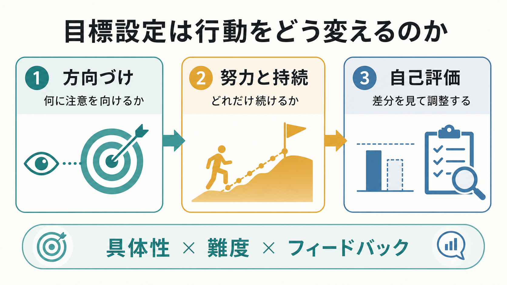
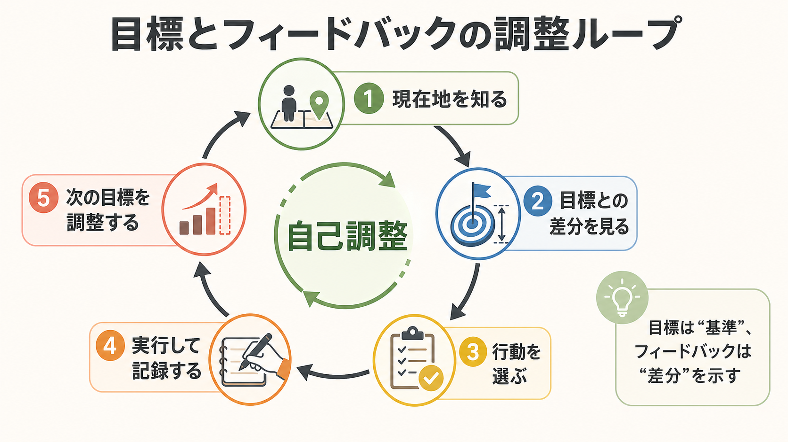

# 目標設定は行動をどう変えるのか

## 要点

- 目標は、行動を「がんばるかどうか」だけでなく、注意の向き、努力量、持続性、方略探索、自己評価の基準を変える。
- 目標設定理論では、曖昧な「ベストを尽くす」よりも、具体的で十分に難しい目標のほうが課題遂行を高めやすいとされる [1][2]。
- 目標の効果は、能力、目標へのコミットメント、フィードバック、課題の複雑さ、自己効力感によって左右される [2][3]。
- 目標は基準を与え、フィードバックは現在地との差分を示す。したがって目標設定は[[自己制御とは何か|自己制御]]と密接に結びつく。
- 行動変容の場面では、目標設定だけでなく「いつ・どこで・どう行うか」を決める実行意図が、目標を行動へ移す助けになる [5]。

## この記事で答える問い

この記事では、次の問いに答える。

1. 明確な目標は、なぜ努力や持続性を高めるのか。
2. 目標は自己評価やフィードバックの使い方をどう変えるのか。
3. 目標設定が逆効果になるのはどのような場合か。
4. 学習、健康行動、臨床・研究の文脈で、目標設定をどう扱えばよいか。

## まず結論

目標設定は、未来の望ましい状態を言葉にするだけではない。目標は「何を重要な情報として見るか」を変え、「どの程度の努力を投入するか」を調整し、「どこまで続けるか」を決める基準になる。さらに、現在の状態と目標との差分が見えると、行動を修正するための[[メタ認知とは何か|メタ認知]]や[[計画能力とは何か|計画能力]]が働きやすくなる。

ただし、目標は常に有効ではない。課題が複雑で、本人が方略をまだ持っていない場合、いきなり高い成果目標を置くと、探索や学習よりも失敗回避に注意が向くことがある [3]。また、フィードバックが人格評価や脅威として受け取られると、パフォーマンスを下げる場合もある [6]。よい目標設定とは、単に高い目標を掲げることではなく、本人の現在地、学習段階、利用できる支援、フィードバックの質に合わせて基準を設計することである。

## 背景

目標設定研究の古典的知見は、産業・組織心理学や教育心理学から発展した。Locke らのレビューでは、多くの実験・フィールド研究において、具体的で困難な目標は、容易な目標、曖昧な努力目標、目標なし条件より高い遂行をもたらしやすいと整理された [1]。その後の Locke と Latham の統合的論文は、目標が行動に作用する主要経路として、注意の方向づけ、努力の動員、持続性の増加、課題方略の発見を挙げている [2]。

この知見は、[[強化とは何か|強化]]や[[オペラント条件づけとは何か|オペラント条件づけ]]のように外的結果から行動を説明する枠組みと対立するものではない。むしろ、目標は「何が報酬的・有意味な結果として扱われるか」を変える内的な基準として働く。たとえば同じ点数でも、目標が「60点を超える」なら成功として感じられ、「90点を目指す」なら不足として感じられる。

## 基本概念

### 目標とは何か

ここでいう目標とは、望ましい結果や状態を表す基準である。目標には、成果目標、学習目標、過程目標、回避目標などがある。たとえば「試験で80点を取る」は成果目標、「毎日20分復習する」は過程目標、「数学の解法パターンを3種類説明できるようにする」は学習目標である。

成果目標は到達点を明確にしやすいが、複雑な課題や初学者では、何を学べばよいかを狭めすぎることがある。学習目標は、方略探索や理解の深まりを支えやすい。Locke と Latham は、複雑な課題では単純な成果目標よりも、まず課題方略を発見する学習目標が有効な場合があると論じている [3]。

### 「具体性」と「難度」

目標の基本条件は、具体性と難度である。「できるだけがんばる」は努力を促すように見えるが、何をもって十分とするかが曖昧で、自己評価にも行動修正にも使いにくい。一方、「今週中に関連論文を3本読み、各1段落で要約する」は行動と評価基準が明確である。

難度は高ければよいわけではない。能力や資源の範囲を大きく超えた目標は、コミットメントを下げたり、失敗回避を強めたりする。目標が難しいほど効果が出やすいのは、本人がそれを受け入れ、必要な能力・時間・支援がある場合である [2][3]。

### コミットメントと自己効力感

目標は、本人が「その目標に取り組む意味がある」「自分にも実行可能性がある」と感じるほど行動に結びつきやすい。ここで重要になるのが[[自己効力感とは何か|自己効力感]]である。自己効力感は、特定の状況で必要な行動を実行できるという判断であり、目標の選択、努力、持続性に影響する [3]。

また、自己一致的な目標、つまり本人の価値や関心と合っている目標は、持続的な努力やウェルビーイングと結びつきやすい [7]。他者から与えられた目標でも有効なことはあるが、本人が納得していない目標は、短期的な服従を生んでも長期的な自己調整にはつながりにくい。

## 仕組み

### 1. 注意を方向づける

目標は、環境の中から何を重要な情報として拾うかを変える。レポートの目標が「文字数を満たす」なら文字数に注意が向くが、「反論を1つ検討する」なら論証構造に注意が向く。これは[[注意とは何か|注意]]の配分を変える作用であり、目標は認知資源の向き先を決めるフィルターになる。

### 2. 努力量を調整する

目標は、どの程度の努力を投入すべきかの基準になる。低すぎる目標は早い満足を生み、高すぎる目標はあきらめを生むことがある。適切に難しい目標は、現在の能力を少し超える水準を示し、努力の動員を促す [1][2]。

### 3. 持続性を支える

目標があると、一時的な失敗や疲労を「目標との差分」として解釈しやすくなる。これは、単なる気合いではなく、行動の終了条件を変えることに近い。目標が明確であれば、「今日は進まなかった」だけで終わらず、「どこで止まったか」「何を変えればよいか」を考えやすい。

### 4. 方略探索を促す

目標は、行動の量だけでなく方法を変える。もし同じやり方で目標に届かないなら、学習者は別の方略を探す必要がある。ただし、課題が複雑で方略がまだない段階では、高い成果目標がかえって視野を狭めることがある。そこで、初期段階では「正答数を上げる」より「解法を比較する」「誤答理由を分類する」といった学習目標が有効になる [3]。

### 5. 自己評価の基準を作る

目標は自己評価のものさしである。基準がなければ、同じ結果でも「よかったのか、足りないのか」が判断しにくい。基準があると、現在地との差分を見て行動を調整できる。この差分検出は、[[自己評価はどのように形成されるのか|自己評価]]や[[自己制御とは何か|自己制御]]の中心にある。

## 図解

目標設定を自己調整ループとして見ると、次の順序で整理できる。

| 段階 | 問い | 例 |
|---|---|---|
| 現在地を知る | いま何ができているか | 今週は2回だけ運動した |
| 目標との差分を見る | どこが足りないか | 目標は週4回なので2回不足 |
| 行動を選ぶ | 次に何を変えるか | 帰宅後ではなく昼休みに歩く |
| 実行して記録する | 行動は起きたか | カレンダーに記録する |
| 目標を調整する | 難度や方法は適切か | 雨の日の代替行動を決める |

この循環が働くには、フィードバックが必要である。フィードバックは、目標と現在地の差分を示す情報である。ただし、フィードバック介入のメタ分析では、平均的には遂行を改善する一方で、かなりの割合で遂行を低下させることも報告されている [6]。人格や自己価値への評価に注意を向けるフィードバックより、課題・方略・次の行動に注意を戻すフィードバックのほうが、目標設定と組み合わせやすい。

## 臨床・研究との接続

### 行動変容

健康行動や生活習慣の介入では、目標設定は基本的な行動変容技法の一つとして扱われる。Epton らのランダム化比較試験に基づくメタ分析では、目標設定は多様な行動に対して小さいが有意な独自効果を示し、難しい目標、公的に設定された目標、集団目標で効果が大きい傾向が報告された [4]。一方、健康行動変容のメタレビューでは、目標設定の効果は介入内容や対象行動によって一貫しない面もあると整理されている [8]。したがって、目標設定は万能な単独技法ではなく、モニタリング、フィードバック、環境調整などとの組み合わせが重要である。

### 実行意図

目標は「何を達成したいか」を定めるが、それだけでは行動開始の失敗を防げない。実行意図は、「もし状況 X が起きたら、行動 Y をする」という if-then 形式の計画であり、目標を状況手がかりに結びつける。Gollwitzer と Sheeran のメタ分析では、実行意図は目標達成に中から大程度の効果を示した [5]。

たとえば「運動する」ではなく、「月・水・金の昼食後に、職場の周囲を15分歩く」と決める。これは[[意思決定とは何か|意思決定]]の負荷を毎回発生させず、行動開始を状況に委ねる工夫である。[[認知負荷とは何か|認知負荷]]が高い人、疲労が強い人、うつや不安で開始が難しい人にとっても、目標を小さく、具体的に、状況に埋め込むことは重要になる。

### 臨床・教育での注意

臨床・教育の文脈では、目標設定を個別診断や治療指示としてではなく、支援設計の道具として扱う必要がある。抑うつ、不安、慢性疼痛、ADHD、発達特性、睡眠不足、過重労働などがある場合、目標未達は「意志の弱さ」ではなく、症状、環境、報酬構造、支援不足の反映かもしれない。

したがって、目標設定では次を確認する。

- 目標は本人の価値や生活文脈と合っているか。
- 目標は現在の能力・時間・体力に対して実行可能か。
- 結果目標だけでなく、過程目標や学習目標があるか。
- 失敗時に、人格評価ではなく方略修正へ戻れるか。
- フィードバックは、具体的で、次の行動に結びつくか。

## よくある誤解

### 誤解1: 目標は高ければ高いほどよい

難しい目標は努力を引き出しやすいが、能力・時間・支援・コミットメントが不足していると逆効果になる。特に初学者や複雑課題では、成果目標より学習目標を先に置くほうがよい場合がある [3]。

### 誤解2: 目標を決めれば行動は自然に変わる

目標は行動の基準を作るが、行動開始を保証しない。実行意図、記録、環境調整、他者支援、報酬構造が必要になることが多い [4][5]。

### 誤解3: フィードバックは多いほどよい

フィードバックは目標との差分を示すが、与え方によっては自己防衛や萎縮を生む。課題、方略、次の行動に焦点を戻すフィードバックが重要である [6]。

### 誤解4: 目標未達は本人の性格の問題である

目標未達は、目標の難度、環境、症状、資源不足、手がかりの不在、方略不足によっても起こる。本人の人格評価に早く飛びつくと、改善可能な条件を見落とす。

## 関連ノート

既存ノートへの関連リンク:

- [[自己制御とは何か]]
- [[自己効力感とは何か]]
- [[計画能力とは何か]]
- [[実行機能とは何か]]
- [[意思決定とは何か]]
- [[注意とは何か]]
- [[メタ認知とは何か]]
- [[認知負荷とは何か]]
- [[強化とは何か]]
- [[オペラント条件づけとは何か]]

MOC 更新候補:

- `content/00_MOC/` 配下の認知科学・心理学系 MOC
- 学習・行動・動機づけ系 MOC
- 自己制御・動機づけ・行動変容系 MOC

今後の作成候補:

- 目標設定理論とは何か
- 実行意図とは何か
- フィードバックは学習をどう変えるのか
- 学習目標と成果目標は何が違うのか
- 行動変容技法とは何か

## 理解チェック

1. 具体的で困難な目標が、曖昧な「ベストを尽くす」目標より行動を変えやすいのはなぜか。
2. 目標設定が注意、努力、持続性、方略探索に与える影響を一つずつ説明できるか。
3. 目標とフィードバックは、自己調整ループの中でそれぞれどの役割を持つか。
4. 複雑課題や初学者に、いきなり高い成果目標を置くことのリスクは何か。
5. 実行意図は、単なる目標設定と何が違うか。

## 参考文献

[1] Locke, E. A., Shaw, K. N., Saari, L. M., & Latham, G. P. (1981). Goal setting and task performance: 1969-1980. *Psychological Bulletin, 90*(1), 125-152. https://doi.org/10.1037/0033-2909.90.1.125

[2] Locke, E. A., & Latham, G. P. (2002). Building a practically useful theory of goal setting and task motivation: A 35-year odyssey. *American Psychologist, 57*(9), 705-717. https://doi.org/10.1037/0003-066X.57.9.705

[3] Locke, E. A., & Latham, G. P. (2006). New directions in goal-setting theory. *Current Directions in Psychological Science, 15*(5), 265-268. https://doi.org/10.1111/j.1467-8721.2006.00449.x

[4] Epton, T., Currie, S., & Armitage, C. J. (2017). Unique effects of setting goals on behavior change: Systematic review and meta-analysis. *Journal of Consulting and Clinical Psychology, 85*(12), 1182-1198. https://doi.org/10.1037/ccp0000260

[5] Gollwitzer, P. M., & Sheeran, P. (2006). Implementation intentions and goal achievement: A meta-analysis of effects and processes. *Advances in Experimental Social Psychology, 38*, 69-119. https://doi.org/10.1016/S0065-2601(06)38002-1

[6] Kluger, A. N., & DeNisi, A. (1996). The effects of feedback interventions on performance: A historical review, a meta-analysis, and a preliminary feedback intervention theory. *Psychological Bulletin, 119*(2), 254-284. https://doi.org/10.1037/0033-2909.119.2.254

[7] Sheldon, K. M., & Elliot, A. J. (1999). Goal striving, need satisfaction, and longitudinal well-being: The self-concordance model. *Journal of Personality and Social Psychology, 76*(3), 482-497. https://doi.org/10.1037/0022-3514.76.3.482

[8] Hennessy, E. A., Johnson, B. T., Acabchuk, R. L., McCloskey, K., & Stewart-James, J. (2020). Self-regulation mechanisms in health behavior change: A systematic meta-review of meta-analyses, 2006-2017. *Health Psychology Review, 14*(1), 6-42. https://doi.org/10.1080/17437199.2019.1679654

## 未解決問題

- 目標設定の効果は、個人の価値、症状、社会的支援、文化的背景によってどの程度変わるのか。
- デジタル記録やウェアラブルデバイスのフィードバックは、自己調整を助けるのか、それとも過剰な自己監視を強めるのか。
- 臨床場面で、目標設定を本人の主体性と安全性を損なわずに使うための最適な支援形式は何か。
