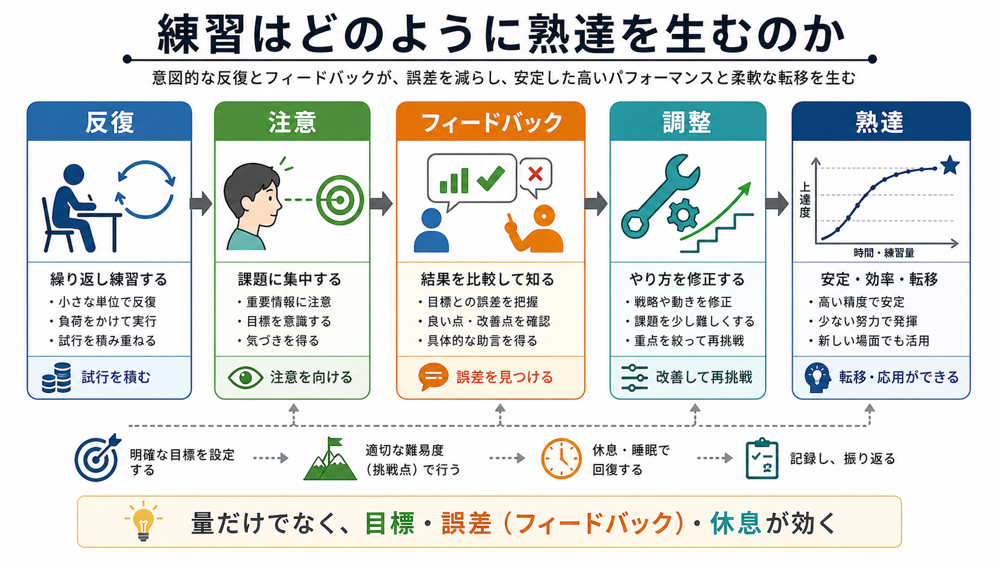

# 練習はどのように熟達を生むのか

## 要点

- 練習は、同じ行為をただ繰り返すことではなく、目標と現在のずれを見つけ、次の試行を変える過程である。
- 熟達を生みやすい練習は、明確な目標、集中した注意、具体的なフィードバック、難易度調整、休息と間隔を含む[1][3][5]。
- 意図的練習は熟達研究の中心概念だが、分野・年齢・選抜・動機づけ・機会の差も大きく、練習量だけで個人差を説明することはできない[1][2]。
- フィードバックは学習を助ける一方で、与えすぎると自分で誤差を検出する力を弱めることがある[4]。
- 短期的な成績のよさと、長期保持・転移は同じではない。少し難しく、間隔を空け、思い出す練習を含むほうが、後で使える技能になりやすい[3][5][6][7]。

## この記事で答える問い

1. 反復は、なぜ技能を安定させるのか。
2. フィードバックは、どのように「誤差を直す」練習を支えるのか。
3. 意図的練習は、普通の反復練習と何が違うのか。
4. 練習量だけで熟達を説明できないのはなぜか。
5. 教育・臨床・研究では、練習をどのように設計すべきか。

## まず結論

練習が熟達を生むのは、試行の数が増えるからだけではない。各試行で「何を狙ったか」「実際に何が起きたか」「どの誤差を修正するか」が比較され、次の試行の注意、動作、方略が更新されるからである。この意味で、練習は[[学習とは何か|学習]]の一部であり、行動・記憶・注意・動機づけをまとめて再編成する過程である。

ただし、練習は万能ではない。誤った手続きの反復は、誤った[[習慣学習とは何か|習慣]]を強めることがある。過度に簡単な課題は変化を生みにくく、過度に難しい課題は何を修正すべきかを見えにくくする。熟達を支えるのは、現在の技能水準に対して「少し届きにくい」課題、明確なフィードバック、そして休息を含む長期的な設計である[3][5]。

## 背景

熟達研究では、音楽、チェス、スポーツ、医学、学術技能など、多様な領域で「どのような経験が高い遂行を生むのか」が問われてきた。Ericsson らは、専門家の高い遂行は単なる経験年数ではなく、改善を目的とした意図的練習に強く支えられると論じた[1]。ここでの練習は、楽しく流す反復ではなく、弱点を特定し、集中し、指導やフィードバックを得て、限界近くで改善を続ける活動である。

一方、その後のメタ分析は、意図的練習が熟達に重要であることを認めつつも、成績差のすべてを説明するわけではないことを示した[2]。領域によって説明率は異なり、個人の初期条件、教育機会、身体的条件、動機づけ、社会的支援、課題環境も関わる。したがって、実践的には「努力すれば必ず同じ到達点に至る」と断定するより、「練習の質を高めると、到達可能な範囲を広げやすい」と捉えるほうが正確である。

## 基本概念

### 反復

反復は、同じような課題に繰り返し取り組むことである。ただし、熟達につながる反復は、単なる回数の蓄積ではない。毎回の試行が、目標、結果、誤差、修正方略と結びつくとき、反復は学習信号を含む。反対に、何を改善するかが曖昧な反復は、疲労や慣れだけを生み、技能改善にはつながりにくい。

### フィードバック

フィードバックとは、行為の結果や過程について得られる情報である。結果フィードバックは「正誤」「得点」「成功・失敗」を知らせる。過程フィードバックは「どこで、なぜ、どう直すか」を知らせる。技能獲得では、結果だけでなく、誤差の原因に注意を向けさせる過程フィードバックが重要になる[4]。

### 意図的練習

意図的練習は、明確な改善目標をもち、現在の能力を少し超える課題に集中して取り組み、フィードバックを受けながら方略を修正する練習である[1]。これは、好きな課題を長時間続けることや、すでにできることをなめらかに反復することとは異なる。心理的負荷が高いため、休息、動機づけ、支援環境も必要になる。

### 保持と転移

練習直後にうまくできることは、学習が定着したことを必ずしも意味しない。翌日、数週間後、別の状況で再現できるかを見る必要がある。保持とは時間が経ってもできること、転移とは別の課題や文脈でも使えることである。熟達とは、特定場面での高得点だけでなく、保持と転移を伴う柔軟な遂行である。

## 仕組み

### 1. 目標が誤差を見えるようにする

練習は、目標があるときに情報量を持つ。たとえば「速く読む」だけではなく、「要点を3つ取り出し、5分で要約する」と決めると、結果を比較できる。[[目標設定は行動をどう変えるのか|目標設定]]は、注意を向ける場所を絞り、何を失敗とみなすかを明確にする。

### 2. 誤差検出が次の試行を変える

熟達の中核は、現在の遂行と目標とのずれを検出し、次の試行を修正することである。運動学習では、正確な動作、タイミング、力加減、姿勢などが誤差信号になる。認知技能では、解法選択、注意配分、記憶検索、判断基準が誤差信号になる。報酬や結果の予測とのずれは、[[報酬予測誤差とは何か|報酬予測誤差]]として行動更新を支えることもある。

### 3. 最適な挑戦点が学習を進める

Guadagnoli と Lee の challenge point framework は、技能水準に対して課題が簡単すぎても難しすぎても学習に有効な情報が減ると整理する[3]。簡単すぎる課題では誤差が少なく、調整の必要がない。難しすぎる課題では誤差が大きすぎ、どの要素を直すべきかが分からない。学習を促すのは、失敗を含みつつも、誤差が解釈できる難易度である。

### 4. フィードバックは依存ではなく自己修正を育てる

フィードバックは強力だが、多ければ多いほどよいわけではない。運動学習研究では、頻繁すぎる外的フィードバックが、学習者自身の誤差検出を弱める可能性が指摘されてきた[4]。初期段階では具体的な助言が有効でも、熟達に近づくほど、自分で違和感や誤差を検出し、修正できることが重要になる。

### 5. 間隔と検索が保持を支える

練習を一度に詰め込むと、その場の成績は上がりやすい。しかし、長期保持では、練習を分散させるほうが有利になりやすい[5]。また、答えや手順を見直すだけでなく、自分で思い出す検索練習は、後の記憶保持を強める[6][7]。このため、熟達を目指す練習では、同じ課題を連続で流すだけでなく、間隔を空け、少し忘れた状態から取り出す機会を設計する。

## 図解

| 図 | 何を示すか | 読み方 |
|---|---|---|
| 図1 | 反復、注意、フィードバック、調整、熟達の流れ | 練習量だけでなく、目標・誤差・休息が熟達に効く |
| 図2 | 試行、結果確認、誤差修正、再試行のループ | フィードバックと難易度調整が、長期保持と転移につながる |

## 臨床・研究との接続

教育では、熟達を「説明を聞いた量」ではなく、「誤差を検出して修正した経験」として設計する必要がある。問題演習、自己説明、検索練習、間隔反復、フィードバックの遅延や頻度調整は、すべてこの観点から位置づけられる[5][6][8]。

臨床やリハビリテーションでは、練習は症状や能力の単純な評価ではなく、生活の中で使える行動を再獲得する過程として扱われる。ここでは、課題の難易度、疲労、失敗経験、支援者のフィードバック、本人の[[自己効力感は学習にどう影響するのか|自己効力感]]が重要になる。ただし、この記事の内容は教育・研究目的の一般的整理であり、個別の診断や治療指示ではない。

研究では、練習の効果を見るときに、直後の成績だけでなく、保持テスト、転移テスト、課題難易度、フィードバック条件、練習量、個人差を分けて測る必要がある。特に熟達研究では、累積練習時間と成績の相関を、選抜、環境、年齢、動機づけ、測定方法から切り離して解釈することが難しい[2]。

## よくある誤解

### 誤解1: 練習量が多ければ必ず熟達する

練習量は重要だが、量だけでは十分ではない。誤った手順を大量に反復すれば、誤った手順が自動化されることもある。熟達に必要なのは、量、目標、フィードバック、難易度、休息、動機づけの組み合わせである[1][2]。

### 誤解2: すぐ成績が上がる練習が最良である

練習中の成績が高い方法が、長期保持に最もよいとは限らない。分散練習や検索練習は、その場では負荷が高く見えるが、後で使える記憶を支えやすい[5][6][7]。

### 誤解3: フィードバックは多いほどよい

初期学習では多めのフィードバックが助けになることがある。しかし、熟達には自分で誤差を検出する力が必要である。外的フィードバックへの依存が強すぎると、支援がない場面で遂行が不安定になる可能性がある[4]。

### 誤解4: 熟達者は自動的に学び続ける

熟達者ほど、自分の弱点を細かく見つけ、課題を作り替える必要がある。すでにできることだけを反復すると、技能は安定しても伸びにくい。熟達者にとっても、意図的練習は快適な練習ではなく、限界近くで誤差を扱う練習である[1]。

## 関連ノート

既存ノート:

- [[学習とは何か]]
- [[強化とは何か]]
- [[報酬予測誤差とは何か]]
- [[習慣学習とは何か]]
- [[目標設定は行動をどう変えるのか]]
- [[自己効力感は学習にどう影響するのか]]
- [[観察学習とは何か]]
- [[内発的動機づけとは何か]]

今後の作成候補:

- 意図的練習とは何か
- フィードバックは学習をどう変えるのか
- 分散練習とは何か
- 検索練習とは何か
- 技能獲得の段階モデルとは何か

MOC更新候補:

- `content/00_MOC/MOC｜認知科学・心理学.md`
- `content/00_MOC/MOC｜キャリア・学習法.md`

## 理解チェック

1. 「反復」と「意図的練習」は何が違うか。
2. フィードバックが多すぎると、どのような問題が起こりうるか。
3. 練習中の成績が高いことと、長期保持がよいことはなぜ区別すべきか。
4. 自分の学習課題を1つ選び、目標、誤差、フィードバック、次の修正を具体化するとどうなるか。

## 参考文献

[1] Ericsson, K. A., Krampe, R. T., & Tesch-Romer, C. (1993). The role of deliberate practice in the acquisition of expert performance. *Psychological Review*, 100(3), 363-406. https://doi.org/10.1037/0033-295X.100.3.363

[2] Macnamara, B. N., Hambrick, D. Z., & Oswald, F. L. (2014). Deliberate practice and performance in music, games, sports, education, and professions: A meta-analysis. *Psychological Science*, 25(8), 1608-1618. https://doi.org/10.1177/0956797614535810

[3] Guadagnoli, M. A., & Lee, T. D. (2004). Challenge point: A framework for conceptualizing the effects of various practice conditions in motor learning. *Journal of Motor Behavior*, 36(2), 212-224. https://doi.org/10.3200/JMBR.36.2.212-224

[4] Salmoni, A. W., Schmidt, R. A., & Walter, C. B. (1984). Knowledge of results and motor learning: A review and critical reappraisal. *Psychological Bulletin*, 95(3), 355-386. https://doi.org/10.1037/0033-2909.95.3.355

[5] Cepeda, N. J., Pashler, H., Vul, E., Wixted, J. T., & Rohrer, D. (2006). Distributed practice in verbal recall tasks: A review and quantitative synthesis. *Psychological Bulletin*, 132(3), 354-380. https://doi.org/10.1037/0033-2909.132.3.354

[6] Roediger, H. L., III, & Karpicke, J. D. (2006). Test-enhanced learning: Taking memory tests improves long-term retention. *Psychological Science*, 17(3), 249-255. https://doi.org/10.1111/j.1467-9280.2006.01693.x

[7] Karpicke, J. D., & Roediger, H. L., III. (2008). The critical importance of retrieval for learning. *Science*, 319(5865), 966-968. https://doi.org/10.1126/science.1152408

[8] Dunlosky, J., Rawson, K. A., Marsh, E. J., Nathan, M. J., & Willingham, D. T. (2013). Improving students' learning with effective learning techniques: Promising directions from cognitive and educational psychology. *Psychological Science in the Public Interest*, 14(1), 4-58. https://doi.org/10.1177/1529100612453266
