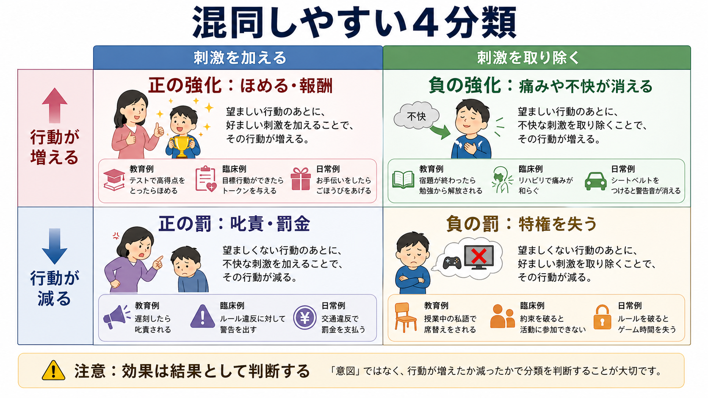
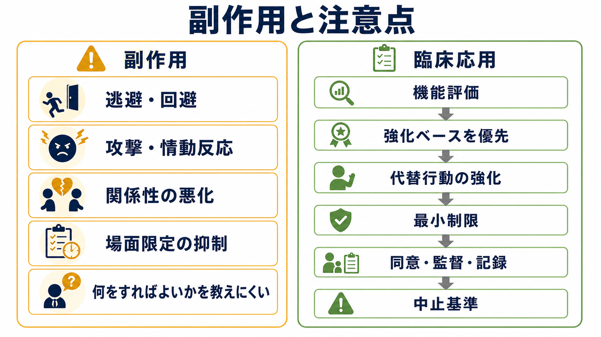

# 罰とは何か

## 要点

- 罰とは、ある行動の後に生じた結果によって、その行動が将来起こりにくくなる過程である。道徳的な「悪いことへの報い」ではなく、行動頻度の変化で定義する[1][2]。
- 正の罰は嫌悪的な刺激を加えて行動を減らすこと、負の罰は好ましい刺激や機会を取り去って行動を減らすことである[1][2]。
- 罰は行動を一時的に抑えることがあるが、何をすればよいかを教えにくく、逃避・回避、攻撃、情動反応、関係性の悪化、場面限定の抑制などの副作用を伴いうる[3][4]。
- 臨床・教育では、まず機能評価を行い、強化ベースの介入と代替行動の強化を優先する。制限的・罰的手続きは、リスク、同意、監督、記録、中止基準を明確にして慎重に扱う[5][6]。
- 体罰や屈辱を伴うしつけは、長期的な有害転帰と関連するため、発達支援や臨床支援では推奨されない[7][8]。

## この記事で答える問い

このノートでは、罰を[[意思決定とは何か|意思決定]]や[[手続き記憶とは何か|学習された行動]]の一般論ではなく、オペラント条件づけにおける「行動を減らす結果」として整理する。中心の問いは、次の4つである。

1. 罰は強化、負の強化、消去とどう違うのか。
2. 正の罰と負の罰は、何を「加える/取り去る」のか。
3. 罰にはどのような副作用と限界があるのか。
4. 臨床・教育・研究で罰を扱うとき、どのような倫理的注意が必要か。

## まず結論

罰は「嫌なことをすること」ではなく、「ある結果の後で、その行動が減ったこと」によって事後的に判断される。たとえば叱責をしたつもりでも、相手が注目を得たことで同じ行動を増やすなら、それは罰ではなく強化として機能している可能性がある。逆に、本人にとって小さく見える結果でも、その後に行動が安定して減るなら、機能的には罰として働いたと考える[1][2]。

ただし、罰は「行動を止める」ことに焦点が偏りやすい。望ましい行動を新しく教える力は弱く、行動がなぜ起きているかを見落とすと、同じ機能をもつ別の問題行動に置き換わることがある。したがって実践では、問題行動を単に抑えるのではなく、何がその行動を維持しているのかを評価し、同じ機能をより安全で適応的な行動で満たせるように設計する必要がある[5][6]。

## 背景

オペラント条件づけでは、行動はその後に続く結果によって変化する。結果が行動を増やせば強化、減らせば罰である。ここでいう「正」「負」は、よい/悪いという価値判断ではない。「正」は刺激や出来事を加えること、「負」は刺激や出来事を取り去ることを意味する[1]。

| 種類 | 結果の操作 | 行動への効果 | 例 |
|---|---|---|---|
| 正の強化 | 好子を加える | 行動が増える | 課題後に称賛を得て、課題提出が増える |
| 負の強化 | 嫌悪刺激を取り去る | 行動が増える | 依頼すると騒音が止まり、依頼行動が増える |
| 正の罰 | 嫌悪刺激を加える | 行動が減る | 危険行動後に警告を受け、その行動が減る |
| 負の罰 | 好子を取り去る | 行動が減る | ルール違反後にゲーム時間を失い、違反が減る |

この分類で誤解されやすいのは、負の強化である。負の強化は「罰」ではない。不快なものがなくなることで行動が増える過程であり、たとえば不安を避けるための回避行動が増える場合に関係する。これは[[PTSDでは恐怖記憶ネットワークに何が起きているのか|恐怖記憶]]や不安の維持を考えるときにも重要な区別である。

## 基本概念

### 行動で定義する

罰は、行動の形だけでは決まらない。声かけ、注意、課題追加、タイムアウト、反応コストなどは、手続きとしては罰的に見えることがある。しかし、それが罰として働いたかどうかは、標的行動が将来減ったかを測定して判断する[2]。

この点は臨床的に重要である。支援者が「これは罰ではなく注意です」と考えていても、本人にとって社会的注目や課題回避の機会になれば、行動を増やす結果になりうる。したがって、意図ではなく、行動データと文脈から効果を読む必要がある。

### 正の罰

正の罰は、行動の後に何かを加え、その行動が減る過程である。典型例としては、危険行動の直後に明確な警告を与える、ルール違反に対して追加の制約を置く、といった手続きがある。ただし、叱責や強い注意は、相手にとって注目として機能し、かえって行動を増やす場合がある。

### 負の罰

負の罰は、行動の後に好ましい刺激、活動、機会を取り去り、その行動が減る過程である。タイムアウトや反応コストはこの領域に入ることが多い。たとえば、攻撃行動の後に短時間だけ遊びの機会から離れる、約束違反の後にトークンを失う、といった形である。ただし、活動から離れることが本人にとって嫌悪的でない場合や、課題から逃れられる場合には、罰ではなく負の強化として働く可能性がある。

## 仕組み

罰の基本構造は、三項随伴性で整理できる。先行事象があり、行動が起こり、その後に結果が生じる。結果が次回以降の行動確率を下げれば、その結果は罰として働いたと考える[1][2]。

$$
\text{先行事象} \rightarrow \text{行動} \rightarrow \text{結果} \rightarrow \text{将来の行動確率の低下}
$$

ただし、この矢印は機械的ではない。罰の効果は、強さ、即時性、一貫性、他の強化子の存在、代替行動の有無、過去の学習歴、相手との関係、場面文脈に依存する[3][4]。ある場面で行動が減っても、別の場面では続くことがある。罰を与える人の前では抑制されるが、その人がいないと再発することもある。

もう一つ重要なのは、罰は「行動の機能」を直接置き換えないことである。たとえば、課題から逃れるために問題行動が起きている場合、その行動を罰しても、課題が苦痛であることや、助けを求めるスキルが不足していることは残る。機能分析研究は、自己傷害などの重篤な行動であっても、注目、逃避、感覚刺激など複数の環境機能によって維持されうることを示した[5]。そのため、介入では「やめさせる」だけでなく、「同じ機能をより安全に満たす行動」を教える必要がある。

## 図解

下の図は、罰を使うときに問題になりやすい副作用と、臨床応用上のチェックポイントを整理したものである。本文の要点は、罰を単独技法として見るのではなく、機能評価、強化ベースの支援、代替行動、倫理的監督の中に位置づけることである。

## 臨床・研究との接続

### 機能評価を先に置く

問題行動は、単に「困った行動」としてまとめると見誤る。同じ叩く行動でも、注目を得るため、課題から逃れるため、感覚刺激を得るため、痛みや不快感を伝えるためなど、維持要因が異なる可能性がある。機能分析は、行動と環境事象の機能的関係を実験的に評価する枠組みであり、重篤な行動支援では重要な基礎になっている[5]。

### 強化ベースの支援を優先する

罰的手続きだけで行動を減らしても、望ましい代替行動が増えなければ、生活の質は改善しにくい。応用行動分析の教科書的整理でも、行動を減らす手続きは、測定、機能評価、強化、般化、倫理と結びつけて扱われる[2]。たとえば、課題拒否を減らしたい場合は、拒否を罰する前に、課題量の調整、選択肢の提示、援助要求、休憩要求、達成後の自然な強化を設計する。

### 制限的手続きには倫理的条件がある

行動分析の倫理コードは、行動変容介入ではリスクを最小化し、制限的または罰的手続きは、より侵襲性の低い方法で望ましい結果が得られない場合、または標的行動の危険性が介入リスクを上回る場合に限って慎重に扱うべきだとしている。また、必要な審査、継続的な効果評価、記録、無効な場合の変更または中止が求められる[6]。

これは、罰を絶対に使わないという単純な結論ではない。危険行動が差し迫っている場合、環境調整や安全確保が必要になることはある。しかし、その場合でも、罰的手続きは支援計画全体の一部であり、本人の権利、尊厳、同意、代替行動の学習、専門的監督から切り離して扱ってはならない。

### 体罰・屈辱を伴う罰は別問題として扱う

家庭や教育で語られる「罰」には、体罰、脅し、恥をかかせる言葉が混ざりやすい。これらは行動分析上の罰概念と重なる部分があるが、発達的・倫理的リスクが大きい。体罰に関するメタ分析では、スパンキングは複数の有害な子どもの転帰と関連していた[7]。米国小児科学会も、身体的罰や恥を与える言葉によるしつけを避け、肯定的なしつけを推奨している[8]。医療・教育・支援の文脈では、個別事例への診断や治療指示としてではなく、研究知見と倫理原則に基づき、非暴力的で尊厳を守る支援を優先する必要がある。

## よくある誤解

### 誤解1: 罰は「悪いことへの報い」である

行動分析での罰は、道徳的評価ではない。ある結果が行動を減らしたかどうかで定義される。したがって、支援では「悪い子だから罰する」ではなく、「どの行動が、どの文脈で、どの結果によって変化しているのか」を見る。

### 誤解2: 叱れば罰になる

叱責が行動を減らすとは限らない。注目を得ることが強化子になっている場合、叱責は行動を増やすことがある。逆に、静かな声かけや環境変更が行動を減らす場合もある。重要なのは、手続き名ではなく機能である。

### 誤解3: 負の強化は罰である

負の強化は、不快な刺激が取り除かれることで行動が増える過程である。罰は行動を減らす。たとえば、不安な場面から逃げると不安が下がり、次回も逃げやすくなるなら、それは負の強化である。これは[[リスク下の意思決定はどのように行われるのか|リスク下の意思決定]]や回避行動を考えるうえで重要である。

### 誤解4: 罰は即効性があるから最も効率的である

罰は短期的に行動を抑えることがある。しかし、長期維持、般化、関係性、情動反応、代替行動の獲得を含めると、効率的とは限らない。罰の副作用は必ず常に生じるわけではないが、逃避・回避、攻撃、反発、場面限定の抑制などは慎重に監視すべきリスクである[3][4]。

## 関連ノート

- [[意思決定とは何か]]
- [[リスク下の意思決定はどのように行われるのか]]
- [[手続き記憶とは何か]]
- [[抑制制御とは何か]]
- [[PTSDでは恐怖記憶ネットワークに何が起きているのか]]

### 関連ノート候補

- オペラント条件づけとは何か
- 強化とは何か
- 負の強化と回避学習
- 応用行動分析とは何か
- 機能分析とは何か
- タイムアウトと反応コスト
- 体罰と発達リスク

### MOC更新候補

- `content/00_MOC/MOC｜認知科学・心理学.md`
- `content/00_MOC/MOC｜臨床実践.md`

## 理解チェック

1. 「正の罰」と「負の罰」の違いを、よい/悪いではなく刺激の加除で説明できるか。
2. 叱責が罰ではなく強化として働くのは、どのような場合か。
3. 罰が行動を減らしても、代替行動の強化が必要になる理由は何か。
4. 負の強化と罰は、行動頻度の変化としてどう違うか。
5. 臨床・教育で制限的・罰的手続きを検討する前に、確認すべき倫理的条件は何か。

## 未解決問題

- 罰の副作用は、どの条件で一過性になり、どの条件で長期化するのか。
- 罰的手続きの短期効果と、代替行動の強化による長期効果を、個別事例でどう比較するべきか。
- 行動の危険性が高い場合に、本人の権利と安全確保をどのように両立するか。
- 文化、制度、家族関係、学校環境は、罰の効果と害をどのように変えるか。

## 参考文献

[1] OpenStax. (2019). 6.3 Operant Conditioning. *Psychology 2e*. Rice University. https://openstax.org/books/psychology-2e/pages/6-3-operant-conditioning

[2] Cooper, J. O., Heron, T. E., & Heward, W. L. (2020). *Applied Behavior Analysis* (3rd ed.). Pearson. https://books.google.com/books/about/Applied_Behavior_Analysis.html?id=bXMqswEACAAJ

[3] Skinner, B. F. (1953). *Science and Human Behavior*. Macmillan. https://openlibrary.org/works/OL1725508W/Science_and_human_behaviour

[4] Lerman, D. C., & Vorndran, C. M. (2002). On the status of knowledge for using punishment: Implications for treating behavior disorders. *Journal of Applied Behavior Analysis*, 35(4), 431-464. https://doi.org/10.1901/jaba.2002.35-431

[5] Iwata, B. A., Dorsey, M. F., Slifer, K. J., Bauman, K. E., & Richman, G. S. (1994). Toward a functional analysis of self-injury. *Journal of Applied Behavior Analysis*, 27(2), 197-209. https://doi.org/10.1901/jaba.1994.27-197

[6] Behavior Analyst Certification Board. (2022). *Ethics Code for Behavior Analysts*. https://www.bacb.com/wp-content/ecba

[7] Gershoff, E. T., & Grogan-Kaylor, A. (2016). Spanking and child outcomes: Old controversies and new meta-analyses. *Journal of Family Psychology*, 30(4), 453-469. https://doi.org/10.1037/fam0000191

[8] Sege, R. D., Siegel, B. S., & Council on Child Abuse and Neglect; Committee on Psychosocial Aspects of Child and Family Health. (2018). Effective discipline to raise healthy children. *Pediatrics*, 142(6), e20183112. https://doi.org/10.1542/peds.2018-3112
