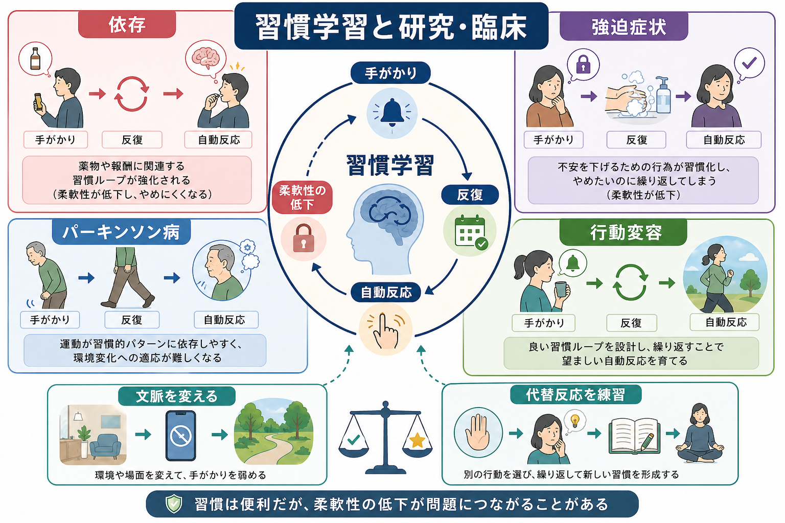

# 習慣学習とは何か

## 要点

- 習慣学習とは、最初は目標や報酬を意識して選んでいた行動が、反復と文脈手がかりによって自動的に起こりやすくなる過程である。
- 重要なのは「よくやる行動」そのものではなく、行動が結果価値の変化にどれだけ敏感かである。習慣化が進むと、報酬の価値が下がっても反応が残りやすい[1][2]。
- 神経科学的には、前頭前野と線条体を含む[[大脳基底核ループとは何か]]が関わり、目標志向制御と習慣制御の重みづけが変化すると考えられている[3][4]。
- 習慣は認知資源を節約する一方で、依存、強迫症状、運動症状、行動変容の失敗を理解する手がかりにもなる[5][8]。

## この記事で答える問い

- 習慣学習は、[[オペラント条件づけとは何か]]や[[強化学習とは何か]]と何が違うのか。
- 「目標に基づく行動」が、どのように「手がかりで起こる行動」へ変わるのか。
- 脳内では、どのような回路が習慣化を支えているのか。
- 臨床・研究では、習慣学習をどのように扱うべきか。

## まず結論

習慣学習は、行動選択の制御が「この行動をすると何が得られるか」という行動-結果関係から、「この文脈・手がかりではこの反応をする」という刺激-反応関係へ相対的に移っていく過程である[2][3]。たとえば、最初は「通知を確認すれば重要な連絡があるかもしれない」と考えてスマートフォンを見る。ところが同じ状況で何度も確認を繰り返すと、通知音、退屈な時間、机の上のスマートフォンといった手がかりだけで、ほとんど考えずに手が伸びるようになる。

この変化は単に「意識が薄れる」ことではない。より厳密には、行動が結果の現在価値にどれだけ依存しているかが変わる。報酬が不要になった、あるいはむしろ不利益になった後でも行動が続くなら、習慣制御の比重が高いと推定される[1][2]。

## 背景

行動はいつも同じ仕組みで選ばれているわけではない。新しい課題、変化の多い環境、失敗が高くつく場面では、私たちは目標、予測、価値、代替案を比較しながら行動する。このような制御は[[意思決定とは何か]]や実行機能に近く、柔軟だが遅く、認知的負荷が高い。

一方、日常の多くの行動は毎回熟考されない。歯磨き、通勤経路、キーボード入力、よく使うアプリの起動などは、安定した文脈で繰り返されることで、手がかりに反応するようにまとまっていく。心理学では、この自動化された行動様式を「習慣」と呼び、反復、文脈安定性、報酬履歴、手続き的記憶との関係で研究してきた[6]。この点で、習慣学習は[[手続き記憶とは何か]]とも重なるが、特に「行動制御が結果価値からどれだけ独立するか」に焦点を当てる。

## 基本概念

### 目標志向行動

目標志向行動は、行動と結果の関係、そしてその結果の現在価値に基づいて選ばれる行動である[1][4]。たとえば「水を飲めば喉の渇きが減る」とわかっていて、水がほしいから飲む。この場合、喉が渇いていなければ水を飲む行動は減る。つまり、行動は結果価値の変化に敏感である。

### 習慣行動

習慣行動は、特定の手がかりや文脈に対して反応が起こりやすくなった状態である[2][6]。習慣は必ずしも悪いものではない。むしろ、毎回考えなくてよい行動を自動化し、注意や作業記憶を節約する。しかし、状況や価値が変わったときに行動が更新されにくくなると、柔軟性の低下として問題化する。

### 脱価値化テスト

習慣を研究する代表的な方法が脱価値化テストである。ある行動で得られる報酬の価値を下げた後、その行動がどれだけ残るかを調べる。価値が下がると行動も減るなら目標志向制御が強く、価値が下がっても行動が残るなら習慣制御が強いと解釈される[1][7]。

## 仕組み

習慣学習は、単一の「習慣中枢」で起こるのではなく、複数の制御系の競合と協調として理解される。古典的には、目標志向制御は前頭前野や背内側線条体を含む回路、習慣制御は感覚運動皮質や背外側線条体を含む回路と関連づけられてきた[3][4]。ただし、人間の脳では領域対応が単純に一対一ではなく、課題、訓練量、価値更新、ストレス、認知負荷によって重みづけが変わる。

[[報酬予測誤差とは何か]]や[[ドパミンは報酬だけの物質なのか]]で扱うドパミン信号は、行動の価値学習や手がかりへの予測的反応に関わる。ただし、習慣学習を「ドパミンが増えたから自動化する」とだけ説明するのは粗い。重要なのは、行動-結果表象、刺激-反応連合、文脈手がかり、価値更新、探索と活用のバランスが、訓練履歴の中で再編成されることである[4][5]。

計算論的には、習慣制御はしばしばモデルフリー制御、目標志向制御はモデルベース制御に対応づけられる。モデルベース制御は環境構造を使って将来結果を見積もるため柔軟だが負荷が高い。モデルフリー制御は過去の報酬履歴に基づくため速いが、環境変化には鈍くなりやすい[5]。ただし、この対応は便利な近似であり、心理学的な「習慣」と計算論的な「モデルフリー制御」は完全に同義ではない。

## 図解

| 段階 | 行動の特徴 | 典型的な問い | 失敗しやすい点 |
|---|---|---|---|
| 目標志向 | 結果価値を見て選ぶ | 「これをすると何が得られるか」 | 負荷が高く、疲労やストレスに弱い |
| 反復期 | 同じ文脈で同じ行動が強まる | 「この場面では何をしがちか」 | 手がかりに引っ張られやすい |
| 習慣化 | 手がかりで反応が起こる | 「結果が変わっても続くか」 | 柔軟な更新が遅れる |
| 再設計 | 文脈・摩擦・代替反応を調整する | 「どこを変えれば反応が変わるか」 | 意志力だけに依存しやすい |

図解案として重要なのは、習慣を「悪い行動の固定」ではなく、「文脈手がかり、反復、価値更新、反応選択の関係」として見ることである。これにより、習慣を弱めるときも、単に行動を禁止するのではなく、手がかりを変える、反応までの摩擦を増やす、代替反応を練習する、といった介入点が見えやすくなる。

## 臨床・研究との接続

依存研究では、薬物や報酬に向かう行動が、当初の快感や目的から離れて、手がかり誘発的・反復的な行動へ移る過程が注目されてきた[8]。この観点は、[[依存症は報酬学習の病態としてどう理解できるのか]]と接続する。ただし、依存を「習慣だけ」で説明することはできない。報酬感受性、離脱、不快感の回避、社会的文脈、ストレス、意思決定の制約が同時に関わる。

強迫症状でも、確認や洗浄などの反復行動が、安心を得るための目標志向的行動から、手がかりで誘発される反応へ移る可能性が議論される[6]。これは[[強迫症では皮質線条体視床回路に何が起きているのか]]と関連するが、個人の症状をそのまま「習慣の病気」と断定してはいけない。臨床的には、研究で示される機構と、個別の診断・治療判断を区別する必要がある。

パーキンソン病や基底核疾患では、運動の開始、系列化、報酬学習、行動の柔軟な切り替えが影響を受けることがある。習慣学習の研究は、運動習慣、手続き学習、薬物治療下の行動変化を理解する背景にもなる[3][4]。

## よくある誤解

### 習慣は意志が弱いから起こる

習慣は意志の弱さだけでは説明できない。安定した文脈で反復され、報酬や不快感の低下によって強化され、手がかりに結びついた行動は、強い意思があっても起こりやすい。したがって、行動変容では「強く決意する」だけでなく、手がかり、環境、摩擦、代替反応を設計する必要がある[6]。

### 習慣はすべて無意識である

習慣行動は自動的に始まりやすいが、完全に無意識とは限らない。行動中に気づくことも、あとから説明することもある。重要なのは意識の有無だけではなく、行動が結果価値の変化にどれだけ敏感かである。

### 反復すれば必ず習慣になる

反復は重要だが、十分条件ではない。文脈の安定性、報酬や不快感低減の履歴、行動の単純さ、競合する行動、ストレスや疲労、社会的制約が習慣化を左右する[6]。同じ回数だけ繰り返しても、すべての行動が同じ速度で習慣化するわけではない。

## 関連ノート

- [[オペラント条件づけとは何か]]
- [[強化学習とは何か]]
- [[報酬予測誤差とは何か]]
- [[意思決定とは何か]]
- [[手続き記憶とは何か]]
- [[大脳基底核ループとは何か]]
- [[ドパミンは報酬だけの物質なのか]]
- [[依存症は報酬学習の病態としてどう理解できるのか]]
- [[強迫症では皮質線条体視床回路に何が起きているのか]]

## 理解チェック

1. ある行動が習慣化しているかを調べるとき、なぜ「反復回数」だけでなく「結果価値の変化への感受性」を見る必要があるのか。
2. 目標志向制御と習慣制御は、行動-結果関係と刺激-反応関係のどちらに近いか。
3. 習慣を変えたいとき、意志力以外にどのような介入点が考えられるか。

## 参考文献

[1] Dickinson, A. (1985). Actions and habits: The development of behavioural autonomy. *Philosophical Transactions of the Royal Society of London. B, Biological Sciences*, 308(1135), 67-78. https://doi.org/10.1098/rstb.1985.0010

[2] Yin, H. H., Knowlton, B. J., & Balleine, B. W. (2006). Inactivation of dorsolateral striatum enhances sensitivity to changes in the action-outcome contingency in instrumental conditioning. *Behavioural Brain Research*, 166(2), 189-196. https://doi.org/10.1016/j.bbr.2005.07.012

[3] Yin, H. H., & Knowlton, B. J. (2006). The role of the basal ganglia in habit formation. *Nature Reviews Neuroscience*, 7, 464-476. https://doi.org/10.1038/nrn1919

[4] Balleine, B. W., & O'Doherty, J. P. (2010). Human and rodent homologies in action control: Corticostriatal determinants of goal-directed and habitual action. *Neuropsychopharmacology*, 35, 48-69. https://doi.org/10.1038/npp.2009.131

[5] Dolan, R. J., & Dayan, P. (2013). Goals and habits in the brain. *Neuron*, 80(2), 312-325. https://doi.org/10.1016/j.neuron.2013.09.007

[6] Wood, W., & Rünger, D. (2016). Psychology of habit. *Annual Review of Psychology*, 67, 289-314. https://doi.org/10.1146/annurev-psych-122414-033417

[7] Tricomi, E., Balleine, B. W., & O'Doherty, J. P. (2009). A specific role for posterior dorsolateral striatum in human habit learning. *European Journal of Neuroscience*, 29(11), 2225-2232. https://doi.org/10.1111/j.1460-9568.2009.06796.x

[8] Everitt, B. J., & Robbins, T. W. (2005). Neural systems of reinforcement for drug addiction: From actions to habits to compulsion. *Nature Neuroscience*, 8, 1481-1489. https://doi.org/10.1038/nn1579

## 関連ノート候補・MOC更新候補

- MOC更新候補: `content/00_MOC/` 配下の認知科学・心理学、学習・行動・動機づけ系 MOC に本記事を追加。
- 今後の作成候補: 「目標志向行動とは何か」「脱価値化テストとは何か」「モデルベース制御とモデルフリー制御は何が違うのか」。

## 未解決問題

- 人間の日常習慣を、実験室の脱価値化課題だけでどこまで測定できるか。
- 「習慣」と「モデルフリー制御」をどの範囲で対応づけるべきか。
- 習慣を弱める介入と、望ましい習慣を形成する介入を、同じ理論でどこまで説明できるか。
