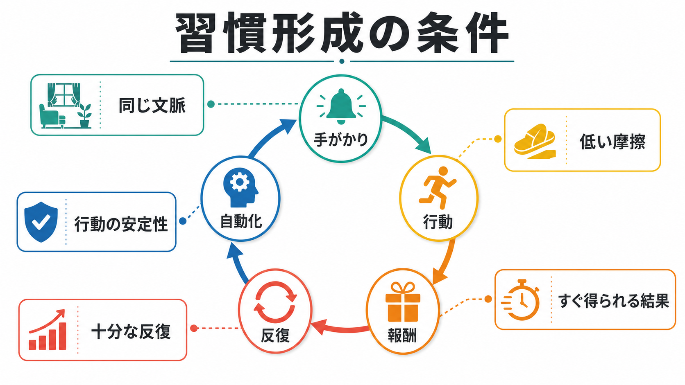
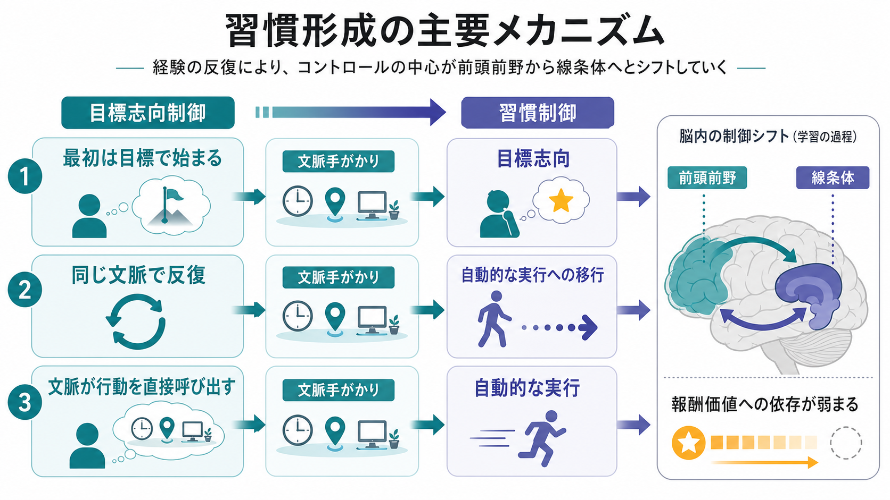
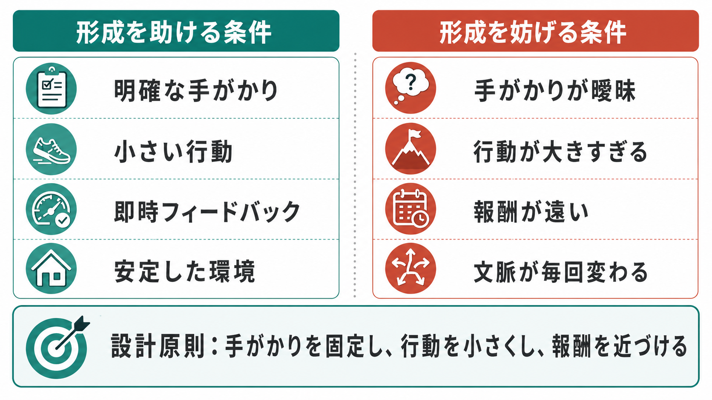

# 習慣形成にはどのような条件が必要なのか

## 要点

- 習慣は、同じ文脈で同じ行動を反復した結果、文脈手がかりが行動を直接呼び出すようになる学習である。
- 形成に必要なのは、明確な手がかり、小さく実行しやすい行動、近い報酬またはフィードバック、安定した文脈、十分な反復である。
- 「21日で必ず定着する」のような固定日数では説明できない。実生活研究では、自動性が高まる速度には大きな個人差と行動差がある。
- 習慣化は意志力を不要にする魔法ではない。むしろ、最初は目標志向的に環境を設計し、繰り返しやすい条件を作ることが重要である。

## この記事で答える問い

このノートでは、「ある行動を習慣にするには、どのような条件が必要なのか」を扱う。特に、[[古典的条件づけとは何か]]や[[オペラント条件づけとは何か]]で扱う「手がかり」「行動」「結果」の関係を、日常的な自動行動の形成として読み替える。

## まず結論

習慣形成の中心条件は、**同じ文脈の中で、同じ行動を、十分な回数、実行可能な負荷で繰り返し、その行動の直後に何らかの結果が伴うこと**である。習慣研究では、習慣は単なる頻度ではなく、文脈手がかりによって比較的自動的に起動される反応として捉えられる[1][2]。

そのため、「やる気を高める」だけでは足りない。最初の数回は目標や意図が行動を支えるが、習慣として安定するには、いつ・どこで・何のあとに行うかが繰り返しそろっている必要がある。過去行動が将来行動を予測するのは、安定した文脈では自動的な開始過程が働きやすくなるためである[3]。

## 背景

日常の行動は、すべてが毎回熟考されているわけではない。歯を磨く、通勤経路を選ぶ、机に座ったらメールを見る、帰宅後にスマートフォンを開くといった行動は、しばしば「そうしよう」と明示的に決める前に始まる。

習慣研究は、このような行動を、意図や目標から独立した反応としてだけでなく、目標達成の過程で形成され、その後は効率的な既定反応として働くものとして説明する[1]。たとえば、運動習慣は最初は健康という目標によって始まるが、同じ時間・同じ場所・同じ準備動作で繰り返すうちに、「夕食後に靴を履く」という手がかりだけで行動が始まりやすくなる。

## 基本概念

### 習慣

習慣とは、反復によって形成された、文脈手がかりに対する比較的自動的な行動傾向である。ここでいう自動性には、意識的な熟考が少ない、開始が速い、実行中の注意負荷が小さい、行動を始める感覚が「自然に出る」といった特徴が含まれる[1][4]。

### 手がかり

手がかりとは、行動の直前に安定して存在する刺激や状況である。時刻、場所、直前の行動、物の配置、感情状態、他者の存在などが手がかりになりうる。習慣を作るには、「毎朝」よりも「朝食後に洗面台の前で」のように、行動開始の合図が具体的なほうがよい。

### 行動

行動は、小さく、すぐ始められ、観察可能であるほど反復しやすい。これは[[強化とは何か]]で扱う結果随伴性とも関係する。行動が大きすぎると、疲労、準備不足、迷いによって反復機会が失われる。

### 報酬・フィードバック

習慣形成における報酬は、必ずしも大きな快感である必要はない。達成感、記録のチェック、身体感覚の変化、環境が整うことなど、行動直後に得られる結果が反復を支える。報酬の予測やずれは[[報酬予測誤差とは何か]]や[[強化学習とは何か]]とも接続するが、日常の習慣形成では「すぐわかる結果」にしておくことが実装上重要である。

## 仕組み

習慣形成は、少なくとも三つの段階に分けて理解できる。

第一に、行動は目標志向的に始まる。人は「健康になりたい」「集中したい」「不安を減らしたい」といった目標を持ち、そのために行動を選ぶ。この段階では、行動と結果の関係、努力に見合う価値、実行可能性が重要である[8]。

第二に、同じ文脈での反復により、手がかりと行動の連合が強くなる。実生活研究では、参加者が日々同じ文脈で選んだ行動を繰り返すと、自動性は非線形に増加し、ある程度で頭打ちになることが示された[4]。この研究では、95%の自動性水準に近づくまでの推定期間が18日から254日まで大きくばらついた。つまり、習慣化に必要なのは固定日数ではなく、行動の種類、文脈の安定性、実行一貫性である。

第三に、行動制御の重心が、結果を毎回評価する制御から、文脈に応答する制御へ移る。動物研究では、訓練が長くなると報酬価値の低下に対して行動が鈍感になることがあり、これは「その結果が今も欲しいから行う」というより、「刺激が来ると反応が出る」状態に近い[8]。神経科学的には、基底核、特に線条体を含む皮質-基底核回路が、目標志向的行動と刺激駆動的習慣の移行に関わると考えられている[6][7]。

## 図解

習慣形成を実践的に設計するなら、次のように考えるとよい。

| 条件 | 形成を助ける形 | 形成を妨げる形 |
|---|---|---|
| 手がかり | 「夕食後」「机に座ったら」のように具体的 | 「時間があるとき」のように曖昧 |
| 行動 | 2分で始められる、小さい単位 | 準備が多く、失敗しやすい |
| 報酬 | 直後に達成感・記録・身体感覚が得られる | 結果が遠すぎて実感できない |
| 文脈 | 場所・時間・直前行動が安定している | 毎回条件が変わる |
| 反復 | 多少抜けても再開しやすい | 一度抜けると中断として扱う |

## 臨床・研究との接続

臨床や健康行動の文脈では、習慣形成は「患者にもっと努力させる」技法ではなく、行動が続きやすい環境を設計する考え方として有用である。健康行動の習慣化に関する実践的整理では、既存の日課に新しい行動を結びつけること、単純な行動から始めること、文脈を安定させることが強調されている[5]。

ただし、医療・精神医学的な問題では、習慣化だけで症状や生活課題を解決できるとは限らない。強迫的な反復、依存、衝動制御の困難などでは、反復行動が本人の目標とずれて持続することがある。基底核回路と習慣・儀式的行動の関係を扱う神経科学レビューは、習慣が適応的な効率化にも、不適応な反復にも関わりうることを示している[7]。したがって、臨床応用では「研究で示されている一般原理」と「個別の治療判断」を分けて扱う必要がある。

## よくある誤解

### 「習慣は21日でできる」

固定日数で決まるわけではない。実生活での習慣形成研究では、自動性の獲得速度には大きなばらつきがあり、行動の難しさや文脈の安定性が影響する[4]。

### 「強い意志があれば習慣になる」

意志は開始には役立つが、習慣化の中心ではない。習慣は、意志を毎回使わなくてもよいように、手がかりと行動を結びつける仕組みである。したがって、意志力よりも、開始手がかり、行動の小ささ、摩擦の少なさを設計するほうが安定しやすい[1][5]。

### 「報酬が大きいほどよい」

大きい報酬より、行動直後に得られる予測可能な結果のほうが、日常の反復には使いやすい。遠い成果だけに頼ると、行動直後の学習信号が弱くなる。記録、チェック、環境の変化、身体感覚など、小さく近いフィードバックを設計するほうがよい。

### 「一度抜けたら習慣形成は失敗」

一度の欠落が直ちに形成過程を壊すわけではない。重要なのは、抜けた後に同じ文脈で再開できる設計にしておくことである[4]。

## 関連ノート

- [[古典的条件づけとは何か]]
- [[オペラント条件づけとは何か]]
- [[強化とは何か]]
- [[強化学習とは何か]]
- [[報酬予測誤差とは何か]]
- [[価値学習とは何か]]
- [[消去とは何か]]
- [[内発的動機づけとは何か]]

MOC更新候補: `content/00_MOC/` 配下の認知科学・心理学、学習・行動・動機づけ関連 MOC に、本記事へのリンクを追加する候補がある。並列ジョブとの衝突を避けるため、このターンでは MOC 本体は更新しない。

## 理解チェック

1. ある行動を習慣にしたいとき、「毎日やる」だけでなく「どの手がかりの直後にやるか」を決める必要があるのはなぜか。
2. 目標志向行動と習慣行動は、報酬価値が下がったときの行動変化でどのように区別できるか。
3. 習慣化のために、行動を小さくすることと報酬を近づけることは、それぞれどの段階を助けるか。

## 限界と未解決問題

- 習慣の自動性は自己報告で測られることが多く、神経・行動指標と完全に一致するとは限らない。
- 実験室で測られる刺激-反応習慣と、日常生活の複雑な習慣をどこまで同じ枠組みで扱えるかには議論がある。
- 健康行動、依存、強迫的反復、職場行動などでは、同じ「反復」でも本人の価値や環境制約が大きく異なる。

## 参考文献

[1] Wood, W., & Rünger, D. (2016). Psychology of habit. *Annual Review of Psychology, 67*, 289-314. https://doi.org/10.1146/annurev-psych-122414-033417

[2] Wood, W., & Neal, D. T. (2007). A new look at habits and the habit-goal interface. *Psychological Review, 114*(4), 843-863. https://doi.org/10.1037/0033-295X.114.4.843

[3] Ouellette, J. A., & Wood, W. (1998). Habit and intention in everyday life: The multiple processes by which past behavior predicts future behavior. *Psychological Bulletin, 124*(1), 54-74. https://doi.org/10.1037/0033-2909.124.1.54

[4] Lally, P., van Jaarsveld, C. H. M., Potts, H. W. W., & Wardle, J. (2010). How are habits formed: Modelling habit formation in the real world. *European Journal of Social Psychology, 40*(6), 998-1009. https://doi.org/10.1002/ejsp.674

[5] Gardner, B., Lally, P., & Wardle, J. (2012). Making health habitual: The psychology of 'habit-formation' and general practice. *British Journal of General Practice, 62*(605), 664-666. https://doi.org/10.3399/bjgp12X659466

[6] Yin, H. H., & Knowlton, B. J. (2006). The role of the basal ganglia in habit formation. *Nature Reviews Neuroscience, 7*, 464-476. https://doi.org/10.1038/nrn1919

[7] Graybiel, A. M. (2008). Habits, rituals, and the evaluative brain. *Annual Review of Neuroscience, 31*, 359-387. https://doi.org/10.1146/annurev.neuro.29.051605.112851

[8] Dickinson, A. (1985). Actions and habits: The development of behavioural autonomy. *Philosophical Transactions of the Royal Society of London. Series B, Biological Sciences, 308*(1135), 67-78. https://doi.org/10.1098/rstb.1985.0010
