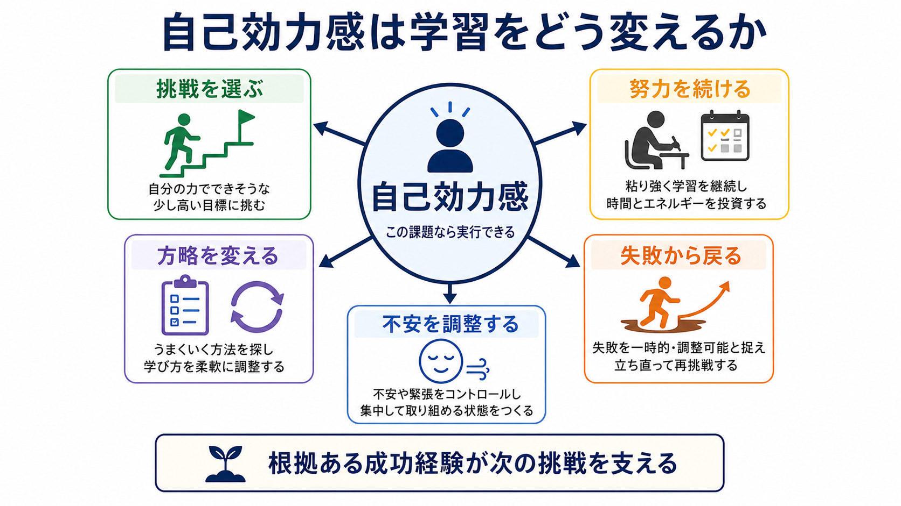
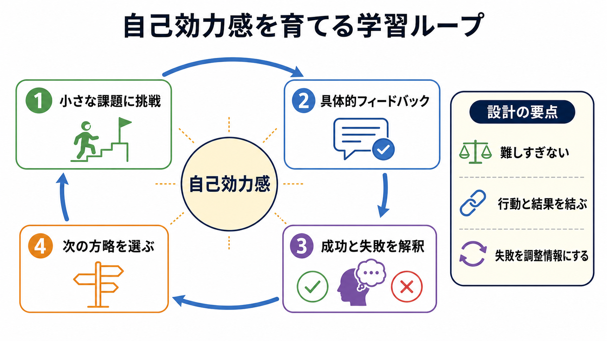

# 自己効力感は学習にどう影響するのか

## 要点

- 自己効力感とは、「この課題に必要な行動を自分は実行できる」という課題特異的な信念であり、単なる自信や楽観とは違う[1][2]。
- 学習では、挑戦する課題の選択、努力量、粘り強さ、失敗後の立て直し、学習方略の調整に影響する[2][4]。
- 自己効力感は結果を直接保証する魔法ではない。実際の技能、課題の難しさ、支援環境、フィードバック、健康状態と一緒に働く[3][7]。
- 最も強い情報源は、本人が「自分の行動でできた」と解釈できる達成経験である。ただし、代理経験、言語的説得、情動・身体状態も効く[1][6]。
- 教育実践では、根拠のない励ましよりも、小さく達成可能な課題、具体的フィードバック、失敗を調整情報として読む設計が重要である[5][6]。

## この記事で答える問い

1. 自己効力感は、学習のどの場面に影響するのか。
2. 「自分はできる」という信念は、なぜ挑戦、努力、回復力に関わるのか。
3. 自己効力感を高める教育的支援では、何に注意すべきか。

## まず結論

自己効力感は、学習成績そのものより手前にある「行動の入口」を変える。学習者が難しい課題を見たとき、自己効力感があると「試す価値がある」「やり方を変えれば進める」と解釈しやすい。一方、自己効力感が低いと、同じ課題でも「自分には無理だ」「失敗したら能力不足が証明される」と読まれ、回避や早い断念につながりやすい[1][4]。

ただし、自己効力感は能力の代用品ではない。学習成果を支えるには、実際の練習、適切な難易度、[[メタ認知とは何か|メタ認知]]、フィードバック、休息、環境調整が必要である。自己効力感は、それらを使って行動し続けるための「実行可能性の見積もり」として働く。

## 背景

Banduraの社会的認知理論では、人間の行動は、個人内要因、行動、環境が相互に影響しあうものとして説明される。自己効力感はこの枠組みの中で、特定の行動を組織化し実行できるという信念として位置づけられた[1]。ここで重要なのは、結果への期待と自己効力感を分ける点である。「この勉強法は成績を上げる」と思っていても、「自分がそれを続けられる」と思えなければ行動は起こりにくい。

学習研究では、自己効力感は自己調整学習、動機づけ、学業成績と繰り返し関連づけられてきた。Zimmermanは、自己効力感が課題選択、努力、持続、感情反応、自己調整過程と関係し、学習を支える中心的な動機づけ要因だと整理した[4]。Pajaresも、学業場面では、課題に対応した具体的な自己効力感尺度の方が、全般的な自己概念よりも関連する成果を予測しやすいと論じている[3]。

## 基本概念

### 自己効力感と似た概念

自己効力感は、[[自己効力感とは何か]]で整理されるように、「自分には価値がある」という自尊感情ではなく、「この条件で、この行動を実行できる」という判断である。たとえば「自分は価値ある人間だ」と感じていても、初めての統計解析には自己効力感が低いことがある。逆に、特定の英単語テストには自信があっても、全体的な[[自己評価はどのように形成されるのか|自己評価]]が安定しているとは限らない。

| 概念 | 中心となる問い | 学習での例 |
|---|---|---|
| 自己効力感 | この行動を実行できるか | この問題集を毎日20分進められるか |
| 結果期待 | その行動は望ましい結果を生むか | 復習すれば点数は上がるか |
| 自己概念 | 自分はどんな人か | 自分は理系が得意な人間か |
| 自尊感情 | 自分には価値があるか | 失敗しても自分の価値は保たれるか |

### 学習での自己効力感は状況特異的である

「勉強に自信があるか」という粗い質問だけでは、自己効力感を捉えにくい。数学の文章題、英語のリスニング、論文読解、発表準備では、必要な技能も環境も違う。Pajaresは、自己効力感を測るときには、評価したい課題や成果と同じ粒度で尋ねる必要があると強調している[3]。

## 仕組み

### 1. 挑戦する課題を選びやすくする

自己効力感が高い学習者は、やや難しい課題を「成長の機会」と見なしやすい。逆に低い場合、課題が少し難しくなるだけで、能力不足の証拠として受け取り、避ける方向に動きやすい。Schunkは、自己効力感が目標設定、情報処理、モデル提示、帰属的フィードバック、報酬と関係しながら学業動機づけを支えると整理している[5]。

### 2. 努力と持続を支える

自己効力感は「努力すれば必ず成功する」という信念ではない。むしろ、「いまの方法がうまくいかなくても、別の方法を試せる」という持続可能性の見積もりに近い。Multonらのメタ分析では、自己効力感は学業成績および持続性と有意に関連していたが、研究間の効果は一様ではなく、対象や測定方法によって変わっていた[2]。

### 3. 方略を変える余地を残す

自己効力感が適切に保たれていると、失敗は「能力がない証拠」ではなく「方略を変える情報」として読まれやすい。ここで[[メタ認知とは何か|メタ認知]]が重要になる。PintrichとDe Grootの教室研究でも、自己効力感、内発的価値、自己調整、学習方略は学業遂行と関連しており、動機づけと方略を切り離さず見る必要が示されている[8]。学習者は、自分の理解度を監視し、復習、要約、問題演習、質問、休息などの方略を切り替える必要がある。

### 4. 不安と身体状態の解釈を変える

Banduraは、自己効力感の情報源として、達成経験、代理経験、言語的説得、生理的・情動的状態を挙げた[1]。試験前の緊張を「失敗のサイン」と読むか、「準備した課題に体が反応している」と読むかで、行動は変わる。もちろん、強い不安や睡眠不足を気合で処理すべきという意味ではない。身体状態は、支援や休息を含めて調整する対象である。

## 図解

図1は、自己効力感が学習行動の入口を複数方向に変えることを示している。中心にあるのは「自分は万能である」という信念ではなく、「この課題なら、行動を組み立てて実行できる」という判断である。

図2は、自己効力感が一度高まれば終わりではなく、課題への挑戦、フィードバック、成功・失敗の解釈、次の方略選択を通じて更新されることを示す。教育的には、成功経験を偶然として流さず、「何をしたから進んだのか」を学習者が説明できるようにすることが重要である。

## 臨床・研究との接続

教育研究では、自己効力感は学業成績と中程度に関連するが、因果方向は単純ではない。HonickeとBroadbentの大学生研究の体系的レビューでは、学業自己効力感は成績と中程度に関連し、努力調整、深い処理方略、目標志向などが媒介・調整要因として挙げられた。一方で、縦断研究や介入研究が限られているため、因果を断定しすぎない必要がある[7]。

臨床・支援場面では、自己効力感を「本人の気持ちの問題」として扱うと危険である。不安、抑うつ、発達特性、慢性疲労、家庭環境、経済的制約、学校文化は、学習行動の実行可能性を大きく変える。したがって、自己効力感を扱う支援は、個人の信念だけでなく、課題設計、支援資源、評価方法、休息、周囲の期待を含めて考える必要がある。

[[観察学習とは何か|観察学習]]も重要である。自分に近い他者が課題に取り組み、失敗しながら修正していく姿を見ることは、代理経験として自己効力感を支える。ただし、完璧すぎるモデルは「自分とは違う人」と見なされ、逆効果になることがある[6]。

## よくある誤解

### 誤解1: 自己効力感は高ければ高いほどよい

高い自己効力感は挑戦や持続を助けるが、実際の技能や準備とずれて高すぎると、準備不足やリスクの過小評価につながる。必要なのは、根拠のある自己効力感である。

### 誤解2: 褒めれば自己効力感は上がる

言語的説得は情報源の一つだが、達成経験を伴わない励ましは弱い。特に「すごい」「才能がある」より、「この解法を使ったから進んだ」「間違いを見つけて修正できた」のように、行動と結果を結ぶフィードバックの方が学習に接続しやすい[5][6]。

### 誤解3: 自己効力感が低い人は努力不足である

自己効力感の低さは、過去の失敗経験、支援不足、比較環境、身体状態、課題の難しさから生じることがある。本人を責めるより、課題を小さく分け、成功基準を明確にし、必要な支援を整える方が実践的である。

### 誤解4: 成績が上がれば自己効力感も自動的に上がる

成績が上がっても、「運がよかった」「先生が助けてくれただけ」と解釈されれば、自己効力感には残りにくい。成果を、本人の行動、方略、努力、環境調整と結びつけて振り返る必要がある。

## 関連ノート

既存ノート:

- [[自己効力感とは何か]]
- [[観察学習とは何か]]
- [[自己評価はどのように形成されるのか]]
- [[メタ認知とは何か]]
- [[オペラント条件づけとは何か]]
- [[強化とは何か]]

関連ノート候補:

- 自己調整学習とは何か
- 学業自己効力感とは何か
- 目標設定は学習をどう変えるのか
- フィードバックは学習をどう変えるのか

MOC更新候補:

- `content/00_MOC/MOC｜認知科学・心理学.md` の「学習・行動・動機づけ」周辺に追加する。

## 理解チェック

1. 自己効力感と結果期待の違いを、試験勉強の例で説明できるか。
2. 自己効力感が低い学習者に対して、「励ます」以外にどのような課題設計ができるか。
3. 失敗経験が自己効力感を下げる場合と、次の学習に役立つ場合の違いは何か。
4. 自己効力感を測るとき、なぜ課題の粒度をそろえる必要があるのか。

## 参考文献

[1] Bandura, A. (1977). Self-efficacy: Toward a unifying theory of behavioral change. *Psychological Review, 84*(2), 191-215. https://doi.org/10.1037/0033-295X.84.2.191

[2] Multon, K. D., Brown, S. D., & Lent, R. W. (1991). Relation of self-efficacy beliefs to academic outcomes: A meta-analytic investigation. *Journal of Counseling Psychology, 38*(1), 30-38. https://doi.org/10.1037/0022-0167.38.1.30

[3] Pajares, F. (1996). Self-efficacy beliefs in academic settings. *Review of Educational Research, 66*(4), 543-578. https://doi.org/10.3102/00346543066004543

[4] Zimmerman, B. J. (2000). Self-efficacy: An essential motive to learn. *Contemporary Educational Psychology, 25*(1), 82-91. https://doi.org/10.1006/ceps.1999.1016

[5] Schunk, D. H. (1991). Self-efficacy and academic motivation. *Educational Psychologist, 26*(3-4), 207-231. https://doi.org/10.1080/00461520.1991.9653133

[6] Usher, E. L., & Pajares, F. (2008). Sources of self-efficacy in school: Critical review of the literature and future directions. *Review of Educational Research, 78*(4), 751-796. https://doi.org/10.3102/0034654308321456

[7] Honicke, T., & Broadbent, J. (2016). The influence of academic self-efficacy on academic performance: A systematic review. *Educational Research Review, 17*, 63-84. https://doi.org/10.1016/j.edurev.2015.11.002

[8] Pintrich, P. R., & De Groot, E. V. (1990). Motivational and self-regulated learning components of classroom academic performance. *Journal of Educational Psychology, 82*(1), 33-40. https://doi.org/10.1037/0022-0663.82.1.33

## 未解決問題

- 自己効力感が成績を高める経路と、成績が自己効力感を高める経路を、縦断研究でどこまで分離できるか。
- AIチューターや学習アプリのフィードバックは、自己効力感を支えるのか、それとも過信や依存を生むのか。
- 不安、睡眠不足、家庭環境、発達特性がある場合、自己効力感支援をどのように環境調整と組み合わせるべきか。
