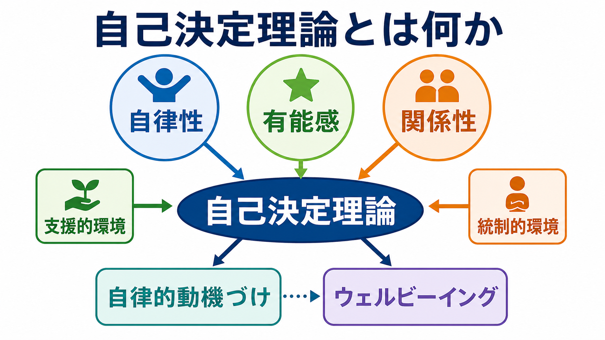
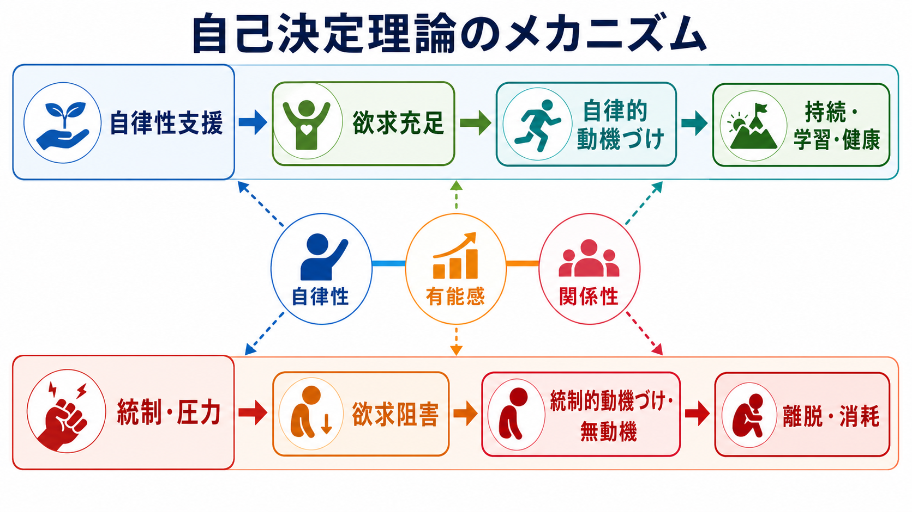
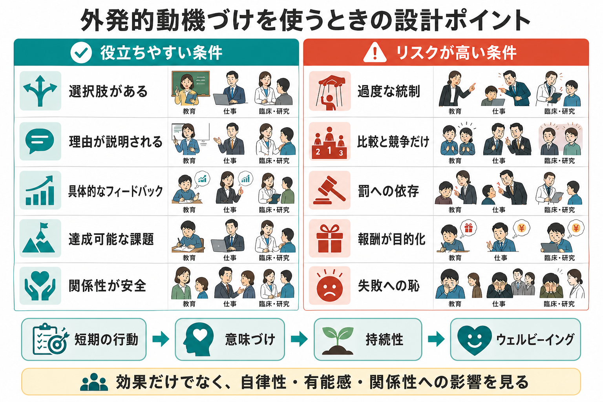

# 自己決定理論とは何か

## 要点

- 自己決定理論は、人が「どれだけ動機づけられているか」だけでなく、「どのような質の動機づけで動いているか」を問う理論である[1][2]。
- 中心にあるのは、**自律性**、**有能感**、**関係性**という3つの基本的心理欲求である。これらが充足されるほど、内発的動機づけ、自律的な外発的動機づけ、ウェルビーイングが支えられやすい[2][3][5]。
- 自律性は「何でも自由にすること」ではなく、自分の価値・理由・納得感と行動がつながっている感覚である[3][4]。
- 外発的動機づけはすべて悪いわけではない。重要なのは、報酬・評価・義務が、本人の価値として内在化されているか、外からの圧力として働いているかである[3][4]。
- 教育、医療・健康行動、心理療法、職場研究では、単に行動を増やすよりも、選択肢、意味づけ、具体的フィードバック、関係性の安全を設計することが重要になる[7][8]。

## この記事で答える問い

この記事では、[[オペラント条件づけとは何か]]や[[強化とは何か]]で扱う報酬・強化の考え方を背景に、次の問いに答える。

1. 自己決定理論は、動機づけをどのように説明するのか。
2. 自律性・有能感・関係性とは何か。
3. 内発的動機づけと外発的動機づけは、どう違うのか。
4. 報酬、評価、罰、支援は、動機づけの質にどう影響するのか。
5. 教育・健康・臨床・研究で使うとき、どこに注意すべきか。

## まず結論

自己決定理論は、動機づけを「量」ではなく「質」から見る理論である。人は、外から命令されて動くことも、自分で価値を見いだして動くことも、活動そのものが面白くて動くこともある。表面的には同じ行動でも、背景にある理由が違えば、持続性、学習の深さ、ストレス、健康への影響は変わる[2][3]。

この理論の核は、3つの基本的心理欲求である。

| 欲求 | 短い定義 | 典型的な支援 |
|---|---|---|
| 自律性 | 自分の価値や理由と行動がつながっている感覚 | 選択肢、理由の説明、圧力を減らす |
| 有能感 | 課題に働きかけ、上達できる感覚 | 達成可能な課題、具体的フィードバック |
| 関係性 | 他者とつながり、尊重されている感覚 | 共感、承認、安全な対話 |

ここでいう自律性は、孤立した自己決定でも、単なる自由放任でもない。むしろ、他者との関係の中で、納得できる理由を持ち、自分の行動として引き受けられることを指す。したがって自己決定理論は、[[自己とは何か]]、[[意思決定とは何か]]、[[自己効力感とは何か]]と接続しながら読むと理解しやすい。

## 背景

動機づけ研究では、長く「報酬を与えれば行動は増える」「罰を与えれば行動は減る」という見方が強かった。これは行動の頻度を扱ううえで重要であり、強化学習や行動分析の基礎にもなる。一方で、人間の学習や健康行動では、同じ報酬でも「支えられている」と感じる場合と「操作されている」と感じる場合がある。

Deci と Ryan は、内発的動機づけ、外発的動機づけ、社会的文脈、発達、ウェルビーイングを統合する枠組みとして自己決定理論を発展させた[1][2][4]。この理論は、外からの報酬や評価を否定するための理論ではない。むしろ、報酬・評価・ルール・目標が、どのような関わり方の中で提示されると、自律性・有能感・関係性を支えるのかを問う理論である。

## 基本概念

### 自律性

自律性とは、自分の行動が自分の価値、関心、納得した理由とつながっている感覚である[3][4]。これは「誰にも影響されないこと」ではない。教師、治療者、家族、上司から提案を受けても、その理由を理解し、自分にとって意味があると感じられれば、自律性は保たれうる。

逆に、選択肢が多くても、失敗への恥、罰への恐怖、他者からの圧力だけで動いているなら、自律性は低い。自律性支援では、本人の視点を聴く、選択肢を示す、制限が必要な場合にも理由を説明する、統制的な言い方を避けることが重視される[8]。

### 有能感

有能感とは、環境に働きかけ、課題を達成し、上達できるという感覚である。[[自己効力感とは何か]]と近いが、自己決定理論では、基本的心理欲求の一つとして位置づけられる。課題が簡単すぎると退屈になり、難しすぎると無力感が生じやすい。適度な挑戦、明確な目標、具体的なフィードバックが、有能感を支える。

重要なのは、評価そのものではなく、評価が「能力を伸ばす情報」として働くか、「人としての価値を裁く圧力」として働くかである。外的報酬の効果に関するメタ分析では、報酬が統制的に経験される場合、内発的動機づけを弱めうることが示されている[6]。

### 関係性

関係性とは、他者とつながり、尊重され、気にかけられている感覚である[3][5]。自己決定理論は「個人主義的な自由の理論」と誤解されることがあるが、実際には関係性を基本的心理欲求の一つとして扱う。人は、信頼できる他者との関係の中でこそ、困難な課題に取り組み、自分の価値として目標を引き受けやすくなる。

この点は、教育や臨床で特に重要である。支援者が正しい助言をしていても、本人が見下されている、操作されている、孤立していると感じれば、助言は自律的な行動に結びつきにくい。

### 動機づけの連続体

自己決定理論では、外発的動機づけを単純に「悪いもの」としない。外発的動機づけには、自律性の低いものから高いものまで段階がある[3][4]。

| 動機づけの型 | 行動の理由 | 例 |
|---|---|---|
| 無動機 | なぜやるのか分からない | どうせ無理だと思い課題を避ける |
| 外的調整 | 報酬・罰・命令 | 叱られないために課題を出す |
| 取り入れ的調整 | 罪悪感・恥・自己価値の維持 | できない自分が嫌で無理に続ける |
| 同一化的調整 | 価値を認めている | 健康のために運動する |
| 統合的調整 | 自分の価値体系と統合されている | 研究者として必要だから論文を読む |
| 内発的動機づけ | 活動自体が面白い | 学ぶこと自体が楽しくて続ける |

この連続体で重要なのは、外から始まった行動でも、理由が理解され、本人の価値として内在化されると、より自律的な動機づけに近づくことである。

## 仕組み

自己決定理論の基本的な仕組みは、次のように読める。

1. 周囲の環境が、本人の視点を尊重し、選択肢と理由を与える。
2. 自律性・有能感・関係性が充足される。
3. 行動の理由が、外からの圧力ではなく、自分にとって意味のあるものとして内在化される。
4. 行動の持続、深い学習、健康行動、ウェルビーイングが支えられる。

反対に、環境が過度に統制的で、罰や比較や恥によって行動を動かすと、短期的には行動が増えても、欲求阻害、回避、消耗、無動機につながることがある[5][6]。

この仕組みは、[[強化とは何か]]の否定ではない。むしろ、強化や報酬が「情報」として働くのか、「統制」として働くのかを区別するための視点を与える。たとえば、フィードバックが「ここが改善できている」と具体的に能力情報を与えるなら有能感を支えやすい。一方で、「これをしないと価値がない」と感じさせる評価は、自律性と関係性を損ないやすい。

## 図解

図1は、自己決定理論の全体像を示している。自律性・有能感・関係性という3つの基本的心理欲求が、自律的動機づけとウェルビーイングを支える一方で、支援的環境と統制的環境の違いがその過程を左右する。

図2は、もっとも基本的なメカニズムを示している。自律性支援は、基本的心理欲求の充足を通じて自律的動機づけを支える。統制・圧力は、欲求阻害を通じて統制的動機づけや無動機につながりやすい。

図3は、外発的動機づけを使うときの設計ポイントである。報酬、評価、締切、ルールは不要ではない。しかし、それらが過度な統制、比較、罰への依存、失敗への恥として経験されると、短期の行動は増えても、長期の学習や健康には不利になることがある。

## 臨床・研究との接続

### 教育

教育では、自己決定理論は「ほめればよい」「自由にさせればよい」という単純な話ではない。むしろ、課題の意味を説明する、選択の余地を作る、達成可能な難度に調整する、具体的なフィードバックを返す、教師との関係性を安全にすることが重要になる。自律性支援に関するメタ分析は、教師や指導者の支援的な関わりが、生徒の動機づけや学習成果と関連することを示している[8]。

### 健康行動

健康行動では、禁煙、運動、服薬、食事、リハビリテーションのように、短期的には負担が大きく、長期的な価値を理解する必要がある行動が多い。自己決定理論に基づく健康心理学のメタ分析では、自律性支援、欲求充足、自律的動機づけが、健康行動や心理的健康と関連することが報告されている[7]。

ただし、これは「本人に任せればよい」という意味ではない。医療や支援では、安全上の制約、症状、認知機能、生活資源、家族環境を考慮する必要がある。自己決定理論は、個別の診断や治療指示ではなく、支援の質を点検する教育・研究上の枠組みとして使うのが適切である。

### 心理療法・臨床研究

心理療法では、治療目標が本人にとってどの程度意味を持つか、治療者との関係が安全か、小さな有能感が積み上がっているかが重要になる。これは、[[メタ認知とは何か]]や[[情動と認知は分けられるのか]]で扱う自己理解・感情調整とも関係する。

研究では、基本的心理欲求の充足・阻害、動機づけの調整型、ウェルビーイング、行動指標を組み合わせて測定する。近年のレビューでは、欲求充足だけでなく、欲求阻害も独立に重要な予測因子として扱う必要が強調されている[5]。

## よくある誤解

### 誤解1: 自己決定理論は「好きなことだけをやる」理論である

自己決定理論の自律性は、好き勝手に行動することではない。必要な課題、規則、治療、努力であっても、理由が理解され、自分の価値と接続されれば、自律的に取り組むことができる[3][4]。

### 誤解2: 外発的報酬はすべて悪い

外発的報酬は、条件によって異なる働きをする。報酬が達成情報や感謝として経験される場合と、本人を操作する圧力として経験される場合では影響が違う。報酬研究のメタ分析は、報酬の種類、予期性、課題の面白さ、評価のされ方を区別する必要を示している[6]。

### 誤解3: 自律性支援は放任である

自律性支援は、構造をなくすことではない。むしろ、明確な目標、理由の説明、達成可能な課題、具体的なフィードバックを含む。構造がないと有能感が支えられず、自由に見えても不安や無動機が増えることがある。

### 誤解4: 3つの欲求は文化によって不要になる

文化によって自律性の表れ方は異なるが、自己決定理論では、自律性・有能感・関係性は広い文脈で重要な心理欲求とされる[4][5]。ただし、尺度の翻訳、文化的規範、集団主義・個人主義の違いを無視して同じ解釈を当てはめるべきではない。

## 関連ノート

- [[オペラント条件づけとは何か]]
- [[強化とは何か]]
- [[自己効力感とは何か]]
- [[自己とは何か]]
- [[意思決定とは何か]]
- [[メタ認知とは何か]]
- [[情動と認知は分けられるのか]]

MOC更新候補:

- `content/00_MOC/MOC｜認知科学・心理学.md`
- 学習・行動・動機づけ領域の索引に追加

## 理解チェック

1. 自己決定理論でいう「自律性」は、単なる自由や独立とどう違うか。
2. 有能感を支えるフィードバックと、統制的に働く評価は何が違うか。
3. 外発的動機づけが、同一化的調整や統合的調整へ近づくとはどういうことか。
4. 教育・医療・職場のどれか一つを選び、自律性・有能感・関係性を支える関わりを具体例で説明できるか。

## 参考文献

[1] Deci, E. L., & Ryan, R. M. (1985). *Intrinsic Motivation and Self-Determination in Human Behavior*. Springer. https://doi.org/10.1007/978-1-4899-2271-7

[2] Ryan, R. M., & Deci, E. L. (2000). Self-determination theory and the facilitation of intrinsic motivation, social development, and well-being. *American Psychologist, 55*(1), 68-78. https://doi.org/10.1037/0003-066X.55.1.68

[3] Deci, E. L., & Ryan, R. M. (2000). The "what" and "why" of goal pursuits: Human needs and the self-determination of behavior. *Psychological Inquiry, 11*(4), 227-268. https://doi.org/10.1207/S15327965PLI1104_01

[4] Ryan, R. M., & Deci, E. L. (2017). *Self-Determination Theory: Basic Psychological Needs in Motivation, Development, and Wellness*. Guilford Press. https://doi.org/10.1521/978.14625/28806

[5] Vansteenkiste, M., Ryan, R. M., & Soenens, B. (2020). Basic psychological need theory: Advancements, critical themes, and future directions. *Motivation and Emotion, 44*, 1-31. https://doi.org/10.1007/s11031-019-09818-1

[6] Deci, E. L., Koestner, R., & Ryan, R. M. (1999). A meta-analytic review of experiments examining the effects of extrinsic rewards on intrinsic motivation. *Psychological Bulletin, 125*(6), 627-668. https://doi.org/10.1037/0033-2909.125.6.627

[7] Ng, J. Y. Y., Ntoumanis, N., Thogersen-Ntoumani, C., Deci, E. L., Ryan, R. M., Duda, J. L., & Williams, G. C. (2012). Self-determination theory applied to health contexts: A meta-analysis. *Perspectives on Psychological Science, 7*(4), 325-340. https://doi.org/10.1177/1745691612447309

[8] Su, Y.-L., & Reeve, J. (2011). A meta-analysis of the effectiveness of intervention programs designed to support autonomy. *Educational Psychology Review, 23*, 159-188. https://doi.org/10.1007/s10648-011-9159-3

## 未解決問題

- 自律性支援の効果は、文化、年齢、発達特性、症状、社会経済的資源によってどのように変わるのか。
- 欲求充足と欲求阻害は、同じ連続体の両端なのか、それとも異なるメカニズムとして測るべきなのか。
- 報酬、ゲーミフィケーション、AIチュータリングを使うとき、自律性・有能感・関係性を損なわない設計条件は何か。
