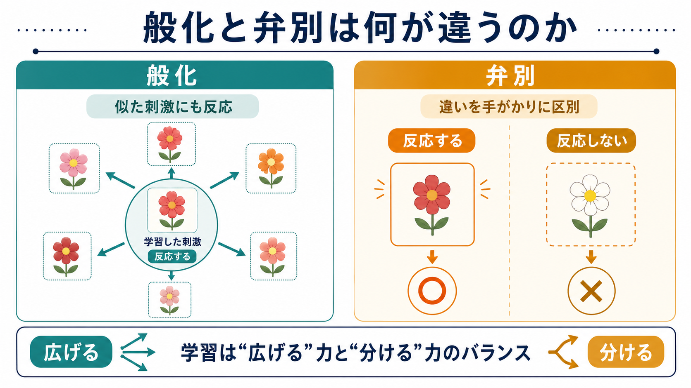
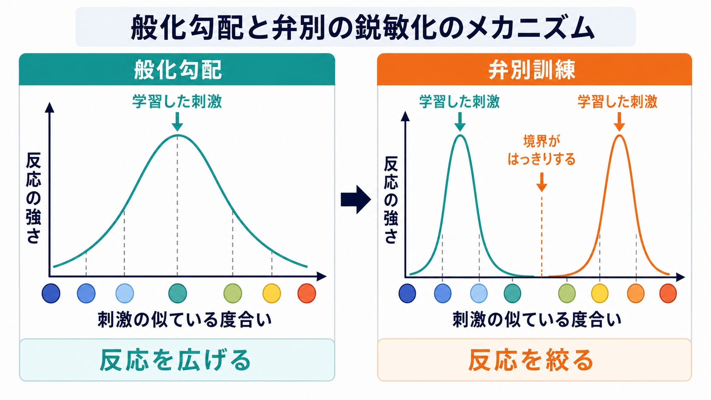
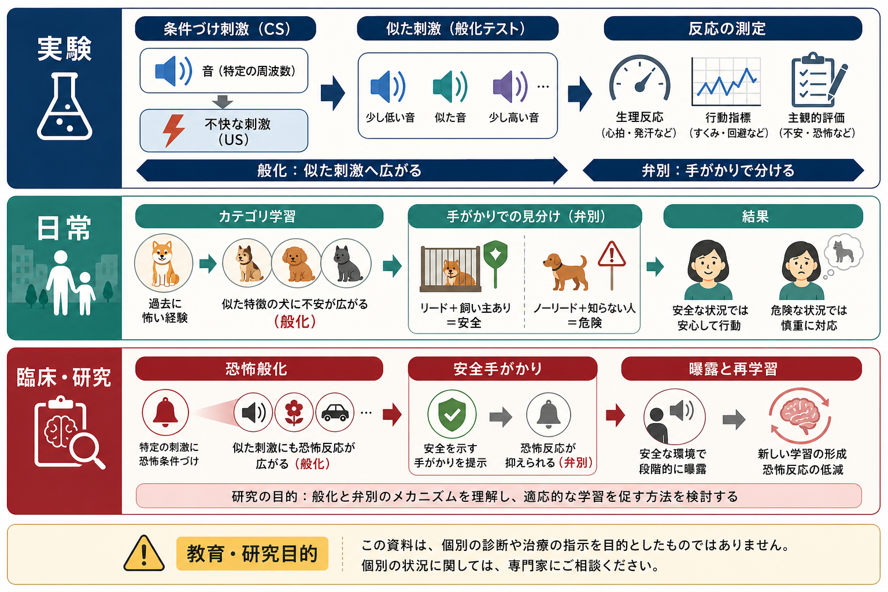

# 般化と弁別は何が違うのか

## 要点

- 般化とは、学習した刺激や状況に似た刺激にも反応が広がることである。たとえば、特定の音で反応を学ぶと、少し高さの違う音にも反応することがある[1][2]。
- 弁別とは、似た刺激の違いを手がかりにして、反応すべき刺激と反応しなくてよい刺激を区別する学習である[1][2]。
- 両者は反対語というより、学習が「どこまで広げるか」と「どこで分けるか」を調整する2つの側面である。
- 般化が弱すぎると応用が利かず、強すぎると不要な反応が広がる。弁別が弱いと過剰反応が起きやすく、強すぎると学習が狭い場面に閉じる。
- 恐怖・不安研究では、危険手がかりへの反応が安全な類似刺激へ広がる「恐怖般化」と、安全手がかりを見分ける「弁別」が重要な研究テーマである[6][7]。ただし、本記事は教育・研究目的であり、個別の診断や治療指示ではない。

## この記事で答える問い

1. 般化と弁別は、それぞれ何を指すのか。
2. なぜ学習には「広げる」働きと「分ける」働きの両方が必要なのか。
3. 般化勾配や弁別訓練は、どのように考えればよいのか。
4. 日常のカテゴリー学習、[[古典的条件づけとは何か|古典的条件づけ]]、[[オペラント条件づけとは何か|オペラント条件づけ]]、恐怖・不安研究とどうつながるのか。

## まず結論

般化は「似ていれば同じように扱う」方向の学習であり、弁別は「似ていても違いに基づいて分ける」方向の学習である。

この2つは、どちらか一方が正しいという関係ではない。学習が実生活で役立つには、経験したことを少し違う場面にも使える必要がある。これが般化である。一方で、何でも同じように扱うと、危険でないものを危険とみなしたり、関係のない場面で反応したりする。そこで、どの違いが重要かを学ぶ必要がある。これが弁別である。

したがって、般化と弁別の違いは、「反応が似た刺激へ広がるか」「似た刺激の中で境界を引くか」にある。より直感的には、般化は学習を外へ広げる働き、弁別は学習を必要な範囲へ絞る働きである。

## 背景

般化と弁別は、[[古典的条件づけとは何か|古典的条件づけ]]の用語として説明されることが多い。古典的条件づけでは、ある刺激が重要な出来事を予測するようになると、その刺激だけで反応が生じる。ところが現実の刺激は完全に同じ形で繰り返されるわけではない。音の高さ、場所の明るさ、人の表情、身体感覚、文脈は少しずつ変化する。

ここで問題になるのが、「どれくらい似ていれば同じものとして扱うのか」である。Pavlov の条件反射研究以来、学習した刺激に似た刺激にも反応が広がること、また訓練によって似た刺激を区別できるようになることは、学習研究の基本現象として扱われてきた[2][3]。

現代的には、これは単なる刺激反応の話にとどまらない。脳や心は、限られた経験から次に何が起きるかを予測する。[[予測処理とは何か|予測処理]]の言葉で言えば、般化は「既存の予測を似た入力に適用する」働き、弁別は「予測を修正し、区別すべき入力を分ける」働きとして読める。

## 基本概念

### 般化

般化は、学習した反応が、元の刺激と似た刺激にも生じる現象である。たとえば、1000 Hz の音が嫌悪刺激を予測するように学習されたとき、900 Hz や1100 Hz の音にも反応が出ることがある。このように、元の刺激からの類似性に応じて反応が広がる[1][3]。

この広がりは、日常ではむしろ役に立つ。ある店で「赤い非常ボタン」を押して助けを呼ぶことを覚えた人は、別の建物で少し形の違う非常ボタンを見ても、同じ種類のものだと理解できる。毎回まったく同じ刺激でなければ学習が使えないなら、学習はきわめて不便になる。

### 弁別

弁別は、似た刺激を区別し、反応の有無や反応の仕方を変える学習である。たとえば、ある音は危険を予測するが、よく似た別の音は何も予測しないと学ぶと、前者には反応し、後者には反応しにくくなる。

弁別では、刺激の違いそのものではなく、「どの違いが結果を予測するか」が重要である。色の違い、音の高さ、場所、文脈、相手の表情など、反応にとって意味のある手がかりが選ばれる。これは[[認知的柔軟性とは何か|認知的柔軟性]]やカテゴリー学習とも関わる。

### 般化勾配

般化の強さは、元の刺激との類似性に応じて連続的に変わることが多い。この関係は般化勾配と呼ばれる[3][4]。元の刺激に近いほど反応は強く、遠いほど弱い、という形で表される。

ただし、般化勾配は固定された物理法則ではない。何を似ているとみなすかは、感覚系、注意、過去の学習、文脈、課題要求によって変わる。たとえば、専門家は初心者には同じに見える刺激を細かく区別できることがある。これは弁別経験によって、重要な差異が見えやすくなるためである。

## 仕組み

### 1. 類似性が反応を広げる

般化の出発点は、刺激間の類似性である。完全に同じ刺激でなくても、音の高さ、形、色、文脈、意味、身体感覚などが似ていれば、過去に学習した反応が呼び出されやすくなる。

動物行動研究では、般化勾配を使って、刺激の物理的類似性と反応の強さの関係が調べられてきた[3][4]。人間では、物理的な類似性だけでなく、意味的な類似性やカテゴリーも関わる。たとえば、ある犬に噛まれた経験が「同じ犬種」だけでなく「大きな犬」「吠える犬」「夜道で近づく動物」へ広がることがある。

### 2. 予測誤差が境界を調整する

学習は、予測と結果のずれによって更新される。Rescorla-Wagner モデルでは、条件刺激の連合強度は、実際に起きた結果と予測された結果の差、すなわち予測誤差に応じて変化すると表現される[5]。

単純化すれば、次のように書ける。

$$
\Delta V = \alpha \beta (\lambda - V)
$$

ここで $V$ は刺激が持つ予測価値、$\lambda$ は実際の結果の強さ、$\lambda - V$ は予測誤差を表す。ある刺激が結果を予測し続ければ、その刺激への反応は強まる。似た刺激が結果を予測しなければ、その刺激への反応は弱まり、弁別が進む。

### 3. 弁別訓練が反応を絞る

弁別訓練では、ある刺激には結果が伴い、似た別の刺激には結果が伴わない、という経験が繰り返される。すると、反応は「似ているもの全体」から「結果を予測する刺激」へ絞られていく[1][2]。

これは、学習が単に強くなる過程ではなく、選択的になる過程でもあることを示している。重要なのは、反応の大きさだけでなく、反応の配置である。どの刺激に反応し、どの刺激には反応しないかが、学習の精度を決める。

### 4. 文脈と記憶検索が影響する

般化と弁別は、刺激そのものだけで決まらない。場所、時間、身体状態、過去の経験、言語的説明なども反応を変える。消去や再学習に関する研究では、反応が文脈依存的に戻ることがあり、記憶が単純に消えるのではなく、どの記憶が検索されるかが重要だと考えられている[8]。

この点は、[[エピソード記憶とは何か|エピソード記憶]]や[[情動と認知は分けられるのか|情動と認知]]とも関係する。反応は、刺激の物理的特徴だけでなく、「その刺激が自分にとって何を意味するか」という記憶と評価に支えられる。

## 図解

| 観点 | 般化 | 弁別 |
|---|---|---|
| 中心的な働き | 学習した反応を似た刺激へ広げる | 似た刺激の違いを手がかりに反応を分ける |
| 典型例 | ある音で学んだ反応が、似た高さの音にも出る | 危険を予測する音と安全な音を区別する |
| 利点 | 新しい場面に学習を応用できる | 不要な反応を減らし、反応を精密にできる |
| 行き過ぎた場合 | 過剰反応、恐怖や警戒の広がり | 過度に狭い学習、応用のしにくさ |
| 研究での見方 | 般化勾配、類似性、カテゴリー | 弁別訓練、境界、手がかり選択 |

## 臨床・研究との接続

恐怖条件づけ研究では、危険を予測する刺激に対して恐怖反応が学習され、その反応が似た刺激へ広がることがある。これが恐怖般化である。恐怖般化は、危険を広めに見積もるという点では防御的に有利な場合もあるが、安全な刺激にまで強い反応が広がると、生活の範囲を狭める要因になりうる[6][7]。

不安症やトラウマ関連症状の研究では、危険手がかりと安全手がかりの区別が難しくなること、すなわち弁別の弱さや過剰般化が注目されている[7]。この論点は、[[PTSDでは恐怖記憶ネットワークに何が起きているのか|PTSDの恐怖記憶ネットワーク]]や[[扁桃体過活動は不安症やPTSDにどう関わるのか|扁桃体過活動]]の理解とも接続する。

曝露療法の理論では、恐れていた結果が起きない経験を通じて、新しい安全学習を形成することが重視される[8]。ここでも大切なのは、恐怖反応を単に弱めるだけでなく、安全な文脈や手がかりを学び、危険と安全をよりよく弁別できるようになることである。ただし、これは治療原理の研究的説明であり、個別の症状に対する判断や治療選択は専門家と相談して行う必要がある。

教育や技能学習でも同じ構造がある。数学の解法を新しい問題に使えるのは般化であり、似ているが別の解法が必要な問題を見分けるのは弁別である。学習支援では、例を増やして応用範囲を広げるだけでなく、紛らわしい例を比較して違いを見せることが重要になる。

## よくある誤解

### 誤解1: 般化は悪いことで、弁別は良いことである

般化は、学習を実生活に使うために不可欠である。問題になるのは、般化そのものではなく、必要以上に広がることである。同様に、弁別も常に良いわけではない。弁別が狭すぎると、少し条件が変わっただけで学習を使えなくなる。

### 誤解2: 般化は「雑な反応」である

般化は単なる雑さではない。限られた経験から未経験の状況に対応するための合理的な働きである。生物は、完全に同じ出来事だけを待ってから反応するわけにはいかない。似た状況に過去の学習を使うことは、予測と適応の基本である[3][4]。

### 誤解3: 弁別は刺激の違いを見つけるだけである

弁別で重要なのは、物理的な違いを見つけることだけではない。その違いが、結果や意味の違いを予測するかどうかである。たとえば、色の違いが重要な課題もあれば、形や文脈の違いが重要な課題もある。

### 誤解4: 恐怖般化だけで不安症を説明できる

恐怖般化は重要な研究概念だが、不安やPTSDを単独で説明するものではない。記憶、注意、予測、身体感覚、社会的意味づけ、生活史などが重なって症状は形成される。般化と弁別は、その一部を理解するための基礎語彙である。

## 関連ノート

- [[古典的条件づけとは何か]]
- [[オペラント条件づけとは何か]]
- [[予測処理とは何か]]
- [[情動と認知は分けられるのか]]
- [[認知的柔軟性とは何か]]
- [[エピソード記憶とは何か]]
- [[神経可塑性は発達と学習をどう支えるのか]]
- [[PTSDでは恐怖記憶ネットワークに何が起きているのか]]
- [[扁桃体過活動は不安症やPTSDにどう関わるのか]]

### 関連ノート候補

- 恐怖条件づけとは何か
- 消去学習とは何か
- 般化勾配とは何か
- 弁別訓練とは何か
- 安全学習とは何か

### MOC更新候補

- `content/00_MOC/MOC｜認知科学・心理学.md`

## 理解チェック

1. 般化と弁別を、それぞれ一文で説明できるか。
2. 般化がまったく起きない学習には、どのような不便があるか。
3. 弁別が弱いと、どのような過剰反応が起こりうるか。
4. 般化勾配とは何を表す図か。
5. 恐怖般化を臨床研究へ接続するとき、なぜ個別診断や治療指示と混同してはいけないのか。

## 未解決問題

- 物理的類似性、意味的類似性、文脈類似性は、般化勾配にどのように重みづけされるのか。
- 人間の言語的説明や自己理解は、恐怖般化と弁別学習をどの程度変化させるのか。
- 動物実験で得られた恐怖般化の知見を、人間の不安症やPTSDにどこまで一般化できるのか。
- 曝露や安全学習を、別の文脈でも保持されやすくする条件は何か。

## 参考文献

[1] Sanvictores, T., Mahabadi, N., & Rehman, C. I. (2024). Classical Conditioning. In *StatPearls*. StatPearls Publishing. https://www.ncbi.nlm.nih.gov/sites/books/NBK470326/

[2] OpenStax. (2020). *Psychology 2e*, 6.2 Classical Conditioning. Rice University. https://openstax.org/books/psychology-2e/pages/6-2-classical-conditioning

[3] Pavlov, I. P. (1927/2010). Conditioned reflexes: An investigation of the physiological activity of the cerebral cortex. *Annals of Neurosciences*, 17(3), 136-141. https://pmc.ncbi.nlm.nih.gov/articles/PMC4116985/

[4] Ghirlanda, S., & Enquist, M. (2003). A century of generalization. *Animal Behaviour*, 66(1), 15-36. https://doi.org/10.1006/anbe.2003.2174

[5] Rescorla, R. A., & Wagner, A. R. (1972). A theory of Pavlovian conditioning: Variations in the effectiveness of reinforcement and nonreinforcement. In A. H. Black & W. F. Prokasy (Eds.), *Classical Conditioning II: Current Research and Theory* (pp. 64-99). Appleton-Century-Crofts. https://cir.nii.ac.jp/crid/1573668925942365824

[6] Dunsmoor, J. E., & Paz, R. (2015). Fear Generalization and Anxiety: Behavioral and Neural Mechanisms. *Biological Psychiatry*, 78(5), 336-343. https://doi.org/10.1016/j.biopsych.2015.04.010

[7] Cooper, S. E., van Dis, E. A. M., Hagenaars, M. A., Krypotos, A. M., Nemeroff, C. B., Lissek, S., Engelhard, I. M., & Dunsmoor, J. E. (2022). A meta-analysis of conditioned fear generalization in anxiety-related disorders. *Neuropsychopharmacology*, 47, 1652-1661. https://doi.org/10.1038/s41386-022-01332-2

[8] Craske, M. G., Treanor, M., Conway, C. C., Zbozinek, T., & Vervliet, B. (2014). Maximizing exposure therapy: An inhibitory learning approach. *Behaviour Research and Therapy*, 58, 10-23. https://doi.org/10.1016/j.brat.2014.04.006
