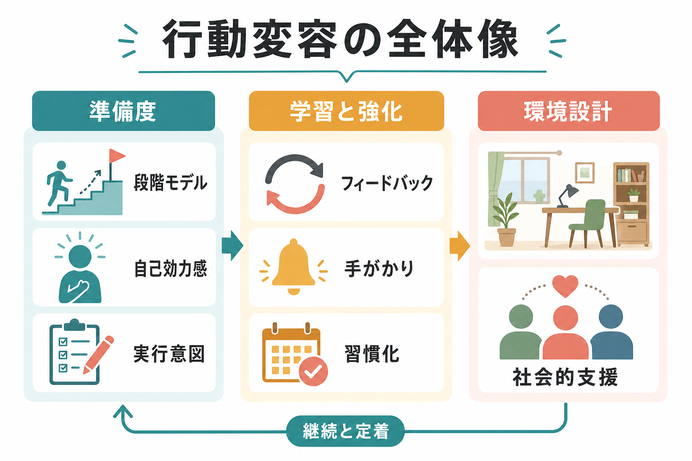
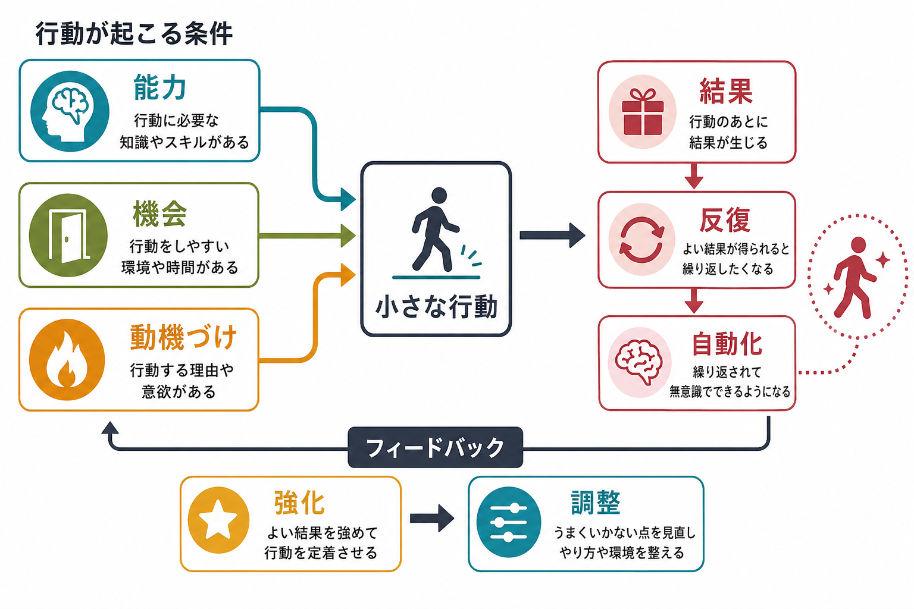
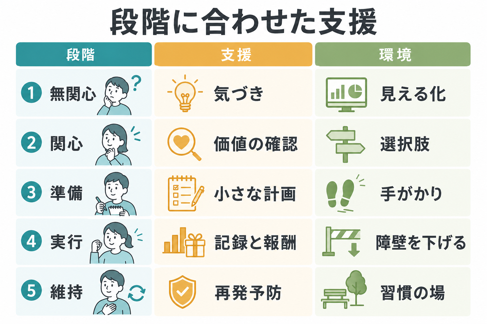

# 行動変容はどのように起こるのか

## 要点

- 行動変容は「強い意志」だけで起こるのではなく、準備度、能力、機会、動機づけ、結果からの学習、環境の手がかりが組み合わさって起こる。
- 段階モデルは、無関心から維持までの準備度に応じて支援を変えるための地図になる。ただし、人は直線的に進むだけでなく、再開や後戻りを繰り返す [1]。
- 行動を続けるには、目標を「いつ・どこで・何をするか」に落とし込み、行動の直後に得られる結果を設計する必要がある [5][6]。
- 健康行動の支援では、個人の努力だけでなく、選択肢、配置、摩擦、社会的支援などの環境設計が重要である [2][7][8]。

## この記事で答える問い

この記事では、「生活習慣を変えたいのに続かない」という現象を、[[強化とは何か]]、[[習慣形成にはどのような条件が必要なのか]]、[[目標設定は行動をどう変えるのか]]と接続しながら説明する。中心的な問いは、次の三つである。

1. 行動変容は、どのような段階を通って進むのか。
2. 行動は、どのような条件がそろうと実行され、繰り返されるのか。
3. 健康行動を支える環境は、どのように設計できるのか。

## まず結論

行動変容は、内面の決意がそのまま行動に変わる過程ではない。むしろ、本人の準備度、実行に必要な技能、周囲の機会、報酬やフィードバック、失敗後に再開できる仕組みが合わさって、少しずつ安定する過程である。

たとえば運動習慣を作る場合、「健康になりたい」と思うだけでは足りない。運動する理由を持つことに加えて、着替えや靴を見える場所に置く、短い運動から始める、実行後に記録する、疲れた日の代替行動を決めておく、といった設計が必要になる。これは[[自己効力感は学習にどう影響するのか]]や[[動機づけとは何か]]の問題でもあり、同時に環境と学習の問題でもある。

## 背景

健康行動や生活習慣の変化は、禁煙、飲酒、食事、運動、服薬、睡眠、リハビリテーションなど多くの場面で問題になる。これらは知識不足だけでは説明できない。何が健康に良いかを知っていても、疲労、ストレス、社会的圧力、時間不足、手近な選択肢、短期的な快感が行動を左右する。

このため、行動変容研究では「説得すれば変わる」という単純な見方から離れ、行動が起こる条件を分析する。COM-B モデルでは、行動は能力（Capability）、機会（Opportunity）、動機づけ（Motivation）が相互に関わることで生じると考える [2]。つまり、行動変容の設計では、本人の意欲を高めるだけでなく、技能を増やし、実行できる機会を作り、実行後の結果から学べるようにする。

## 基本概念

### 段階モデル

トランスセオレティカル・モデルは、変化を「無関心期、関心期、準備期、実行期、維持期」という段階で捉える [1]。無関心期では問題をまだ自分事として捉えていないことが多く、関心期では変えたい気持ちと変えたくない気持ちが共存する。準備期では具体的な計画が必要になり、実行期では失敗後に再開する支援が重要になる。維持期では、新しい行動を日常の文脈に埋め込むことが焦点になる。

ただし、段階モデルは「必ずこの順番で一直線に進む」という意味ではない。依存行動の研究でも、人は複数回の再挑戦を経て変化することがある [1]。したがって、後戻りは単なる失敗ではなく、次の設計を改善する情報として扱うほうが実践的である。

### 行動変容技法

行動変容技法（behavior change techniques; BCTs）は、介入の中で働く具体的な部品を表す。BCT taxonomy v1 は、目標設定、行動計画、セルフモニタリング、フィードバック、社会的支援、報酬、手がかりの追加など、93 の技法を整理している [3]。これは介入を「運動指導」「禁煙支援」と大きく呼ぶだけでなく、何が実際に行動を変える成分だったのかを記述するために役立つ。

### 習慣化

習慣化とは、同じ文脈で同じ行動を繰り返すことで、手がかりが行動を自動的に呼び出しやすくなる過程である。日常生活での習慣形成研究では、自動性の上昇には大きな個人差があり、単純に「21 日で習慣になる」とは言えないことが示されている [4]。重要なのは固定日数ではなく、安定した文脈、小さな行動、反復、実行後のフィードバックである。

## 仕組み

### 1. 準備度を合わせる

変化の初期には、本人がどの段階にいるかを見誤らないことが重要である。無関心期の人に詳細な運動メニューを渡しても、行動にはつながりにくい。逆に、準備期の人に一般的な健康リスクの説明だけを続けると、実行の機会を逃す。

段階に合った支援とは、本人の状態に合わせて問いを変えることである。無関心期では「何が困りごとなのか」、関心期では「変える利点と不安は何か」、準備期では「最初の一歩は何か」、実行期では「どこでつまずいたか」、維持期では「どの環境なら続くか」を扱う。

### 2. 行動を小さくする

大きすぎる行動は、開始前の摩擦を増やす。たとえば「毎日 60 分走る」よりも、「夕食後に運動靴を履いて 5 分歩く」のほうが実行しやすい。小さな行動は成功経験を作りやすく、[[自己効力感は学習にどう影響するのか|自己効力感]]を支えやすい。

実行意図の研究では、「もし状況 X になったら、行動 Y をする」という形で手がかりと行動を結びつける計画が、目標達成を助けることが示されている [5]。これは目標を抽象的な願望から、文脈に結びついた反応へ変換する操作である。

### 3. 結果から学ぶ

行動は、実行後の結果によって選択されやすさが変わる。気分が少し良くなる、達成感がある、記録が埋まる、他者から具体的な承認を受ける、といった結果は行動を繰り返しやすくする。これは[[強化とは何か]]で扱う強化の考え方と対応する。

ただし、報酬は大きければよいわけではない。健康行動では、実行直後に得られる小さく具体的なフィードバックのほうが、遠い将来の利益よりも行動選択に効きやすいことがある。体重、歩数、睡眠時間、気分、痛み、疲労などの記録は、行動と結果を結びつける手がかりになる。

### 4. 環境を変える

行動変容は、本人の内面だけでなく、物理的・社会的環境に強く依存する。選択アーキテクチャ研究では、物の配置、選択肢の見え方、容器の大きさ、動線、標識などの小さな環境変化が、食事、運動、飲酒、喫煙などの健康行動に影響しうると整理されている [7]。

環境設計の利点は、行動のたびに強い自己制御を要求しない点にある。たとえば、机に菓子を置かない、階段を目に入りやすくする、水を手元に置く、寝室にスマートフォンを持ち込まない、運動の予定を他者と共有する、といった設計は、行動の発生確率を変える。

### 5. 再発を設計に含める

生活習慣の変化では、中断や後戻りは例外ではない。重要なのは「失敗しないこと」ではなく、「失敗後に戻れる経路」を作ることである。NICE の行動変容ガイドラインも、個人のニーズ、実行可能性、持続可能性、証拠に基づく技法、支援者の訓練を重視している [8]。

したがって、再発予防では「やめてしまった理由」を人格の問題にせず、摩擦、疲労、社会的状況、報酬の弱さ、手がかりの欠如として分析する。これは[[学習性無力感とは何か]]を避ける意味でも重要である。

## 図解

行動変容を実践的に見ると、次のように整理できる。

| 観点 | 問い | 例 |
|---|---|---|
| 準備度 | いま変える準備はどの程度か | 無関心、関心、準備、実行、維持 |
| 能力 | その行動に必要な知識・技能はあるか | 料理の方法、運動のやり方、服薬管理 |
| 機会 | 実行できる時間・場所・支援はあるか | 近いジム、家族の協力、リマインダー |
| 動機づけ | なぜ今それをするのか | 価値、目標、痛みの軽減、社会的意味 |
| 強化 | 実行後に何が得られるか | 記録、達成感、体調変化、承認 |
| 環境 | 行動を自然に呼び出す手がかりはあるか | 物の配置、動線、選択肢、摩擦の低減 |

## 臨床・研究との接続

臨床や健康支援では、行動変容を個人の責任だけに還元しないことが重要である。喫煙、飲酒、食事、運動、睡眠、服薬、リハビリテーションには、経済状況、労働時間、家族関係、痛み、気分症状、地域資源が関わる。したがって、支援では「本人のやる気」を評価するだけでなく、行動が起こる環境と文脈を評価する必要がある。

研究面では、介入を「教育」「助言」「アプリ」と大きく分類するだけでは不十分である。どの BCT が含まれ、どの文脈で、どの集団に、どの程度の期間、どのアウトカムに効いたのかを記述する必要がある [3]。また、Behaviour Change Wheel は、行動分析から介入機能や政策カテゴリへ橋渡しする枠組みを提供している [2]。

医療・精神医学の文脈では、ここで述べる内容は教育・研究目的の一般的説明であり、個別の診断や治療指示ではない。強い抑うつ、不安、依存、摂食の問題、自傷リスク、身体疾患が関わる場合は、行動計画だけで解決しようとせず、専門的支援と安全確保を優先する。

## よくある誤解

### 誤解1: 行動変容は意志力の問題である

意志力は一部を説明するが、それだけでは不十分である。行動は能力、機会、動機づけ、手がかり、結果の影響を受ける [2]。意志が弱いから続かないのではなく、行動が起こる条件がそろっていない場合が多い。

### 誤解2: 正しい知識があれば行動は変わる

知識は必要だが、十分ではない。知っていることを実行に移すには、具体的な計画、実行意図、記録、環境調整が必要になる [5][8]。

### 誤解3: 一度失敗したら最初からやり直しである

中断は、設計を修正するための情報である。いつ、どこで、何が障壁になったかを見れば、次の手がかり、報酬、代替行動を作れる。

### 誤解4: 習慣化には決まった日数がある

習慣化の速さには大きな個人差がある。日数よりも、同じ文脈で無理なく繰り返せる設計が重要である [4]。

## 関連ノート

- [[強化とは何か]]
- [[習慣形成にはどのような条件が必要なのか]]
- [[目標設定は行動をどう変えるのか]]
- [[動機づけとは何か]]
- [[自己効力感は学習にどう影響するのか]]
- [[オペラント条件づけとは何か]]
- [[報酬予測誤差とは何か]]
- [[学習性無力感とは何か]]

## MOC更新候補

- `content/00_MOC/` 配下の認知科学・心理学、学習、動機づけ、健康行動に関する MOC があれば、バッチ統合時に本記事へのリンクを追加する。
- 並列実行時の衝突を避けるため、本タスクでは MOC 本体は更新しない。

## 理解チェック

1. 行動変容を「意志力」だけで説明すると、どの要因を見落としやすいか。
2. 段階モデルにおいて、無関心期と準備期では支援の焦点がどう違うか。
3. 実行意図は、抽象的な目標をどのように行動へ変換するか。
4. 習慣形成において、固定日数よりも重要な条件は何か。
5. 環境設計は、なぜ自己制御への負担を下げるのか。

## 未解決問題

- 段階モデルは実践上わかりやすいが、個人が段階間をどのように移動するかを精密に予測するには限界がある。
- 選択アーキテクチャやナッジは有用だが、効果の大きさ、持続性、倫理性、健康格差への影響は介入の種類と文脈によって異なる。
- デジタルヘルスアプリでは、記録や通知が支援になる一方で、負担や監視感が動機づけを下げる場合もある。
- 行動変容研究では、短期アウトカムだけでなく、長期維持、再発、生活の質、社会的条件を含めた評価が必要である。

## 参考文献

[1] Prochaska, J. O., DiClemente, C. C., & Norcross, J. C. (1992). In search of how people change: Applications to addictive behaviors. *American Psychologist, 47*(9), 1102-1114. https://doi.org/10.1037/0003-066X.47.9.1102

[2] Michie, S., van Stralen, M. M., & West, R. (2011). The behaviour change wheel: A new method for characterising and designing behaviour change interventions. *Implementation Science, 6*, 42. https://doi.org/10.1186/1748-5908-6-42

[3] Michie, S., Richardson, M., Johnston, M., Abraham, C., Francis, J., Hardeman, W., Eccles, M. P., Cane, J., & Wood, C. E. (2013). The Behavior Change Technique Taxonomy (v1) of 93 hierarchically clustered techniques. *Annals of Behavioral Medicine, 46*(1), 81-95. https://doi.org/10.1007/s12160-013-9486-6

[4] Lally, P., van Jaarsveld, C. H. M., Potts, H. W. W., & Wardle, J. (2010). How are habits formed: Modelling habit formation in the real world. *European Journal of Social Psychology, 40*(6), 998-1009. https://doi.org/10.1002/ejsp.674

[5] Gollwitzer, P. M. (1999). Implementation intentions: Strong effects of simple plans. *American Psychologist, 54*(7), 493-503. https://doi.org/10.1037/0003-066X.54.7.493

[6] Locke, E. A., & Latham, G. P. (2002). Building a practically useful theory of goal setting and task motivation. *American Psychologist, 57*(9), 705-717. https://doi.org/10.1037/0003-066X.57.9.705

[7] Hollands, G. J., Shemilt, I., Marteau, T. M., Jebb, S. A., Kelly, M. P., Nakamura, R., Suhrcke, M., & Ogilvie, D. (2013). Altering micro-environments to change population health behaviour: Towards an evidence base for choice architecture interventions. *BMC Public Health, 13*, 1218. https://doi.org/10.1186/1471-2458-13-1218

[8] National Institute for Health and Care Excellence. (2014). *Behaviour change: Individual approaches* (Public health guideline PH49). https://www.nice.org.uk/guidance/ph49
