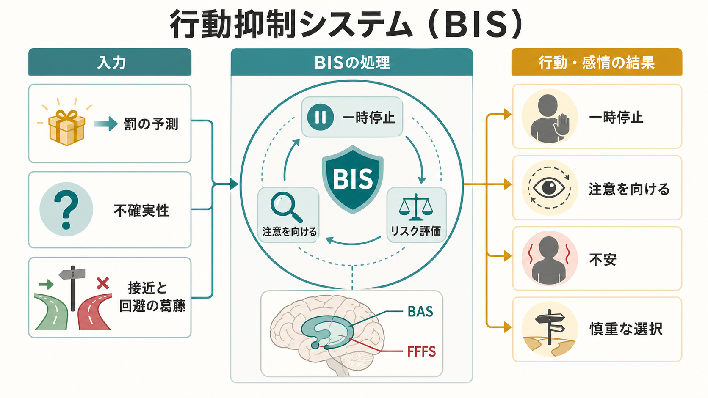
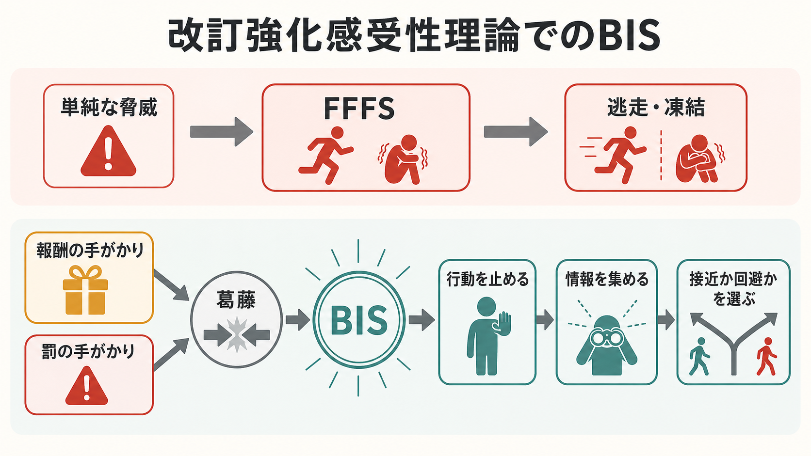

# 行動抑制システムとは何か

## 要点

- 行動抑制システム（Behavioral Inhibition System: BIS）は、罰や危険そのものにただ反応する装置ではなく、目標どうしが衝突したときに行動をいったん止め、注意を高め、状況を再評価させる神経心理学的システムである[1][3]。
- 古典的な強化感受性理論では、BISは条件づけられた罰、無報酬、接近停止、不安と結びつけられた。改訂理論では、BISは主に「接近したいが避けたい」という目標葛藤の検出・解決システムとして整理される[2][3]。
- 単純な脅威への逃走・凍結は、改訂理論ではFFFS（Fight-Flight-Freezing System）に近い。BISは、BAS（接近）とFFFS（防御）が同時に作動するような不確実な場面で強く働く[3][4]。
- 人格研究では、BIS感受性は不安、心配、失敗への過敏さ、社会的評価への敏感さなどと関連して測定されてきたが、既存尺度はBISとFFFSを混同しやすい[5][6]。
- 臨床的には、BISは不安症状や回避を理解する一つの研究モデルになる。ただし、個別の診断や治療方針をBISだけで決めることはできない[8]。

## この記事で答える問い

1. 行動抑制システムは、どのような場面で働くのか。
2. BIS、BAS、FFFSは何が違うのか。
3. BISはなぜ「不安」と関係するのか。
4. パーソナリティ研究や臨床研究では、BISをどのように扱うのか。

## まず結論

行動抑制システムとは、「危ないから何もしない」という単純なブレーキではない。より正確には、報酬に近づく動機と罰・危険を避ける動機が同時に立ち上がったとき、行動を一時停止し、注意を広げ、記憶や文脈を参照しながら、接近するか回避するかを選び直す仕組みである[1][3]。

たとえば、発表すれば評価される可能性があるが、失敗して恥をかく可能性もある場面では、BASは「評価・達成に近づく」方向へ、FFFSは「失敗や社会的脅威を避ける」方向へ働く。この衝突が強いほど、BISは行動を遅らせ、心配、警戒、情報収集、反すう的な検討を増やしやすい。ここから主観的な不安が生じる、というのが改訂強化感受性理論の中心的な考え方である[3][4]。

## 背景

BISは、Jeffrey Grayの強化感受性理論（Reinforcement Sensitivity Theory: RST）から発展した概念である。RSTは、個人差を「報酬や罰への感受性の違い」として説明しようとする生物心理学的な人格理論であり、学習、情動、動機づけ、パーソナリティをつなぐ枠組みとして用いられてきた[4]。

初期の理論では、BISは罰の予測、無報酬、目新しい刺激に反応し、進行中の行動を抑制して不安を生むシステムとされた[1][2]。その後、GrayとMcNaughtonの改訂では、単純な脅威への防御反応はFFFS、報酬への接近はBAS、両者の葛藤を扱うのがBIS、という三システムに再整理された[3][4]。

この違いは、[[罰とは何か]]、[[恐怖条件づけとは何か]]、[[回避学習とは何か]]を読むと理解しやすい。罰や恐怖条件づけは「脅威の予測」を説明するが、BISはさらに一歩進んで、「脅威があるのに近づきたい」「避けたいのに達成したい」という葛藤場面での調整を説明する。

## 基本概念

### BIS、BAS、FFFS

| システム | 主な入力 | 主な機能 | 関連する感情 |
|---|---|---|---|
| BAS | 報酬、達成、接近の手がかり | 接近行動を促す | 期待、興奮、喜び |
| FFFS | 罰、痛み、捕食者、単純な脅威 | 逃走、凍結、防御を促す | 恐怖 |
| BIS | 接近と回避の葛藤、不確実性、目標衝突 | 行動停止、注意増強、リスク評価 | 不安 |

改訂RSTで重要なのは、BISを「罰への反応」そのものと見なさない点である。単純に危険から逃げる場合はFFFSが中心になる。一方、報酬や義務に近づく理由があるのに、同時に罰や失敗も予測される場合、BISが葛藤を検出し、行動を一時停止させる[3][7]。

### 行動抑制とは何を抑制するのか

ここでいう抑制は、筋肉運動を止めることだけではない。BISが強く働くと、次のような変化が起こりやすい。

- いま進めていた行動を遅らせる。
- 罰や失敗の手がかりへ注意を向ける。
- 過去の記憶や文脈を参照する。
- 接近と回避のどちらが安全かを再評価する。
- 心配、緊張、警戒を強める。

この意味でBISは、[[オペラント条件づけとは何か]]でいう行動頻度の単純な増減だけではなく、目標選択、注意、情動、予測をまとめて調整する概念である。

## 仕組み

### 1. 葛藤の検出

BISが典型的に働くのは、接近と回避が同時に活性化する場面である[3]。たとえば、試験を受ければ単位が取れるが、失敗すれば自尊心が傷つく。好きな相手に話しかければ関係が進むかもしれないが、拒絶されるかもしれない。このような場面では、報酬予測と罰予測が同時に存在する。

この構造は、[[強化学習とは何か]]や[[報酬予測誤差とは何か]]で扱う「価値の更新」とも関係する。ただしBISは、期待値を計算する単一アルゴリズムではなく、情動、注意、行動停止を含む神経心理学的な制御システムとして提案されている。

### 2. 行動停止と注意の増強

葛藤が検出されると、BISは即座の反応を止め、探索モードを強める。これは適応的である。状況が不確実なときにすぐ突進すれば、危険を見落とす。逆に、すぐ逃げれば報酬や学習機会を失う。BISはこの中間で、情報を集める時間を作る[1][3]。

神経基盤としては、GrayとMcNaughtonは中隔-海馬系をBISの重要な構成要素と考えた[1][2]。その後の防御システム論では、扁桃体、中隔-海馬系、視床下部、中脳水道周囲灰白質、前頭前野などが、防御距離や防御方向に応じて階層的に関わると整理された[3]。

### 3. 不安としての主観的経験

BISの作動は、主観的には不安、心配、警戒、迷いとして経験されやすい。これは「不安は無意味なノイズである」という意味ではない。不安は、接近と回避のどちらも簡単に選べない状況で、情報収集と方略変更を促す信号として理解できる[3][6]。

ただし、このシステムが過剰に作動すると、行動の遅延、過度なリスク評価、反すう、回避の固定化につながる可能性がある。BISは適応的な慎重さを支える一方で、不安症状や社会的回避を説明する研究モデルにもなる[8]。

## 図解

図1は、BISを「罰への直接反応」ではなく、報酬・罰・不確実性が交差する場面の調整システムとして示している。図2は、改訂RSTで重要な区別、すなわち「単純な脅威へのFFFS」と「接近-回避葛藤へのBIS」を対比している。

図を文章で置き換えるなら、次の流れになる。

1. 報酬の手がかりがBASを活性化する。
2. 罰や危険の手がかりがFFFSを活性化する。
3. 両者が同時に強いと、BISが葛藤を検出する。
4. BISは行動を止め、注意とリスク評価を高める。
5. 文脈情報を集めたうえで、接近、回避、保留のいずれかに方略が更新される。

## 臨床・研究との接続

### パーソナリティ測定

CarverとWhiteのBIS/BAS尺度は、BIS感受性とBAS感受性を自己報告で測る代表的な尺度である[5]。この尺度では、罰予測で緊張しやすい、悪いことが起こると心配しやすい、批判に敏感である、といった項目がBISに関係する。

ただし、改訂RSTの観点からは、古いBIS尺度が「不安としてのBIS」と「恐怖としてのFFFS」を混ぜて測っている可能性がある[6][7]。そのため近年は、BIS、FFFS、BASをより分けて測定する尺度や、反応時間課題、葛藤課題、情動刺激課題を組み合わせた研究が行われている[7]。

### 不安症状との関係

BISは、不安症状を「危険を予測するだけでなく、接近と回避の葛藤を解けない状態」として理解する視点を与える。社会不安を例にすると、人と関わりたい、評価されたい、参加したいという接近動機がある一方で、拒絶、失敗、恥への回避動機が強い。この葛藤が慢性的に高いと、行動停止、過度な自己監視、回避が維持されやすい[8]。

ただし、これは教育・研究上の説明であり、個別の診断や治療指示ではない。不安が生活を大きく妨げる場合には、専門家による評価が必要である。BISは臨床現象を理解する地図の一部であって、症状全体を一つのシステムだけで説明するものではない。

## よくある誤解

### 誤解1: BISは「怖がりな性格」の別名である

BISは怖がりそのものではない。改訂RSTでは、単純な恐怖反応はFFFSに近く、BISは接近と回避の葛藤に関わる。不安と恐怖は重なり合うが、理論上は区別される[3][6]。

### 誤解2: BISが強いほど悪い

BISは悪いシステムではない。危険を見落とさず、衝動的な行動を止め、慎重な判断を支える点では適応的である。問題になりやすいのは、状況に比べて過剰に働き、行動停止や回避が固定化するときである。

### 誤解3: BISは脳の一カ所にある

BISは単一の脳部位ではなく、海馬・中隔系を中心に、扁桃体、前頭前野、防御系回路などと関係する機能的なシステムとして考える方がよい[1][3]。したがって「BIS部位が活動した」と単純に読むより、どの課題で、どの葛藤を、どの指標で測っているかを確認する必要がある。

## 関連ノート

- [[罰とは何か]]: 罰予測と行動抑制の基礎。
- [[恐怖条件づけとは何か]]: 脅威予測と防御反応の学習。
- [[回避学習とは何か]]: 回避行動が維持される仕組み。
- [[強化とは何か]]: 行動が増える条件と減る条件。
- [[強化学習とは何か]]: 報酬・罰から価値を更新する計算論的枠組み。
- [[報酬予測誤差とは何か]]: 予測と結果のずれによる学習。

MOC更新候補: `content/00_MOC/` 配下の認知科学・心理学、学習・行動・動機づけ、不安・情動関連のMOCがある場合、バッチ統合時に本記事へのリンクを追加する。

## 理解チェック

1. 改訂RSTでは、BISとFFFSはどのように区別されるか。
2. 「発表したいが、失敗が怖い」という場面では、BAS、FFFS、BISはそれぞれ何を担うか。
3. BIS感受性が高いことは、どのような適応的利点とリスクを持つか。
4. 自己報告尺度でBISを測るとき、なぜ恐怖と不安の混同に注意が必要なのか。

## 未解決問題

- BIS、FFFS、BASを人間の自己報告、行動課題、生理指標、神経画像でどこまで一貫して分離できるか。
- BIS感受性が、不安症状の発症要因なのか、維持要因なのか、文脈依存的な調整要因なのか。
- 文化、発達段階、社会的評価場面によって、BISの表れ方がどの程度変わるか。
- 強化学習モデルの価値計算や不確実性推定と、RSTのBIS概念をどのように接続できるか。

## 参考文献

[1] Gray, J. A., & McNaughton, N. (2003). *The Neuropsychology of Anxiety: An enquiry into the functions of the septo-hippocampal system* (2nd ed.). Oxford University Press. https://doi.org/10.1093/acprof:oso/9780198522713.001.0001

[2] McNaughton, N., & Gray, J. A. (2000). Anxiolytic action on the behavioural inhibition system implies multiple types of arousal contribute to anxiety. *Journal of Affective Disorders, 61*(3), 161-176. https://doi.org/10.1016/S0165-0327(00)00344-X

[3] McNaughton, N., & Corr, P. J. (2004). A two-dimensional neuropsychology of defense: Fear/anxiety and defensive distance. *Neuroscience & Biobehavioral Reviews, 28*(3), 285-305. https://doi.org/10.1016/j.neubiorev.2004.03.005

[4] Corr, P. J. (Ed.). (2008). *The Reinforcement Sensitivity Theory of Personality*. Cambridge University Press. https://doi.org/10.1017/CBO9780511819384

[5] Carver, C. S., & White, T. L. (1994). Behavioral inhibition, behavioral activation, and affective responses to impending reward and punishment: The BIS/BAS scales. *Journal of Personality and Social Psychology, 67*(2), 319-333. https://doi.org/10.1037/0022-3514.67.2.319

[6] Smillie, L. D., Pickering, A. D., & Jackson, C. J. (2006). The new reinforcement sensitivity theory: Implications for personality measurement. *Personality and Social Psychology Review, 10*(4), 320-335. https://doi.org/10.1207/s15327957pspr1004_3

[7] Berkman, E. T., Lieberman, M. D., & Gable, S. L. (2009). BIS, BAS, and response conflict: Testing predictions of the revised reinforcement sensitivity theory. *Personality and Individual Differences, 46*(5-6), 586-591. https://doi.org/10.1016/j.paid.2008.12.015

[8] Kimbrel, N. A. (2008). A model of the development and maintenance of generalized social phobia. *Clinical Psychology Review, 28*(4), 592-612. https://doi.org/10.1016/j.cpr.2007.08.003
