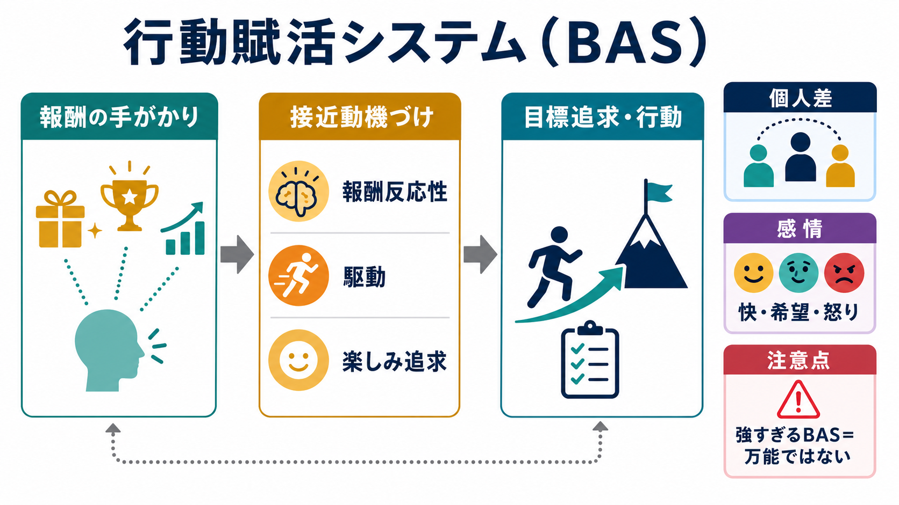
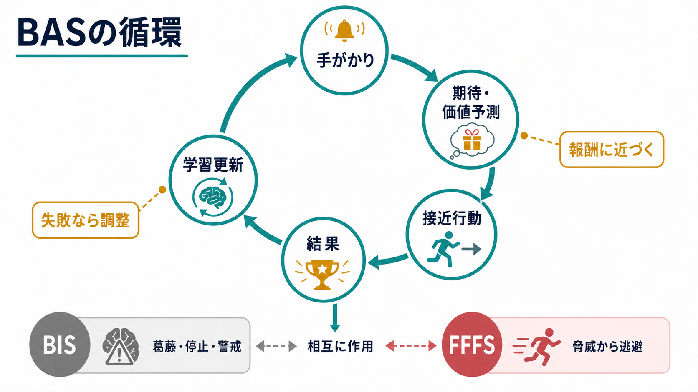

# 行動賦活システムとは何か

## 要点

- 行動賦活システム（Behavioral Activation System / Behavioral Approach System; BAS）は、報酬、目標、望ましい結果の手がかりに反応し、接近行動や努力投入を促す動機づけシステムとして考えられてきた[1][2]。
- BASは「快楽そのもの」ではなく、報酬を予期し、近づき、達成へ向けて行動を組織する働きを指す。したがって、[[強化学習とは何か]]や[[報酬予測誤差とは何か]]で扱う価値更新の考え方と接続しやすい。
- 個人差としてのBAS感受性は、報酬反応性、目標への駆動、楽しみ追求などに分けて測定されることが多い[2]。
- 現代の強化感受性理論では、BAS、BIS、FFFSを区別する。BASは接近、BISは葛藤や不確実性への警戒、FFFSは脅威からの逃避・凍結に関わると整理される[1][3]。
- BASは臨床的な診断名ではない。うつ病の接近行動低下、双極スペクトラムにおける報酬過敏性、衝動性研究などを考えるための研究概念として使うのが安全である[7][8]。

## この記事で答える問い

1. 行動賦活システムとは、どのような心理・神経システムなのか。
2. BASは報酬、接近、ドーパミン、個人差とどう関係するのか。
3. BISやFFFSとは何が違うのか。
4. 研究・臨床では、BASをどこまで使える概念として読めばよいのか。

## まず結論

行動賦活システムとは、「報酬になりそうな手がかりを見つけ、そこへ近づく行動を起こし、目標達成へ向けて努力を続ける」ための動機づけシステムである。たとえば、試験でよい点を取りたい、研究発表を成功させたい、好きな活動を始めたい、誰かに会いに行きたい、というとき、人は単に快感を待っているのではなく、報酬や目標を予期し、それに近づく行動を組み立てている。

ただし、BASを「やる気の量」や「ドーパミンの強さ」と同一視すると誤解が生じる。BASは、報酬手がかりへの注意、期待、価値予測、行動開始、努力、失敗後の調整を含む広い構成概念である。さらに、BASが強いことは常に望ましいわけではない。目標追求が柔軟に調整されれば適応的だが、過剰な報酬追求、睡眠軽視、衝動的意思決定、失敗時の怒りや落胆につながる場合もある[6][8]。

## 背景

BASは、Grayの強化感受性理論（Reinforcement Sensitivity Theory; RST）から広く知られるようになった概念である。初期のRSTでは、行動を大きく、報酬や罰の手がかりに対する反応システムとして整理した。後の改訂では、脅威への恐怖反応を担うFFFS、目標間の葛藤や不確実性を処理するBIS、報酬接近を担うBASがより明確に区別された[1][3]。

この枠組みの重要点は、行動を「性格が明るい・暗い」「意志が強い・弱い」だけで説明しないところにある。人は、報酬がありそうな状況では接近し、損失や罰がありそうな状況では回避し、報酬と危険が混ざる状況では葛藤を処理する。BASはこのうち、報酬接近側のシステムを表す。

## 基本概念

### BASは何に反応するのか

BASが反応するのは、実際の報酬だけではない。報酬を予測させる手がかり、目標達成の見込み、過去に強化された行動、成功の可能性が高まった感覚などもBASを動かす。これは、[[オペラント条件づけとは何か]]で扱う強化の経験や、[[意思決定とは何か]]で扱う価値評価とつながる。

報酬手がかりに反応すると、注意はその対象へ向き、身体は行動準備に入り、目標に近づく選択肢が魅力的に見えやすくなる。ここでいう接近は、物理的に近づくことだけではない。勉強する、交渉する、応募する、練習を続ける、研究計画を立てるといった、将来の報酬へ向けた行動も含まれる。

### 個人差としてのBAS

CarverとWhiteのBIS/BAS尺度は、BASを自己報告で測定する代表的な尺度である。この尺度ではBASを、報酬が得られたときの反応性、目標へ向かう駆動、楽しい新奇経験を求める傾向などに分けて捉える[2]。そのため、同じ「BASが高い」といっても、達成目標へ粘り強く向かう人、報酬への情動反応が強い人、刺激的な機会へ飛びつきやすい人では、意味が異なる。

改訂RSTに合わせた測定では、BASの下位側面をさらに細かく分ける試みもある。たとえばRST-PQでは、Reward Interest、Goal-Drive Persistence、Reward Reactivity、ImpulsivityなどのBAS因子が提案されている[3]。これは、BASが単一の「活動性」ではなく、関心、持続、反応性、衝動性を含む多面的な構成概念であることを示す。

## 仕組み

BASの流れは、次の循環として理解しやすい。

1. 報酬や目標に関係する手がかりを検出する。
2. その手がかりがどれほど価値ある結果につながるかを予測する。
3. 接近行動を選び、努力や注意を投入する。
4. 結果を観察する。
5. 成功・失敗・予想外の結果に応じて、次の価値予測や行動方針を更新する。

この循環は、[[強化学習とは何か]]の価値更新と近い。報酬が予想より大きければ、その手がかりや行動の価値は上がりやすい。予想より悪ければ、価値は下がりやすい。BASはこの価値更新そのものだけでなく、価値が高そうな方向へ行動を起こす動機づけ側面を担う概念として位置づけられる。

神経生物学的には、BASはしばしば中脳ドーパミン系、腹側線条体、側坐核、前頭前野、帯状皮質などの報酬・動機づけ回路と関連づけられる[4]。ただし、BASを単一の脳部位や単一神経伝達物質へ還元するのは危険である。ドーパミンは快楽だけでなく、手がかりの顕著性、努力、学習、予測、行動開始などに関わるため、BASは複数の神経回路と計算過程の重なりとして理解するほうがよい。

## 図解

1枚目の図は、BASを「報酬手がかり」「接近動機づけ」「目標追求」「個人差」「感情」の関係として整理している。BASは快感だけでなく、報酬へ向かう準備と行動の組織化を含む。

2枚目の図は、BASの循環を示している。手がかりから期待が生じ、接近行動が起こり、結果をもとに学習更新が起きる。下部にはBISとFFFSを別システムとして示し、接近、葛藤、脅威反応を混同しないようにしている。

## 臨床・研究との接続

うつ病研究では、接近動機づけの低下、回避行動の増加、正の強化経験の減少が、活動低下や快感低下の維持に関わると考えられる[7]。この見方は、臨床技法としての行動活性化をそのままBASへ還元するものではないが、生活の中で報酬や達成経験に近づく行動をどう回復させるか、という問いと接続する。関連して、[[報酬系の異常はうつ病をどう説明するのか]]も参照できる。

双極スペクトラム研究では、BASの過敏性や調整不全が、報酬手がかりへの強い反応、目標追求の増幅、活動性上昇、睡眠短縮、躁・軽躁方向の変化と関連づけて検討されている[8]。ただし、BASが高いから双極性障害である、という意味ではない。BASは脆弱性、誘発因子、経過予測を考えるための一つの次元であり、診断は症状、持続期間、生活機能、既往、除外診断を含む総合評価によって行われる。詳しくは[[双極性障害は情動ネットワークの異常として説明できるのか]]と接続できる。

また、BASは[[自己制御とは何か]]とも関係する。報酬へ向かう力が強いほど、目標達成に有利になる場面もある。一方で、短期報酬へ引き寄せられすぎると、長期目標、睡眠、健康、対人関係との調整が難しくなる。したがってBASは「高いほどよい」性質ではなく、文脈に合わせて接近と停止を調整できることが重要である。

## よくある誤解

### BASはドーパミンそのものではない

BASとドーパミン系は深く関連するが、同じものではない。BASは心理学的・行動科学的な構成概念であり、ドーパミンは神経伝達物質である。両者は対応しうるが、一対一対応ではない[4]。

### BASが高い人は常に幸せとは限らない

BASは快感や希望と関係するが、目標が妨げられたときには怒り、欲求不満、落胆にもつながる[6]。接近が強いほど、失敗や阻害への反応も強くなる場合がある。

### BASはBISの反対語ではない

BASとBISは単純な反対軸ではない。改訂RSTでは、BISは報酬と脅威、接近と回避が競合する状況で葛藤を検出し、注意や行動を調整するシステムとして考えられる[1][3]。したがって「BASが高いからBISが低い」とは限らない。

### 尺度得点は診断ではない

BIS/BAS尺度やRST-PQは研究・心理測定の道具であり、個人の診断や治療方針を単独で決めるものではない。特に臨床文脈では、症状、生活機能、発達歴、環境、薬物、睡眠、ストレスなどを合わせて見る必要がある。

## 関連ノート

- [[強化学習とは何か]]
- [[報酬予測誤差とは何か]]
- [[オペラント条件づけとは何か]]
- [[回避学習とは何か]]
- [[意思決定とは何か]]
- [[自己制御とは何か]]
- [[報酬系の異常はうつ病をどう説明するのか]]
- [[双極性障害は情動ネットワークの異常として説明できるのか]]
- [[前頭前野は情動制御にどう関わるのか]]

## MOC更新候補

- `content/00_MOC/` 配下の認知科学・心理学、学習・動機づけ、精神疾患と報酬系に関するMOCへ追加候補。
- 並列ジョブとの競合を避けるため、本記事ではMOCファイル本体は更新しない。

## 理解チェック

1. BASは「快感」と「報酬へ向かう動機づけ」のどちらに近い概念か。
2. BAS、BIS、FFFSはそれぞれ、接近、葛藤、脅威反応のどれと関係するか。
3. BASが高いことが、なぜ常に適応的とは限らないのか。
4. BASを臨床研究で使うとき、尺度得点を診断と混同してはいけない理由は何か。

## 参考文献

[1] Gray, J. A., & McNaughton, N. (2000/2003). *The Neuropsychology of Anxiety: An enquiry into the function of the septo-hippocampal system* (2nd ed.). Oxford University Press. https://doi.org/10.1093/acprof:oso/9780198522713.001.0001

[2] Carver, C. S., & White, T. L. (1994). Behavioral inhibition, behavioral activation, and affective responses to impending reward and punishment: The BIS/BAS scales. *Journal of Personality and Social Psychology, 67*(2), 319-333. https://doi.org/10.1037/0022-3514.67.2.319

[3] Corr, P. J., & Cooper, A. J. (2016). The Reinforcement Sensitivity Theory of Personality Questionnaire (RST-PQ): Development and validation. *Psychological Assessment, 28*(11), 1427-1440. https://doi.org/10.1037/pas0000273

[4] Depue, R. A., & Collins, P. F. (1999). Neurobiology of the structure of personality: Dopamine, facilitation of incentive motivation, and extraversion. *Behavioral and Brain Sciences, 22*(3), 491-517. https://doi.org/10.1017/S0140525X99002046

[5] Poythress, N. G., Skeem, J. L., Weir, J., Lilienfeld, S. O., Douglas, K. S., Edens, J. F., & Kennealy, P. J. (2008). Psychometric properties of Carver and White's (1994) BIS/BAS scales in a large sample of offenders. *Personality and Individual Differences, 45*(8), 732-737. https://doi.org/10.1016/j.paid.2008.07.021

[6] Carver, C. S. (2004). Negative affects deriving from the behavioral approach system. *Emotion, 4*(1), 3-22. https://doi.org/10.1037/1528-3542.4.1.3

[7] Trew, J. L. (2011). Exploring the roles of approach and avoidance in depression: An integrative model. *Clinical Psychology Review, 31*(7), 1156-1168. https://doi.org/10.1016/j.cpr.2011.07.007

[8] Alloy, L. B., & Abramson, L. Y. (2010). The role of the behavioral approach system (BAS) in bipolar spectrum disorders. *Current Directions in Psychological Science, 19*(3), 189-194. https://doi.org/10.1177/0963721410370292

## 未解決問題

- BASを自己報告尺度、行動課題、神経画像、計算モデルで測ったとき、どこまで同じ構成概念を測っているのか。
- 報酬感受性、努力投入、衝動性、目標持続性を、どの程度分離して測定できるのか。
- 臨床群におけるBASの変化が、症状の原因、結果、補償、状態依存的変化のどれにあたるのか。

