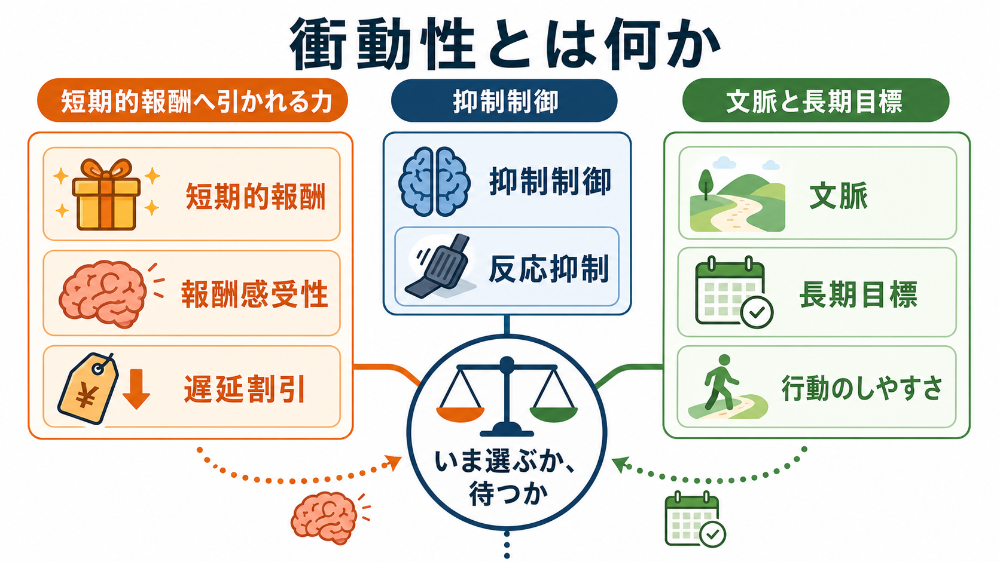
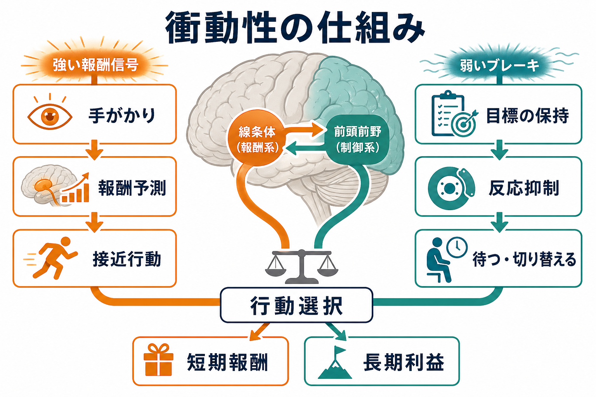
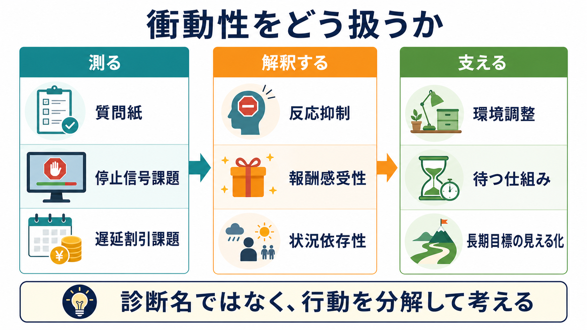

# 衝動性とは何か

## 要点

- 衝動性とは、短期的な報酬・刺激・反応が強く引かれ、長期的な目標や状況に照らした調整が追いつきにくい傾向である。単なる「意志の弱さ」ではなく、報酬感受性、抑制制御、時間割引、情動、文脈が重なって現れる多次元の構成概念である[1][2]。
- 重要なのは、「すぐ動くこと」そのものではなく、行動が早すぎる、見通しが不足する、状況に合わない、結果として不利益を生みやすい、という条件である[1][3]。
- 代表的な仕組みは、短期報酬を大きく評価する報酬系と、反応を止める・待つ・切り替える抑制制御のバランスとして理解できる[4][5]。
- 衝動性は ADHD、物質使用、ギャンブル、躁状態、パーソナリティ特性などと関連して研究されるが、診断名そのものではない。臨床では、個人の診断を決める言葉ではなく、行動を分解して理解するための次元として扱う必要がある[3][6]。

## この記事で答える問い

この記事では、[[自己制御とは何か]]、遅延割引、[[行動抑制システムとは何か]]、[[行動賦活システムとは何か]]、[[報酬予測誤差とは何か]]、[[強化学習とは何か]]と接続しながら、次の問いに答える。

1. 衝動性は、どのような行動傾向を指すのか。
2. なぜ人は、長期的には不利だとわかっていても短期的報酬を選びやすいのか。
3. 抑制制御と報酬感受性は、衝動的行動をどう説明するのか。
4. 研究・臨床では、衝動性をどのように測り、どこに注意して解釈するのか。

## まず結論

衝動性は、「すぐ欲しい」「すぐ反応したい」という行動の速さだけでなく、「待つ」「止める」「長期目標に照らして選び直す」機能がどの程度働くかによって決まる。たとえば、目の前の報酬が強く、将来の利益が抽象的で、疲労やストレスがあり、環境がすぐ行動できる形に整っていると、短期的選択は起こりやすくなる。

したがって、衝動性を理解するには「本人の性格が悪い」と見るより、次のように分解する方が有用である。

- 何が報酬として強く働いているのか。
- どの反応を止める必要があるのか。
- 将来の利益は、いまの選択場面でどれくらい見えているのか。
- 疲労、情動、社会的圧力、手がかり、習慣がどの程度行動を押しているのか。

## 背景

衝動性は古くから、精神医学、行動分析、人格心理学、神経科学、行動経済学で扱われてきた。Evenden は、衝動性という一語が、早すぎる反応、計画不足、危険な選択、状況不適合な行動などを幅広く含むため、単一の神経機構に還元しにくいと整理した[1]。Moeller らも、衝動性を「内的・外的刺激に対して、本人または他者への否定的結果を十分考えずに素早く無計画に反応する素因」として、精神医学的に重要な次元と位置づけた[2]。

この多義性のため、研究では衝動性をいくつかの成分に分ける。代表的には、行動を止める力に関わる「反応抑制」、遅れた報酬をどれだけ低く見積もるかに関わる「遅延割引」、強い刺激や新奇性を求める傾向、情動が高まったときに早まる反応などである[1][3]。

## 基本概念

### 衝動性はひとつの能力ではない

衝動性は、知能や筋力のように単一尺度で測れる能力ではない。質問紙で高い衝動性を示す人が、必ず停止信号課題でも反応を止めにくいとは限らない。逆に、実験課題で反応抑制が弱くても、生活上は環境調整や習慣によって大きな問題が表に出ないこともある。

そのため、衝動性を理解するときは、少なくとも次の3つを分ける必要がある。

| 観点 | 中心になる問い | 代表的な測定 |
|---|---|---|
| 反応抑制 | すでに始まりかけた反応を止められるか | 停止信号課題、Go/No-Go課題 |
| 遅延割引 | 遅れて得られる大きな報酬をどれだけ低く評価するか | 遅延割引課題 |
| 報酬感受性 | 報酬手がかりにどれだけ行動が引かれるか | 強化学習課題、接近行動、質問紙 |

### 「短期報酬」は主観的な価値である

短期的報酬とは、金銭や食物だけではない。安心、承認、退屈からの解放、怒りの発散、不安の回避、通知を確認する快感なども、選択場面では報酬として働きうる。[[報酬予測誤差とは何か]]で扱うように、行動は実際の報酬だけでなく「報酬が来そうだ」という予測にも動かされる。

この点で、衝動性は「快楽を求める傾向」だけではない。嫌な気分をすぐ下げたい、緊張を早く終わらせたい、退屈を避けたい、といった負の強化も衝動的行動を支える。[[オペラント条件づけとは何か]]で言えば、行動の直後に不快感が下がると、その行動は次回以降に起こりやすくなる。

## 仕組み

### 1. 遅延割引: 将来の価値が小さく見える

遅延割引とは、報酬が遅れるほど主観的価値が下がる現象である。Ainslie は、衝動的選択を「遅れた大きな報酬より、近い小さな報酬を選ぶ」問題として整理し、時間とともに選好が反転することを説明した[4]。

たとえば、1年後の健康、来月の成績、将来の信頼は重要でも、いま目の前にある快楽や不快感の低減に比べると、選択場面では弱く感じられる。遅延割引が急であるほど、将来の利益は速く価値を失い、短期報酬が相対的に強くなる。神経経済学では、遅延報酬の主観的価値を腹側線条体、内側前頭前野、後部帯状皮質などの活動と結びつけて検討してきた[8]。

### 2. 反応抑制: いったん始まった反応を止める

衝動的行動には、考える前に手が出る、言葉が出る、クリックする、購入する、食べる、といった「早すぎる反応」が含まれる。停止信号課題は、この反応抑制を測る代表的課題である。参加者は通常は素早く反応するが、まれに停止信号が出たら反応を止める。Logan らの競走モデルでは、実行過程と停止過程が競争し、停止過程が間に合えば反応は止まる[5]。

Bari と Robbins は、抑制が目標指向行動に不可欠な機能であり、前頭前野と皮質下構造の協調が不要な反応の抑制に関わると整理している[6]。ここでいう抑制は、単に「我慢する精神力」ではなく、注意、目標保持、運動制御、状況評価が組み合わさった認知制御である。

### 3. 報酬感受性: 手がかりが行動を押す

報酬に関連する手がかりは、行動を準備させる。通知音、広告、店の匂い、相手の表情、勝てそうな予感、過去に報酬が得られた場所などは、現在の選択を変える。[[ドパミンは報酬だけの物質なのか]]で扱うように、ドパミン系は単純な快感物質ではなく、報酬予測、動機づけ、学習信号、行動活性化に関わる。

Dalley らは、衝動性を時間割引、運動性の脱抑制、注意課題における早すぎる反応などに分け、それぞれが異なる皮質-線条体回路と関わる可能性を整理した[3]。この観点では、「報酬信号が強すぎる」だけでなく、「制御信号が弱い」「手がかりが過剰に行動を引く」「習慣化した反応が切り替わりにくい」などが別々に検討される。

## 図解

図1は、衝動性を「短期的報酬へ引かれる力」「抑制制御」「文脈と長期目標」の相互作用として示している。図2は、線条体を中心とする報酬系と前頭前野を中心とする制御系が、行動選択にどう影響するかを単純化している。図3は、衝動性を研究・臨床・日常支援で扱うときの流れを示している。

## 臨床・研究との接続

### 研究では「どの衝動性か」を明確にする

衝動性を研究する場合、質問紙、停止信号課題、Go/No-Go課題、遅延割引課題、強化学習課題は、それぞれ違う側面を測る。したがって、「衝動性が高い」という表現だけでは不十分であり、「反応抑制が弱い」「遅延割引が急である」「報酬手がかりへの接近が強い」などに分ける必要がある。

遅延割引については、依存行動との関連がメタ分析で示されている。MacKillop らは、依存行動を示す群で遅延報酬割引が高い傾向を報告した[7]。ただし、これは「遅延割引が高い人は必ず依存になる」という意味ではない。効果量、測定法、サンプル、併存要因、社会環境を含めて解釈する必要がある。

### 臨床では診断名に還元しない

衝動性は ADHD、物質使用障害、ギャンブル障害、躁状態、境界性パーソナリティ特性、摂食行動、攻撃行動などで問題になることがある[2][7]。しかし、衝動性は診断名ではなく、診断横断的な行動次元である。教育・研究目的で説明する際も、個別の診断や治療指示として断定してはいけない。

実践的には、次のように行動単位で見る方が有用である。

- どの場面で起こるのか。
- 直前の手がかりは何か。
- 行動直後に何が得られ、何が避けられるのか。
- 後から困る結果は何か。
- 待つ、止める、距離を取る、長期目標を見える化するための環境調整は何か。

この見方は、行動変容、[[習慣学習とは何か]]、フィードバック学習とも接続する。

## よくある誤解

### 衝動性は「性格が悪い」という意味ではない

衝動性は、道徳的な評価語ではない。報酬、抑制、情動、疲労、ストレス、社会的圧力、環境の手がかりが重なって行動が早まる現象である。本人の責任を免除する言葉でも、本人を責める言葉でもなく、行動を分析するための概念である。

### すばやい判断はすべて衝動的ではない

熟練者のすばやい判断、緊急時の反応、訓練された直観は、状況に合っていれば適応的である。衝動性として問題になるのは、行動が早すぎる、見通しが足りない、文脈に合わない、反復的に不利益を生む場合である。

### 報酬感受性が高いことは、必ず悪いことではない

報酬に反応しやすいことは、学習、探索、創造性、行動開始にも関わる。問題は、短期報酬が長期目標を一貫して押しのける場合や、本人の価値観に反する結果を繰り返す場合である。

### 抑制制御は「根性」だけでは改善しない

反応を止めるには、疲労を減らす、手がかりを遠ざける、待つ手続きを外部化する、長期目標を見える形にする、選択肢を事前に制限するなど、環境側の設計が重要である。これは[[自己効力感は学習にどう影響するのか]]やナッジにもつながる。

## 関連ノート

- [[自己制御とは何か]]
- [[行動抑制システムとは何か]]
- [[行動賦活システムとは何か]]
- [[報酬予測誤差とは何か]]
- [[強化学習とは何か]]
- [[オペラント条件づけとは何か]]
- [[ドパミンは報酬だけの物質なのか]]
- [[習慣学習とは何か]]

## 理解チェック

1. 衝動性を「意志の弱さ」とだけ説明すると、どのような要因が見落とされるか。
2. 反応抑制と遅延割引は、どちらも衝動性に関わるが、何を測っている点が違うか。
3. 短期報酬が強くなる場面を、自分の日常例で1つ挙げるとしたら何か。
4. 衝動的行動を減らすために、本人の努力ではなく環境側で変えられる要素は何か。
5. 衝動性を臨床で扱うとき、なぜ診断名そのものとして扱ってはいけないのか。

## 関連ノート候補

- 抑制制御とは何か
- 停止信号課題とは何か
- 報酬感受性とは何か
- 遅延割引とは何か
- 行動変容はどのように起こるのか
- フィードバックは学習をどう促進するのか
- ナッジとは何か
- 衝動制御困難を伴う疾患には何があるのか
- 依存行動と遅延割引はどう関係するのか
- 前頭線条体回路は行動選択をどう制御するのか

## MOC更新候補

- `content/00_MOC/` 配下の認知科学・心理学、学習・行動・動機づけ、神経科学、計算論的精神医学関連 MOC への追加候補。
- 並列生成ジョブとの競合を避けるため、本記事作成時点では MOC ファイルを直接更新しない。

## 未解決問題

- 衝動性の各成分は、質問紙、実験課題、日常行動ログの間でどの程度一致するのか。
- 報酬感受性、反応抑制、情動調整、習慣化を、個人内でどのように分離して測定できるのか。
- 遅延割引や停止信号課題の指標を、個別支援や教育介入の選択にどこまで使えるのか。
- 衝動性が適応的に働く場面と、不利益を生む場面をどう区別するのか。

## 参考文献

[1] Evenden, J. L. (1999). Varieties of impulsivity. *Psychopharmacology, 146*, 348-361. https://doi.org/10.1007/PL00005481

[2] Moeller, F. G., Barratt, E. S., Dougherty, D. M., Schmitz, J. M., & Swann, A. C. (2001). Psychiatric aspects of impulsivity. *American Journal of Psychiatry, 158*(11), 1783-1793. https://doi.org/10.1176/appi.ajp.158.11.1783

[3] Dalley, J. W., Everitt, B. J., & Robbins, T. W. (2011). Impulsivity, compulsivity, and top-down cognitive control. *Neuron, 69*(4), 680-694. https://doi.org/10.1016/j.neuron.2011.01.020

[4] Ainslie, G. (1975). Specious reward: A behavioral theory of impulsiveness and impulse control. *Psychological Bulletin, 82*(4), 463-496. https://doi.org/10.1037/h0076860

[5] Logan, G. D., Cowan, W. B., & Davis, K. A. (1984). On the ability to inhibit simple and choice reaction time responses: A model and a method. *Journal of Experimental Psychology: Human Perception and Performance, 10*(2), 276-291. https://doi.org/10.1037/0096-1523.10.2.276

[6] Bari, A., & Robbins, T. W. (2013). Inhibition and impulsivity: Behavioral and neural basis of response control. *Progress in Neurobiology, 108*, 44-79. https://doi.org/10.1016/j.pneurobio.2013.06.005

[7] MacKillop, J., Amlung, M. T., Few, L. R., Ray, L. A., Sweet, L. H., & Munafo, M. R. (2011). Delayed reward discounting and addictive behavior: A meta-analysis. *Psychopharmacology, 216*(3), 305-321. https://doi.org/10.1007/s00213-011-2229-0

[8] Peters, J., & Buchel, C. (2011). The neural mechanisms of inter-temporal decision-making: Understanding variability. *Trends in Cognitive Sciences, 15*(5), 227-239. https://doi.org/10.1016/j.tics.2011.03.002
