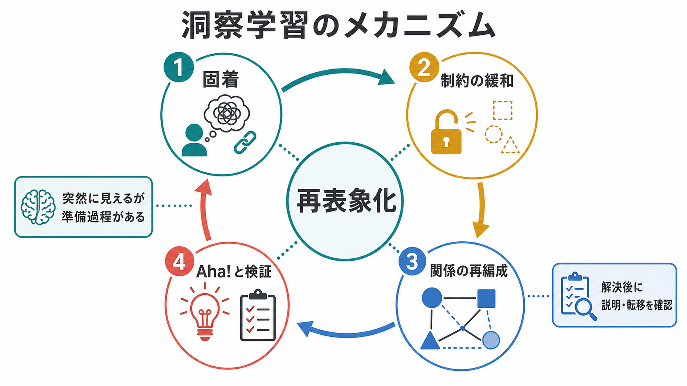

# 観察学習とは何か

## 要点

- 観察学習とは、他者の行動、文脈、結果を手がかりにして、自分の行動レパートリーや期待を変える学習である。
- 単なる「まね」ではなく、注意、記憶、運動・言語的再生、動機づけ、自己効力感が関わる。
- 他者が報酬や罰を受ける場面を見ることは、直接経験していなくても「その行動を取るべきか」という予測を変える。
- 教育、スポーツ、リハビリテーション、臨床的スキルトレーニング、メディア影響研究、AIの社会的学習研究と接続する。

## この記事で答える問い

1. 観察学習は、模倣や条件づけと何が違うのか。
2. 観察された行動と結果は、どのように自分の行動へ変換されるのか。
3. 観察学習は、教育・臨床・研究でどのように使えるのか。

## まず結論

観察学習は、「他者が何をしたか」だけでなく、「その行動がどのような結果をもたらしたか」を読む学習である。Banduraらの古典的研究は、子どもが攻撃的モデルを観察した後、モデルが不在でも類似行動を示しうることを示した[1]。その後の社会的学習理論・社会的認知理論では、観察学習は、注意、保持、再生、動機づけという過程を通じて成立し、外的強化だけでなく期待、価値、自己効力感によって調整されると整理された[2][3]。

## 背景

行動主義的な学習理論では、行動は主に直接の強化や罰によって変化すると考えられてきた。しかし日常生活では、人はすべてを自分で試す前に、親、教師、同僚、友人、動画内の人物、物語上の登場人物を観察して学ぶ。危険な行動、複雑な手順、社会的に望ましいふるまいは、むしろ直接経験だけに頼ると高コストである。

観察学習の重要性はここにある。観察者は、他者の行動を知覚し、結果を評価し、「自分が同じことをしたら何が起こるか」という予測を作る。これは[[社会的認知とは何か]]、[[心の理論とは何か]]、[[共感は認知機能としてどう理解できるのか]]と重なるが、観察学習の焦点は、他者理解そのものよりも、観察情報が自分の将来行動をどう変えるかにある。

## 基本概念

### 観察学習

観察学習とは、他者の行動やその結果を見ることで、行動の獲得、抑制、促進、価値づけの変化が生じる学習である。観察によって新しい行動がすぐ実行される場合もあれば、知識として保持され、後の状況で初めて行動化される場合もある。

### 模倣との違い

模倣は、観察した行動の形を再現することを指す。観察学習はそれより広く、行動の形だけでなく、行動と結果の関係、どの文脈で有効か、どの程度リスクがあるかも学ぶ。したがって、観察学習には「まねる」だけでなく、「避ける」「別のやり方を選ぶ」「まだ実行しないが知識として持つ」も含まれる。

### 代理強化

代理強化とは、他者が報酬や罰を受ける場面を観察することで、自分の行動傾向が変わる現象である。たとえば、同級生が発言して称賛されるのを見ると、自分も発言しやすくなる。逆に、誰かが失敗して嘲笑されるのを見ると、自分は試行を控えるかもしれない。これは直接強化ではないが、行動結果の予測を変える。

## 仕組み

Banduraの枠組みでは、観察学習は大きく4つの過程に分けられる[2][3]。

| 過程 | 何が起きるか | 失敗しやすい点 |
|---|---|---|
| 注意 | モデル、行動、結果に注意を向ける | モデルが不明瞭、注意資源が足りない、結果が見えない |
| 保持 | 観察内容を言語的・イメージ的に記憶する | 手順が複雑、意味づけが弱い |
| 再生 | 記憶した行動を自分の運動・言語・社会的スキルへ変換する | 必要な技能や身体条件が足りない |
| 動機づけ | 実行する価値、期待、自己効力感を評価する | 失敗コストが高い、報酬が弱い、能力感が低い |

観察学習は、[[注意とは何か]]、[[手続き記憶とは何か]]、[[実行機能とは何か]]の協調によって支えられる。見るだけで十分なのではなく、何を見るか、どう符号化するか、いつどのように試すかが学習効果を左右する。

### 予測誤差としての観察学習

近年の神経科学では、観察学習を「他者を通じた予測更新」として捉える研究がある。Burkeらは、人が他者の選択と結果を観察するとき、自分自身の報酬予測誤差とは異なる、観察された行動や結果に関する予測誤差が学習に関わると提案した[4]。これは、観察者が単に他者の行動をコピーしているのではなく、他者の選択と結果を使って[[予測処理とは何か]]に近い形で環境モデルを更新していることを示唆する。

### ミラーシステムだけでは説明できない

行為観察と運動表象の対応には、いわゆるミラーニューロン・システムが関わるとされる[5]。ただし、観察学習を「ミラーシステムがあるから起こる」とだけ説明すると狭すぎる。観察学習には、行為理解、報酬評価、記憶、前頭前野による目標調整、社会的文脈の解釈が関わる。神経作業モデルのレビューでも、観察学習はミラー系、報酬系、前頭前野系を含む分散的なネットワークとして整理されている[6]。

## 図解

観察学習を実践的に見ると、次の流れになる。

1. 誰かの行動を見る。
2. その行動が、称賛、成功、失敗、罰、無反応など、どの結果に結びついたかを見る。
3. 自分にとっての期待、価値、リスク、実行可能性を評価する。
4. 必要なら記憶した手順を再生し、フィードバックで修正する。

## 臨床・研究との接続

教育場面では、教師や熟達者のモデル提示、動画教材、ピアモデル、成功例と失敗例の比較が観察学習を促す。身体技能では、観察練習が運動学習を支える可能性があり、体育・スポーツ教育を対象にしたシステマティックレビューでも、モデル形式や言語的手がかりが効果を左右する点が整理されている[7]。

臨床的には、観察学習はモデリング、ロールプレイ、社会的スキルトレーニング、曝露やリハビリテーションの補助として使われる。ただし、医療・心理支援では、観察学習を個別診断や治療指示として単純化してはいけない。観察による学習効果は、症状、発達特性、対人不安、注意機能、自己効力感、支援環境によって変わる。

研究上は、観察学習は動物の社会的学習、人間の技能獲得、メディア影響、文化伝達、AIの模倣学習・逆強化学習とも接続する。Heyesは、社会的学習を特殊な社会専用モジュールだけで説明するのではなく、一般的な連合学習や注意・動機づけ過程との連続性として捉える重要性を論じている[8]。

## よくある誤解

### 誤解1: 観察学習は「見るだけでできるようになる」ことである

観察は入力にすぎない。実際にできるようになるには、注意、保持、再生、フィードバック、練習が必要である。特に運動技能では、行動の見取りと身体的実行のあいだにギャップが残る。

### 誤解2: 観察学習は模倣と同じである

模倣は観察学習の一部である。観察学習では、観察した行動をあえて避ける、条件を変えて応用する、行動せずに知識だけを保持することもある。

### 誤解3: 報酬や罰を直接受けなければ学習は起こらない

代理強化の考え方では、他者が受けた報酬や罰を観察するだけでも、行動の期待値が変わる。直接経験は強力だが、唯一の学習経路ではない。

### 誤解4: 観察学習は必ずよい学習である

観察学習は適応的にも不適応的にも働く。安全行動、学習方略、対人スキルを学ぶ一方で、攻撃行動、回避、不安反応、偏見、リスク行動を学ぶこともある。教育や臨床で使う場合は、何をモデルとして提示するか、どの結果を見せるか、観察者がどう解釈するかを設計する必要がある。

## 関連ノート

- [[社会的認知とは何か]]
- [[心の理論とは何か]]
- [[共感は認知機能としてどう理解できるのか]]
- [[注意とは何か]]
- [[手続き記憶とは何か]]
- [[実行機能とは何か]]
- [[予測処理とは何か]]
- 今後の作成候補: 強化学習とは何か、自己効力感とは何か、模倣とは何か、社会的学習理論とは何か、ミラーニューロンとは何か

## 理解チェック

1. 観察学習と模倣の違いを、自分の例で説明できるか。
2. 代理強化が起こる場面を、学校・職場・家庭から1つ挙げられるか。
3. 注意、保持、再生、動機づけのうち、動画教材で最も設計しやすい要素はどれか。
4. 観察学習が不適応的に働く例を1つ挙げ、それを防ぐ設計を考えられるか。

## 参考文献

[1] Bandura, A., Ross, D., & Ross, S. A. (1961). Transmission of aggression through imitation of aggressive models. *The Journal of Abnormal and Social Psychology*, 63(3), 575-582. https://doi.org/10.1037/h0045925

[2] Bandura, A. (1977). *Social Learning Theory*. Englewood Cliffs, NJ: Prentice-Hall. https://doi.org/10.1177/105960117700200317

[3] Bandura, A. (1986). *Social Foundations of Thought and Action: A Social Cognitive Theory*. Prentice-Hall. ISBN: 978-0-13-815614-5. https://discover.library.unt.edu/catalog/b1336011

[4] Burke, C. J., Tobler, P. N., Baddeley, M., & Schultz, W. (2010). Neural mechanisms of observational learning. *Proceedings of the National Academy of Sciences*, 107(32), 14431-14436. https://doi.org/10.1073/pnas.1003111107

[5] Rizzolatti, G., & Craighero, L. (2004). The mirror-neuron system. *Annual Review of Neuroscience*, 27, 169-192. https://doi.org/10.1146/annurev.neuro.27.070203.144230

[6] Kang, W., Pineda Hernández, S., & Mei, J. (2021). Neural mechanisms of observational learning: A neural working model. *Frontiers in Human Neuroscience*, 14, 609312. https://doi.org/10.3389/fnhum.2020.609312

[7] Han, Y., Syed Ali, S. K. B., & Ji, L. (2022). Use of observational learning to promote motor skill learning in physical education: A systematic review. *International Journal of Environmental Research and Public Health*, 19(16), 10109. https://doi.org/10.3390/ijerph191610109

[8] Heyes, C. (2012). What's social about social learning? *Journal of Comparative Psychology*, 126(2), 193-202. https://doi.org/10.1037/a0025180

## 未解決問題

- 観察によって得た知識が、どの条件で実際の行動変化へ移るのか。
- 代理報酬・代理罰の効果は、発達段階や文化、集団規範によってどの程度変わるのか。
- 動画教材やAIチューターは、どのようなモデル提示を行うと過学習や誤学習を避けられるのか。
- 不安、抑うつ、発達特性、対人過敏性が観察学習の解釈バイアスにどう影響するのか。
