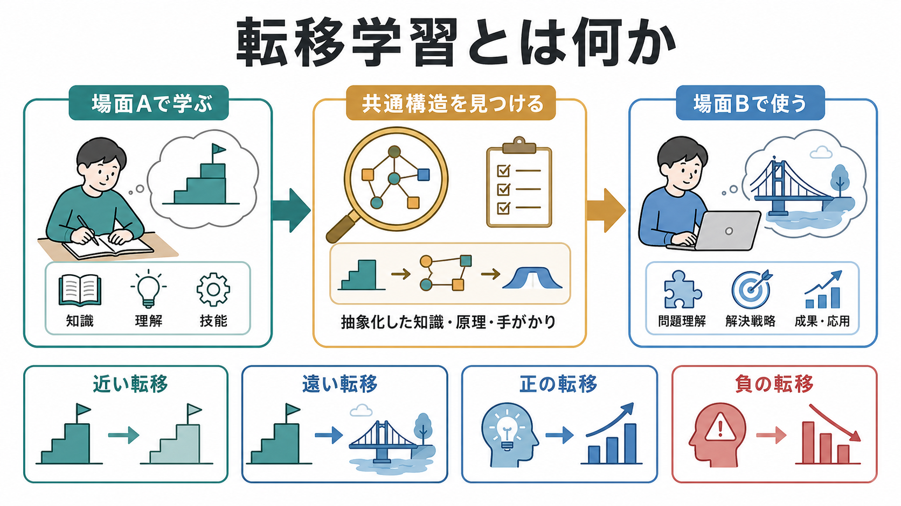
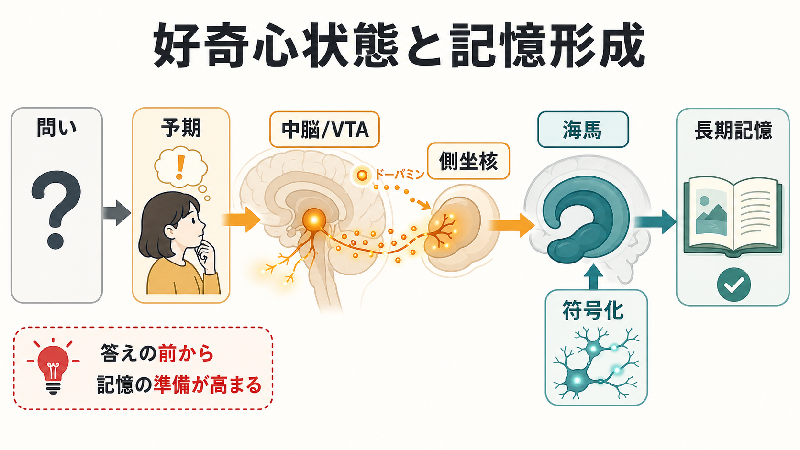

# 転移学習とは何か

## 要点

- 転移学習とは、ある場面で学んだ知識・技能・方略が、別の場面の理解や問題解決に影響することである。よい影響なら正の転移、妨げる影響なら負の転移と呼ぶ[1][2]。
- 転移は「似た場面なら自然に起こる」とは限らない。遠い転移では、表面的な類似ではなく、共通する深い構造を見つけ、思い出し、対応づける必要がある[3][4]。
- 教育や訓練で重要なのは、単に内容を覚えさせることではなく、知識を使う場面を広げること、複数の例を比較させること、原理を言語化させること、後で学べる準備を作ることである[4][5][6]。
- 心理学の転移学習と機械学習の transfer learning は同じものではないが、「ある領域で得た表現や知識を別の領域に持ち込む」という問題意識を共有している[7]。
- 臨床・支援の文脈では、介入室でできたことを日常生活へ移す、あるいは不適応な反応が別場面へ広がる、という形で転移の問題が現れる。ただし個別の診断や治療指示としてではなく、教育・研究上の概念として理解する必要がある。

## この記事で答える問い

1. 転移学習とは何を指すのか。
2. 近い転移、遠い転移、正の転移、負の転移はどう違うのか。
3. なぜ学んだことは、別の場面でなかなか使えないのか。
4. 転移を促すには、どのような学習設計が必要なのか。
5. 認知心理学・教育研究・臨床支援・機械学習では、転移をどう扱うのか。

## まず結論

転移学習の中心は、「知識を持っていること」と「その知識を別の場面で使えること」は同じではない、という点にある。試験問題では解ける数式を、実生活の見積もりや研究デザインに使えない。カウンセリング室では落ち着いて対処できるのに、職場や家庭では同じ対処法を思い出せない。プログラミングで身につけた分解の考え方が、文章構成にはなかなか応用されない。こうしたずれが、転移の問題である。

転移が起こるには、少なくとも三つの段階が必要になる。第一に、元の学習で、単なる手順ではなく「何が効いていたのか」という構造をつかむ。第二に、新しい場面で、その構造に気づく。第三に、元の知識をそのまま貼りつけるのではなく、新しい条件に合わせて調整する。このため、転移は[[学習とは何か|学習]]、[[般化と弁別は何が違うのか|般化と弁別]]、[[洞察学習とは何か|洞察学習]]、[[自己効力感は学習にどう影響するのか|自己効力感]]と深く関係する。

## 背景

転移研究は、教育心理学と認知心理学の古典的なテーマである。Thorndike と Woodworth は、ある精神機能の訓練が別の機能へ広く一般化するという考えに対して、転移は課題間の共通要素に依存するという見方を示した[1]。これは、古典的な「一般的な頭の訓練」観への反論でもあった。

その後、研究の焦点は「共通要素があるか」だけでなく、「学習者が共通構造に気づけるか」「どのような表象を作るか」「どの文脈で検索できるか」へ広がった。たとえば類推研究では、表面的には違う問題でも、深い構造を共有していれば解法を転用できることが示された一方で、学習者はその関係に自発的には気づきにくいことも示されている[3][4]。

教育研究では、転移は授業の究極的な目的に近い。学校や訓練場で学んだことが、試験後、職場、家庭、研究、臨床判断、市民生活で使えなければ、学習の価値は限定される。National Academies の学習科学レビューも、知識の理解、文脈、動機づけ、メタ認知、学校外への接続を含めて、学習を設計する必要を論じている[6]。

## 基本概念

### 正の転移と負の転移

正の転移とは、以前の学習が新しい課題を助けることである。たとえば、統計で「変数を統制する」という考えを学んだ人が、心理学実験の交絡要因を見つけやすくなる場合がある。

負の転移とは、以前の学習が新しい課題を妨げることである。たとえば、あるソフトウェアのショートカットに慣れすぎて、別のソフトウェアで誤操作を繰り返す場合がある。負の転移は「学習が悪い」という意味ではなく、過去に有効だった手がかりが、新しい環境では合わなくなっている状態である[2]。

### 近い転移と遠い転移

近い転移は、学習場面と応用場面がよく似ている場合に起こる。練習問題と少し数値を変えた問題を解く、教習所で練習した運転操作を似た道路で使う、といった例である。

遠い転移は、表面的には異なる場面へ学習を応用する場合である。数学で学んだ比例関係を、薬の濃度、研究計画、経済データの読み取りに使う。面接で学んだ傾聴の技能を、家族との対話に使う。遠い転移では、共通する原理や構造を抽象化する必要があるため、起こりにくい[2][5]。

### 低い道と高い道

Perkins と Salomon は、転移を「低い道」と「高い道」に分けて説明した[8]。低い道の転移は、よく練習された反応が似た状況で半自動的に出る場合である。高い道の転移は、学習者が意識的に抽象化し、「これは前に学んだあの構造と似ている」と考えて応用する場合である。

この区別は、[[習慣学習とは何か|習慣学習]]と[[洞察学習とは何か|洞察学習]]の違いにも近い。反復で身につく転移もあれば、比較、説明、メタ認知を通じて初めて起こる転移もある。

## 仕組み

### 1. 表面的特徴と深い構造を分ける

転移が難しい大きな理由は、人が問題の表面的特徴に引き寄せられやすいことにある。たとえば「城を攻める物語」と「腫瘍に放射線を当てる医療問題」は表面的には異なる。しかし、弱い力を複数方向から集中させるという構造を共有している。このような類推問題では、学習者が深い構造を取り出せるかが転移を左右する[3]。

### 2. 検索手がかりが必要になる

元の知識が記憶にあっても、新しい場面で検索されなければ使えない。転移は、記憶の保持だけではなく、必要なときに適切な知識を呼び出す問題でもある。Gick と Holyoak の研究では、複数の類似例を比較してスキーマを作ることが、後の類推的転移を助けることが示された[4]。

### 3. 対応づけと調整が必要になる

転移はコピーではない。元の場面の要素と新しい場面の要素を対応づけ、どこを保ち、どこを変えるかを決める必要がある。たとえば「フィードバックを早く返す」という学習支援の原理は、スポーツ、心理教育、プログラミング学習で役立つが、返し方、頻度、言葉づかいは場面によって調整される。

### 4. 動機づけと自己効力感が影響する

転移には、能力だけでなく「使ってみよう」とする選択も関わる。学習者が自分の知識を新しい課題に使えると感じていなければ、そもそも試そうとしない。これは[[内発的動機づけとは何か|内発的動機づけ]]や[[自己効力感は学習にどう影響するのか|自己効力感]]と関係する。転移は、知識の問題であると同時に、状況を読むこと、挑戦すること、失敗から調整することの問題でもある。

## 図解

図1は、転移学習を「場面Aで学ぶ」「共通構造を見つける」「場面Bで使う」という流れで示している。図2は、経験、抽象化、想起、対応づけ、フィードバックの循環として転移のメカニズムを整理している。図3は、転移を促す学習設計を「近づける設計」と「橋をかける設計」に分けて示している。

## 臨床・研究との接続

### 教育と訓練

教育実践では、転移を促すには少なくとも三つの設計が必要である。第一に、近い転移を支えるため、応用先に近い練習を行う。第二に、遠い転移を支えるため、複数例を比較し、共通原理を言語化する。第三に、学習者が後で新しい情報を学べるように、疑問、予測、比較軸を持たせる。Bransford と Schwartz は、転移を「すでに学んだ答えを再生する力」だけでなく、「未来の学習への準備」として捉えることを提案した[5]。

### 臨床・支援

心理支援やリハビリテーションでは、相談室・訓練室でできた行動を日常へ移すことが重要になる。たとえば、呼吸法、問題解決スキル、セルフモニタリング、対人場面での主張練習は、練習場面だけでなく生活場面で使える必要がある。

ただし、これは「練習すれば必ず日常で使える」という意味ではない。生活場面には、疲労、対人関係、時間制約、感情、報酬、回避、習慣などが加わる。したがって臨床応用では、練習場面と生活場面の差を小さくする工夫、使用場面を事前に決める工夫、失敗したときの再計画が必要になる。ここでの説明は教育・研究目的であり、個別の診断や治療指示ではない。

### 研究方法

転移を調べる研究では、「何がどこへ転移したのか」を明確にする必要がある。Barnett と Ceci は、遠い転移を考えるとき、知識領域、物理的文脈、時間、機能、社会的文脈、様式など、複数の距離を区別する分類を提案した[2]。これにより、「遠い転移が起きた」と一括りにせず、何が遠く、何が近かったのかを検討できる。

### 機械学習との接続

機械学習でいう transfer learning は、あるデータ領域や課題で学んだ表現・パラメータ・知識を、別の領域や課題へ利用する枠組みである。Pan と Yang は、従来の機械学習が「訓練データと将来データは同じ特徴空間・同じ分布にある」と仮定しがちな点を指摘し、その仮定が崩れる状況で転移学習が重要になると整理した[7]。

人間の転移学習と機械学習の転移学習は、同じ理論ではない。しかし、どちらも「過去に得た表現を、新しい条件でどう使うか」という問題を扱う。人間では意味、文脈、動機づけ、身体、社会的状況が強く関わる。機械学習では、特徴空間、分布差、事前学習、微調整、ドメイン適応が中心になる。

## よくある誤解

### 誤解1: たくさん練習すれば自動的に転移する

反復は近い転移には有効だが、遠い転移には十分ではない。新しい場面で何が同じで何が違うかを見抜くには、比較、説明、抽象化、フィードバックが必要になる[4][5]。

### 誤解2: 転移は「応用問題が解けること」だけである

応用問題を解くことは転移の一部である。しかし、転移には、学んだ概念で新しい現象を見直すこと、次に学ぶ内容を理解しやすくなること、方略を別領域へ移すことも含まれる[5][6]。

### 誤解3: 遠い転移はほとんど起こらないので目標にしなくてよい

遠い転移は難しいが、目標から外す必要はない。むしろ、遠い転移が難しいからこそ、複数例の比較、共通原理の言語化、文脈をまたぐ練習、自己説明を設計する必要がある[2][4]。

### 誤解4: 機械学習の転移学習と心理学の転移学習は同じである

両者は関連するが、同一ではない。心理学では、意味理解、記憶検索、動機づけ、社会的文脈が重要である。機械学習では、データ分布、特徴表現、モデルの事前学習、タスク間の関係が中心になる[7]。

## 関連ノート

- [[学習とは何か]]
- [[般化と弁別は何が違うのか]]
- [[洞察学習とは何か]]
- [[潜在学習とは何か]]
- [[観察学習とは何か]]
- [[自己効力感は学習にどう影響するのか]]
- [[動機づけとは何か]]
- [[強化学習とは何か]]

### 関連ノート候補

- 類推とは何か
- スキーマとは何か
- メタ認知とは何か
- 遠い転移とは何か
- ドメイン適応とは何か

### MOC更新候補

- `content/00_MOC/` 配下の認知科学・心理学、学習・行動・動機づけ、機械学習関連 MOC に本記事へのリンクを追加する。
- 並列記事生成ジョブとの競合を避けるため、このタスクでは MOC 本体は更新しない。

## 理解チェック

1. 正の転移と負の転移の違いを、自分の日常例で説明できるか。
2. 近い転移と遠い転移の違いを、「表面的特徴」と「深い構造」という言葉を使って説明できるか。
3. なぜ、授業で解けた問題が実生活では使えないことがあるのか。
4. 複数の例を比較することは、なぜ転移を助けるのか。
5. 機械学習の transfer learning と、人間の転移学習はどこが似ていて、どこが違うのか。

## 未解決問題

- 転移を測る課題で得られた効果は、どの程度まで日常生活や職場の複雑な状況へ一般化できるのか。
- どのような学習者特性、動機づけ、自己効力感、文化的文脈が、転移の成否を左右するのか。
- 遠い転移を促す教育設計は、短期成績と長期的な応用力のどちらをどの程度改善するのか。
- 機械学習の転移学習で使われる表現学習やドメイン適応の考え方は、人間の学習理論とどこまで比較できるのか。

## 参考文献

[1] Thorndike, E. L., & Woodworth, R. S. (1901). The influence of improvement in one mental function upon the efficiency of other functions. *Psychological Review, 8*(3), 247-261. https://doi.org/10.1037/h0074898

[2] Barnett, S. M., & Ceci, S. J. (2002). When and where do we apply what we learn? A taxonomy for far transfer. *Psychological Bulletin, 128*(4), 612-637. https://doi.org/10.1037/0033-2909.128.4.612

[3] Gick, M. L., & Holyoak, K. J. (1980). Analogical problem solving. *Cognitive Psychology, 12*(3), 306-355. https://doi.org/10.1016/0010-0285(80)90013-4

[4] Gick, M. L., & Holyoak, K. J. (1983). Schema induction and analogical transfer. *Cognitive Psychology, 15*(1), 1-38. https://doi.org/10.1016/0010-0285(83)90002-6

[5] Bransford, J. D., & Schwartz, D. L. (1999). Rethinking transfer: A simple proposal with multiple implications. *Review of Research in Education, 24*, 61-100. https://doi.org/10.3102/0091732X024001061

[6] National Academies of Sciences, Engineering, and Medicine. (2018). *How People Learn II: Learners, Contexts, and Cultures*. The National Academies Press. https://doi.org/10.17226/24783

[7] Pan, S. J., & Yang, Q. (2010). A survey on transfer learning. *IEEE Transactions on Knowledge and Data Engineering, 22*(10), 1345-1359. https://doi.org/10.1109/TKDE.2009.191

[8] Perkins, D. N., & Salomon, G. (1989). Rocky roads to transfer: Rethinking mechanisms of a neglected phenomenon. *Educational Psychologist, 24*(2), 113-142. https://doi.org/10.1207/s15326985ep2402_1
