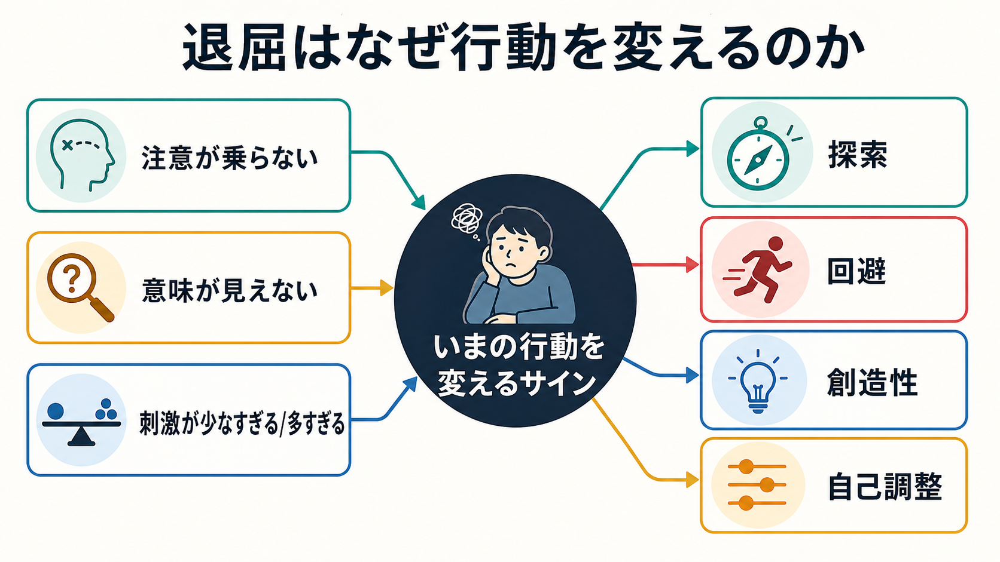
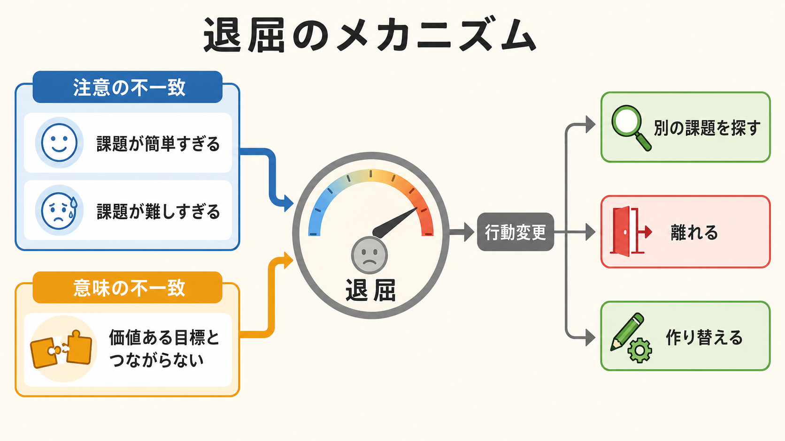
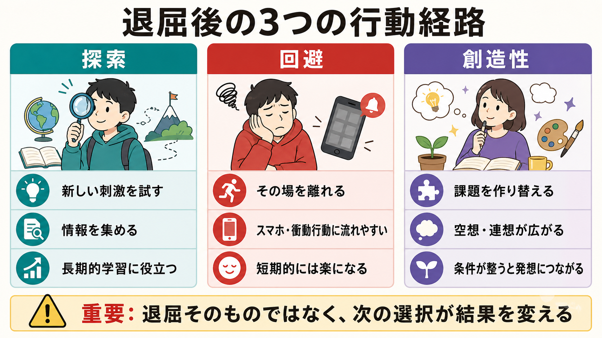

# 退屈はなぜ行動を変えるのか

## 要点

- 退屈は「何もしたくない」状態ではなく、「いまの活動には十分に関われないが、何か別の満足できる活動には関わりたい」という感情状態である[1]。
- 退屈は、現在の行動が注意・意味・刺激の水準に合っていないことを知らせ、別の目標や活動へ移るように促す[2][3]。
- 退屈後の行動は一方向ではない。探索、回避、衝動的な気晴らし、課題の作り替え、創造的連想のいずれにも進みうる[2][5][6]。
- 「退屈そのものが創造性を高める」と単純化するのは危険である。退屈が有益に働くには、空想や連想を許す余白、選べる代替行動、課題を作り替える余地が必要である[6]。
- 臨床・教育・研究では、退屈を怠けや性格の問題として短絡せず、注意の失敗、意味の欠如、自己調整、環境設計の問題として扱う必要がある[1][3][8]。

## この記事で答える問い

1. 退屈は、なぜ単なる不快感ではなく行動を変える信号になるのか。
2. 刺激不足、注意の失敗、意味の欠如は、どのように退屈を生むのか。
3. 退屈は、探索・回避・創造性をどのように分岐させるのか。
4. 教育、研究、臨床の文脈で、退屈をどう扱えばよいのか。

## まず結論

退屈は、現在の活動に対する「関与の失敗」を知らせる感情である。人は退屈しているとき、完全に無気力になっているわけではない。むしろ、何かに関わりたいのに、いま目の前にある活動にはうまく関われない。Eastwood らは、この状態を「満足できる活動に関わりたいが関われない不快な経験」と整理した[1]。

この不快感は、行動の切り替えを促す。Bench と Lench は、退屈には、もはや有益でない目標から離れ、新しい目標や経験を探す機能があると論じた[2]。つまり退屈は、現在の行動を続ける価値が低いことを知らせるだけでなく、「別の行動候補を探せ」という信号でもある。

ただし、退屈が必ず良い結果を生むわけではない。退屈は [[探索と活用のジレンマとは何か|探索]] を促す一方で、スマートフォン、過食、衝動的な購買、危険行動のような短期的な回避にも流れやすい。重要なのは、退屈を消すことではなく、退屈が知らせている「注意・意味・刺激の不一致」を読み取り、次の行動をどう設計するかである。

## 背景

日常語では、退屈は「刺激が少ない」「やることがない」「同じことの繰り返し」と結びつけられやすい。これは一部正しい。単調すぎる作業、長すぎる待ち時間、予測できすぎる授業や会議は退屈を生みやすい。

しかし、退屈は刺激不足だけでは説明できない。情報が多すぎる場合、課題が難しすぎて何をすればよいかわからない場合、または活動の意味が自分の価値や目標とつながらない場合にも退屈は起こる[3]。この点で、退屈は [[動機づけとは何か|動機づけ]]、[[内発的動機づけとは何か|内発的動機づけ]]、注意、意味づけ、自己調整が交差する感情である。

退屈研究で重要なのは、退屈を「低覚醒の気分」とだけ見ないことである。退屈には不快さ、落ち着かなさ、時間が遅く感じられること、注意が散ること、いまの環境のせいで関われないと感じることが含まれる[1]。そのため、退屈は単に休めば消える疲労とも、危険を避ける恐怖とも異なる。

## 基本概念

### 退屈

退屈とは、現在の活動に満足して関われないにもかかわらず、何かに関わりたい欲求は残っている状態である[1]。この定義では、退屈の中心は「活動がないこと」ではなく「関与できないこと」にある。

たとえば、簡単すぎる課題では注意を維持する必要がなく、難しすぎる課題では注意をどこに向ければよいかわからない。どちらも、活動への関与を損なう。さらに、その活動が自分の目標や価値に結びついていないと、たとえ適度な難しさでも退屈になりうる[3]。

### 刺激不足と刺激過多

退屈は、刺激が少なすぎるときだけでなく、多すぎるときにも起こる。刺激が少なすぎると、注意を向ける対象が乏しくなる。刺激が多すぎると、何を選び、どの手がかりに従えばよいかがわからなくなる。どちらも「有意味な関与」を妨げる。

この観点は、[[報酬系とは何か|報酬系]] や [[価値学習とは何か|価値学習]] の議論とも接続しやすい。行動を続けるには、その活動が何らかの価値、期待、進展感をもつ必要がある。価値が見えず、予測誤差も生じず、何を学べるかもわからないと、退屈は強くなりやすい。

### 意味の欠如

退屈には実存的な側面もある。Van Tilburg らは、退屈が意味の探索と結びつき、ノスタルジアのような意味回復の反応を誘発しうることを示した[4]。つまり退屈は、「刺激が足りない」だけでなく「これは自分にとって何の意味があるのか」という問いを立ち上げる。

この意味の欠如は、教育や仕事で重要である。作業が簡単でも、難しくても、目的が見えなければ退屈になる。反対に、単調な反復でも、技能の上達、他者への貢献、長期的目標との接続が見えると、退屈は弱まりやすい。

## 仕組み

### 1. 注意が活動に乗らない

退屈の第一の経路は、注意の不一致である。Eastwood らは、退屈を注意の観点から定義した。人は、内部の思考や外部の刺激にうまく注意を向けられず、満足できる活動に参加できないときに退屈を経験しやすい[1]。

このとき問題になるのは、単に注意力が低いことではない。課題の要求と利用可能な認知資源が合っていないことが重要である。簡単すぎる課題では資源が余り、難しすぎる課題では資源が足りない。どちらでも注意は活動に結びつきにくい。

### 2. 意味が価値ある目標とつながらない

Westgate と Wilson の MAC モデルは、退屈を「注意の成分」と「意味の成分」から説明する[3]。このモデルでは、退屈は、活動の認知的要求と利用可能な注意資源の不一致、または活動と価値ある目標の不一致によって生じる。

この見方は、退屈が「暇」だけでなく「むなしい」「何のためかわからない」と感じられる理由を説明する。人は、課題に注意を向けられていても、それが自分の価値や目標とつながらないと退屈しうる。逆に、意味が強くても、課題が複雑すぎて何をすればよいかわからなければ退屈になりうる。

### 3. 行動変更の圧力が高まる

退屈は不快であるため、現在の状態から離れたい圧力を生む。Wilson らの実験では、参加者は短時間「何もせず考える」ことを楽しく感じにくく、外的な活動を好み、条件によっては不快な刺激を選ぶ人もいた[5]。この結果は、退屈や関与の欠如が、人を「何かをする」方向へ強く押すことを示している。

ただし、この実験を「人は考えることが嫌いである」と読むのは単純すぎる。より慎重には、構造のない時間、選べる対象の少なさ、注意を置く足場の不足が、行動変更への圧力を高めると考えられる。

### 4. 次の行動は環境に依存して分岐する

退屈が促すのは「良い行動」ではなく「別の行動」である。選べる代替行動が学習や探索なら、退屈は新しい情報収集につながる。選べる代替行動がスマートフォンや衝動的な気晴らしなら、退屈は短期的な回避に向かいやすい。課題を作り替える余地があれば、退屈は創造的な再構成につながりうる。

この点で、退屈は [[回避学習とは何か|回避学習]] とも接続する。退屈な場面から離れると一時的に楽になるため、その離脱行動が強化されることがある。短期的には適応的でも、長期的には学習機会や関係形成を狭める場合がある。

## 図解

上の図は、退屈後の行動を三つに分けている。

| 経路 | 起こること | 役立つ条件 | 注意点 |
|---|---|---|---|
| 探索 | 新しい刺激、情報、課題を試す | 選択肢があり、失敗コストが低い | 目的のない散漫な探索になることがある |
| 回避 | その場を離れる、気晴らしに流れる | 危険や過負荷から距離を取る必要がある | 短期的な楽さが長期的な停滞を強めることがある |
| 創造性 | 課題を作り替え、空想や連想を使う | 時間的余白、心理的安全性、素材がある | 退屈だけで自動的に創造性が生まれるわけではない |

## 臨床・研究との接続

### 教育

教育では、退屈を「やる気がない」とだけ見ないことが重要である。課題が簡単すぎる、難しすぎる、目的が見えない、進展が感じられない、選択肢がなさすぎる、という複数の経路がありうる。

実践上は、課題の難易度を調整し、なぜ学ぶのかを説明し、小さな選択肢を用意し、進歩のフィードバックを与えることが有効になりやすい。これは [[自己決定理論とは何か|自己決定理論]] の自律性・有能感・関係性の観点とも整合する。

### 研究

研究では、退屈を単一の自己報告得点だけで扱うと、注意の不一致、意味の欠如、刺激不足、刺激過多、自己制御の困難を混同しやすい。MAC モデルのように、注意と意味を分けて測る設計が役立つ[3]。

また、退屈傾向は自己調整とも関わる。Danckert らは、退屈しやすさの成分が自己制御、制御焦点、行動開始の傾向、認知的柔軟性と関連することを報告している[8]。これは、退屈を「個人の性格」として固定的に見るより、目標追求と環境調整の問題として扱う必要を示す。

### 臨床

臨床に近い文脈では、退屈はうつ、注意困難、依存、衝動性、慢性的な空虚感、生活リズムの乱れと重なりうる。Danckert と Eastwood は、退屈を「関与したいのに関与できない」経験として幅広く整理し、退屈への反応が事故、リスク行動、孤立、デジタルな気晴らしと結びつきうる一方で、適切に読めば生活を組み直す手がかりにもなると論じている[7]。ただし、退屈だけから個別の診断や治療方針を決めることはできない。本記事は教育・研究目的の整理であり、個別の診断や治療指示ではない。

実務的には、退屈がどの行動を強化しているかを見ることが重要である。たとえば、[[プロクラステイネーションはなぜ起こるのか|先延ばし]]、[[衝動性とは何か|衝動性]]、過剰な気晴らしがある場合、退屈を消すことだけを目標にすると短期的報酬へ流れやすい。むしろ、退屈が出たときに選べる代替行動を事前に作ることが支援になる。

## よくある誤解

### 誤解1: 退屈は刺激が少ないときだけ起こる

退屈は刺激不足で起こりやすいが、刺激過多でも起こる。情報が多すぎ、課題が難しすぎ、どこに注意を向ければよいかわからない場合にも、関与の失敗が生じる[3]。

### 誤解2: 退屈は悪い感情だから取り除けばよい

退屈は不快だが、機能をもつ。現在の活動がうまく働いていないことを知らせ、別の目標を探すよう促す[2]。問題は退屈そのものではなく、退屈後にどの行動を選ぶかである。

### 誤解3: 退屈すれば創造的になる

退屈な活動の後に創造的課題の成績が高まる場合はある[6]。しかし、これは退屈が自動的に創造性を生むという意味ではない。空想や連想を許す余白、課題を作り替える自由、素材へのアクセスがなければ、退屈は単なる回避や苛立ちに向かう。

### 誤解4: 退屈は本人の怠けである

退屈には個人差があるが、環境側の構造も大きい。難易度、意味づけ、選択肢、社会的文脈、時間の長さ、フィードバックの乏しさが退屈を左右する。本人の努力だけで説明すると、支援や設計の手がかりを見落とす。

## 関連ノート

既存ノート:

- [[動機づけとは何か]]
- [[内発的動機づけとは何か]]
- [[探索と活用のジレンマとは何か]]
- [[回避学習とは何か]]
- [[報酬系とは何か]]
- [[価値学習とは何か]]
- [[自己決定理論とは何か]]
- [[プロクラステイネーションはなぜ起こるのか]]
- [[衝動性とは何か]]

今後の作成候補:

- 退屈傾向とは何か
- 意味づけは学習をどう変えるのか
- 空想と創造性はどう関係するのか
- スマートフォン使用と退屈の関係

MOC 更新候補:

- `content/00_MOC/` 配下の認知科学・心理学、学習・行動・動機づけ関連 MOC に、本記事へのリンクをバッチ統合時に追加する。

このジョブでは並列編集競合を避けるため、MOC 本体は更新しない。

## 理解チェック

1. 退屈を「何もしたくない状態」とだけ定義すると、どの点を見落とすか。
2. 注意の不一致と意味の不一致は、それぞれどのように退屈を生むか。
3. 退屈後の探索と回避は、どの条件で分かれやすいか。
4. 「退屈は創造性を高める」という主張を、どのように限定して理解すべきか。
5. 教育や臨床支援で、退屈を本人の怠けに還元しないためには何を観察すべきか。

## 参考文献

[1] Eastwood, J. D., Frischen, A., Fenske, M. J., & Smilek, D. (2012). The unengaged mind: Defining boredom in terms of attention. *Perspectives on Psychological Science, 7*(5), 482-495. https://doi.org/10.1177/1745691612456044

[2] Bench, S. W., & Lench, H. C. (2013). On the function of boredom. *Behavioral Sciences, 3*(3), 459-472. https://doi.org/10.3390/bs3030459

[3] Westgate, E. C., & Wilson, T. D. (2018). Boring thoughts and bored minds: The MAC model of boredom and cognitive engagement. *Psychological Review, 125*(5), 689-713. https://doi.org/10.1037/rev0000097

[4] Van Tilburg, W. A. P., Igou, E. R., & Sedikides, C. (2013). In search of meaningfulness: Nostalgia as an antidote to boredom. *Emotion, 13*(3), 450-461. https://doi.org/10.1037/a0030442

[5] Wilson, T. D., Reinhard, D. A., Westgate, E. C., Gilbert, D. T., Ellerbeck, N., Hahn, C., Brown, C. L., & Shaked, A. (2014). Just think: The challenges of the disengaged mind. *Science, 345*(6192), 75-77. https://doi.org/10.1126/science.1250830

[6] Mann, S., & Cadman, R. (2014). Does being bored make us more creative? *Creativity Research Journal, 26*(2), 165-173. https://doi.org/10.1080/10400419.2014.901073

[7] Danckert, J., & Eastwood, J. D. (2020). *Out of My Skull: The Psychology of Boredom*. Harvard University Press. https://doi.org/10.4159/9780674247079

[8] Mugon, J., Struk, A., & Danckert, J. (2018). A failure to launch: Regulatory modes and boredom proneness. *Frontiers in Psychology, 9*, 1126. https://doi.org/10.3389/fpsyg.2018.01126

## 未解決問題

- 退屈が探索に向かう場合と、短期的な回避に向かう場合を分ける環境条件は、どの程度一般化できるのか。
- 退屈傾向、注意困難、衝動性、抑うつ、孤独感の関係は、因果的にどの方向へ働くのか。
- デジタル環境では、退屈をすぐ埋める設計が、長期的な探索や創造性をどの程度妨げるのか。
- 教育現場で、退屈を減らすことと、退屈に耐えて課題を作り替える力を育てることは、どのように両立できるのか。
