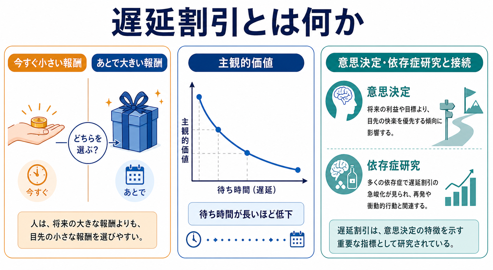
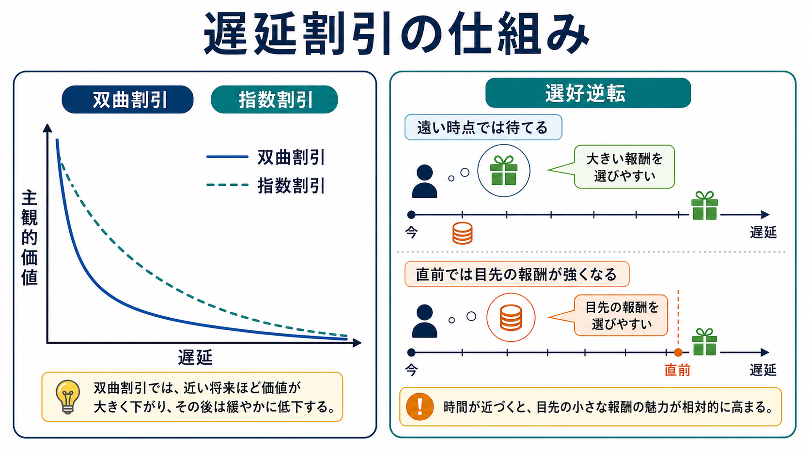
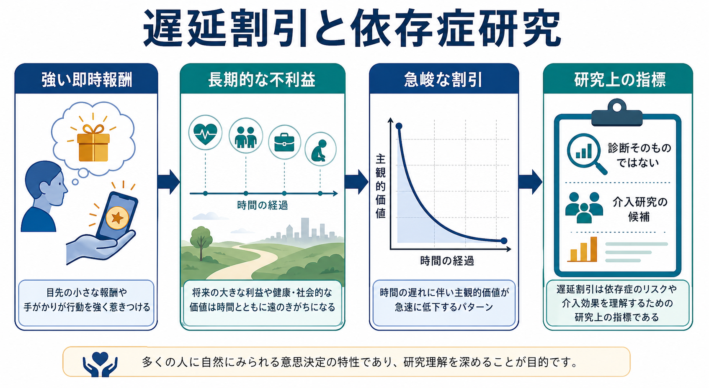

# 遅延割引とは何か

## 要点

- 遅延割引とは、報酬や結果が将来に遅れるほど、その主観的価値が低く見積もられる現象である。典型例は「今すぐ少額を受け取るか、数か月後に多額を受け取るか」という[[意思決定とは何か|意思決定]]である[1][2]。
- 遅延割引は単なる「我慢の弱さ」ではない。報酬の大きさ、遅延の長さ、不確実性、ストレス、手がかり、生活環境、将来の見通しやすさが組み合わさって変化する[1][2]。
- 実験研究では、指数割引よりも双曲割引に近いパターンがよく観察される。双曲割引では、報酬が近づいた直前に価値評価が急に変わり、選好逆転が起こりやすい[3][4]。
- 依存症研究では、即時報酬を相対的に強く評価し、遅れた大きな利益を低く評価する傾向が、物質使用や行動嗜癖と関連することがメタ分析で示されている[5][6][7]。
- ただし、遅延割引は診断そのものではない。個人の臨床状態を単独で決める指標ではなく、[[衝動性とは何か|衝動性]]、[[報酬系とは何か|報酬系]]、認知制御、環境要因を研究するための行動指標として扱う必要がある[6][8]。

## この記事で答える問い

1. 遅延割引とは何を測る概念なのか。
2. なぜ人は、将来の大きな報酬より目先の小さな報酬を選ぶことがあるのか。
3. 双曲割引、指数割引、選好逆転はどう違うのか。
4. 遅延割引は依存症や臨床研究でどのように使われるのか。
5. 遅延割引を解釈するとき、どのような誤解を避けるべきか。

## まず結論

遅延割引は、「将来の価値が、現在の意思決定の中でどれくらい目減りして扱われるか」を表す概念である。たとえば、今日もらえる 5,000 円と、1 年後にもらえる 10,000 円を比べるとき、後者の客観的金額は大きい。しかし、待つ不便さ、不確実性、将来の実感しにくさ、現在の欲求の強さによって、1 年後の 10,000 円の主観的価値は今日の 5,000 円より低く感じられることがある[1][2]。

この現象は、日常的な先延ばし、貯蓄、健康行動、学習、物質使用、ギャンブルなどに広く関係する。ただし、「遅延割引が高い人は悪い」「遅延割引が低いほど常によい」とは言えない。将来が不確実で、資源が乏しく、今の報酬が生活上きわめて重要な場面では、即時報酬を選ぶことが合理的に見える場合もある。したがって遅延割引は、個人の道徳性ではなく、[[価値学習とは何か|価値評価]]と環境条件の相互作用として理解するのがよい。

## 背景

経済学では、将来の利得を現在価値に換算する「割引」という考え方が古くから用いられてきた。標準的な割引モデルでは、将来報酬の価値は時間とともに一定の割合で下がると仮定される。心理学・行動経済学では、このような規範的モデルだけでは、人間や動物の実際の選択を十分に説明できないことが問題になった[1]。

遅延割引研究が重要なのは、選択が「報酬量」だけで決まらないことを明確に示すからである。同じ 10,000 円でも、今もらえる、明日もらえる、1 年後にもらえる、条件が不確実、受け取りに手間がかかる、という違いによって価値は変わる。さらに、将来の報酬が近づくにつれて、以前は「待てる」と思っていた人が、直前になって「やはり今すぐの小さな報酬」を選ぶこともある。この選好逆転を説明するために、双曲割引や準双曲割引などのモデルが発展した[3][4]。

## 基本概念

### 遅延割引

遅延割引とは、結果の受け取りが遅れるほど、その結果の主観的価値が下がる現象である[2]。報酬を $A$、遅延を $D$、割引率を $k$ とすると、よく使われる双曲割引モデルは次のように表せる。

$$
V = \frac{A}{1 + kD}
$$

ここで $V$ は主観的価値である。$k$ が大きいほど、遅延に対して価値が急に下がる。つまり、同じ将来報酬でも、$k$ が大きい人や状況では「待つ価値」が低く見積もられやすい。

### 指数割引と双曲割引

指数割引では、時間が進むごとに一定の比率で価値が低下する。式で書けば、たとえば次のようになる。

$$
V = A e^{-rD}
$$

このモデルは数学的には扱いやすく、時間を通じて一貫した選好を想定しやすい。一方、実際の行動では、近い将来の遅延に対して価値が急落し、遠い将来では低下が緩やかになることが多い。このパターンが双曲割引である[3]。

### 選好逆転

選好逆転とは、時間が経つにつれて選択の好みが入れ替わることである。たとえば、1 か月前には「来月まで待って大きな報酬を得る」と決めていたのに、選択時点が近づくと「今すぐ小さな報酬を得る」に変わる。この現象は、双曲割引の曲線が近い遅延で急に変化することと関係する[3][4]。

## 仕組み

### 1. 将来報酬は抽象的になりやすい

目の前の報酬は感覚的に具体的である。食べ物、薬物、スマートフォン通知、賞賛、課金アイテム、ギャンブルの当たりなどは、注意を引き、[[報酬系とは何か|報酬系]]や接近行動を強く動かしやすい。一方、将来の健康、貯蓄、信頼、学習成果は、重要であっても抽象的で、現在の行動に変換しにくい。

このため、遅延割引は単に「未来を軽視する」というより、「将来の価値を現在の行動選択に十分な強度で表現できるか」という問題でもある。[[実行機能とは何か|実行機能]]、計画、ワーキングメモリ、将来イメージの鮮明さが関わる可能性がある。

### 2. 即時報酬は手がかりによって増幅される

依存症や習慣行動では、報酬そのものだけでなく、報酬を予告する手がかりが重要になる。飲酒場面、喫煙場所、通知音、ギャンブル環境などは、報酬予測を高め、即時報酬の主観的価値を押し上げる。[[報酬予測誤差とは何か|報酬予測誤差]]や[[強化学習とは何か|強化学習]]の観点から見ると、過去の経験によって手がかりと報酬が結びつき、現在の選択を偏らせる。

### 3. 認知制御は将来価値を保つ働きをする

遅延報酬を選ぶには、目先の報酬を消すだけでなく、将来の報酬を行動選択の中に保つ必要がある。神経経済学の研究では、即時報酬を含む選択で辺縁系・報酬関連領域が強く関与し、より長期的な選択では前頭頭頂ネットワークが関与するという報告がある[8]。ただし、これは単純な「感情脳対理性脳」ではない。実際の選択は、報酬価値、記憶、注意、身体状態、社会的文脈が組み合わさって生じる。

## 図解

図1は、遅延割引を「今すぐの小さな報酬」と「あとでの大きな報酬」の比較として示している。図2は、双曲割引が近い遅延で価値を急に下げるため、選択時点が近づくと選好逆転が起こりやすいことを示している。図3は、依存症研究における遅延割引の位置づけを示す。遅延割引は診断そのものではなく、即時報酬、長期的不利益、認知制御、介入研究をつなぐ研究上の指標である。

## 臨床・研究との接続

### 依存症研究

依存症研究では、遅延割引は行動経済学的な[[衝動性とは何か|衝動性]]指標として広く用いられてきた。ヘロイン依存症群が非薬物使用対照群よりも遅延報酬を急峻に割り引いたという古典的研究は、物質使用と遅延割引の関係を強く印象づけた[5]。その後のメタ分析でも、依存行動を示す群では、遅延報酬の割引が高い傾向が報告されている[6]。

より新しいメタ分析では、物質使用や嗜癖行動の重症度と遅延割引の連続的関連も検討されている[7]。ただし、効果量、測定法、対象集団、報酬の種類、併存症、社会経済的条件によって結果は変わる。したがって、遅延割引を「依存症の原因」と単純に読むのではなく、即時報酬が強く、将来報酬が行動に反映されにくくなる意思決定パターンの一部として読むのが適切である。

### 介入研究

遅延割引は、将来価値をより具体的にする介入、環境から即時手がかりを減らす介入、報酬構造を変える介入、エピソード的未来思考、作業記憶訓練、マインドフルネス、コンティンジェンシー・マネジメントなどの研究と接続される。ただし、これらは研究上の候補であり、個人に対する治療指示として短絡してはいけない。臨床場面では、遅延割引だけでなく、症状、生活史、支援資源、安全性、本人の目標を含めて総合的に理解する必要がある。

### 日常の意思決定

遅延割引は依存症だけの概念ではない。学習、運動、睡眠、貯蓄、食行動、先延ばし、キャリア選択など、現在の行動と将来の結果がずれる場面に広く関わる。[[プロクラステイネーションはなぜ起こるのか|プロクラステイネーション]]では、今の不快感を避ける報酬が強く、将来の損失が遠く感じられる。[[習慣形成にはどのような条件が必要なのか|習慣形成]]では、将来の利益を待つだけでなく、現在の行動にも小さな報酬を設計することが重要になる。

## よくある誤解

### 遅延割引は「意志の弱さ」ではない

遅延割引は、性格の欠陥ではなく、価値評価と環境条件の相互作用である。即時報酬が生活維持に重要な状況、将来が不確実な状況、慢性的ストレスが高い状況では、将来報酬を低く見積もることが環境への適応として理解できる場合がある。

### 遅延割引が低ければ常によいわけではない

どんな状況でも将来報酬を優先すればよいわけではない。今すぐ必要な休息、痛みの軽減、安全確保、人間関係の応答などは、将来目標より優先されるべき場面がある。遅延割引を考えるときは、「現在報酬を選ぶことが本当に不利益なのか」を文脈ごとに見なければならない。

### 依存症の診断指標そのものではない

遅延割引の高さは、依存症や問題行動と関連することがあるが、単独で診断を決めるものではない[6][7]。臨床的には、診断基準、機能障害、苦痛、生活環境、併存症、本人の目標を含めて評価する必要がある。この記事の内容は教育・研究目的の整理であり、個別の診断や治療指示ではない。

## 関連ノート

- [[意思決定とは何か]]
- [[リスク下の意思決定はどのように行われるのか]]
- [[衝動性とは何か]]
- [[価値学習とは何か]]
- [[報酬系とは何か]]
- [[報酬予測誤差とは何か]]
- [[強化学習とは何か]]
- [[プロクラステイネーションはなぜ起こるのか]]
- [[習慣形成にはどのような条件が必要なのか]]

MOC更新候補: `content/00_MOC/` 配下の認知科学・心理学、学習・行動・動機づけ、精神医学・依存症関連 MOC に、本記事へのリンクを追加する候補がある。ただし並列ジョブとの競合を避けるため、このタスクでは MOC 本体は更新しない。

## 理解チェック

1. 遅延割引では、報酬の「大きさ」以外に何が価値評価を変えるか。
2. 指数割引と双曲割引では、選好逆転の説明しやすさがどう違うか。
3. 依存症研究で遅延割引が注目される理由は何か。
4. 遅延割引を「診断そのもの」と見なしてはいけない理由は何か。
5. 日常生活で、即時報酬を選ぶことが必ずしも不合理ではない例を挙げられるか。

## 未解決問題

- 遅延割引が依存行動の原因、結果、維持要因のどれとして働くのかは、縦断研究や介入研究でさらに整理する必要がある。
- 金銭報酬で測った遅延割引が、食物、薬物、社会的報酬、健康行動などにどこまで一般化するかは一様ではない。
- 文化、貧困、ストレス、将来の不確実性が遅延割引に与える影響を、個人差だけに還元しない研究設計が必要である。
- 神経機構については、単純な二重過程モデルではなく、価値表現、認知制御、記憶、身体状態、環境手がかりの動的相互作用として捉える必要がある。

## 参考文献

[1] Frederick, S., Loewenstein, G., & O'Donoghue, T. (2002). Time discounting and time preference: A critical review. *Journal of Economic Literature, 40*(2), 351-401. https://doi.org/10.1257/002205102320161311

[2] Odum, A. L. (2011). Delay discounting: I'm a k, you're a k. *Journal of the Experimental Analysis of Behavior, 96*(3), 427-439. https://doi.org/10.1901/jeab.2011.96-423

[3] Ainslie, G. (1975). Specious reward: A behavioral theory of impulsiveness and impulse control. *Psychological Bulletin, 82*(4), 463-496. https://doi.org/10.1037/h0076860

[4] Rachlin, H., & Green, L. (1972). Commitment, choice and self-control. *Journal of the Experimental Analysis of Behavior, 17*(1), 15-22. https://doi.org/10.1901/jeab.1972.17-15

[5] Kirby, K. N., Petry, N. M., & Bickel, W. K. (1999). Heroin addicts have higher discount rates for delayed rewards than non-drug-using controls. *Journal of Experimental Psychology: General, 128*(1), 78-87. https://doi.org/10.1037/0096-3445.128.1.78

[6] MacKillop, J., Amlung, M. T., Few, L. R., Ray, L. A., Sweet, L. H., & Munafò, M. R. (2011). Delayed reward discounting and addictive behavior: A meta-analysis. *Psychopharmacology, 216*(3), 305-321. https://doi.org/10.1007/s00213-011-2229-0

[7] Amlung, M., Vedelago, L., Acker, J., Balodis, I., & MacKillop, J. (2017). Steep delay discounting and addictive behavior: A meta-analysis of continuous associations. *Addiction, 112*(1), 51-62. https://doi.org/10.1111/add.13535

[8] McClure, S. M., Laibson, D. I., Loewenstein, G., & Cohen, J. D. (2004). Separate neural systems value immediate and delayed monetary rewards. *Science, 306*(5695), 503-507. https://doi.org/10.1126/science.1100907
