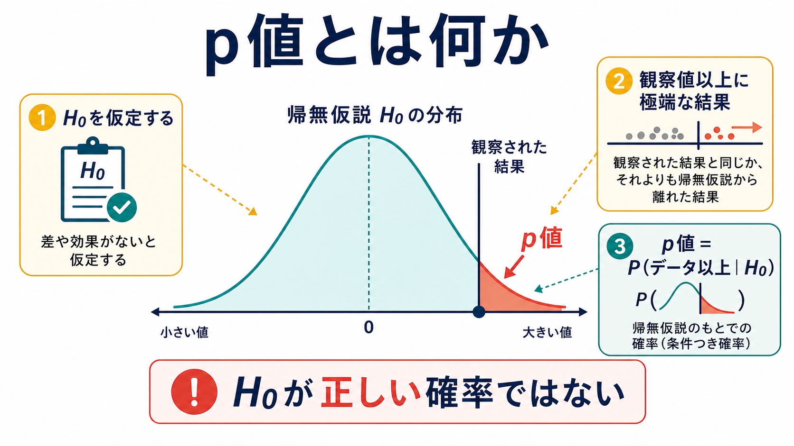
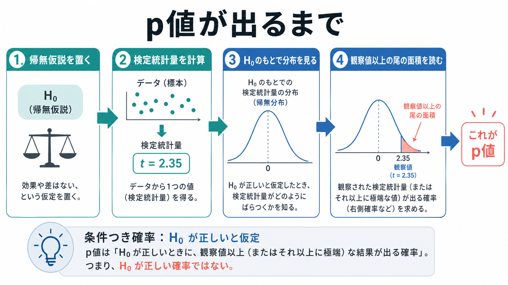
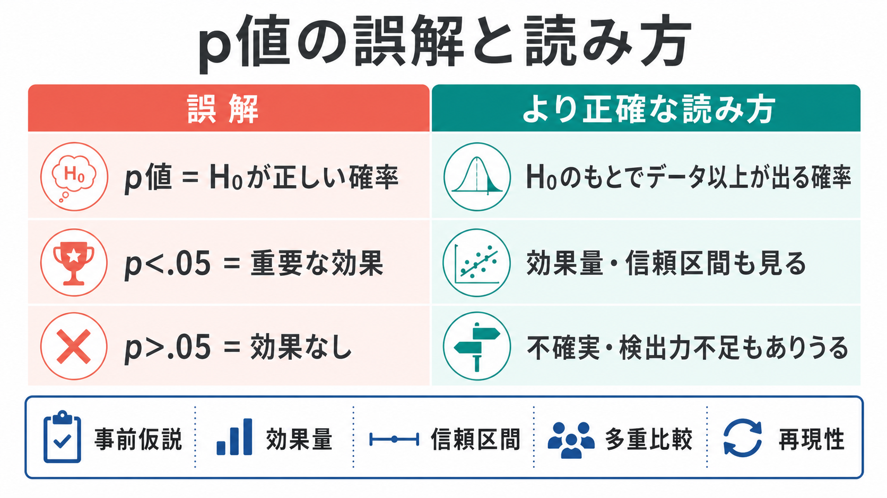

# p値とは何か

## 要点

- p値は「帰無仮説が正しい確率」ではなく、「帰無仮説を仮定したとき、観察された結果と同じか、それ以上に極端な結果が得られる確率」である[1]。
- p値が小さいほど、観察データは帰無仮説の予測と相性が悪い。ただし、効果の大きさ、研究の重要性、再現可能性を単独で保証しない[1][2]。
- `p < .05` は慣習的な判断線にすぎず、証拠を「真 / 偽」に二分する境界ではない[6]。
- 心理学研究では、p値を効果量、信頼区間、研究デザイン、事前仮説、分析の透明性と合わせて読む必要がある[4][7][8]。

## この記事で答える問い

- p値は、何の確率なのか。
- 「観察された結果以上」とは何を意味するのか。
- なぜ「p値が小さい = 仮説が正しい」と言えないのか。
- [[心理学研究法とは何か]]、[[実験研究とは何か]]、[[観察研究とは何か]]の中で、p値をどう扱えばよいのか。

## まず結論

p値は、データを得た後に「もし帰無仮説 $H_0$ が成り立っていたなら、この程度以上に帰無仮説から外れたデータはどれくらい珍しいか」を測る指標である。式で書くと、単純化すれば次のように表せる。

$$
p = P(T(X) \geq T(x_{\mathrm{obs}}) \mid H_0)
$$

ここで $T(X)$ は検定統計量、$T(x_{\mathrm{obs}})$ は実際に観察された検定統計量である。「以上に極端」とは、検定の向きや両側検定か片側検定かによって定義される。たとえば「平均差が 0 である」という帰無仮説のもとで、観察された平均差がかなり大きければ、その値と同じか、さらに帰無仮説から離れた平均差が出る確率を考える。

## 背景

p値は、心理学、医学、神経科学、教育測定などで広く使われる統計的仮説検定の中心的な指標である。典型的には、研究者は「差がない」「関連がない」「効果がない」といった帰無仮説を置き、データがその仮説とどれくらい両立しにくいかを評価する。

米国統計学会の声明は、p値を有用な指標と認めつつも、誤用と誤解が科学的結論の再現性や解釈を損なってきたと整理している[1]。特に問題になるのは、p値を「仮説が正しい確率」「偶然である確率」「研究結果が再現する確率」と読んでしまうことである[2][5]。

心理学では、同じ `p < .05` でも、サンプルサイズ、測定の[[信頼性とは何か|信頼性]]、分析選択、除外基準、測定項目の数によって意味が変わる。したがって、p値は研究結果を読むための入口であって、結論そのものではない。

## 基本概念

### 帰無仮説

帰無仮説 $H_0$ は、検定でいったん仮定する基準モデルである。たとえば「介入群と対照群の平均差は 0」「尺度得点と症状得点の相関は 0」「条件 A と条件 B の反応時間差は 0」といった形をとる。

重要なのは、p値が $H_0$ の真偽そのものを直接測っていない点である。p値はあくまで「$H_0$ が成り立つ世界で、このデータはどれくらい珍しいか」を表す条件つき確率である[1][3]。

### 観察された結果以上

「観察された結果以上」とは、観察値と同じくらい、またはそれよりも帰無仮説から離れた結果を指す。ここでの「離れ方」は検定統計量で測る。

たとえば、2群の平均差を調べる t 検定では、平均差そのものではなく、平均差を標準誤差で割った t 値を使う。観察された t 値が 2.2 で両側検定なら、帰無仮説のもとで $|T| \geq 2.2$ となる確率が p値になる。

### 有意水準

有意水準 $\alpha$ は、データを見る前に決める判断基準である。慣習的には `.05` がよく使われるが、これは自然法則ではない。研究の目的、誤判定のコスト、多重比較、探索的か確認的かによって、適切な基準は変わる[6]。この点は[[カットオフ値はどのように決めるのか]]とも接続する。

## 仕組み

p値の計算は、概念的には次の手順で理解できる。

1. 帰無仮説 $H_0$ を置く。
2. データから検定統計量を計算する。
3. $H_0$ のもとで、その検定統計量がどのように分布するかを考える。
4. 観察された値と同じか、それ以上に極端な値が出る確率を求める。

例として、ある心理教育プログラムの前後で不安得点が下がったかを検討するとする。帰無仮説は「平均変化は 0」である。観察された平均低下が大きく、帰無仮説のもとではその程度の低下がめったに起こらないなら、p値は小さくなる。

ただし、ここから言えるのは「データは帰無仮説と相性が悪い」ということまでである。プログラムが臨床的に有用か、効果が十分大きいか、別サンプルでも再現するかは、別の情報を必要とする[2][6][7]。

## 図解

下の図は、p値を読むときの典型的な誤解をまとめたものである。

p値を読むときは、次の区別が重要である。

| よくある読み方 | より正確な読み方 |
|---|---|
| `p = .03` だから帰無仮説が正しい確率は 3% | 帰無仮説のもとで、観察値以上に極端な結果が出る確率が 3% |
| `p < .05` だから効果は重要 | 統計的には帰無仮説と相性が悪いが、実質的重要性は効果量や文脈で判断する |
| `p > .05` だから効果はない | このデータでは十分な証拠がない。検出力不足や測定誤差もありうる |
| p値だけ見れば研究の質がわかる | 事前登録、測定の妥当性、分析計画、サンプルサイズ、再現性も必要 |

## 臨床・研究との接続

心理学・精神医学・認知科学の研究では、p値は「差や関連がノイズだけで説明しにくいか」を確認するために役立つ。しかし、臨床的・実践的な判断では、p値よりも効果の大きさと不確実性の幅が重要になることが多い。

たとえば、サンプルサイズが非常に大きい研究では、実質的には小さい差でも p値が小さくなる。一方、サンプルサイズが小さい研究では、効果が中程度でも p値が `.05` を下回らないことがある[4]。そのため、[[心理測定とは何か]]や[[妥当性とは何か]]に関わる研究では、p値だけで尺度や介入の価値を判断しない。

研究報告では、少なくとも次の情報を一緒に確認したい。

- 研究仮説は事前に決められていたか。
- 主要アウトカムと分析方法は事前に定義されていたか。
- 効果量と信頼区間は示されているか。
- 多重比較や探索的分析が区別されているか。
- データ、コード、材料、除外基準が透明に報告されているか。
- 既存研究やメタ分析と整合しているか。

心理学の再現性研究では、元研究の多くが統計的に有意であっても、直接追試で同じように有意になるとは限らないことが示された[7]。これは、p値が単独で「発見の安定性」を保証するものではないことを示している。

## よくある誤解

### 誤解1: p値は帰無仮説が正しい確率である

これは代表的な誤解である。p値は $P(\text{data} \mid H_0)$ に関わる量であり、$P(H_0 \mid \text{data})$ ではない[1][5]。後者を考えるには、事前確率や代替仮説の尤度など、ベイズ的な情報が必要になる。

### 誤解2: p値は偶然である確率である

「偶然である」という言い方は曖昧である。p値は「帰無仮説が正しいと仮定した場合の、データ以上の極端さの確率」であって、研究結果が偶然かどうかを直接判定する確率ではない[2]。

### 誤解3: p値が小さいほど効果が大きい

p値は効果量、サンプルサイズ、測定誤差、モデル仮定に影響される。効果が小さくてもサンプルサイズが大きければ p値は小さくなりうる。反対に、効果が大きくてもデータが少なければ p値は大きくなりうる[4]。

### 誤解4: `p > .05` は「差がない」ことの証明である

有意でない結果は、帰無仮説を証明しない。検出力不足、測定のばらつき、分析方法の不適合、効果の不均一性などで p値が大きくなることがある[2]。差が実質的に小さいことを示したい場合は、信頼区間、等価性検定、事前に定義した臨床的最小重要差などが必要になる。

### 誤解5: `p < .05` なら発見として確定できる

データ収集、除外基準、アウトカム選択、共変量選択、分析停止時点に柔軟性があると、実際には効果がなくても有意な結果を得やすくなる[8]。この問題は p-hacking や研究者自由度と呼ばれ、事前登録、分析計画、完全報告によって抑える必要がある。

## 関連ノート

- [[心理学研究法とは何か]]
- [[実験研究とは何か]]
- [[観察研究とは何か]]
- [[心理測定とは何か]]
- [[妥当性とは何か]]
- [[信頼性とは何か]]
- [[カットオフ値はどのように決めるのか]]
- [[横断研究と縦断研究は何が違うのか]]

MOC 更新候補: `content/00_MOC/` 配下の心理学研究法、心理測定、統計・研究法系 MOC に追加するとよい。並列ジョブとの競合を避けるため、本記事では MOC 本体は更新しない。

## 理解チェック

1. `p = .02` は「帰無仮説が正しい確率が 2%」という意味か。
2. p値が小さい研究結果を読むとき、効果量と信頼区間を一緒に見る理由は何か。
3. `p > .05` の結果を「効果なし」と断定してはいけない理由は何か。
4. 複数のアウトカムや分析方法を試した後に、最も小さい p値だけを報告すると何が問題になるか。

## 未解決問題

- p値を教育するとき、頻度主義的な定義、ベイズ的な直感、研究実務上の判断をどの順序で教えるのが最も誤解を減らすか。
- 心理学研究で `p < .05` に代わる判断基準をどこまで標準化できるか。
- 事前登録、オープンデータ、メタ分析、ベイズ推定を組み合わせたとき、p値はどの役割に限定するのがよいか。

## 参考文献

[1] Wasserstein, R. L., & Lazar, N. A. (2016). The ASA's statement on p-values: Context, process, and purpose. *The American Statistician, 70*(2), 129-133. https://doi.org/10.1080/00031305.2016.1154108

[2] Greenland, S., Senn, S. J., Rothman, K. J., Carlin, J. B., Poole, C., Goodman, S. N., & Altman, D. G. (2016). Statistical tests, P values, confidence intervals, and power: A guide to misinterpretations. *European Journal of Epidemiology, 31*(4), 337-350. https://doi.org/10.1007/s10654-016-0149-3

[3] Krzywinski, M., & Altman, N. (2013). Significance, P values and t-tests. *Nature Methods, 10*, 1041-1042. https://doi.org/10.1038/nmeth.2698

[4] Altman, N., & Krzywinski, M. (2017). P values and the search for significance. *Nature Methods, 14*, 3-4. https://doi.org/10.1038/nmeth.4120

[5] Goodman, S. (2008). A dirty dozen: Twelve p-value misconceptions. *Seminars in Hematology, 45*(3), 135-140. https://doi.org/10.1053/j.seminhematol.2008.04.003

[6] Wasserstein, R. L., Schirm, A. L., & Lazar, N. A. (2019). Moving to a world beyond "p < 0.05". *The American Statistician, 73*(sup1), 1-19. https://doi.org/10.1080/00031305.2019.1583913

[7] Open Science Collaboration. (2015). Estimating the reproducibility of psychological science. *Science, 349*(6251), aac4716. https://doi.org/10.1126/science.aac4716

[8] Simmons, J. P., Nelson, L. D., & Simonsohn, U. (2011). False-positive psychology: Undisclosed flexibility in data collection and analysis allows presenting anything as significant. *Psychological Science, 22*(11), 1359-1366. https://doi.org/10.1177/0956797611417632
