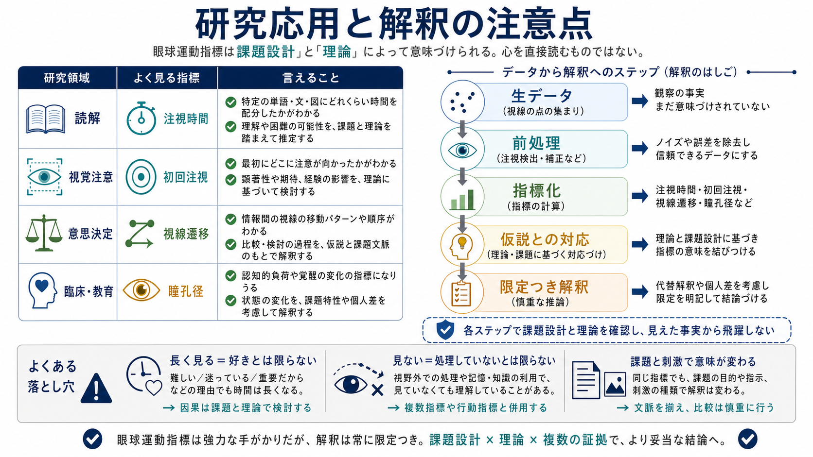
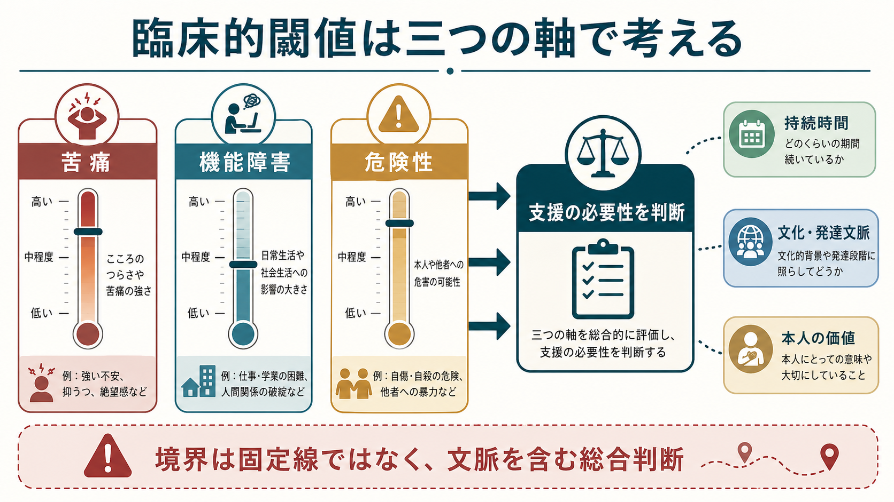
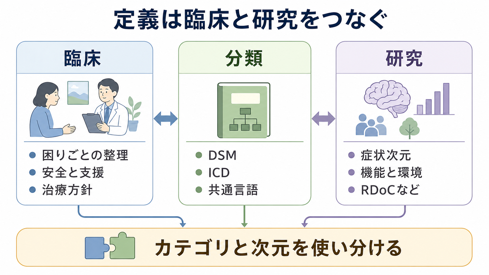

# アイトラッキングは心理研究で何を示すのか

## 要点

- アイトラッキングは「心そのもの」を読む技術ではなく、眼球運動を通じて、課題中にどの情報がいつ、どれだけサンプリングされたかを推定する方法である。
- 主な指標は、視線位置、注視、サッカード、AOI、視線遷移、瞳孔径であり、それぞれ注意、読解、探索、意思決定、認知負荷に異なる形で対応する。
- 注視時間が長いことは、関心、困難、曖昧性、価値評価、課題要求など複数の理由で生じるため、単独では心理状態を一義的に決められない。
- 解釈の質は、機器の精度だけでなく、課題設計、校正、前処理、AOI の作り方、統計モデル、理論仮説との対応に強く依存する。

## この記事で答える問い

この記事では、[[心理測定とは何か]]や[[生理指標は心理状態をどう反映するのか]]と接続しながら、アイトラッキングが心理研究で何を測っているのかを整理する。中心となる問いは次の3つである。

1. 視線位置や注視時間は、注意や認知処理のどの側面を反映するのか。
2. 読解、視覚探索、意思決定の研究では、どのような指標が使われるのか。
3. 「長く見た」「先に見た」「見なかった」から、どこまで心理状態を推論してよいのか。

## まず結論

アイトラッキングが最もよく示すのは、外界のどの領域に高解像度の視覚情報処理を割り当てたかという、顕在的注意の時系列である。人間の中心窩で細部を処理できる範囲は限られるため、読字、探索、選択、社会的場面の理解では、眼球運動が情報取得の順序をかなり直接に反映する[1][2]。

ただし、視線は注意の一部であって、注意の全体ではない。周辺視で処理される情報、内的注意、記憶検索、課題方略は、必ずしも視線位置に現れない。したがって、アイトラッキングは「何を考えているか」を読む装置ではなく、課題中の情報サンプリングを心理理論と照合するための測定法と考えるのがよい。

## 背景

心理学では、反応時間や正答率のような最終結果だけでなく、答えに至る途中の処理過程を知りたい場面が多い。たとえば文章読解では、誤答したかどうかだけでなく、どの単語で処理が詰まったのかが重要になる。意思決定では、最終的に選んだ選択肢だけでなく、価格、リスク、報酬、他者の表情をどの順序で見たのかが、判断過程を推定する手がかりになる。

眼球運動研究が有用なのは、視線がミリ秒単位で変化し、課題中の情報取得の順序を比較的細かく記録できるからである。読解研究では、注視時間、再注視、戻り読みが語彙処理、統語処理、文脈統合の負荷と関連することが示されてきた[3][4]。自然場面研究では、何を見るかは刺激の目立ちやすさだけでなく、現在の課題、行為目標、報酬構造によって大きく変わる[5]。

この点で、アイトラッキングは[[反応時間課題は何を測っているのか]]と相補的である。反応時間が「処理全体にかかった時間」を与えるのに対し、視線計測は「どの情報を、いつ、どれだけ取り込んだか」をより局所的に示す。

## 基本概念

### 視線位置

視線位置は、画面や実環境上のどこを見ていると推定されたかを表す座標である。画面実験では x-y 座標、実環境やVRではカメラ映像や3次元空間上の座標として扱われる。視線位置は最も基礎的なデータだが、そのまま心理指標になるわけではない。まばたき、頭部運動、校正誤差、サンプリングレートの影響を受けるため、前処理が必要になる[1][2]。

### 注視

注視は、視線が一定時間、比較的狭い範囲にとどまる区間である。研究では、注視中に対象の詳細な情報が取得されると仮定することが多い。読解で特定の単語への注視が長い場合、その語の頻度、予測可能性、曖昧性、文脈との整合性などが処理負荷に影響している可能性がある[3][4]。

ただし、注視の定義はアルゴリズム依存である。速度しきい値、分散しきい値、最短持続時間の設定によって、同じ生データから異なる注視列が得られる。固定的な「正解」があるというより、課題、機器、研究目的に合う検出規則を明示する必要がある[6]。

### サッカード

サッカードは、注視点から次の注視点へ移る高速な眼球運動である。サッカード中は視覚入力が抑制されるため、多くの情報取得は注視中に行われると考えられる。サッカードの方向、振幅、頻度は、視覚探索や読字の流暢性、画面レイアウトの探索効率を評価する手がかりになる。

### AOI

AOI（Area of Interest）は、研究者が事前または事後に定義する関心領域である。たとえば、文章中のターゲット語、広告画像、顔の目領域、選択肢カード、リスク情報欄などが AOI になる。AOI 内の初回注視時間、総注視時間、注視回数、訪問順序を集計することで、仮説に対応する比較ができる。

AOI は便利だが、研究者の切り方に依存する。領域が小さすぎると計測誤差の影響を受けやすく、大きすぎると異なる情報を混ぜてしまう。AOI は単なる作図ではなく、[[構成概念妥当性とは何か]]に関わる測定操作である。

### 瞳孔径

瞳孔径は、明るさだけでなく認知負荷や覚醒にも影響される。古典的研究では、短期記憶課題で保持負荷が増えると瞳孔径が変化することが示された[7]。ただし瞳孔径は照明、画面輝度、感情喚起、薬剤、疲労にも敏感であるため、視線位置以上に統制とベースライン補正が重要になる。

## 仕組み

多くの現代的なアイトラッカーは、ビデオベースの角膜反射法を用いる。赤外光を眼に当て、カメラで瞳孔中心と角膜反射の位置関係を検出し、校正課題を通じて画面上の視線座標へ変換する。研究用データとして使うには、少なくとも次の流れを踏む[1][2]。

1. 参加者に校正点を見てもらい、眼球画像と画面座標の対応を作る。
2. 課題中の瞳孔、角膜反射、視線座標、まばたき、欠損値を記録する。
3. 欠損値、外れ値、低信頼サンプルを処理する。
4. 注視、サッカード、AOI 内滞在時間などの指標へ変換する。
5. 課題条件、刺激特性、個人差、試行差を含めて統計的に比較する。

この流れから分かるように、アイトラッキングの測定値は機器から直接出てくる「心理状態」ではない。生データから心理指標へ進む過程には、校正、前処理、注視検出、AOI 設定、統計モデルという複数の研究者判断が入る。この判断を透明に記述することが、[[心理学研究法とは何か]]の観点から重要になる。

## 図解

アイトラッキング指標は、次のように研究上の問いと対応づけて使う。

| 指標 | 典型的な問い | 解釈の例 | 注意点 |
|---|---|---|---|
| 初回注視までの時間 | どの情報が先に捕捉されたか | 目立ちやすさ、課題関連性、探索効率 | 周辺視や刺激配置に依存する |
| 初回注視時間 | 最初の処理でどれだけ時間を要したか | 語彙処理、初期理解、注意捕捉 | 興味と困難を区別しにくい |
| 総注視時間 | どの領域に処理資源が割かれたか | 関心、重要性、処理負荷 | AOI サイズや露出時間に影響される |
| 注視回数 | 何度戻って確認したか | 再確認、迷い、比較、理解困難 | 長い滞在時間と相関しやすい |
| 視線遷移 | どの情報をどう比較したか | 選択肢間比較、読み戻り、探索方略 | 遷移の意味は課題構造に依存する |
| 瞳孔径 | 負荷や覚醒が変化したか | 認知負荷、努力、情動喚起 | 輝度と生理要因の統制が必須 |

## 臨床・研究との接続

読解研究では、アイトラッキングは単語単位の処理過程を調べるために使われる。難しい語、文脈に合わない語、曖昧な構文では注視時間や戻り読みが増えることがある。これは[[読字は脳内でどのように処理されるのか]]や[[認知負荷とは何か]]と接続する。

注意研究では、視線は[[注意とは何か]]や[[トップダウン注意とボトムアップ注意は何が違うのか]]を操作的に調べる手段になる。突然現れる刺激、目立つ色、顔、課題関連情報は視線を引きつけやすいが、何を探すかという目標も視線を強く制御する。自然場面では、視線は単なる刺激駆動ではなく、行為目標に合わせて選ばれる[5]。

意思決定研究では、視線は選択肢や属性への情報アクセスを示す。選択前にどの属性を長く見たか、選択肢間をどのように比較したかは、価値評価や証拠蓄積の過程と関連する。レビュー研究は、眼球運動が意思決定の結果を受動的に反映するだけでなく、どの情報が処理に入るかを制御することで選択過程そのものに関わる可能性を指摘している[8]。この点は[[リスク下の意思決定はどのように行われるのか]]と近い。

臨床・教育場面でも、アイトラッキングは読字困難、発達特性、注意障害、社会的認知、認知症評価などに応用される。ただし、個人診断に直結する単独指標として扱うのは慎重であるべきである。教育・研究目的では、行動指標、質問紙、神経生理指標、面接情報と組み合わせて、仮説を限定的に検証する使い方が望ましい。

## よくある誤解

### 長く見たものは「好き」だと言える？

言えない。長い注視は、好意、興味、重要性だけでなく、理解困難、曖昧性、違和感、課題要求、比較の必要性でも生じる。好意を主張したいなら、選択行動、評定、表情、生理指標など別の証拠と合わせる必要がある。

### 見ていないものは処理していない？

これも言い切れない。周辺視で処理された情報、短時間の視線、まばたきや欠損で記録されなかった視線、事前知識に基づく推論がある。特に視覚探索や読解では、中心窩外の情報も次のサッカード計画に影響する。

### ヒートマップを見れば結論が分かる？

ヒートマップは探索的な可視化には役立つが、統計的検定や理論的解釈の代わりにはならない。刺激の提示時間、参加者数、AOI の大きさ、外れ値処理によって印象が変わる。論文では、ヒートマップだけでなく、事前に定義した指標とモデルで仮説を検証する必要がある。

### アイトラッキングは客観的だから主観尺度より優れている？

単純には言えない。視線データは自己報告より反応過程に近い情報を与えるが、心理的意味づけには仮説が必要である。測定が客観的でも、構成概念との対応が弱ければ[[妥当性とは何か]]の問題は残る。

## 関連ノート

- [[心理測定とは何か]]
- [[生理指標は心理状態をどう反映するのか]]
- [[心理学研究法とは何か]]
- [[反応時間課題は何を測っているのか]]
- [[注意とは何か]]
- [[トップダウン注意とボトムアップ注意は何が違うのか]]
- [[認知負荷とは何か]]
- [[読字は脳内でどのように処理されるのか]]
- [[リスク下の意思決定はどのように行われるのか]]
- [[構成概念妥当性とは何か]]

## MOC更新候補

- `content/00_MOC/` 配下の認知科学・心理学系 MOC に、本記事を「心理測定・心理学研究」または「認知機能の測定法」として追加する候補。
- 並列ジョブとの競合を避けるため、このタスクでは MOC ファイル自体は更新しない。

## 理解チェック

1. アイトラッキングが直接測っているものと、心理学的に推論しているものを区別するとどうなるか。
2. 注視時間が長いことを「興味がある」と解釈するには、どのような追加証拠が必要か。
3. AOI の切り方が研究結果に影響するのはなぜか。
4. 読解研究と意思決定研究では、同じ「注視時間」でも意味づけがどう変わるか。

## 未解決問題

- 視線、周辺視、内的注意を統合して、注意配分をどこまでモデル化できるか。
- 個人差、疲労、薬剤、発達特性が視線指標に与える影響を、どの程度一般化可能な形で扱えるか。
- ウェブカメラ型やVR型の低侵襲アイトラッキングを、研究水準の精度と再現性でどこまで使えるか。
- 視線データを機械学習で分類する場合、説明可能性と構成概念妥当性をどう担保するか。

## 参考文献

[1] Duchowski, A. T. (2017). *Eye Tracking Methodology: Theory and Practice* (3rd ed.). Springer. https://doi.org/10.1007/978-3-319-57883-5

[2] Holmqvist, K., Nyström, M., Andersson, R., Dewhurst, R., Jarodzka, H., & van de Weijer, J. (2011). *Eye Tracking: A Comprehensive Guide to Methods and Measures*. Oxford University Press. https://global.oup.com/academic/product/eye-tracking-9780198738596

[3] Rayner, K. (1998). Eye movements in reading and information processing: 20 years of research. *Psychological Bulletin, 124*(3), 372-422. https://doi.org/10.1037/0033-2909.124.3.372

[4] Rayner, K. (2009). Eye movements and attention in reading, scene perception, and visual search. *The Quarterly Journal of Experimental Psychology, 62*(8), 1457-1506. https://doi.org/10.1080/17470210902816461

[5] Hayhoe, M., & Ballard, D. (2005). Eye movements in natural behavior. *Trends in Cognitive Sciences, 9*(4), 188-194. https://doi.org/10.1016/j.tics.2005.02.009

[6] Salvucci, D. D., & Goldberg, J. H. (2000). Identifying fixations and saccades in eye-tracking protocols. *Proceedings of the 2000 Symposium on Eye Tracking Research & Applications*, 71-78. https://doi.org/10.1145/355017.355028

[7] Kahneman, D., & Beatty, J. (1966). Pupil diameter and load on memory. *Science, 154*(3756), 1583-1585. https://doi.org/10.1126/science.154.3756.1583

[8] Orquin, J. L., & Mueller Loose, S. (2013). Attention and choice: A review on eye movements in decision making. *Acta Psychologica, 144*(1), 190-206. https://doi.org/10.1016/j.actpsy.2013.06.003
