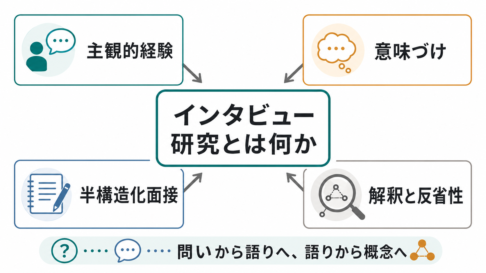
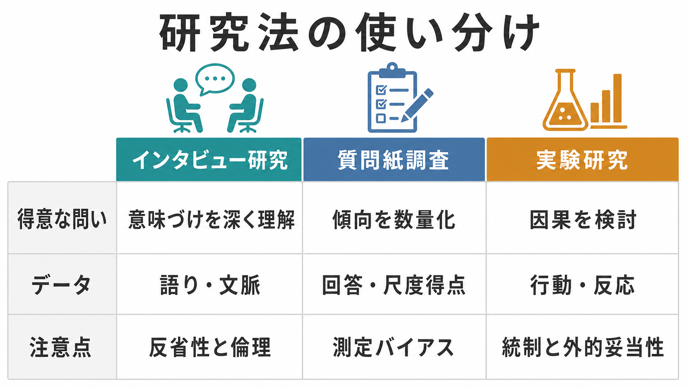

# インタビュー研究とは何か

## 要点

- インタビュー研究は、参加者の語りを通じて、行動の背後にある経験、意味づけ、状況、関係性を理解する[[心理学研究法とは何か|心理学研究法]]である。
- 半構造化面接では、研究者が面接ガイドを持ちながらも、参加者の語りに応じて追加質問を行う。標準化と探索性の中間に位置する。
- 分析では、逐語録を読み、コード化し、パターンを検討し、テーマとして解釈する。代表的な方法にテーマ分析がある[1]。
- 質的研究の品質は「人数の多さ」だけで決まらない。研究目的、サンプルの具体性、対話の質、理論的背景、分析戦略を合わせて判断する[2]。
- 研究者自身の前提、権力関係、質問の仕方、記録・分析の判断が結果に関わるため、反省性と倫理が中心的な品質管理になる[3][4]。

## この記事で答える問い

1. インタビュー研究は何を明らかにする方法なのか。
2. 半構造化面接は、自由な会話や質問紙調査と何が違うのか。
3. インタビューの語りは、どのように分析されるのか。
4. 信頼できる質的研究にするには、何を報告し、何に注意すべきか。

## まず結論

インタビュー研究は、「何人がそう答えたか」よりも、「その人がなぜ、どの文脈で、どのようにそう経験し、意味づけたのか」を問う方法である。質問紙や実験が、傾向、関連、因果を見やすくするのに対して、インタビューは、まだ尺度化されていない経験、曖昧な感情、制度や文化の中で作られる意味を扱いやすい。

ただし、インタビューは単なる「話を聞くこと」ではない。研究問いを定め、参加者を選び、面接ガイドを作り、同意を得て、録音・逐語化し、コード化し、解釈し、反省性と倫理を報告する一連の研究デザインである。報告基準である COREQ や SRQR は、研究者と参加者の関係、サンプリング、データ収集、分析、結果の提示を透明化することを求めている[3][4]。

## 背景

心理学や人間科学では、[[実験研究とは何か|実験研究]]、[[観察研究とは何か|観察研究]]、質問紙調査、臨床面接、エスノグラフィなど、問いに応じて多様な方法が使われる。インタビュー研究が必要になるのは、現象がまだ十分に定義されていないとき、既存尺度では捉えにくい経験を扱うとき、ある行動が本人や周囲にとってどのような意味を持つかを理解したいときである。

たとえば、「不安得点が高い人は何人いるか」は質問紙で扱いやすい。一方で、「その人が不安をどのような身体感覚、対人関係、職場環境、自己理解として経験しているか」は、語りと文脈を扱うインタビュー研究の方が向いている。これは[[心理測定とは何か|心理測定]]の代替ではなく、測定する概念を作る前段階や、量的結果の意味を解釈する補助にもなる。

## 基本概念

### インタビュー研究

インタビュー研究とは、研究目的に沿って参加者と対話し、そこで得られた語りをデータとして分析する質的研究である。語りは、参加者の内面をそのまま写す「透明な窓」ではない。質問の仕方、場の雰囲気、研究者との関係、文化的規範、記憶の再構成によって形作られる。そのため、語りを重視しながらも、語りが生まれた条件を合わせて読む必要がある。

### 構造化・半構造化・非構造化

| 種類 | 特徴 | 向いている問い |
|---|---|---|
| 構造化面接 | 質問順や選択肢を強く固定する | 比較可能な回答を集めたい |
| 半構造化面接 | 共通の面接ガイドを持ちつつ、追加質問を行う | 共通テーマと個別文脈の両方を見たい |
| 非構造化面接 | 会話の展開を大きく参加者に委ねる | 経験世界を探索的に理解したい |

半構造化面接は、心理学・医学教育・看護学・社会科学でよく使われる。面接ガイドの作成には、研究問い、先行研究、予備面接、質問の明瞭さ、順序、パイロットテストが関わる[5]。ガイドは「読む台本」ではなく、問いの焦点を保ちながら、参加者の語りに深く入るための足場である。

### データと分析単位

主なデータは録音、逐語録、フィールドノート、観察メモ、研究者メモである。分析単位は、一文、一段落、語りのまとまり、事例全体、参加者間の比較など、研究目的によって変わる。発話内容だけでなく、沈黙、言い直し、比喩、語りの順序、文脈情報が解釈上の手がかりになることもある。

## 仕組み

インタビュー研究は、線形に見えて実際には反復的である。面接で得られた語りを読み、初期分析で見えた論点を次の面接ガイドに反映し、必要に応じて参加者の選び方を調整する。グラウンデッド・セオリーのような方法では、理論的サンプリングや比較を通じて概念化を進める[6]。

### 研究問いを決める

問いは「経験の構造」「意味づけ」「困難への対処」「制度との相互作用」など、語りによって深まる形にする。たとえば「抑うつ経験者は治療をどう評価するか」よりも、「治療を続ける・中断する判断は、本人の生活史や周囲の期待の中でどのように語られるか」の方が、面接研究として設計しやすい。

### 参加者を選ぶ

質的研究では、無作為抽出よりも目的に即したサンプリングが使われることが多い。重要なのは「人数を増やせばよい」ではなく、研究目的に対して十分な情報力を持つサンプルかどうかである。Malterud らは、サンプルサイズを考える際に、研究目的の狭さ、サンプルの具体性、既存理論、対話の質、分析戦略を考慮する情報力という考え方を提案している[2]。飽和も有用な考え方だが、Guest らの実証研究が示すように、何回の面接で十分かはデータの同質性、分析目的、テーマの粒度に依存する[8]。

### 面接を行う

面接者は、誘導的な質問を避けながら、具体例、出来事、感情、判断の理由を掘り下げる。初心者ほど「質問をすべて消化すること」に意識が向きやすいが、よい面接では、参加者の言葉を受けて「そのとき何が起きていましたか」「その言葉はあなたにとってどういう意味ですか」と確認する。面接は情報の抽出ではなく、研究者と参加者の相互行為として成立する[7]。

### コード化とテーマ化

テーマ分析では、逐語録への馴染み、初期コード化、テーマ候補の探索、テーマの見直し、定義、記述という流れで、語りのパターンを整理する[1]。テーマは「頻出語」ではない。研究問いに照らして意味を持つ、データ内の組織化されたパターンである。したがって、テーマ分析では引用を並べるだけでなく、引用がどの解釈を支えているのかを明確にする必要がある。

## 図解

インタビュー研究は、量的研究よりも「ゆるい」方法ではない。むしろ、標準化の代わりに、問い、文脈、解釈過程、倫理、研究者の立場を明示することで品質を担保する。

## 臨床・研究との接続

臨床心理学や精神医学では、インタビュー研究は、症状の数値化だけでは見えにくい経験を理解するために使われる。たとえば、診断名が同じでも、本人が症状を「性格の弱さ」「身体の異常」「職場との不一致」「家族への負担」と捉えるかによって、援助への態度は変わる。こうした意味づけは、尺度得点だけでは十分に捉えにくい。

研究面では、インタビュー研究は少なくとも三つの役割を持つ。第一に、新しい概念や仮説を作る探索的役割。第二に、質問紙や尺度の項目作成、[[内容的妥当性とは何か|内容的妥当性]]の検討に使う役割。第三に、量的研究の結果を、参加者の文脈から解釈する混合研究法の一部としての役割である。

ただし、臨床的な語りを扱う場合、研究と診療を混同してはならない。研究面接は個別診断や治療指示ではなく、教育・研究目的で経験を理解する手続きである。苦痛を伴うテーマでは、同意、撤回可能性、守秘、録音データの管理、支援先の案内を明確にしておく必要がある。

## よくある誤解

### 「少人数だから科学的ではない」

少人数であること自体は欠点ではない。質的研究では、深く具体的なデータが研究目的に十分な情報を持つかが重要である。ただし、少人数の結果を頻度や有病率の推定のように一般化することはできない。一般化の形は、統計的一般化ではなく、概念的転用可能性や理論的説明として考える。

### 「テーマはデータから自然に出てくる」

テーマは、研究者がデータと研究問いを往復しながら構成する。したがって、分析者の前提、コード化の判断、反証例の扱いを記録し、透明に報告する必要がある。これは[[信頼性とは何か|信頼性]]や[[妥当性とは何か|妥当性]]を、量的研究と同じ指標で測るという意味ではなく、質的研究に即した品質管理を行うという意味である。

### 「面接者は中立でいればよい」

面接者は完全な中立的観察者にはなれない。年齢、性別、職業、専門性、所属機関、話し方、反応は、参加者の語りに影響する。重要なのは、影響をゼロにすることではなく、その影響を自覚し、研究記録や報告に反省性として組み込むことである[3][4]。

### 「インタビューは自由に聞けばよい」

自由な会話と研究面接は違う。研究面接では、研究問い、面接ガイド、同意説明、録音、逐語化、分析手順、引用の扱い、個人情報保護が設計される。特にセンシティブなテーマでは、参加者が語らない権利、途中で止める権利、記録の利用範囲を明確にする。

## 関連ノート

- [[心理学研究法とは何か]]
- [[実験研究とは何か]]
- [[観察研究とは何か]]
- [[心理測定とは何か]]
- [[信頼性とは何か]]
- [[妥当性とは何か]]
- [[内容的妥当性とは何か]]
- [[評価者間信頼性とは何か]]
- [[社会的望ましさバイアスとは何か]]
- [[反応バイアスとは何か]]

## MOC更新候補

- `content/00_MOC/` 配下に研究法または心理測定・心理学研究の MOC がある場合、バッチ統合時に本記事 `[[インタビュー研究とは何か]]` を追加する。
- 近接配置先は `content/02_認知科学・心理学/心理測定・心理学研究/` が妥当。

## 理解チェック

1. 半構造化面接は、構造化面接と非構造化面接のどの中間に位置するか。
2. インタビュー研究で「人数が多ければよい」と言えない理由は何か。
3. テーマ分析でいうテーマは、単なる頻出語と何が違うか。
4. 反省性は、研究者のどのような影響を明示するために必要か。
5. インタビュー研究の知見を、割合や有病率の推定のように扱うと何が問題になるか。

## 未解決問題

- AI文字起こしや自動コード化を使う場合、データ保護、誤変換、解釈責任をどのように報告すべきか。
- 参加者チェック、複数分析者、監査証跡などの品質管理を、研究目的に応じてどこまで求めるべきか。
- オンライン面接で得られる語りは、対面面接とどのように異なるのか。
- 臨床的に脆弱な参加者を対象にするとき、研究面接と支援の境界をどのように設計するか。

## 参考文献

[1] Braun, V., & Clarke, V. (2006). Using thematic analysis in psychology. *Qualitative Research in Psychology, 3*(2), 77-101. https://doi.org/10.1191/1478088706qp063oa

[2] Malterud, K., Siersma, V. D., & Guassora, A. D. (2016). Sample Size in Qualitative Interview Studies: Guided by Information Power. *Qualitative Health Research, 26*(13), 1753-1760. https://doi.org/10.1177/1049732315617444

[3] Tong, A., Sainsbury, P., & Craig, J. (2007). Consolidated criteria for reporting qualitative research (COREQ): a 32-item checklist for interviews and focus groups. *International Journal for Quality in Health Care, 19*(6), 349-357. https://doi.org/10.1093/intqhc/mzm042

[4] O'Brien, B. C., Harris, I. B., Beckman, T. J., Reed, D. A., & Cook, D. A. (2014). Standards for Reporting Qualitative Research: A Synthesis of Recommendations. *Academic Medicine, 89*(9), 1245-1251. https://doi.org/10.1097/ACM.0000000000000388

[5] Kallio, H., Pietilä, A.-M., Johnson, M., & Kangasniemi, M. (2016). Systematic methodological review: developing a framework for a qualitative semi-structured interview guide. *Journal of Advanced Nursing, 72*(12), 2954-2965. https://doi.org/10.1111/jan.13031

[6] Charmaz, K. (2014). *Constructing Grounded Theory* (2nd ed.). SAGE. https://us.sagepub.com/en-us/nam/constructing-grounded-theory/book235960

[7] McGrath, C., Palmgren, P. J., & Liljedahl, M. (2019). Twelve tips for conducting qualitative research interviews. *Medical Teacher, 41*(9), 1002-1006. https://doi.org/10.1080/0142159X.2018.1497149

[8] Guest, G., Bunce, A., & Johnson, L. (2006). How Many Interviews Are Enough? An Experiment with Data Saturation and Variability. *Field Methods, 18*(1), 59-82. https://doi.org/10.1177/1525822X05279903
