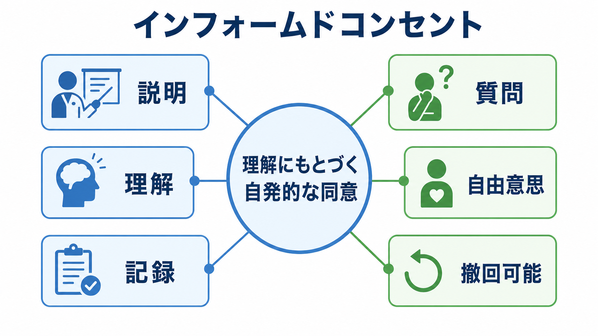
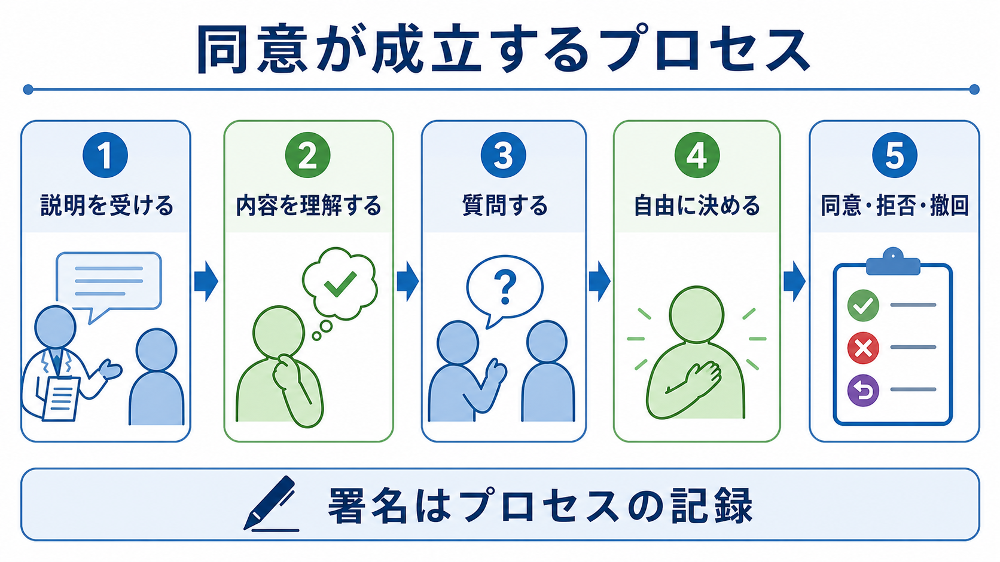

# インフォームドコンセントとは何か

## 要点

- インフォームドコンセントとは、研究参加者が研究の目的、方法、負担、リスク、利益、個人情報の扱い、撤回可能性を理解したうえで、自発的に参加を決めるための手続きである。
- Belmont Report は、同意を「情報」「理解」「自発性」の三要素として整理し、人格の尊重、善行、公正という研究倫理の原則と結びつけた [1]。
- 同意書への署名は重要な記録だが、同意そのものではない。研究者が説明し、参加者が質問し、拒否や撤回を選べる継続的なプロセスが中心である [2][3]。
- 心理学研究では、オンライン調査、欺瞞を含む実験、脆弱な集団、録音・録画、個人情報の二次利用などで、説明と同意の設計が研究の妥当性と倫理性を左右する。
- この記事は教育・研究目的の整理であり、個別の研究計画に対する法的判断や倫理審査の代替ではない。

## この記事で答える問い

1. インフォームドコンセントは、単なる署名と何が違うのか。
2. 研究参加者に説明すべき内容は何か。
3. 自発的な同意を妨げる要因には何があるのか。
4. 心理学研究や臨床研究では、どのような場面で注意が必要か。

## まず結論

インフォームドコンセントは、「説明したから同意したはず」という研究者側の手続きではなく、参加者が理解し、質問し、拒否し、撤回できる状態を作るための倫理的な仕組みである。したがって、よい同意手続きでは、研究目的や手順だけでなく、予測される負担、リスク、利益、個人情報の扱い、謝礼、問い合わせ先、撤回の方法が明確に示される [2][4]。

心理学研究では、研究参加の負担が身体的リスクだけに限られない。質問紙でつらい経験を思い出す、実験課題で失敗感を経験する、録音・録画が残る、オンライン調査で個人情報が扱われる、権威者や授業担当者との関係で断りにくい、といった心理的・社会的リスクもある。したがって、[[心理学研究法とは何か]]を考えるとき、インフォームドコンセントは研究デザインの外側にある事務手続きではなく、研究参加者をどう扱うかを決める中心的な設計要素である。

## 背景

人を対象とする研究では、参加者はデータを生み出す手段ではなく、権利と尊厳をもつ主体である。この考え方は、第二次世界大戦後のニュルンベルク綱領、医療研究倫理を扱うヘルシンキ宣言、米国の Belmont Report、CIOMS ガイドラインなどで発展してきた [1][3][5]。

Belmont Report は、人を対象とする研究の基本原則として、人格の尊重、善行、公正を示した。インフォームドコンセントは、このうち人格の尊重を実践する代表的な方法である。参加者が自分に何が起こるのかを知り、参加するかどうかを自分で決められるようにするためである [1]。

日本では、生命科学・医学系研究について「人を対象とする生命科学・医学系研究に関する倫理指針」が、研究計画書、倫理審査、インフォームド・コンセント等、個人情報、研究結果の取扱い、相談窓口などを定めている [6]。心理学研究のすべてがこの指針の対象になるわけではないが、人を対象とする研究で説明、同意、撤回、個人情報保護をどう設計するかを考えるうえで重要な参照点になる。

## 基本概念

### 情報

参加者は、何の研究に誘われているのか、何を求められるのか、どのくらい時間がかかるのか、どのような負担やリスクがあるのかを知る必要がある。45 CFR 46.116 は、研究であること、目的、期間、手順、予測可能なリスクや不快感、予測される利益、代替手段、守秘、問い合わせ先などを基本要素として示している [2]。

心理学研究では、「軽い質問紙です」と説明されても、質問内容がトラウマ、差別経験、違法行為、精神症状、家庭環境に関わる場合には、参加者にとって負担が大きいことがある。[[反応バイアスとは何か]]で扱うように、参加者は社会的に望ましい回答を選んだり、断りにくさから同意したりすることもある。説明は、研究者が重要だと思う情報だけでなく、参加者の判断に影響しうる情報を含む必要がある。

### 理解

情報が提示されても、参加者が理解できなければ同意は十分ではない。専門用語、長い説明文、複雑な同意画面、研究者との権威差は、理解を妨げる。CIOMS ガイドラインは、参加者が理解できる言語や方法で情報を提供することを重視している [3]。

理解を支えるには、短い説明、平易な言葉、質問時間、理解確認、持ち帰り検討、必要に応じた代諾者や支援者の関与が有効である。これは、参加者を説得するためではなく、本人が自分の価値や状況に照らして判断できるようにするためである。

### 自発性

同意は自由意思にもとづく必要がある。断ると成績、診療、支援、雇用、人間関係に不利益が出るように見える場合、形式的には「同意」していても自発性は弱くなる。Belmont Report は、同意過程を情報、理解、自発性に分けて考える必要を示している [1]。

心理学研究では、授業内実験、教員と学生、治療者と患者、上司と部下、施設職員と利用者の関係に注意が必要である。[[服従とは何か]]や[[同調とは何か]]で扱うように、人は権威や集団圧力のもとで、内心とは違う同意を示すことがある。参加しない選択肢、代替課題、成績やサービスへの不利益がないこと、撤回方法を明示することが重要になる。

## 仕組み

インフォームドコンセントは、一般に次の流れで成立する。

1. 研究者が研究の目的、方法、期間、参加者に求める行為を説明する。
2. 参加者が、負担、リスク、利益、個人情報の扱い、謝礼、問い合わせ先を理解する。
3. 参加者が質問でき、必要なら参加を保留できる。
4. 参加者が、参加、拒否、撤回を自由に選べる。
5. 研究者が、同意の内容と説明の過程を適切に記録する。

ここで重要なのは、署名が最後に来ることである。署名は、説明と判断の過程があったことを記録するための手段であり、理解や自発性を自動的に保証しない。APA の倫理規準も、心理学研究で参加者に研究目的、期間、手順、拒否・撤回の権利、予測されるリスクや不快感、利益、守秘の限界、謝礼、問い合わせ先を伝え、質問の機会を設けることを求めている [7]。

### 説明すべき項目

| 項目 | 説明の焦点 | 心理学研究での例 |
|---|---|---|
| 目的 | 何を明らかにする研究か | 注意、記憶、態度、症状、尺度開発 |
| 方法 | 何をするか | 質問紙、反応時間課題、面接、録音、追跡調査 |
| 期間 | どのくらい関わるか | 1回30分、3か月後フォローアップ |
| 負担 | 時間、疲労、心理的負荷 | つらい経験を思い出す質問 |
| リスク | 不快感、個人情報、再識別 | 機微情報の漏えい、録画データ |
| 利益 | 個人または社会への利益 | 直接利益がない場合も明示する |
| 個人情報 | 収集、保管、共有、匿名化 | ID化、データ共有、二次利用 |
| 謝礼 | 金額、条件、不参加時の扱い | 途中撤回時の謝礼 |
| 撤回 | いつ、どう撤回できるか | データ削除可能な期限 |
| 連絡先 | 質問・苦情・相談先 | 研究責任者、倫理審査窓口 |

## 図解

この記事の図は、インフォームドコンセントを三つの層で整理している。第一に、情報・理解・自発性という成立条件である。第二に、説明、質問、判断、同意・拒否・撤回という時間的プロセスである。第三に、参加者が確認すべき具体項目である。

文章でまとめると、インフォームドコンセントは次の式に近い。

$$
\text{有効な同意} = \text{十分な情報} + \text{理解} + \text{自発性} + \text{撤回可能性}
$$

この式は厳密な数学モデルではないが、同意を署名だけに還元しないための実用的な見取り図になる。どれか一つが欠けると、同意の倫理的な強さは下がる。

## 臨床・研究との接続

臨床研究では、参加者が患者でもあるため、「治療」と「研究」の区別が曖昧になりやすい。研究参加によって必ず自分に治療的利益があると誤解することを、治療的誤解と呼ぶことがある。ヘルシンキ宣言は、医療研究において参加者の権利、安全、福祉を優先し、研究参加の同意を適切に得ることを重視している [5]。

心理学研究では、[[実験研究とは何か]]、[[観察研究とは何か]]、[[心理測定とは何か]]のいずれでも、参加者の理解と自発性が必要になる。たとえば尺度開発では、回答内容の機微性、データの匿名化、再利用範囲が問題になる。実験研究では、欺瞞やデブリーフィング、課題によるストレスが問題になる。オンライン調査では、同意画面を読まずに進む参加者や、撤回方法がわかりにくい設計が問題になる。

オープンサイエンスとの関係もある。[[事前登録とは何か]]や[[心理学の再現性危機とは何か]]で扱うように、研究の透明性は重要である。しかし、透明性のために参加者のプライバシーを犠牲にしてよいわけではない。データ共有を行うなら、同意時点で共有範囲、匿名化、再識別リスク、アクセス制限を説明する必要がある。

## よくある誤解

### 誤解1: 同意書に署名があれば十分である

署名は記録であり、同意の全体ではない。説明が難しすぎる、質問できない、断りにくい、撤回方法が不明確である場合、署名があっても倫理的には不十分になりうる。

### 誤解2: リスクが小さい研究なら説明は簡単でよい

リスクが小さい研究では手続きが簡略化される場合があるが、参加者が何に参加するのかを知らなくてよいという意味ではない。最小リスクの質問紙でも、個人情報、機微な質問、謝礼、撤回方法は参加者の判断に関わる。

### 誤解3: 参加者は自由に断れるはずである

断れる「はず」と、実際に断れる雰囲気があることは違う。教員、医療者、支援者、雇用者、研究者との関係では、参加者が不利益を恐れることがある。研究者は、参加しない選択肢を現実的に使える形で用意する必要がある。

### 誤解4: 欺瞞を使う研究では同意は不要である

欺瞞を使う研究でも、倫理審査、最小限の欺瞞、リスク評価、可能な範囲の事前説明、事後説明、撤回機会が必要になる。APA 倫理規準でも、欺瞞、録音・録画、デブリーフィングは別個に扱われる [7]。

## 関連ノート

- [[心理学研究法とは何か]]
- [[実験研究とは何か]]
- [[観察研究とは何か]]
- [[心理測定とは何か]]
- [[事前登録とは何か]]
- [[心理学の再現性危機とは何か]]
- [[反応バイアスとは何か]]
- [[ナッジとは何か]]
- [[服従とは何か]]
- [[同調とは何か]]

MOC 更新候補: `content/00_MOC/MOC｜研究方法.md`、心理学研究法・心理測定関連 MOC。並列ジョブとの衝突を避けるため、本記事では MOC 本体を更新しない。

今後の作成候補: 研究倫理とは何か、倫理審査とは何か、デブリーフィングとは何か、治療的誤解とは何か、代諾とアセントとは何か。

## 理解チェック

1. インフォームドコンセントの三要素を、情報、理解、自発性の観点から説明できるか。
2. 署名があっても同意が不十分になりうる状況を一つ挙げられるか。
3. 心理学研究で、身体的リスク以外にどのような負担やリスクがあるか。
4. 教員と学生、治療者と患者のような関係で、なぜ自発性の確認が重要になるか。
5. オープンデータと参加者のプライバシーを両立するには、同意時に何を説明すべきか。

## 参考文献

[1] National Commission for the Protection of Human Subjects of Biomedical and Behavioral Research. (1979). *The Belmont Report: Ethical Principles and Guidelines for the Protection of Human Subjects of Research*. U.S. Department of Health and Human Services. https://www.hhs.gov/ohrp/regulations-and-policy/belmont-report/read-the-belmont-report/index.html

[2] U.S. Department of Health and Human Services. (2018). *45 CFR 46.116: General requirements for informed consent*. Electronic Code of Federal Regulations. https://www.ecfr.gov/current/title-45/subtitle-A/subchapter-A/part-46/subpart-A/section-46.116

[3] Council for International Organizations of Medical Sciences. (2016). *International Ethical Guidelines for Health-related Research Involving Humans: Guideline 9 and Appendix 2*. CIOMS/WHO. https://www.ncbi.nlm.nih.gov/books/NBK614414/ ; https://www.ncbi.nlm.nih.gov/books/n/cioms9789290360889/app2/

[4] U.S. Department of Health and Human Services, Office for Human Research Protections. (n.d.). *Informed Consent FAQs*. https://www.hhs.gov/ohrp/regulations-and-policy/guidance/faq/informed-consent/index.html

[5] World Medical Association. (2024). *Declaration of Helsinki: Medical Research Involving Human Participants*. https://www.wma.net/what-we-do/medical-ethics/declaration-of-helsinki/

[6] 文部科学省・厚生労働省・経済産業省. (2023). *人を対象とする生命科学・医学系研究に関する倫理指針*. https://www.mhlw.go.jp/web/t_doc?dataId=00012250

[7] American Psychological Association. (2017). *Ethical Principles of Psychologists and Code of Conduct*, Standard 8.02. https://www.apa.org/ethics/code

[8] Beauchamp, T. L., & Childress, J. F. (2019). *Principles of Biomedical Ethics* (8th ed.). Oxford University Press. https://global.oup.com/academic/product/principles-of-biomedical-ethics-9780190640873

## 未解決問題

- オンライン調査で、参加者が説明を読んだことを過度な負担なく確認する最適な方法は何か。
- 研究データの二次利用や公開共有について、どの範囲までを初回同意で扱うべきか。
- 子ども、認知機能が低下した人、強い依存関係にある人の意思を、代諾だけでなくアセントとしてどう尊重するか。
- AI を用いた心理学研究で、参加者にどの程度まで処理方法や再利用リスクを説明すべきか。
