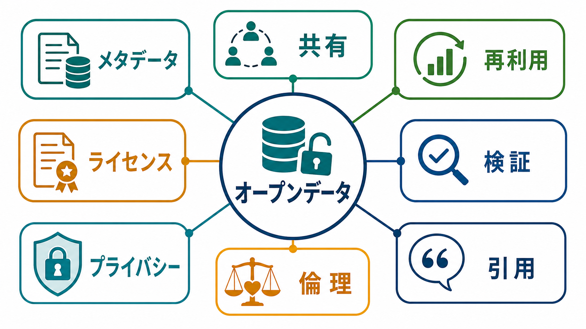
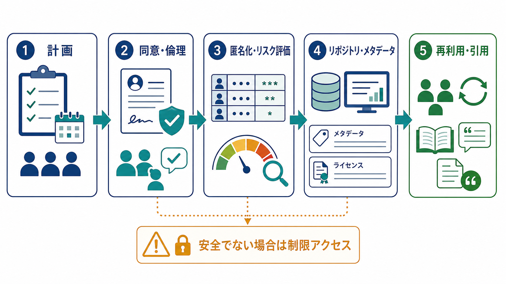
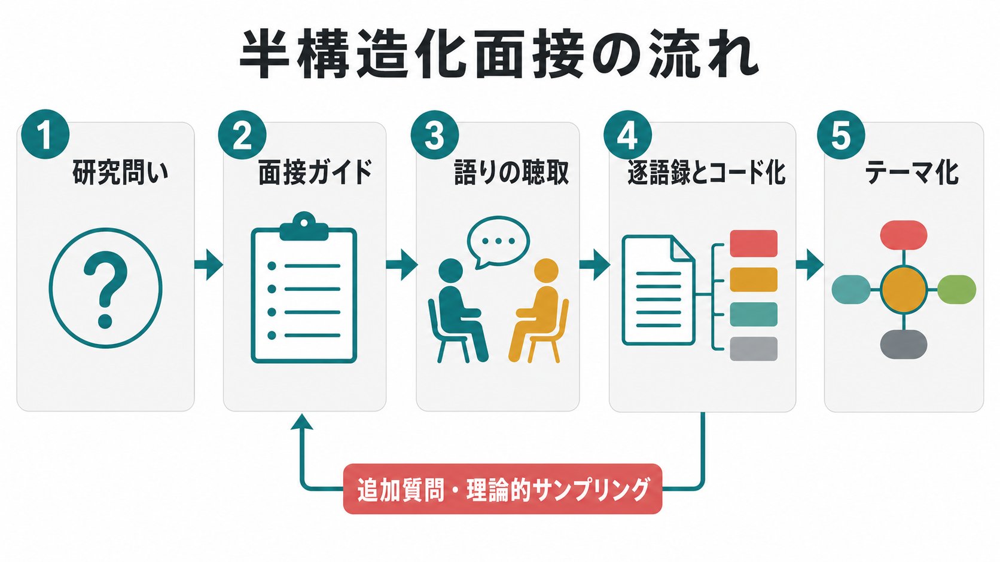

# オープンデータとは何か

## 要点

- オープンデータとは、誰でもアクセスし、利用し、再利用し、共有できるように公開されたデータである。ただし、出典表示や同じ条件での共有など、由来と開放性を守るための条件が付くことはある[1]。
- 研究におけるオープンデータは、単なるファイル公開ではない。メタデータ、解析コード、利用条件、バージョン、引用方法、保存先リポジトリがそろってはじめて、他者が検証・再利用しやすくなる[2][3]。
- 研究データ共有の意義は、[[心理学研究法とは何か]]で扱う透明性、[[実験研究とは何か]]で重視される再現可能性、[[観察研究とは何か]]や[[横断研究と縦断研究は何が違うのか]]で問題になる二次分析の可能性と結びつく。
- ただし、心理学・医学・臨床研究のデータには、個人識別、スティグマ、差別、将来の不利益というリスクがある。匿名化しても再識別リスクはゼロにならないため、公開・制限アクセス・非公開を研究ごとに判断する必要がある[4][6]。

## この記事で答える問い

1. オープンデータは、通常のデータ共有や補足資料と何が違うのか。
2. 研究データを共有すると、研究の透明性や再利用可能性はどのように高まるのか。
3. 人を対象とする研究では、どのような倫理・プライバシー上の注意が必要なのか。
4. すべての研究データを公開すべきなのか。

## まず結論

オープンデータは、「研究者が親切にファイルを置くこと」ではなく、他者が検証・再利用できる形で研究データを長期的に管理する実践である。公開されるべきものは、数値表だけではない。変数定義、収集手続き、欠損処理、コードブック、解析コード、ライセンス、データ引用情報、制限アクセスの条件まで含めて、研究成果の根拠を読者が追跡できるようにする。

一方で、オープンデータは「何でも公開する」という意味ではない。研究参加者の同意、個人情報保護、共同体への不利益、商業的・安全保障上のリスク、先住民データや小集団データの扱いなどを踏まえ、必要なら制限アクセスや非公開を選ぶ。重要なのは、公開するかどうかだけでなく、なぜその公開範囲が妥当なのかを説明できることである[2][4]。

## 背景

心理学・認知科学・精神医学では、同じデータを別の仮説から再分析したり、複数研究を統合したり、測定尺度の[[信頼性とは何か]]や[[妥当性とは何か]]を再評価したりする場面が多い。データが見えなければ、読者は論文の要約統計、図表、著者の説明に依存するしかない。データが適切に共有されていれば、分析の再実行、外れ値処理の確認、別モデルによる再分析、メタ分析への利用が可能になる。

研究データ共有は、データ集中型の科学では研究方法そのものの一部になっている。Tenopir らの大規模調査では、研究者はデータ共有の価値を認めつつも、時間・資金・支援体制・長期保存への不満が障壁になることが示された[5]。つまり、オープンデータは個人の善意だけで成立するものではなく、研究機関、資金配分機関、リポジトリ、学術誌、評価制度が支える必要がある。

## 基本概念

### オープンデータ

Open Definition では、知識が「オープン」であるとは、誰でもアクセス、利用、修正、共有できることを意味し、その制約は由来表示や開放性の維持に限られる[1]。研究データに当てはめると、次の条件が重要になる。

| 観点 | 確認すること |
|---|---|
| アクセス | データに到達できるか。URL だけでなく、永続識別子があるか。 |
| 利用条件 | ライセンス、引用方法、再配布条件が明確か。 |
| 機械可読性 | 表計算ソフト専用形式だけでなく、CSV など再利用しやすい形式があるか。 |
| メタデータ | 変数名、単位、尺度、欠損値、収集時期、対象者条件が説明されているか。 |
| 保存性 | 個人サイトではなく、長期保存を想定したリポジトリに置かれているか。 |

### FAIR とオープンの違い

FAIR 原則は、データを Findable, Accessible, Interoperable, Reusable、すなわち「見つけやすく、アクセス可能で、相互運用可能で、再利用可能」にするための原則である[3]。FAIR は必ずしも完全公開を意味しない。たとえば、機微な臨床データは、メタデータだけを公開し、データ本体は審査制アクセスにすることがある。これは「閉じているから悪い」のではなく、研究価値とリスクのバランスを取る設計である。

### 研究データとは何か

NIH のデータ管理・共有方針では、科学データは研究知見の検証と再現に必要な十分な質をもつデータとして扱われる[4]。心理学研究なら、反応時間、質問紙回答、面接逐語録、行動ログ、脳画像特徴量、解析用スクリプト、コードブックなどが該当しうる。ただし、実験ノート、査読コメント、論文草稿、将来研究の計画などは、通常そのまま共有対象にはならない。

## 仕組み

オープンデータの実務は、研究終了後に慌ててファイルを公開する作業ではない。研究計画の段階で、何を、いつ、どの範囲で、どの形式で、どのリポジトリに、どのライセンスで共有するかを決める。

1. 研究計画で、共有対象、共有時期、保存形式、責任者、費用を決める。
2. 同意説明文書と倫理審査で、将来の二次利用、共有範囲、撤回可能性、制限アクセスの条件を明確にする。
3. データクリーニング、変数定義、欠損値処理、匿名化、再識別リスク評価を行う。
4. リポジトリにデータ、コードブック、解析コード、メタデータ、ライセンス、引用情報を登録する。
5. 論文中でデータを引用し、読者がどのデータがどの主張を支えるのかを確認できるようにする[7]。

この流れは、[[サンプルサイズ設計とは何か]]や[[p値とは何か]]のような統計的判断とも関係する。データが共有されていれば、検定だけでなく、事前に定めた除外基準、外れ値処理、代替モデル、効果量、感度分析まで検討しやすくなる。

## 図解

研究データの扱いは、公開か非公開かの二択ではない。実務上は、公開データ、制限アクセス、非公開の三段階で考えると整理しやすい。

| 選択肢 | 適する場合 | 注意点 |
|---|---|---|
| 公開データ | 匿名化後のリスクが低く、再利用価値が高いデータ | ライセンス、引用、バージョン、メタデータを明確にする。 |
| 制限アクセス | 個人情報・臨床情報・小集団情報など、完全公開にリスクがあるデータ | 申請、審査、データ利用契約、安全な解析環境を設計する。 |
| 非公開 | 公開により参加者や共同体に重大な不利益が生じるデータ | 非公開の理由、代替的な透明性確保策、要約統計やコード公開の可否を記録する。 |

## 臨床・研究との接続

臨床・精神医学・心理支援に近い研究では、データの価値とリスクが同時に高くなる。うつ、不安、トラウマ、発達特性、依存、家族関係、学校適応、勤務状況などのデータは、匿名化されていても、組み合わせによって個人や小集団が推測される可能性がある。HHS の匿名化ガイダンスも、匿名化されたデータの再識別リスクはゼロではないと明示している[6]。

したがって、臨床・心理学研究のオープンデータでは、次の判断が重要になる。

- 直接識別子を削除するだけでなく、年齢、地域、時期、希少疾患、自由記述などの準識別子を確認する。
- 自由記述、面接逐語録、症例記述は、匿名化しても文脈から本人が推測されることがある。
- 研究参加者の同意は、単に「研究に使う」ではなく、二次利用、国際共有、リポジトリ保存、商用利用の可否まで分けて説明する。
- 完全公開が難しい場合でも、メタデータ、解析コード、合成データ、要約統計、データ利用申請手順を公開することで透明性を高められる。

教育・研究目的のデータ共有は、個別診断や治療指示とは区別されるべきである。データから得られた集団レベルの傾向を、個人の診断や支援方針として直接断定してはいけない。

## よくある誤解

### 誤解1: オープンデータは、すべての生データを公開することである

生データをそのまま公開することが望ましいとは限らない。研究参加者の権利、同意範囲、プライバシー、著作権、共同体への影響を検討し、必要なら加工データ、制限アクセス、非公開を選ぶ。重要なのは、公開しない場合にも理由を説明し、可能な範囲で再現性を支える資料を出すことである[2][4]。

### 誤解2: 匿名化すれば安全である

匿名化はリスク低減であって、リスク消滅ではない。特に心理学・臨床データでは、自由記述、希少属性、地域、時期、複数データベースとの照合が再識別リスクを高める[6]。

### 誤解3: データ共有は研究者の損になる

データ共有には手間がかかるが、データ引用の仕組みが整えば、データ作成者へのクレジットを可視化できる。FORCE11 のデータ引用原則は、データを論文と同じく引用可能な研究成果として扱うことを提案している[7]。

### 誤解4: オープンデータがあれば研究は自動的に再現できる

データだけでは不十分である。解析コード、ソフトウェア環境、前処理、除外基準、変数定義、バージョンがなければ、同じ結果に到達できないことがある。これは[[相関研究で因果を言えないのはなぜか]]で問題になる分析解釈の透明性とも関係する。

## 関連ノート

既存の関連ノート:

- [[心理学研究法とは何か]]
- [[実験研究とは何か]]
- [[観察研究とは何か]]
- [[横断研究と縦断研究は何が違うのか]]
- [[サンプルサイズ設計とは何か]]
- [[信頼性とは何か]]
- [[妥当性とは何か]]
- [[相関研究で因果を言えないのはなぜか]]
- [[p値とは何か]]
- [[MOC｜研究方法]]
- [[MOC｜認知科学・心理学]]

今後の作成候補:

- オープンサイエンスとは何か
- データ管理計画とは何か
- 事前登録とは何か
- 研究倫理審査とは何か
- 匿名化と仮名化は何が違うのか
- データリポジトリとは何か

MOC 更新候補:

- `content/00_MOC/MOC｜研究方法.md`
- `content/00_MOC/MOC｜認知科学・心理学.md`

## 理解チェック

1. オープンデータと FAIR データは、どの点で重なり、どの点で異なるか。
2. 心理学研究で完全公開ではなく制限アクセスを選ぶべきデータには、どのような例があるか。
3. データを再利用可能にするために、データ本体以外に何を公開すべきか。
4. データ引用が、データ作成者のクレジットにとって重要なのはなぜか。
5. 匿名化しても再識別リスクが残る理由を説明できるか。

## 参考文献

[1] Open Knowledge Foundation. (n.d.). *Open Definition 2.1*. https://opendefinition.org/od/2.1/en/

[2] OECD. (2024). *Access to research data from public funding toolkit*. https://www.oecd.org/en/toolkits/access-to-research-data-from-public-funding-toolkit.html

[3] Wilkinson, M. D., Dumontier, M., Aalbersberg, I. J., et al. (2016). The FAIR Guiding Principles for scientific data management and stewardship. *Scientific Data, 3*, 160018. https://doi.org/10.1038/sdata.2016.18

[4] National Institutes of Health. (2025). *Data Management & Sharing Policy Overview*. https://grants.nih.gov/policy-and-compliance/policy-topics/sharing-policies/dms/policy-overview

[5] Tenopir, C., Allard, S., Douglass, K., Aydinoglu, A. U., Wu, L., Read, E., Manoff, M., & Frame, M. (2011). Data sharing by scientists: Practices and perceptions. *PLOS ONE, 6*(6), e21101. https://doi.org/10.1371/journal.pone.0021101

[6] U.S. Department of Health and Human Services. (2025). *Guidance regarding methods for de-identification of protected health information in accordance with the HIPAA Privacy Rule*. https://www.hhs.gov/hipaa/for-professionals/special-topics/de-identification/index.html

[7] Data Citation Synthesis Group. (2014). *Joint Declaration of Data Citation Principles*. FORCE11. https://doi.org/10.25490/a97f-egyk

[8] UNESCO. (2021). *Recommendation on Open Science*. https://www.unesco.org/en/legal-affairs/recommendation-open-science
