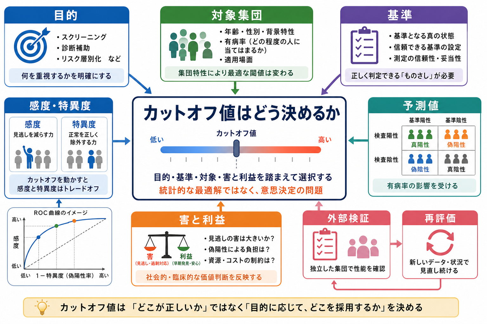
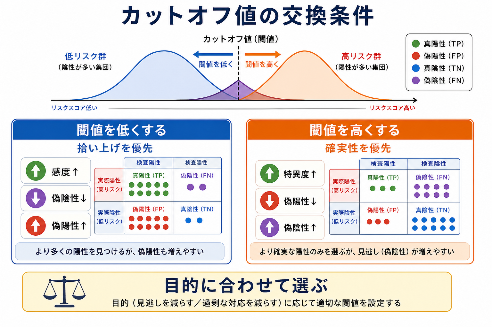
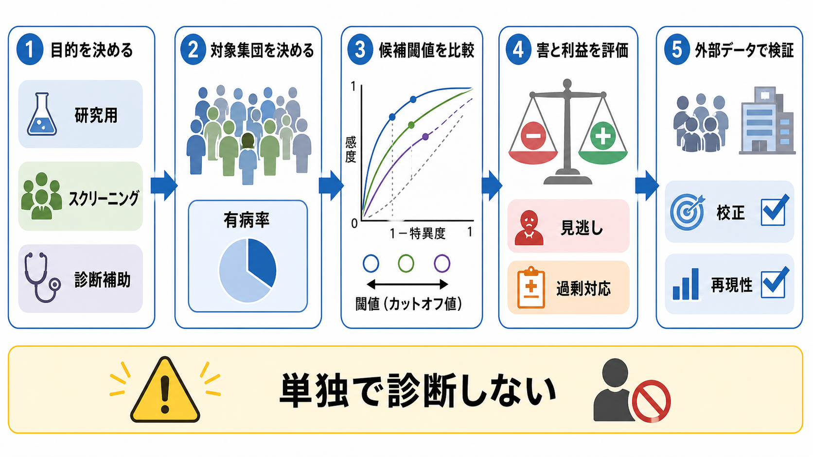

# カットオフ値はどのように決めるのか

## 要点

- カットオフ値は、連続得点やリスク確率を「陽性／陰性」「要支援／経過観察」などの判断に変換する境界である。
- よいカットオフ値は、統計的に最もきれいな点ではなく、目的、対象集団、基準、見逃しと過剰対応の害、資源制約に照らして選ばれる。
- 感度と特異度はカットオフ値を動かすとトレードオフになる。スクリーニングでは感度を重視しやすく、確定的な診断補助では特異度や陽性的中率を重視しやすい。
- ROC解析や Youden 指数は候補値を探す助けになるが、臨床的・社会的な価値判断や外部検証の代わりにはならない。
- 心理尺度や臨床スクリーニングの得点は、単独で個別診断を決めるものではなく、面接、生活機能、既往、観察、他の検査情報と統合して解釈する。

## この記事で答える問い

- カットオフ値は、なぜ「平均より高い」「ROCで一番よい」だけでは決められないのか。
- 感度、特異度、陽性的中率、陰性的中率は、閾値設定にどう関わるのか。
- スクリーニング、診断補助、研究用の層別化では、同じ尺度でもカットオフ値を変えるべきなのか。
- 心理測定や臨床研究で、カットオフ値を報告・利用するときに何を確認すべきか。

## まず結論

カットオフ値は、「どこから上を陽性と呼ぶか」を決める技術であると同時に、「どの誤りをどれだけ許容するか」を決める意思決定である。たとえば抑うつ症状の質問紙をスクリーニングに使うなら、見逃しを減らすために低めの閾値を選ぶ理由がある。一方で、その結果をもとに高負担な介入や追加検査を行うなら、偽陽性による不安、時間、費用、過剰対応も考えなければならない。

したがって、カットオフ値の決定は、少なくとも次の順で考える。

1. 何のために分けるのかを決める。
2. どの集団に使うのかを決める。
3. 何を「真の状態」とみなすかを決める。
4. 複数の候補閾値について、感度、特異度、予測値、尤度比、校正、資源負担を比べる。
5. 独立したデータ、別施設、別時期、別集団で性能が保たれるかを検証する。
6. 利用後も、有病率、対象者、支援体制が変わったら再評価する。

## 背景

心理尺度、認知検査、臨床検査、リスク予測モデルでは、得点そのものは連続的であることが多い。しかし実務では、「追加面接が必要か」「専門機関につなぐか」「研究で高リスク群として層別化するか」のように、どこかで判断を二分または多段階化する必要がある。この境界がカットオフ値である。

問題は、得点分布がきれいに二つに分かれるとは限らないことである。多くの心理特性や症状は連続的に分布し、健常群と臨床群、低リスク群と高リスク群は重なり合う。そのため、どのカットオフ値を選んでも、偽陽性と偽陰性は一定程度生じる。

ROC曲線は、この重なりを前提に、さまざまな閾値で感度と偽陽性率の関係を可視化する方法である。Zweig と Campbell は、ROCを診断ツールの識別能を評価し、閾値選択や意思決定につなぐ中心的な道具として整理した[2]。ただし、ROCは主に「分けられる能力」を見るものであり、その検査を使う価値や害を自動的に決めるものではない。

## 基本概念

### カットオフ値

カットオフ値とは、連続得点や確率を分類判断に変える境界である。質問紙なら「何点以上を陽性とするか」、予測モデルなら「リスク何%以上で追加評価に進むか」、認知検査なら「どの得点以下を要精査とするか」という形をとる。

ここで重要なのは、カットオフ値が測定器に固定された自然法則ではない点である。同じ尺度でも、一般集団スクリーニング、専門外来での診断補助、研究参加者の層別化では、必要な閾値が変わりうる。

### 感度と特異度

感度は、基準上「該当する」人をどれだけ陽性として拾えるかである。特異度は、基準上「該当しない」人をどれだけ陰性として除外できるかである。STARD 2015 でも、感度と特異度は診断精度研究の中核的な報告指標として扱われる[4]。

一般に、陽性と判定する閾値を低くすると感度は上がりやすいが、偽陽性も増えやすい。閾値を高くすると特異度は上がりやすいが、偽陰性も増えやすい。

### 陽性的中率と陰性的中率

陽性的中率は、検査陽性者のうち本当に該当する人の割合である。陰性的中率は、検査陰性者のうち本当に該当しない人の割合である。感度・特異度と違い、予測値は対象集団の有病率や基礎率に強く依存する[8]。

たとえば、まれな状態を一般集団でスクリーニングすると、感度と特異度が高くても、陽性者の中に偽陽性が多く含まれることがある。逆に、専門外来のように事前確率が高い場面では、同じ検査でも陽性的中率が高くなりやすい。

### 基準と妥当性

カットオフ値を決めるには、何を「真の状態」とみなすかが必要になる。診断面接、専門家評価、追跡後の転帰、機能障害、既存の標準検査などが候補になる。ただし、基準そのものが完全でない場合も多い。

心理測定では、得点の意味は利用目的に依存する。[[妥当性とは何か]] や [[構成概念妥当性とは何か]] で扱うように、尺度得点は「その目的でそう解釈してよいか」を証拠で支える必要がある。教育・心理検査の Standards も、テスト得点の解釈と利用、分類や選抜の影響、公平性を含めて検討することを求める[7]。

## 仕組み

### 1. 目的から始める

最初に決めるべきなのは、統計手法ではなく目的である。目的が変わると、重視すべき誤りも変わる。

| 目的 | 重視しやすい点 | 典型的な注意 |
|---|---|---|
| 一般スクリーニング | 見逃しを減らす、感度を高める | 偽陽性による不安や過剰対応を抑える |
| 診断補助 | 面接・検査情報と整合する、特異度や尤度比を確認する | 尺度単独で診断しない |
| 研究用の層別化 | 群の違いを明確にする、再現性を高める | 現実の支援判断にそのまま移さない |
| 治療反応予測 | 介入の利益と害を比較する | 予測精度だけでなく実際の転帰改善を見る |

### 2. ROC曲線で候補を探す

ROC曲線は、すべての候補閾値について、縦軸に感度、横軸に偽陽性率（1 - 特異度）を置く。曲線が左上に近いほど、該当群と非該当群をよく分けられる。AUCは、閾値全体にわたる識別能の要約である[2]。

ただし、AUCが高いことと、特定のカットオフ値が実務上よいことは同じではない。AUCは全範囲の平均的な識別能に近い指標であり、実際に使う閾値付近での感度・特異度、予測値、資源負担を別に確認する必要がある。

### 3. Youden 指数を候補として使う

Youden 指数は、次のように定義される[1]。

$$
J = \mathrm{sensitivity} + \mathrm{specificity} - 1
$$

この値が最大になる点は、感度と特異度を同じ重みで扱うときの一つの「最適」候補になる。Fluss らは、Youden 指数と対応するカットオフ値の推定方法を比較し、推定手続きや分布仮定によって結果が変わりうることを示している[3]。

Youden 指数は便利だが、偽陰性と偽陽性の害が同じであるかのように扱いやすい。実際には、見逃しの害が大きい場面と、過剰対応の害が大きい場面では、同じ Youden 最大点を採用すべきとは限らない。

### 4. 予測値と有病率を確認する

同じ感度・特異度でも、有病率が変わると陽性的中率と陰性的中率は変わる。これは、一般集団スクリーニングで特に重要である[8]。

$$
\mathrm{PPV} =
\frac{\mathrm{sensitivity} \times \mathrm{prevalence}}
{\mathrm{sensitivity} \times \mathrm{prevalence} + (1-\mathrm{specificity}) \times (1-\mathrm{prevalence})}
$$

低有病率集団では、陽性判定の多くが偽陽性になることがある。そのため、陽性判定後に何をするか、追加確認の手順があるか、本人への説明が過度に断定的でないかが重要になる。

### 5. 害と利益を明示する

カットオフ値の選択には、価値判断が含まれる。偽陰性は、支援や精査の機会を逃す可能性がある。偽陽性は、不安、烙印、費用、時間、医療資源の消費、不要な追加評価につながりうる。

Vickers と Elkin の decision curve analysis は、予測モデルを単なる精度指標ではなく、閾値確率に応じた純利益として評価する方法を提案した[5]。これは、カットオフ値を「当たるか外れるか」だけでなく、「その判断を使うと実務上どれだけ利益があるか」として考える助けになる。

### 6. 外部検証と再評価を行う

カットオフ値は、開発データでよく見えるだけでは不十分である。別施設、別時期、別年齢層、別文化、別言語版で性能が保たれるかを確認する必要がある。STARD 2015 は、診断精度研究で参加者、検査手順、基準、閾値、解析を透明に報告する重要性を強調している[4]。予測モデル研究では、TRIPOD が開発、検証、更新の透明な報告を求めている[6]。

## 図解

1枚目は、カットオフ値が「目的・対象集団・基準・性能指標・害と利益・外部検証」を結ぶ意思決定であることを示している。中心にあるのは「統計的な最適点」ではなく、目的に応じて採用する境界である。

2枚目は、閾値を低くすると拾い上げは増えるが偽陽性も増え、閾値を高くすると確実性は増えるが見逃しも増えるという交換条件を示している。

3枚目は、実務での順序を示している。目的を決め、対象集団を定め、候補閾値を比較し、害と利益を評価し、外部データで検証する。最後の「単独で診断しない」は、心理尺度やスクリーニング検査を個別診断に短絡させないための注意である。

## 臨床・研究との接続

### スクリーニング

スクリーニングでは、早期に拾い上げることが重要になりやすい。そのため、感度を高める低めのカットオフ値が選ばれることがある。ただし、陽性は「疾患がある」という意味ではなく、「追加評価を検討するサイン」として扱うべきである。特に有病率が低い集団では、陽性的中率が低くなる可能性がある[8]。

### 診断補助

診断補助では、尺度得点は面接、行動観察、生活機能、経過、身体疾患や薬物の影響、文化的背景と合わせて解釈される。たとえば精神医学や臨床心理学の質問紙は、苦痛や症状の強さを把握する助けにはなるが、単独で診断名や治療方針を決めるものではない。

### 研究

研究では、カットオフ値は群分け、層別化、感度分析、対象者選定に使われる。ここで重要なのは、事前に閾値を定めること、探索的に決めた場合はそのことを明示すること、別データで再現性を確認することである。開発データ上で最もよく見える閾値をそのまま報告すると、過学習により外部データで性能が落ちやすい。

### 心理測定

心理尺度のカットオフ値は、[[心理測定とは何か]]、[[心理尺度はどのように作られるのか]]、[[基準関連妥当性とは何か]] と直結する。尺度の信頼性が低いと、閾値近くの人が測定誤差で陽性・陰性を行き来しやすい。[[標準化とは何か]] の観点からは、対象集団の得点分布、年齢、性別、文化、言語、測定状況を考慮する必要がある。

## よくある誤解

### 誤解1: ROCで最もよい点が、常に最良のカットオフ値である

ROC上の候補点は、識別能の観点では有用である。しかし、実務上の最良点は、偽陽性と偽陰性の害、追加評価の資源、対象者への影響、支援体制によって変わる。

### 誤解2: Youden 指数最大の点を選べば十分である

Youden 指数は感度と特異度を同じ重みで足し合わせる。見逃しの害が過剰対応の害より大きい場面、またはその逆の場面では、目的に合わせた重みづけが必要になる。

### 誤解3: 一度決めたカットオフ値はどの集団でも使える

対象集団が変わると、有病率、症状の分布、回答傾向、文化的意味、併存疾患、受検状況が変わる。したがって、別集団での外部検証が必要である。

### 誤解4: カットオフ値は診断そのものである

カットオフ値は、判断を支援する境界であり、診断そのものではない。教育・研究目的で言えば、陽性判定は「追加評価の必要性を示す情報」であり、個別の診断や治療指示として断定してはいけない。

## 関連ノート

- [[心理測定とは何か]]
- [[心理尺度はどのように作られるのか]]
- [[妥当性とは何か]]
- [[構成概念妥当性とは何か]]
- [[基準関連妥当性とは何か]]
- [[信頼性とは何か]]
- [[標準化とは何か]]
- [[精神疾患の神経画像バイオマーカーは実用化できるのか]]

### MOC更新候補

- `content/00_MOC/MOC｜認知科学・心理学.md` の心理測定・心理学研究項目
- `content/00_MOC/MOC｜統計・医療統計.md` の感度・特異度・診断精度項目
- `content/00_MOC/MOC｜研究方法.md` の測定・妥当性・分類判断項目

## 理解チェック

1. スクリーニングで感度を高めると、どのような利点と不利点が生じるか。
2. 感度・特異度が同じでも、陽性的中率が対象集団によって変わるのはなぜか。
3. Youden 指数最大のカットオフ値を、そのまま採用してよい場面と危険な場面を分けて説明できるか。
4. 心理尺度のカットオフ値を別文化・別年齢層に使うとき、どのような妥当性証拠が必要か。
5. 「尺度陽性」と「診断」はなぜ同じではないのか。

## 未解決問題

- 偽陽性と偽陰性の害を、対象者本人、家族、臨床家、研究者、制度の視点からどのように重みづけるべきか。
- 連続的な心理特性を二分することで失われる情報を、臨床・研究実務の中でどこまで補えるか。
- 動的なリスク予測や反復測定では、固定カットオフ値より個人内変化の閾値を使うべき場面がどこまで広がるか。

## 参考文献

[1] Youden, W. J. (1950). Index for rating diagnostic tests. *Cancer, 3*(1), 32-35. https://doi.org/10.1002/1097-0142(1950)3:1%3C32::AID-CNCR2820030106%3E3.0.CO;2-3

[2] Zweig, M. H., & Campbell, G. (1993). Receiver-operating characteristic (ROC) plots: A fundamental evaluation tool in clinical medicine. *Clinical Chemistry, 39*(4), 561-577. https://doi.org/10.1093/clinchem/39.4.561

[3] Fluss, R., Faraggi, D., & Reiser, B. (2005). Estimation of the Youden Index and its associated cutoff point. *Biometrical Journal, 47*(4), 458-472. https://doi.org/10.1002/bimj.200410135

[4] Bossuyt, P. M., Reitsma, J. B., Bruns, D. E., Gatsonis, C. A., Glasziou, P. P., Irwig, L., et al. (2015). STARD 2015: An updated list of essential items for reporting diagnostic accuracy studies. *BMJ, 351*, h5527. https://doi.org/10.1136/bmj.h5527

[5] Vickers, A. J., & Elkin, E. B. (2006). Decision curve analysis: A novel method for evaluating prediction models. *Medical Decision Making, 26*(6), 565-574. https://doi.org/10.1177/0272989X06295361

[6] Collins, G. S., Reitsma, J. B., Altman, D. G., & Moons, K. G. M. (2015). Transparent reporting of a multivariable prediction model for individual prognosis or diagnosis (TRIPOD): The TRIPOD Statement. *BMC Medicine, 13*, 1. https://doi.org/10.1186/s12916-014-0241-z

[7] American Educational Research Association, American Psychological Association, & National Council on Measurement in Education. (2014). *Standards for Educational and Psychological Testing*. AERA. https://www.ncme.org/resources-publications/books/testing-standards

[8] Altman, D. G., & Bland, J. M. (1994). Diagnostic tests 2: Predictive values. *BMJ, 309*, 102. https://doi.org/10.1136/bmj.309.6947.102
