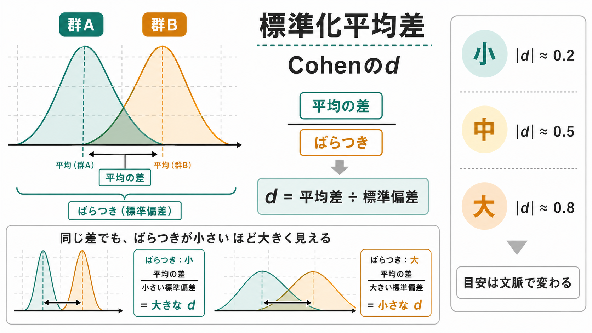
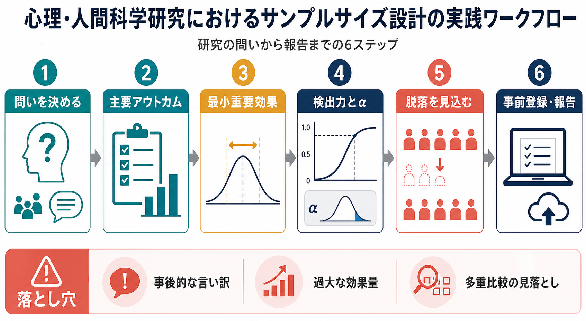

# サンプルサイズ設計とは何か

## 要点

- サンプルサイズ設計とは、「何人集めればよいか」を経験則で決める作業ではなく、研究目的、主要アウトカム、最小重要効果、ばらつき、検出力、有意水準、脱落・欠測を結びつけて、データ収集前に標本数を正当化する作業である[1]。
- 典型的な検出力分析では、効果量が小さいほど、ばらつきが大きいほど、検出力を高くしたいほど、必要なサンプルサイズは大きくなる[2][3]。
- ただし、サンプルサイズ設計は「有意差を出す人数」を決めるだけではない。信頼区間の幅、推定精度、脱落への備え、実施可能性、倫理、費用、探索研究か確認研究かも含めて考える[1][4]。
- 低検出力の研究では、真の効果を見逃すだけでなく、有意になった効果量が過大に見えたり、効果の向きまで誤るリスクが高まる[5][6]。

## この記事で答える問い

1. サンプルサイズ設計は、単なる「人数計算」と何が違うのか。
2. 効果量、検出力、有意水準、ばらつきは、必要な参加者数にどう関係するのか。
3. 心理学・認知科学・臨床研究で、サンプルサイズをどのように報告すればよいのか。

## まず結論

サンプルサイズ設計は、研究の問いに対して「このデータ量なら、どの程度の効果を、どの程度の誤りのリスクで、どの程度の精度で判断できるか」を事前に言語化することである。したがって、最初に決めるべきなのは人数ではなく、主要な研究問い、主要アウトカム、比較、最小重要効果である。

たとえば、[[実験研究とは何か|実験研究]]で2群の平均差を調べる場合、「Cohen の $d=0.5$ くらいを検出したい」「両側 $\alpha=.05$、検出力 .80 にしたい」と決めれば、おおよその必要人数を計算できる[2][3]。一方、[[観察研究とは何か|観察研究]]や尺度研究では、関連の検出だけでなく、推定値の信頼区間をどれくらい狭くしたいか、欠測がどれくらい起きるか、モデルに入れる変数数がどれくらいかも重要になる[4]。

## 背景

心理学・認知科学・神経科学では、費用、時間、参加者募集の難しさから、小規模研究が多くなりやすい。小規模研究自体が悪いわけではない。探索的研究、希少疾患研究、予備研究、詳細な生理計測では、少人数から始める合理的な理由がある。

問題は、少人数であることではなく、少人数で何が言えて、何が言えないかを曖昧にしたまま強い結論を出すことである。Button らは、神経科学研究における低い検出力が、真の効果の見逃し、陽性結果の信頼性低下、効果量の過大推定につながると整理した[6]。同じ問題は、心理尺度研究、介入研究、脳画像研究、教育介入、臨床研究にも広く関係する。

この点は [[心理測定とは何か|心理測定]] とも直結する。測定の [[信頼性とは何か|信頼性]] が低ければ、観察される効果量は弱まり、必要なサンプルサイズは増えやすい。[[妥当性とは何か|妥当性]] が弱ければ、人数を増やしても「何を測ったのか」という解釈は改善しない。[[天井効果と床効果とは何か|天井効果と床効果]] が強い場合も、個人差や変化が圧縮され、設計時に想定した効果量やばらつきが崩れる。

## 基本概念

### 効果量

効果量とは、差や関連の大きさを標準化または意味ある単位で表した量である。2群の平均差なら Cohen の $d$、相関なら $r$、二値アウトカムならリスク差・リスク比・オッズ比などが使われる。Cohen は検出力分析を実践しやすくするため、代表的検定ごとに効果量と必要サンプルサイズを整理した[2]。

ただし、「小・中・大」という経験的目安だけで設計するのは危うい。重要なのは、対象領域で現実的に期待でき、かつ理論的・臨床的・教育的に意味のある最小重要効果を置くことである[1][5]。

### 有意水準

有意水準 $\alpha$ は、帰無仮説が正しいときに誤って有意と判断する確率の基準である。心理学では慣習的に .05 が使われることが多いが、探索研究、確認研究、多重比較、臨床的影響の大きさによって妥当な基準は変わりうる。検定回数が多い場合、単純に各検定を $\alpha=.05$ で行うと偽陽性が増えやすい。

### 検出力

検出力は、指定した効果が本当にあると仮定したときに、研究がそれを統計的に検出できる確率である。通常は $1-\beta$ と書く。たとえば検出力 .80 は、設計時に仮定した条件が正しければ、同じ研究を多数回繰り返したとき約80%で有意な結果が得られる、という意味である[2]。

重要なのは、検出力は「研究結果が正しい確率」ではないことだ。検出力は、事前に置いた効果量、ばらつき、検定方法、有意水準、サンプルサイズに条件づけられた設計上の性質である。

### 推定精度

サンプルサイズ設計は、検出力だけでなく推定精度からも考えられる。Maxwell らは、心理学では「有意かどうか」だけでなく、母数をどれくらい正確に推定できるかを重視したサンプルサイズ計画が重要だと論じた[4]。たとえば、平均差や相関の信頼区間を十分狭くしたい研究では、検出力分析とは別に「許容できる信頼区間幅」から人数を決める。

## 仕組み

2群の平均差を考えると、必要サンプルサイズの直感は次の式でかなり説明できる。

$$
d = \frac{\Delta}{\sigma}
$$

ここで $\Delta$ は検出したい平均差、$\sigma$ は個人差や測定誤差を含む標準偏差である。平均差が同じでも、ばらつきが大きいほど $d$ は小さくなる。小さい効果を安定して見つけるには、多くの参加者が必要になる。

独立2群・等分散・両側検定の単純な近似では、各群の必要人数は次のように考えられる。

$$
n \approx \frac{2(z_{1-\alpha/2}+z_{1-\beta})^2}{d^2}
$$

この式は、必要人数が効果量 $d$ の二乗に反比例することを示している。つまり、検出したい効果が半分になると、必要人数はおおむね4倍になる。G\*Power のようなツールは、このような考え方を多様な検定、効果量、設計に拡張して使いやすくしたものである[3]。

実務では、次の順序で考えると破綻しにくい。

| 決めるもの | 問い | 例 |
|---|---|---|
| 研究目的 | 探索か確認か、推定か検定か | 仮説検証、予備研究、尺度開発 |
| 主要アウトカム | 何を最も重要な結果とするか | 介入後の抑うつ尺度得点 |
| 最小重要効果 | どの差なら意味があるか | $d=0.30$ 以上、5点差以上 |
| ばらつき | 対象集団でどれくらい散らばるか | 先行研究の標準偏差、予備データ |
| 誤りの基準 | $\alpha$ と検出力をどう置くか | 両側 .05、検出力 .80 または .90 |
| 実施上の補正 | 脱落・除外・欠測をどう見込むか | 10%脱落を上乗せ |

## 図解

サンプルサイズ設計は、次の3つの図で整理できる。

1. 効果量は「差」だけでなく「ばらつき」との比で決まる。ばらつきが大きい研究では、同じ平均差でも効果量が小さくなり、必要人数は増えやすい。
2. 検出力は、帰無仮説と対立仮説の分布がどれくらい分離しているかに依存する。サンプルサイズを増やすと標準誤差が小さくなり、指定した効果を検出しやすくなる。
3. 実践では、問い、アウトカム、最小重要効果、検出力と $\alpha$、脱落見込み、事前登録・報告を一連の流れとして扱う。

## 臨床・研究との接続

臨床試験では、サンプルサイズ設計は科学的問題であると同時に倫理的問題でもある。少なすぎる研究は、参加者の負担に見合う情報を生まない可能性がある。多すぎる研究は、必要以上の参加者を介入や測定に巻き込む可能性がある。CONSORT 2010 は、ランダム化比較試験の報告において、サンプルサイズがどのように決められたかを明示することを求めている[7]。

心理学研究では、サンプルサイズ設計は再現性とも関係する。低検出力の研究で有意になった結果は、真の効果より大きく見えやすい。Gelman と Carlin は、検出力だけでなく、効果の向きを誤る Type S error と、効果量を過大評価する Type M error を設計段階で評価する考え方を提案した[5]。

尺度研究では、[[内的一貫性とは何か|内的一貫性]]、[[再検査信頼性とは何か|再検査信頼性]]、因子分析、[[項目反応理論とは何か|項目反応理論]]の推定に必要な人数がそれぞれ異なる。たとえば、因子分析では項目数、因子負荷量、因子数、欠測、分布、推定法によって必要なデータ量が変わる。したがって「心理学研究なら N=100 で十分」といった一律の基準は避ける。

## よくある誤解

### 「先行研究と同じ人数なら十分」

先行研究が低検出力だった場合、その人数を真似ると同じ問題を再生産する。先行研究は、効果量やばらつきの見積もりに使えるが、報告された効果量が出版バイアスや選択的報告で大きく見えている可能性も考える必要がある[5][6]。

### 「有意差が出なかったので効果はない」

小さい研究で有意差が出なかったことは、効果が存在しないことを意味しない。信頼区間が広ければ、意味のある効果も意味のない効果も両方ありえる。非有意結果を読むときは、事前のサンプルサイズ設計、検出可能だった効果量、信頼区間を見る必要がある[7]。

### 「人数は多ければ多いほどよい」

人数が多いほど標準誤差は小さくなるが、どんな小さな差でも有意になりやすくなる。実質的に意味のない差を「統計的に有意」として強調しないためには、最小重要効果、効果量、信頼区間、費用、参加者負担を合わせて設計する必要がある[1][4]。

### 「事後的検出力を報告すればよい」

得られた効果量を使って事後的検出力を計算しても、結果の解釈に新しい情報をほとんど加えない。CONSORT の解説でも、試験結果にもとづく事後的検出力より、信頼区間による不確実性の表示が適切だと整理されている[7]。

## 関連ノート

- [[心理測定とは何か]]
- [[実験研究とは何か]]
- [[観察研究とは何か]]
- [[信頼性とは何か]]
- [[妥当性とは何か]]
- [[内的一貫性とは何か]]
- [[天井効果と床効果とは何か]]
- [[脳画像研究の再現性問題とは何か]]

### MOC更新候補

- [[MOC｜研究方法]]
- [[MOC｜統計・医療統計]]
- [[MOC｜認知科学・心理学]]

## 理解チェック

1. 検出力 .80 は、「今回の研究結果が80%の確率で正しい」という意味ではない。では、何を意味するか。
2. 効果量が半分になると、必要サンプルサイズはなぜ大きく増えるのか。
3. 「先行研究の効果量」をそのまま使って設計すると、どのような過小設計が起こりうるか。
4. 検出力ベースの設計と、信頼区間幅にもとづく精度ベースの設計は、どのように使い分けられるか。

## 未解決問題

- 心理学・認知科学で「最小重要効果」をどう合意するか。
- 探索研究におけるサンプルサイズ正当化を、過度に形式化せず、透明に報告する方法。
- 多変量モデル、階層モデル、ベイズモデル、機械学習予測モデルにおけるサンプルサイズ設計の標準化。
- 測定誤差、欠測、脱落、外れ値除外、解析自由度を、設計段階のシミュレーションにどう組み込むか。

## 参考文献

[1] Lakens, D. (2022). Sample Size Justification. *Collabra: Psychology*, 8(1), Article 33267. https://doi.org/10.1525/collabra.33267

[2] Cohen, J. (1992). A power primer. *Psychological Bulletin*, 112(1), 155-159. https://doi.org/10.1037/0033-2909.112.1.155

[3] Faul, F., Erdfelder, E., Lang, A.-G., & Buchner, A. (2007). G\*Power 3: A flexible statistical power analysis program for the social, behavioral, and biomedical sciences. *Behavior Research Methods*, 39, 175-191. https://doi.org/10.3758/BF03193146

[4] Maxwell, S. E., Kelley, K., & Rausch, J. R. (2008). Sample size planning for statistical power and accuracy in parameter estimation. *Annual Review of Psychology*, 59, 537-563. https://doi.org/10.1146/annurev.psych.59.103006.093735

[5] Gelman, A., & Carlin, J. (2014). Beyond power calculations: Assessing Type S (sign) and Type M (magnitude) errors. *Perspectives on Psychological Science*, 9(6), 641-651. https://doi.org/10.1177/1745691614551642

[6] Button, K. S., Ioannidis, J. P. A., Mokrysz, C., Nosek, B. A., Flint, J., Robinson, E. S. J., & Munafò, M. R. (2013). Power failure: Why small sample size undermines the reliability of neuroscience. *Nature Reviews Neuroscience*, 14, 365-376. https://doi.org/10.1038/nrn3475

[7] Moher, D., Hopewell, S., Schulz, K. F., Montori, V., Gøtzsche, P. C., Devereaux, P. J., Elbourne, D., Egger, M., & Altman, D. G. (2010). CONSORT 2010 explanation and elaboration: Updated guidelines for reporting parallel group randomised trials. *BMJ*, 340, c869. https://doi.org/10.1136/bmj.c869
