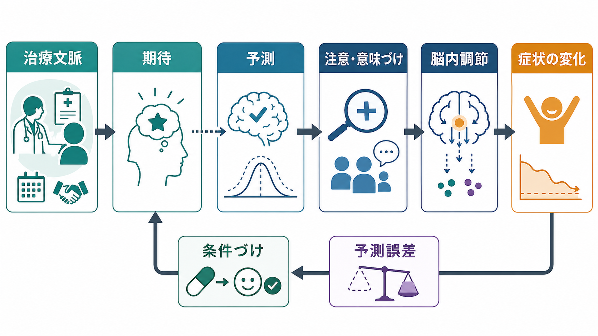
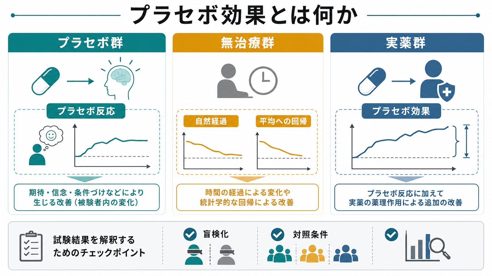

# プラセボ効果とは何か

## 要点

- プラセボ効果とは、薬理学的・物理的な有効成分そのものではなく、期待、意味づけ、治療者との相互作用、学習、研究参加の文脈などによって症状や行動が変化する現象である[1]。
- 「プラセボ反応」はプラセボ群で観察される変化全体を指し、その中には自然経過、平均への回帰、測定誤差、報告バイアスも含まれる。研究法上の「プラセボ効果」は、これらをできるだけ差し引いた文脈・期待由来の変化として扱う必要がある[2][3]。
- 効果は「気のせい」だけではない。疼痛などでは期待や条件づけが注意、予測、情動評価、下降性疼痛調節などに影響しうることが示されている[2]。
- ただし、プラセボは万能の治療ではない。客観的アウトカムよりも、疼痛、倦怠感、気分、主観的症状のような患者報告アウトカムで大きく見えやすい[3]。
- 研究では、盲検化、対照条件、アウトカムの選び方、事前登録、欠測処理が、プラセボ効果の解釈を左右する[4]。

## この記事で答える問い

この記事では、プラセボ効果を「不思議な治癒力」としてではなく、[[実験研究とは何か|実験研究]]と臨床研究で扱うべき測定対象として整理する。中心となる問いは、次の三つである。

1. プラセボ効果とプラセボ反応は何が違うのか。
2. 期待や文脈は、どのような仕組みで症状や行動に影響しうるのか。
3. 研究では、自然経過や[[反応バイアスとは何か|反応バイアス]]とどのように区別するのか。

## まず結論

プラセボ効果は、「有効成分のない処置で病気が治る」という単純な話ではない。より正確には、治療らしい文脈、説明、儀式、医療者との関係、過去の学習、期待が、症状の感じ方、注意の向け方、身体反応、行動を変える現象である[1][2]。

研究法上は、プラセボ群で改善が見えたからといって、それをすべてプラセボ効果とは呼べない。症状は時間とともに変わり、重い時期に参加した人は平均的な状態へ戻りやすく、同じ質問に繰り返し答えるだけでも報告が変わる。したがって、プラセボ効果を論じるには、[[妥当性とは何か|妥当性]]のある比較条件を設計する必要がある[3][4]。

## 背景

プラセボは、もともと臨床試験で「比較対象」として重要だった。実薬群がプラセボ群よりも改善すれば、薬理作用や特異的治療効果があると判断しやすくなる。ここで重要なのは、プラセボ群の改善が無意味な雑音ではないという点である。プラセボ群は、治療を受けているという期待、診察、説明、測定、研究参加の注意深い観察を含むため、そこに現れる変化は研究対象そのものにもなる[1][5]。

一方で、プラセボ効果への関心は過大評価にもつながりやすい。症状が改善した、患者がよくなったと報告した、治療者がよくなったと評価した、という事実だけでは、何が原因で変化したのかはわからない。[[観察研究とは何か|観察研究]]でプラセボ効果を推論するときは、自然経過、選択バイアス、期待による報告変化を分けにくい。

## 基本概念

### プラセボ

プラセボとは、研究上または臨床上、特異的な有効成分や治療手続きの効果を持たない、あるいは少なくともその目的疾患に対して特異的作用を持たないように設計された処置である。典型例は偽薬だが、偽手術、偽刺激、待機リスト、標準ケアのみの群など、研究課題によって対照条件は変わる。

### プラセボ反応

プラセボ反応は、プラセボ群で観察された改善全体である。ここには、プラセボ効果だけでなく、自然回復、疾患の波、平均への回帰、測定誤差、参加者が「よくなった」と答えやすくなる[[社会的望ましさバイアスとは何か|社会的望ましさバイアス]]も含まれる[3]。

### プラセボ効果

プラセボ効果は、プラセボ反応のうち、治療文脈、期待、学習、意味づけなどにより生じた変化として推定される部分である。したがって厳密には、プラセボ群と無治療群、待機群、通常ケア群などを比較しなければ、プラセボ反応とプラセボ効果を分けにくい[3]。

## 仕組み

プラセボ効果の代表的な仕組みは、期待と学習である。

期待とは、「この処置は効くかもしれない」「痛みは下がるはずだ」という予測である。期待は、症状への注意、脅威の評価、身体感覚の解釈を変えうる。たとえば疼痛では、同じ侵害刺激でも、安心できる説明を受けたときと危険なものとして説明されたときで、痛みの主観評価や関連する神経活動が変わりうる[2]。

学習には、条件づけが含まれる。過去に薬を飲んで症状が軽くなった経験があると、似た錠剤、匂い、診察室、医療者の言葉が改善の手がかりになる。これは「思い込み」だけでなく、予測と身体反応の結びつきとして理解できる[1][2]。

もう一つ重要なのが意味づけである。処置が「専門家による治療」として提示されるか、「何かを試しているだけ」として提示されるかで、同じ手続きでも文脈が変わる。治療儀式、説明の確信度、医療者の態度、患者の過去経験は、症状報告と行動を変える[5][6]。

## 図解

次の図は、プラセボ群、無治療群、実薬群の違いを研究法の視点から整理したものである。プラセボ群の改善をそのまま「プラセボ効果」と呼ぶのではなく、自然経過や平均への回帰を含む「プラセボ反応」としてまず扱う点が重要である。

## 臨床・研究との接続

臨床では、プラセボ効果を利用するというより、治療文脈を粗末にしないことが重要である。十分な説明、安心できる関係、治療への見通し、患者の価値観に合った意思決定は、標準治療の効果を支える文脈になりうる[6]。ただし、欺瞞的なプラセボ使用は倫理的問題を持つため、個別の診断や治療指示として安易に推奨できない。

研究では、プラセボ対照試験が治療効果の推定に役立つ。CONSORT 声明のような報告ガイドラインは、ランダム化、割付、盲検化、アウトカム、解析対象を明確に報告することを求める[4]。これは、プラセボ効果そのものを美しく説明するためではなく、効果推定の[[信頼性とは何か|信頼性]]と再現可能性を高めるためである。

近年は、参加者に「これはプラセボです」と明かしたうえで行うオープンラベル・プラセボ研究もある。系統的レビューでは、一定の効果を示す可能性が報告されているが、研究数や対象疾患、期待形成の手続きに限界があるため、標準治療の代替として一般化するのは早い[7]。

## よくある誤解

### 誤解1: プラセボ効果は「気のせい」である

主観的症状に強く出やすいからといって、単なる虚偽や気まぐれとは限らない。期待や学習が注意、情動、疼痛調節、症状報告に影響することは、心理学・神経科学の研究対象である[1][2]。

### 誤解2: プラセボ群が改善したら、それがプラセボ効果である

これは研究法上の典型的な混同である。プラセボ群の改善には、自然経過、平均への回帰、測定誤差、報告バイアスが含まれる。プラセボ効果を推定するには、無治療群や待機群などとの比較が必要になる[3]。

### 誤解3: プラセボ効果があるなら、実薬はいらない

プラセボ効果は特異的治療効果の代替ではない。実薬や心理療法などの有効性を評価するとき、プラセボ効果を含む文脈効果と、治療固有の効果を分けて考える必要がある[4][5]。

### 誤解4: 盲検化すればプラセボ効果は完全に消える

盲検化は期待差を小さくするための手段だが、完全ではない。副作用、処置感、治療者の態度、割付を推測できる手がかりがあると、期待差が残る。盲検化の成否を評価し、アウトカムを事前に定義することが重要である[4]。

## 関連ノート

- [[実験研究とは何か]]
- [[観察研究とは何か]]
- [[反応バイアスとは何か]]
- [[社会的望ましさバイアスとは何か]]
- [[妥当性とは何か]]
- [[信頼性とは何か]]
- [[心理測定とは何か]]

## MOC更新候補

- `content/00_MOC/` 配下の心理学・研究法関連 MOC に、`[[プラセボ効果とは何か]]` を追加する候補。
- 並列実行中の衝突を避けるため、このジョブでは MOC 本体は更新しない。

## 理解チェック

1. プラセボ反応とプラセボ効果の違いを、自分の言葉で説明できるか。
2. プラセボ群で改善が見られたとき、自然経過や平均への回帰をどう区別するか。
3. 期待、条件づけ、意味づけのうち、どれが自分の研究テーマに最も関係しそうか。
4. プラセボ対照試験で、盲検化が崩れるとどのような解釈上の問題が起こるか。

## 未解決問題

- プラセボ効果を最大化しつつ、欺瞞を避ける臨床コミュニケーションをどう設計するか。
- 主観的症状、行動指標、生理指標で、プラセボ効果の大きさと意味はどのように異なるか。
- オープンラベル・プラセボの効果は、どの疾患・症状・説明手続きで再現しやすいか。

## 参考文献

[1] Finniss, D. G., Kaptchuk, T. J., Miller, F., & Benedetti, F. (2010). Biological, clinical, and ethical advances of placebo effects. *The Lancet, 375*(9715), 686-695. https://doi.org/10.1016/S0140-6736(09)61706-2

[2] Benedetti, F., Carlino, E., & Pollo, A. (2011). How placebos change the patient's brain. *Neuropsychopharmacology, 36*, 339-354. https://doi.org/10.1038/npp.2010.81

[3] Hróbjartsson, A., & Gøtzsche, P. C. (2010). Placebo interventions for all clinical conditions. *Cochrane Database of Systematic Reviews*, CD003974. https://doi.org/10.1002/14651858.CD003974.pub3

[4] Schulz, K. F., Altman, D. G., & Moher, D. (2010). CONSORT 2010 Statement: updated guidelines for reporting parallel group randomised trials. *BMJ, 340*, c332. https://doi.org/10.1136/bmj.c332

[5] Kaptchuk, T. J., & Miller, F. G. (2015). Placebo effects in medicine. *New England Journal of Medicine, 373*, 8-9. https://doi.org/10.1056/NEJMp1504023

[6] Evers, A. W. M., Colloca, L., Blease, C., Annoni, M., Atlas, L. Y., Benedetti, F., Bingel, U., Büchel, C., Carvalho, C., Colagiuri, B., Crum, A. J., Enck, P., Gaab, J., Geers, A. L., Howick, J., Jensen, K. B., Kirsch, I., Meissner, K., Napadow, V., ... Kelley, J. M. (2018). Implications of placebo and nocebo effects for clinical practice: expert consensus. *Psychotherapy and Psychosomatics, 87*(4), 204-210. https://doi.org/10.1159/000490354

[7] Charlesworth, J. E. G., Petkovic, G., Kelley, J. M., Hunter, M., Onakpoya, I., Roberts, N., Miller, F. G., & Howick, J. (2017). Effects of placebos without deception compared with no treatment: a systematic review and meta-analysis. *Journal of Evidence-Based Medicine, 10*(2), 97-107. https://doi.org/10.1111/jebm.12251
