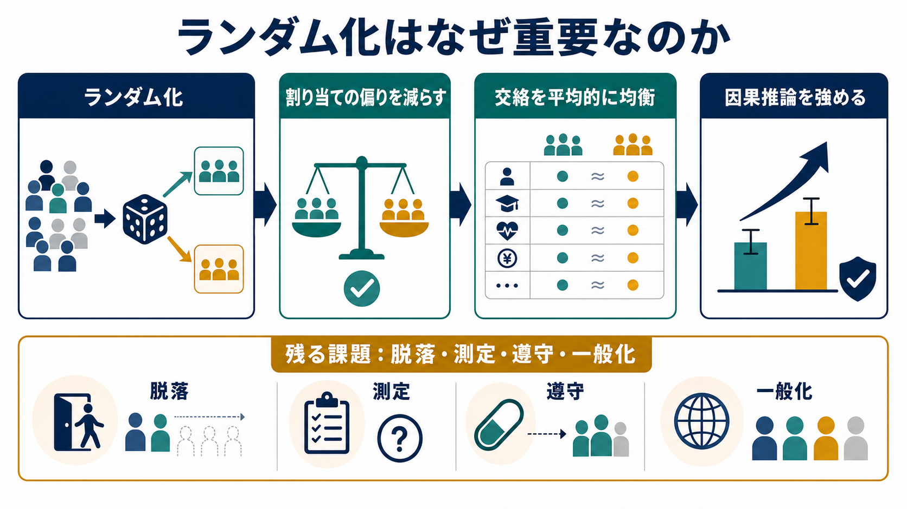
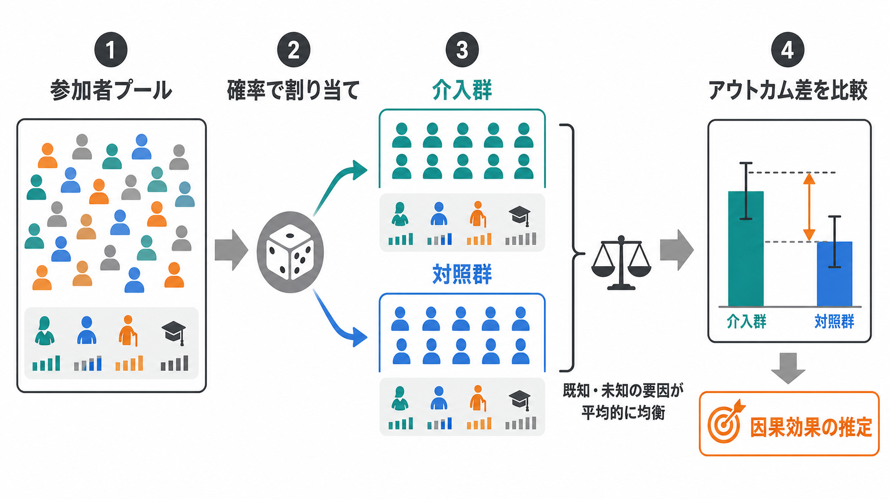

# ランダム化はなぜ重要なのか

## 要点

- ランダム化とは、参加者・クラス・試行・刺激などを、研究者や参加者の意図ではなく確率的な規則で条件に割り当てることである。
- 重要なのは「代表的な人を集める」ことではなく、「比較する群を、介入前には平均的に似たものにする」ことである。
- ランダム化は、観察済みの交絡だけでなく、測っていない交絡も平均的に均衡させるため、因果推論の内的妥当性を強める。
- ただし、脱落、介入遵守の失敗、測定バイアス、盲検化の失敗、サンプルの偏りまでは自動的に解決しない。

## この記事で答える問い

心理学研究では、介入群と対照群、刺激条件、教示条件、測定順序などを比較することが多い。この記事では、なぜその割り当てを「研究者がうまく調整する」のではなく、あえてランダムにするのかを説明する。中心的な問いは、ランダム化がどのように[[妥当性とは何か|妥当性]]、とくに内的妥当性を支えるのかである。

## まず結論

ランダム化が重要なのは、比較したい条件以外の違いを、研究者の判断から切り離して分配できるからである。たとえば、認知トレーニングを受けた群の成績が高かったとしても、その群にもともと動機づけの高い参加者が多ければ、成績差は介入ではなく動機づけの差かもしれない。ランダム化は、このような既知・未知の交絡要因が特定の条件に偏って集まる確率を下げる[1][2]。

ここで大切なのは、「ランダム化すれば各群が完全に同じになる」という意味ではない。有限のサンプルでは偶然の不均衡が残る。ランダム化が与えるのは、割り当て機構が既知で、介入前の系統的な選択バイアスを抑えた比較を設計できる、という強みである[3]。

## 背景

因果効果を考えるとき、本当は同じ参加者について「介入を受けた場合」と「介入を受けなかった場合」の両方を見たい。しかし、同じ時点の同じ人に両方を同時に経験させることはできない。この問題は、潜在アウトカムの枠組みでは、観測できる結果が一方だけであるという形で定式化される[2][4]。

そこで研究は、個人内の見えない反事実を、集団間の比較で近似する。ランダム化された実験では、各参加者がどちらの条件に入るかが潜在的な結果や背景要因に依存しないように設計されるため、群間差を介入効果として解釈しやすくなる[2][3]。

## 基本概念

**ランダム化**は、条件への割り当てを確率過程に委ねることである。参加者単位の個別ランダム化、学校やクラス単位のクラスターランダム化、刺激や試行順序のランダム化などがある。心理学では、介入研究だけでなく、課題順序、刺激提示順、評価者への資料提示順をランダム化することもある。

**無作為抽出**は、母集団から研究参加者を確率的に選ぶことである。これは主に一般化可能性、つまり外的妥当性に関わる。ランダム化された割り当ては内的妥当性を支え、無作為抽出は母集団への一般化を支える。両者は似ているが、役割が異なる[5]。

**割付の隠蔽**は、次にどの条件へ割り当てられるかを、登録担当者などに事前に分からないようにする手続きである。CONSORT は、ランダム配列の生成、割付の隠蔽、実施者の分離を報告すべき項目としている[6]。これは、ランダムな配列があっても、担当者が次の割り当てを知って参加者登録を操作すれば選択バイアスが生じるためである。

**盲検化**は、割り当て後に参加者、介入者、評価者、分析者などが条件を知らないようにする手続きである。盲検化は期待や測定の偏りを減らすが、割り当て前の選択バイアスを防ぐ割付の隠蔽とは別の概念である[6][7]。この区別は、[[反応バイアスとは何か]]や測定時の期待効果を考えるときにも重要である。

## 仕組み

ランダム化の仕組みは、次のように整理できる。

1. 研究対象となる参加者や単位を明確にする。
2. 介入群・対照群、または複数条件への割り当て規則を事前に決める。
3. 乱数表、コンピュータ乱数、ブロックランダム化、層別ランダム化などで割り当て配列を作る。
4. 割付の隠蔽によって、登録や条件付与の前に次の割り当てが予測されないようにする。
5. 結果を測定し、事前に定めた解析方針に沿って群間差を比較する。

単純ランダム化は、コイン投げのように各参加者を確率的に割り当てる方法である。大規模な研究では、群サイズや背景変数はおおむね均衡しやすい。一方、小規模研究では偶然の偏りが大きくなりやすいため、ブロックランダム化や層別ランダム化で群サイズや重要な共変量の均衡を補助することがある[6]。

この設計上の強みは、分析で「あとから調整する」こととは違う。観察研究では、測定済みの共変量を統計的に調整しても、測定していない交絡は残りうる。Rubin が強調したように、因果推論では結果データを見る前の設計が中心的に重要であり、観察研究でもランダム化実験を近似するように設計を考える必要がある[3]。

## 図解

ランダム化を理解するときは、次の4つを分けて考えるとよい。

| 概念 | 主な目的 | タイミング | 防ぎたい偏り |
|---|---|---|---|
| ランダム化 | 比較群を平均的に均衡させる | 割り当て時 | 交絡、選択バイアス |
| 無作為抽出 | 標本を母集団に近づける | 参加者募集時 | サンプル選択の偏り |
| 割付の隠蔽 | 次の割り当てを予測不能にする | 割り当て前 | 登録・割り当て操作 |
| 盲検化 | 期待や評価の影響を減らす | 割り当て後 | 測定バイアス、期待効果 |

## 臨床・研究との接続

臨床試験や心理社会的介入研究では、ランダム化比較試験は介入効果を評価する代表的な設計である。CONSORT 2010 と、社会・心理学的介入向けの CONSORT-SPI 2018 は、ランダム化試験を読むために、割り当て配列の生成、割付の隠蔽、誰が割り当てを実施したか、脱落、ベースライン特性、アウトカム定義などの透明な報告を求めている[6][7]。心理学の量的研究報告基準でも、実験操作や介入、ランダム割り当て、準実験を区別して報告することが重視される[8]。

教育・心理学領域でも、What Works Clearinghouse は、RCT ではランダム割り当てにより観測可能・観測不能な特性がベースラインで似ることが期待される一方、脱落や構成変化が大きい場合にはベースライン等価性の確認や調整が必要になると整理している[5]。つまり、ランダム化は強力な出発点だが、研究の実施過程が崩れると、推論の強さも下がる。

心理尺度研究では、ランダム化そのものが[[信頼性とは何か|信頼性]]や[[構成概念妥当性とは何か|構成概念妥当性]]を保証するわけではない。ただし、項目順序、刺激提示順、評定者への提示順をランダム化すれば、順序効果や期待効果を条件に偏らせにくくできる。これは[[心理測定とは何か]]で扱う測定誤差や、[[標準化とは何か]]で扱う手続きの統一とも接続する。

## よくある誤解

**誤解1：ランダム化すれば、サンプルは母集団を代表する。**  
代表性を高めるのは主に無作為抽出であり、割り当てのランダム化とは別である。ボランティアだけを集めた研究でも、条件割り当てをランダム化することはできるが、その結果をどこまで一般化できるかは別問題である。

**誤解2：ランダム化すれば、群間差はすべて介入効果である。**  
ランダム化は介入前の交絡を平均的に減らすが、脱落、測定の偏り、介入の不均一な実施、分析計画の後出し変更までは消せない。したがって、事前登録、脱落の報告、意図した割り当てに基づく解析、感度分析が重要になる[6][7]。

**誤解3：ランダム化後に群の平均が違ったら、研究は失敗である。**  
小規模研究では、偶然の不均衡は起こりうる。問題は、不均衡の有無だけでなく、割り当て過程が適切だったか、重要なベースライン変数を報告しているか、必要な場合に適切な調整をしているかである[5][6]。

**誤解4：統計的調整をすれば、ランダム化は不要である。**  
統計的調整は測定済みの変数に依存する。ランダム化は、測っていない要因も含めて、条件割り当てを潜在アウトカムから切り離す設計上の仕組みである。この違いが、実験研究と観察研究の因果推論の強さを分ける[3][4]。

## 関連ノート

- [[妥当性とは何か]]
- [[構成概念妥当性とは何か]]
- [[心理測定とは何か]]
- [[反応バイアスとは何か]]
- [[信頼性とは何か]]
- [[標準化とは何か]]

MOC 更新候補：心理測定・心理学研究、研究法、統計・因果推論に関する MOC。並列ジョブとの競合を避けるため、本記事では MOC 本体は更新しない。

## 理解チェック

1. ランダム化と無作為抽出は、それぞれどの妥当性に主に関わるか。
2. ランダム化された配列があっても、割付の隠蔽が不十分だと何が起こりうるか。
3. 小規模研究でベースライン特性が偶然に偏った場合、どのような報告や解析が必要になるか。
4. ランダム化が解決しない偏りを3つ挙げられるか。

## 未解決問題

- 心理学や教育現場の介入では、倫理・運用上の理由で個人単位のランダム化が難しいことがある。その場合、クラスターランダム化、待機リスト対照、回帰不連続デザイン、準実験などをどう選ぶかが課題になる。
- 複雑な心理社会的介入では、同じ「介入群」でも実施者、文脈、参加者の受け取り方が異なる。ランダム化だけでなく、介入忠実度、過程評価、実装文脈の記録が必要になる[7]。
- サンプルサイズが小さい研究では、ランダム化による均衡を過信せず、事前に重要な共変量、層別化、主要アウトカム、解析方針を決める必要がある。

## 参考文献

[1] Fisher, R. A. (1935). *The Design of Experiments*. Oliver and Boyd. https://archive.org/details/in.ernet.dli.2015.502684

[2] Rubin, D. B. (2005). Causal inference using potential outcomes: Design, modeling, decisions. *Journal of the American Statistical Association, 100*(469), 322-331. https://doi.org/10.1198/016214504000001880

[3] Rubin, D. B. (2008). For objective causal inference, design trumps analysis. *The Annals of Applied Statistics, 2*(3), 808-840. https://doi.org/10.1214/08-AOAS187

[4] Imbens, G. W., & Rubin, D. B. (2015). A brief history of the potential outcomes approach to causal inference. In *Causal Inference for Statistics, Social, and Biomedical Sciences: An Introduction*. Cambridge University Press. https://doi.org/10.1017/CBO9781139025751.003

[5] What Works Clearinghouse. (2022). *What Works Clearinghouse Procedures and Standards Handbook, Version 5.0*. Institute of Education Sciences, U.S. Department of Education. https://ies.ed.gov/ncee/wwc/Docs/referenceresources/Final_WWC-HandbookVer5.0-0-508.pdf

[6] Schulz, K. F., Altman, D. G., Moher, D., & CONSORT Group. (2010). CONSORT 2010 Statement: Updated guidelines for reporting parallel group randomised trials. *BMJ, 340*, c332. https://doi.org/10.1136/bmj.c332

[7] Montgomery, P., Grant, S., Mayo-Wilson, E., Macdonald, G., Michie, S., Hopewell, S., Moher, D., & CONSORT-SPI Group. (2018). Reporting randomised trials of social and psychological interventions: The CONSORT-SPI 2018 Extension. *Trials, 19*, 407. https://doi.org/10.1186/s13063-018-2733-1

[8] Appelbaum, M., Cooper, H., Kline, R. B., Mayo-Wilson, E., Nezu, A. M., & Rao, S. M. (2018). Journal article reporting standards for quantitative research in psychology: The APA Publications and Communications Board task force report. *American Psychologist, 73*(1), 3-25. https://doi.org/10.1037/amp0000191
