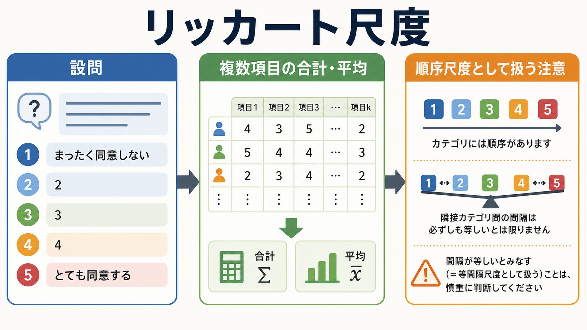
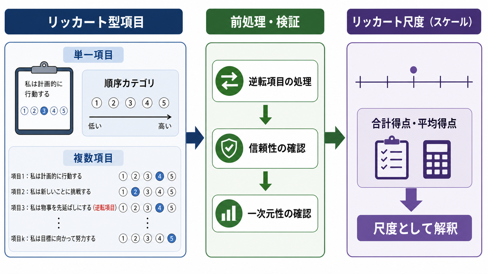
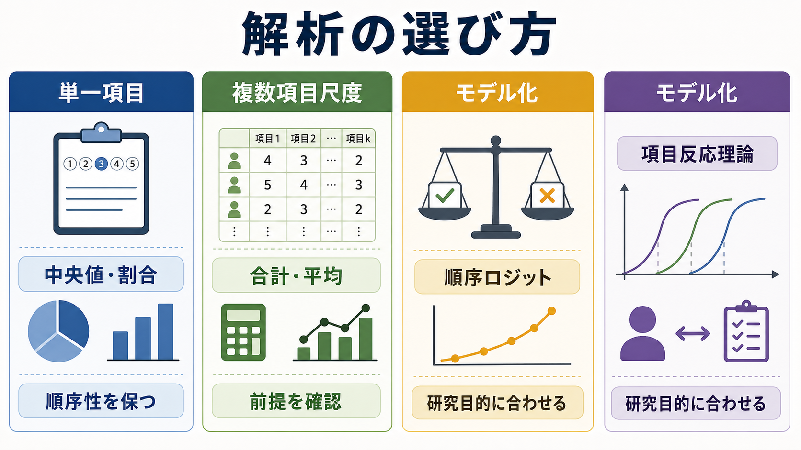

# リッカート尺度とは何か

## 要点

- リッカート尺度は、「まったく同意しない」から「とても同意する」のような段階的選択肢で態度・認知・症状・満足度などを測る質問紙形式である。
- 厳密には、1つの設問は「リッカート型項目」、複数の関連項目を合計・平均して構成概念を測るものが「リッカート尺度」と呼ばれることが多い[2][3]。
- 各選択肢は順序をもつが、隣り合うカテゴリの心理的距離が等しいとは限らない。そのため、単一項目の平均値や通常の線形モデルには注意が必要である[4][7]。
- 複数項目の尺度得点として扱う場合も、[[信頼性とは何か]]、[[妥当性とは何か]]、[[因子分析とは何か]]などを通じて、測りたい構成概念が本当に反映されているかを確認する。

## この記事で答える問い

- リッカート尺度とリッカート型項目は何が違うのか。
- 5件法や7件法の回答は、どのような測定水準として考えるべきか。
- 合計点・平均点・中央値・割合・順序ロジットなどをどう使い分けるのか。
- 心理学研究や臨床研究で、どのような誤解が生じやすいのか。

## まず結論

リッカート尺度は、主観的な態度や経験を、比較・集計しやすい形式で記録するための実用的な道具である。Rensis Likert が1932年に態度測定の方法として体系化した古典的手法であり[1]、現在も[[心理測定とは何か]]、教育評価、臨床尺度、ユーザー調査で広く使われている。

ただし、数値が付いているからといって、そのまま距離尺度として扱えるわけではない。単一項目なら「順序カテゴリ」として、複数項目を組み合わせた尺度なら「近似的な尺度得点」として、研究目的・分布・項目数・信頼性・モデル仮定を確認しながら解析するのが基本である[2][3][7]。

## 背景

心理学や医学では、「不安が強い」「治療に満足している」「ある考えに同意する」といった対象を直接測ることが難しい。そこで、観察できない[[構成概念妥当性とは何か|構成概念]]を、複数の質問項目への回答から推定する。

リッカートの方法の重要性は、個人の態度を1問だけで決めつけるのではなく、同じ態度を反映すると考えられる複数項目を集め、項目得点を足し合わせてより安定した尺度得点を作る点にあった[1]。これは、現在の[[心理尺度はどのように作られるのか|心理尺度作成]]や[[古典的テスト理論とは何か|古典的テスト理論]]にもつながる発想である。

## 基本概念

### リッカート型項目

リッカート型項目とは、1つの文に対して段階的に答える形式である。典型例は次のような設問である。

| 項目文 | 1 | 2 | 3 | 4 | 5 |
|---|---|---|---|---|---|
| この授業は理解しやすかった | まったく同意しない | あまり同意しない | どちらともいえない | やや同意する | とても同意する |

この1、2、3、4、5は「強さの順序」を表す。けれども、1から2への差と、4から5への差が心理的に同じとは限らない。この点が、リッカート型項目を順序尺度として扱うべきだと言われる理由である[4][8]。

### リッカート尺度

リッカート尺度は、同じ構成概念を測る複数のリッカート型項目を合計または平均したものである[2][3]。たとえば「学習意欲」を測るなら、1問だけではなく、興味、持続性、有能感、課題への関与などを表す複数項目を用いる。

尺度として解釈するには、少なくとも次の点を確認する。

- 項目が同じ概念を測っているか。
- 逆転項目を正しく処理したか。
- [[内的一貫性とは何か|内的一貫性]]や再検査信頼性が十分か。
- [[因子分析とは何か|因子構造]]が理論と合うか。
- [[反応バイアスとは何か|反応バイアス]]や[[天井効果と床効果とは何か|天井効果・床効果]]が強すぎないか。

## 仕組み

リッカート尺度の基本的な流れは、次のように整理できる。

1. 測りたい構成概念を決める。
2. その概念を反映しそうな複数の項目を作る。
3. 「同意度」「頻度」「重要度」「困難度」などの段階的選択肢を設定する。
4. 必要に応じて逆転項目を入れる。
5. 回答後、逆転項目を再符号化する。
6. 項目の合計点または平均点を作る。
7. 信頼性、妥当性、因子構造、分布を確認する。

たとえば5件法で10項目なら、単純合計は10点から50点になる。平均点を使えば1点から5点の範囲に戻るため、項目数が異なる下位尺度を比較しやすい。ただし、合計点や平均点は、順序カテゴリを数値として集約しているため、解釈には尺度構成上の前提が含まれる。

## 図解

解析の選び方は、「単一項目か複数項目尺度か」「記述が目的か推測が目的か」「順序性を明示的に扱う必要があるか」で変わる。

| データの扱い | 代表的な要約・解析 | 向いている状況 | 注意点 |
|---|---|---|---|
| 単一のリッカート型項目 | 度数、割合、中央値、四分位範囲 | 回答分布そのものを見せたい | 平均だけでは分布の偏りを隠しやすい |
| 複数項目の尺度得点 | 合計、平均、信頼性係数、相関、回帰 | 項目群が同一概念を測ると確認できる | 一次元性や信頼性の確認が必要 |
| 順序カテゴリとしての推測 | Mann-Whitney検定、Spearman相関、順序ロジット/プロビット | カテゴリ間隔の等間隔性を仮定したくない | 効果量や予測確率の説明を工夫する |
| 近似的な連続変数としての推測 | t検定、ANOVA、線形回帰 | 項目数が多く、分布が大きく歪んでいない | 仮定と感度分析を報告する |

Jamieson は、リッカート型項目を安易に間隔尺度として扱うことに警告を出した[4]。一方で Norman は、実用研究ではパラメトリック手法が一定の頑健性をもつ場合があると論じている[5]。Carifio と Perla も、単一項目と複数項目尺度を区別しない議論を批判した[6]。したがって重要なのは、「平均は禁止」「平均は常に安全」のどちらかに固定することではなく、データの種類と研究目的を明示することである。

## 臨床・研究との接続

臨床研究や教育研究では、症状、生活の質、治療満足度、自己効力感、疲労、痛み、抑うつ、不安などを質問紙で測ることが多い。これらは個別診断や治療指示そのものではなく、研究・教育・評価のための測定として使われる。

リッカート尺度を使うと、主観的経験を集団レベルで比較できる。しかし、尺度得点は「真の症状量」そのものではなく、回答者の解釈、文化、状況、社会的望ましさ、選択肢のラベル、質問順序の影響を受ける。したがって、臨床的に意味のある差を議論するには、[[効果量とは何か]]、測定誤差、カットオフ、妥当性研究、対象集団での再現性をあわせて確認する必要がある。

また、複数項目尺度で Cronbach の alpha を報告するだけでは十分ではない。alpha は内的一貫性の指標として広く使われるが、一次元性を自動的に保証するものではない[8]。必要に応じて因子分析、項目反応理論、測定不変性の検討を組み合わせる。

## よくある誤解

### 誤解1: 5件法の1から5は等間隔である

1から5の数字は、回答カテゴリの順序を扱いやすくする符号である。必ずしも心理的距離の等しさを意味しない。特に単一項目では、度数分布や中央値を見せた方が解釈しやすい場合がある[2][4]。

### 誤解2: リッカート尺度では平均を使ってはいけない

単一項目の平均を過度に解釈するのは危険だが、複数項目を合成した尺度得点では、研究目的によって平均や線形モデルが実用的に使われることもある[5][6]。ただし、分布の歪み、カテゴリ数、項目数、信頼性、感度分析を確認する。

### 誤解3: alpha が高ければ良い尺度である

alpha が高いことは、項目間の関連が強いことを示すが、妥当性や一次元性を単独で保証しない[8]。似た文言を並べただけでも alpha は高くなることがあるため、内容的妥当性、因子構造、外的基準との関連を確認する。

### 誤解4: 中立選択肢は必ず入れるべきである

中立選択肢を入れると、実際に中立の人を拾える一方で、判断回避や曖昧な回答も増えることがある。偶数件法にすると強制選択に近づくが、回答者に不自然な選択を迫る可能性もある。どちらが正しいかは、測りたい概念と調査文脈による。

### 誤解5: 逆転項目を入れれば反応バイアスは解決する

逆転項目は黙従傾向への対策になることがあるが、読解負荷や混乱を増やし、因子構造を乱すこともある。逆転項目を使う場合は、回答後の再符号化と項目特性を必ず確認する。

## 関連ノート

- [[心理測定とは何か]]
- [[心理尺度はどのように作られるのか]]
- [[信頼性とは何か]]
- [[内的一貫性とは何か]]
- [[妥当性とは何か]]
- [[構成概念妥当性とは何か]]
- [[因子分析とは何か]]
- [[項目反応理論とは何か]]
- [[反応バイアスとは何か]]
- [[天井効果と床効果とは何か]]

## MOC更新候補

- `content/00_MOC/` 配下の心理測定・心理学研究関連 MOC があれば、この記事 `[[リッカート尺度とは何か]]` を「心理尺度」「質問紙法」「研究法・統計」の近くに追加する。
- 並列ジョブとの競合を避けるため、この作業では MOC 本体は更新しない。

## 理解チェック

1. 1つの「とても同意する/同意しない」形式の設問は、リッカート尺度か、リッカート型項目か。
2. 単一項目の平均値だけを報告すると、どのような情報が失われるか。
3. 複数項目を合計して尺度得点にする前に、最低限どのような確認が必要か。
4. 順序ロジットモデルが有用になるのは、どのような研究目的のときか。

## 未解決問題

- リッカート型項目を近似的な連続変数として扱ってよい条件は、分布、カテゴリ数、サンプルサイズ、研究目的によって変わる。
- 文化差や翻訳によって、同じラベルでも回答カテゴリの使われ方が変わる可能性がある。
- 臨床尺度では、統計的有意差と臨床的に意味のある変化量を区別する必要がある。

## 参考文献

[1] Likert, R. (1932). *A technique for the measurement of attitudes*. Archives of Psychology, 140, 1-55. Open Library: https://openlibrary.org/books/OL14108129M/A_technique_for_the_measurement_of_attitudes

[2] Sullivan, G. M., & Artino, A. R. Jr. (2013). Analyzing and interpreting data from Likert-type scales. *Journal of Graduate Medical Education, 5*(4), 541-542. https://doi.org/10.4300/JGME-5-4-18

[3] Boone, H. N., Jr., & Boone, D. A. (2012). Analyzing Likert data. *Journal of Extension, 50*(2). https://doi.org/10.34068/joe.50.02.48

[4] Jamieson, S. (2004). Likert scales: how to (ab)use them. *Medical Education, 38*(12), 1217-1218. https://doi.org/10.1111/j.1365-2929.2004.02012.x

[5] Norman, G. (2010). Likert scales, levels of measurement and the "laws" of statistics. *Advances in Health Sciences Education, 15*(5), 625-632. https://doi.org/10.1007/s10459-010-9222-y

[6] Carifio, J., & Perla, R. J. (2008). Resolving the 50-year debate around using and misusing Likert scales. *Medical Education, 42*(12), 1150-1152. https://doi.org/10.1111/j.1365-2923.2008.03172.x

[7] Liddell, T. M., & Kruschke, J. K. (2018). Analyzing ordinal data with metric models: What could possibly go wrong? *Journal of Experimental Social Psychology, 79*, 328-348. https://doi.org/10.1016/j.jesp.2018.08.009

[8] Tavakol, M., & Dennick, R. (2011). Making sense of Cronbach's alpha. *International Journal of Medical Education, 2*, 53-55. https://doi.org/10.5116/ijme.4dfb.8dfd
